# Grafowe bazy danych – Neo4j

Ćwiczenie 1

---

**Imiona i nazwiska autorów:**

---

# Test połączenia

- informacja o wersji

```cypher
CALL dbms.components() YIELD versions
RETURN versions;
```

- wynik

```json
[ "2026.03.1" ]
```

# Przykład 1

Baza northwind

- products
- categories
- suppliers

Stwórz ograniczenia (constraints)

```cypher
CREATE CONSTRAINT product_productID IF NOT EXISTS
FOR (p:Product)
REQUIRE (p.productID) IS UNIQUE;

CREATE CONSTRAINT category_categoryID IF NOT EXISTS
FOR (c:Category)
REQUIRE (c.categoryID) IS UNIQUE;

CREATE CONSTRAINT supplier_supplierID IF NOT EXISTS
FOR (s:Supplier)
REQUIRE (s.supplierID) IS UNIQUE;
```

Sprawdź wynik

```cypher
SHOW CONSTRAINTS;

SHOW INDEXES;
```

Czym są ograniczenia, jakie są możliwości definiowania ograniczeń

Import danych, tworzenie węzłów

- Product
  - zwróć uwagę na typy danych
  - w szczególności `productID` będzie napisem
    - można zrobić konwersję na typ `int`
      - ale trzeba pamiętać żeby robić to konsekwentnie

```cypher
LOAD CSV WITH HEADERS FROM "https://data.neo4j.com/northwind/products.csv" AS row
CREATE (n:Product)
SET
  n = row,
  n.unitPrice = toFloat(row.unitPrice),
  n.unitsInStock = toInteger(row.unitsInStock),
  n.unitsOnOrder = toInteger(row.unitsOnOrder),
  n.reorderLevel = toInteger(row.reorderLevel),
  n.discontinued = (row.discontinued <> "0");
```

sprawdź wynik

```cypher
MATCH (n:Product)
RETURN n;
```

jeśli chcesz usunąć dane to:

```cypher
MATCH (n:Product)
DELETE n;
```

Import danych

- Category
- Supplier

```cypher
LOAD CSV WITH HEADERS FROM "https://data.neo4j.com/northwind/categories.csv" AS row
CREATE (n:Category)
SET n = row;

LOAD CSV WITH HEADERS FROM "https://data.neo4j.com/northwind/suppliers.csv" AS row
CREATE (n:Supplier)
SET n = row;
```

sprawdź wynik

```cypher
MATCH (n:Category)
RETURN n;

MATCH (n:Category)
WHERE n.categoryID = "1"
RETURN n;

MATCH (n:Category {categoryID: "1"})
RETURN n;

MATCH (n:Category {categoryID: "1"})
RETURN n.categoryID, n.categoryName;

MATCH (n:Supplier)
RETURN count(*);
```

sprawdź schemat/strukturę bazy

```cypher
CALL db.schema.visualization();
```

Import danych, tworzenie krawędzi

```cypher
MATCH (p:Product), (c:Category)
WHERE p.categoryID = c.categoryID
RETURN p.productID, p.categoryID, c.categoryID;

MATCH (p:Product), (c:Category)
WHERE p.categoryID = c.categoryID
CREATE (p)-[:PART_OF]->(c);

MATCH (p:Product), (s:Supplier)
WHERE p.supplierID = s.supplierID
RETURN p.productID, p.productName, p.supplierID, s.supplierID, s.companyName;

MATCH (p:Product), (s:Supplier)
WHERE p.supplierID = s.supplierID
CREATE (s)-[:SUPPLIES]->(p);
```

sprawdź schemat/strukturę bazy

```cypher
CALL db.schema.visualization();
```

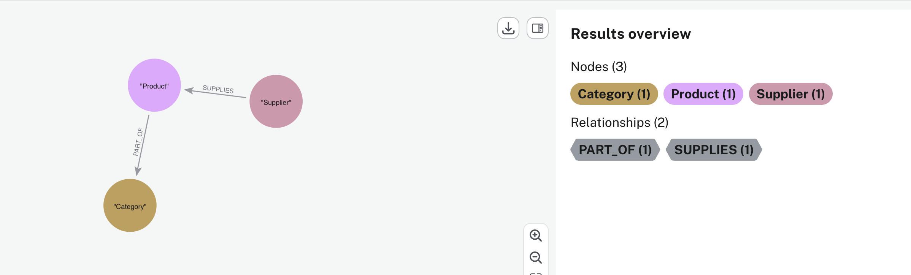

Pokaż dostawców, ich produkty oraz kategorie

- wynik będzie w formie tabelarycznej
  - zwróć uwagę na kierunek krawędzi

```cypher
MATCH (s:Supplier)-->(p:Product)-->(c:Category)
RETURN
  s.companyName,
  collect(DISTINCT p.productName) AS Products,
  collect(DISTINCT c.categoryName) AS Categories;
```

- wynik będzie w formie grafu
  - zwróć uwagę na kierunek krawędzi

```cypher
MATCH (s:Supplier)-->(p:Product)-->(c:Category)
RETURN s, c, p;
```

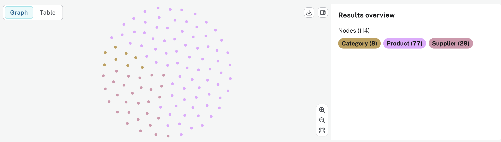

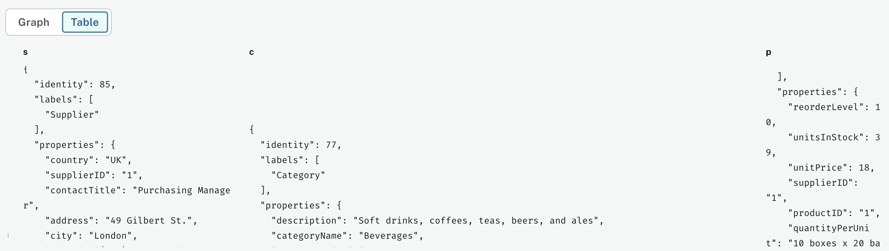

pełny graf z krawędziami

```cypher
MATCH (s:Supplier)-[su:SUPPLIES]->(p:Product)-[po:PART_OF]->(c:Category)
RETURN s, c, p, su, po;
```

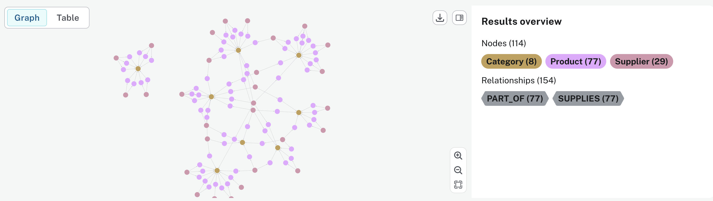

Warunek

- `categoryID = "1"`
- `categoryID = "1" OR c.categoryID = "2"`

```cypher
MATCH (s:Supplier)-[r1]-(p:Product)-[r2]-(c:Category)
WHERE c.categoryID = "1"
RETURN s, p, c, r1, r2;

MATCH (c:Category {categoryID: "1"})-[r2]-(p:Product)-[r1]-(s:Supplier)
RETURN s, p, c, r1, r2;

MATCH (s:Supplier)-[r1]-(p:Product)-[r2]-(c:Category)
WHERE c.categoryID = "1" OR c.categoryID = "2"
RETURN s, p, c, r1, r2;

MATCH (s:Supplier)-[r1]-(p:Product)-[r2]-(c:Category)
WHERE c.categoryID IN ["1", "2"]
RETURN s, p, c, r1, r2;

```

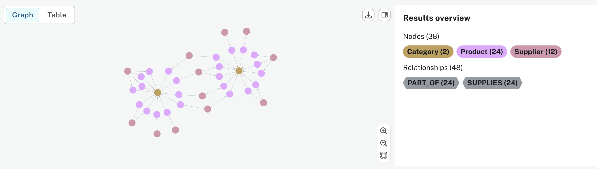

Plan wykonania

- porównaj plany dla trzech wersji zapytania

```cypher
PROFILE
MATCH (s:Supplier)-[r1]-(p:Product)-[r2]-(c:Category)
WHERE c.categoryID = "1"
RETURN s, p, c, r1, r2;

PROFILE
MATCH (c:Category)-[r2]-(p:Product)-[r1]-(s:Supplier)
WHERE c.categoryID = "1"
RETURN s, p, c, r1, r2;

PROFILE
MATCH (c:Category {categoryID: "1"})-[r2]-(p:Product)-[r1]-(s:Supplier)
RETURN s, p, c, r1, r2;
```

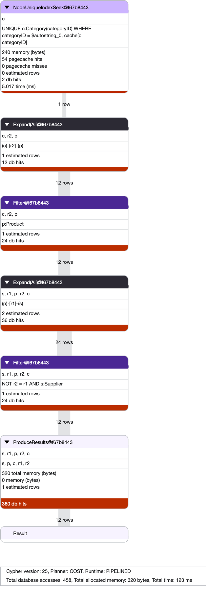

Dostawcy, produkty, kategorie

```cypher
MATCH (s:Supplier)-->(p:Product)-->(c:Category)
RETURN
  s.companyName,
  collect(DISTINCT p.productName) AS Products,
  collect(DISTINCT c.categoryName) AS Categories;
```

to mniej więcej odpowiada takiemu poleceniu `SQL`

```SQL
select
    s.companyname,
    string_agg(p.productname, ', ') as products,
    string_agg(c.categoryname, ', ') as categories
from suppliers s
join products p   on p.supplierid = s.supplierid
join categories c on c.categoryid = p.categoryid
group by s.companyname
order by s.companyname;
```

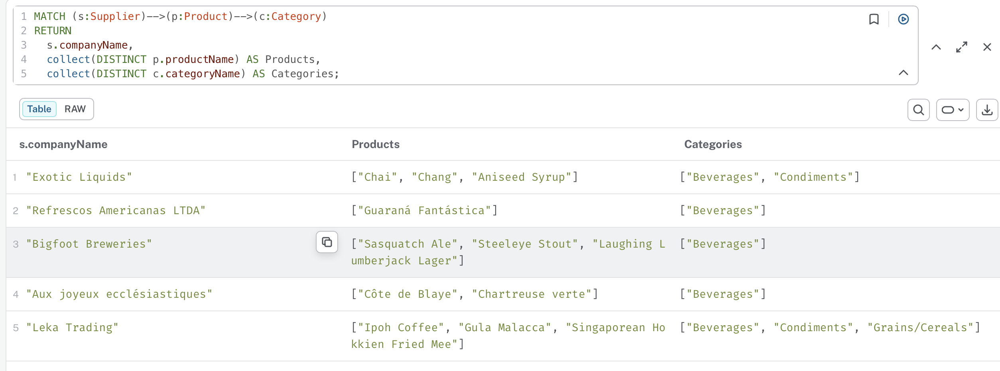

w przeglądarkowym GUI, wynik można pobrać np. w formacie `JSON`

```json
 {
    "s.companyName": "Aux joyeux ecclésiastiques",
    "Products": [
      "Côte de Blaye",
      "Chartreuse verte"
    ],
    "Categories": [
      "Beverages"
    ]
  },
  {
    "s.companyName": "Leka Trading",
    "Products": [
      "Ipoh Coffee",
      "Gula Malacca",
      "Singaporean Hokkien Fried Mee"
    ],
    "Categories": [
      "Beverages",
      "Condiments",
      "Grains/Cereals"
    ]
```

# Przykład 2

pozostałe dane

- customers
- orders
- orderdetails

```cypher
CREATE CONSTRAINT customer_customerID IF NOT EXISTS
FOR (c:Customer)
REQUIRE (c.customerID) IS UNIQUE;

CREATE CONSTRAINT order_orderID IF NOT EXISTS
FOR (o:Order)
REQUIRE (o.orderID) IS UNIQUE;
```

```cypher
LOAD CSV WITH HEADERS FROM "https://data.neo4j.com/northwind/customers.csv" AS row
CREATE (n:Customer)
SET n = row;

LOAD CSV WITH HEADERS FROM "https://data.neo4j.com/northwind/orders.csv" AS row
CREATE (n:Order)
SET n = row;
```

dodajemy krawędź

```cypher
MATCH (c:Customer), (o:Order)
WHERE c.customerID = o.customerID
RETURN c.customerID, o.customerID, o.orderID;

MATCH (c:Customer), (o:Order)
WHERE c.customerID = o.customerID
CREATE (c)-[:PURCHASED]->(o);
```

sprawdź schemat/strukturę bazy

```cypher
CALL db.schema.visualization();
```

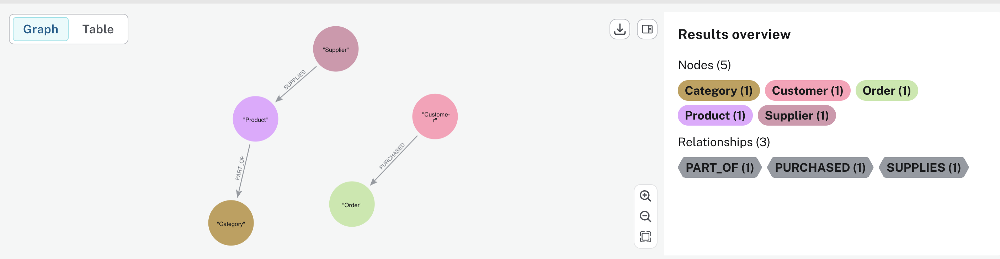

można zobaczyć tą relację

znajdź wszystkie relacje `PURCHASED` wraz z ich węzłami i zwróć je jako ścieżki

```cypher
MATCH p = ()-[:PURCHASED]->()
RETURN p;
```

- `()` → dowolny węzeł (bez etykiety)
- `[:PURCHASED]` → relacja typu `PURCHASED`
- `->()` → dowolny węzeł po drugiej stronie
- `p = ...` → zapisanie całej ścieżki (path) do zmiennej `p`

zamówienia klienta 'ALFKI'

```cypher
MATCH p = (c:Customer)-[:PURCHASED]->(o:Order)
WHERE o.customerID = "ALFKI"
RETURN p;
```

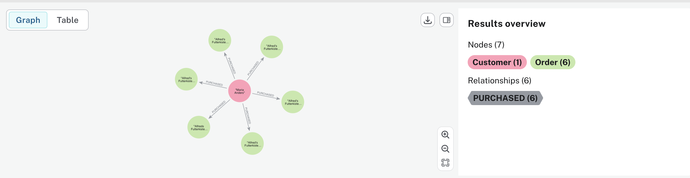

zamówienia dla zakresu dat

```cypher
// to nie zadziała, orderDate jet napisem
MATCH p = (c:Customer)-[:PURCHASED]->(o:Order)
WHERE o.orderDate >= date('1997-01-01') AND o.orderDate < date('1998-01-01')
RETURN p;

//  ale można tak
MATCH p = (c:Customer)-[:PURCHASED]->(o:Order)
WHERE o.orderDate STARTS WITH "1997"
RETURN p;

// albo można zrobić konwersję do daty
MATCH (o:Order)
SET o.orderDate = date(split(o.orderDate, " ")[0]);
```

orderdetails

```cypher
LOAD CSV WITH HEADERS FROM "https://data.neo4j.com/northwind/order-details.csv" AS row
MATCH (p:Product), (o:Order)
WHERE p.productID = row.productID AND o.orderID = row.orderID
CREATE (o)-[details:CONTAINS]->(p)
SET
  details = row,
  details.quantity = toInteger(row.quantity),
  details.unitPrice = toFloat(row.unitPrice),
  details.discount = toFloat(row.discount);
```

sprawdź schemat/strukturę bazy

```cypher
CALL db.schema.visualization();
```

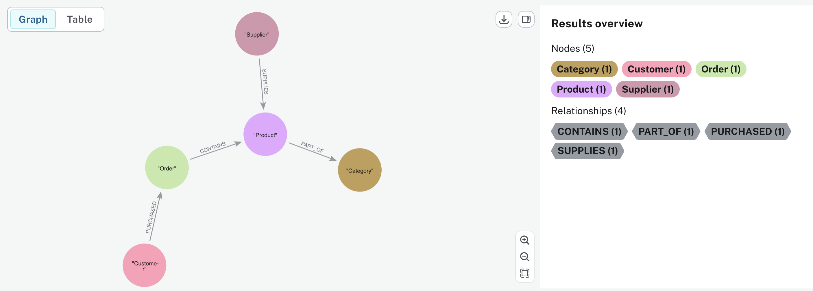

```cypher
MATCH ph = (o:Order)-[od:CONTAINS]-(p:Product)
RETURN ph;
```

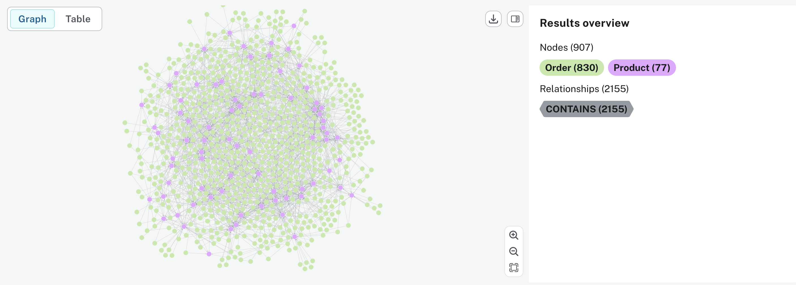

# Przykłady zapytań

1. Dla kadego klienta poka liczbę (jednosek) kupionych produktów (z kategorii Produce)

```cypher
MATCH
  (c:Customer)-[:PURCHASED]->
  (o:Order)-[d:CONTAINS]->
  (p:Product)-[:PART_OF]->
  (cat:Category {categoryName: "Produce"})
RETURN c.companyName AS customer, SUM(d.quantity) AS totalQuantity
ORDER BY totalQuantity DESC;


MATCH (c:Customer)-[:PURCHASED]->(o:Order)
      -[d:CONTAINS]->(p:Product)
      -[:PART_OF]->(cat:Category {categoryName: "Produce"})
RETURN c.customerID AS customerID,
       c.companyName AS customer,
       SUM(d.quantity) AS totalQuantity
ORDER BY totalQuantity DESC;
```

W Cypher grupowanie działa "po tym, co zwracasz bez agregacji”.

- czyli jeśli chcesz grupować po `customerID`, musisz go umieścić w `RETURN`.

Równoważne polecenie `SQL`

```sql
select c.companyname as customer,
       sum(od.quantity) as totalquantity
from customers c
join orders o on o.customerid = c.customerid
join orderdetails od  on od.orderid = o.orderid
join products p on p.productid = od.productid
join categories cat  on cat.categoryid = p.categoryid
where cat.categoryname = 'Produce'
group by c.customerid, c.companyname
order by totalquantity desc;
```

ale to nie są "wszyscy klienci"

wszyscy klienci - `SQL`

```sql
select c.companyname as customer,
       coalesce(sum(od.quantity),0) as totalquantity
from orders o
join orderdetails od  on od.orderid = o.orderid
join products p on p.productid = od.productid
join categories cat  on cat.categoryid = p.categoryid
and cat.categoryname = 'Produce'
right join Customers c on c.CustomerID = o.customerid
group by c.companyname
order by totalquantity desc;
```

wszyscy klienci - `Cypher - Neo4j`

```cypher
MATCH (c:Customer)
OPTIONAL MATCH
  (c)-[:PURCHASED]->
  (o:Order)-[d:CONTAINS]->
  (p:Product)-[:PART_OF]->
  (cat:Category {categoryName: "Produce"})
RETURN
  c.customerID AS customerID,
  c.companyName AS customer,
  coalesce(SUM(d.quantity), 0) AS totalQuantity
ORDER BY totalQuantity DESC;
```

2. Produkty z kategorii "Produce"

```cypher
// zwraca productname
MATCH (p:Product)-[:PART_OF]->(c:Category {categoryName: "Produce"})
RETURN p.productName AS product;

// zwraca p, c, r
MATCH (p:Product)-[r:PART_OF]->(c:Category {categoryName: "Produce"})
RETURN p, c , r;

// zwraca path
MATCH path = (p:Product)-[r:PART_OF]->(c:Category {categoryName: "Produce"})
RETURN path;
```

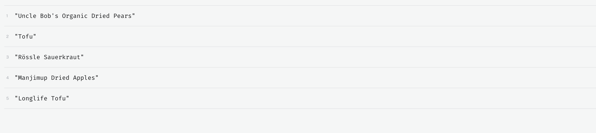

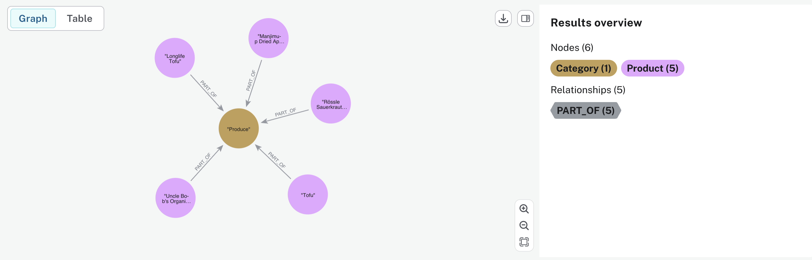

3. Dostawcy produktów z kategorii Produce

```sql
select distinct s.companyname as supplier
from suppliers s
join products p on p.supplierid = s.supplierid
join categories c on c.categoryid = p.categoryid
where c.categoryname = 'Produce';
```

```cypher
MATCH
  (s:Supplier)-[:SUPPLIES]->
  (p:Product)-[:PART_OF]->
  (c:Category {categoryName: "Produce"})
RETURN DISTINCT s.companyName AS supplier;
```

4. Liczba zamówień każdego klienta w 1997 - od stycznia do kończ czerwca

```cypher
MATCH (c:Customer)-[:PURCHASED]->(o:Order)
WHERE o.orderDate >= date("1997-01-01") AND o.orderDate < date("1997-07-01")
RETURN
  c.customerID AS customerID,
  c.companyName AS customer,
  count(o) AS orderCount
ORDER BY orderCount DESC;


MATCH (c:Customer)
OPTIONAL MATCH (c)-[:PURCHASED]->(o:Order)
WHERE o.orderDate >= date("1997-01-01") AND o.orderDate < date("1997-07-01")
RETURN
  c.customerID AS customerID,
  c.companyName AS customer,
  count(o) AS orderCount
ORDER BY orderCount DESC;
```

graf (graf wizualnie pokazuje liczbę zamówień)

```cypher
MATCH (c:Customer)-[r:PURCHASED]->(o:Order)
WHERE o.orderDate >= date("1997-01-01") AND o.orderDate < date("1997-07-01")
RETURN c, o, r
```

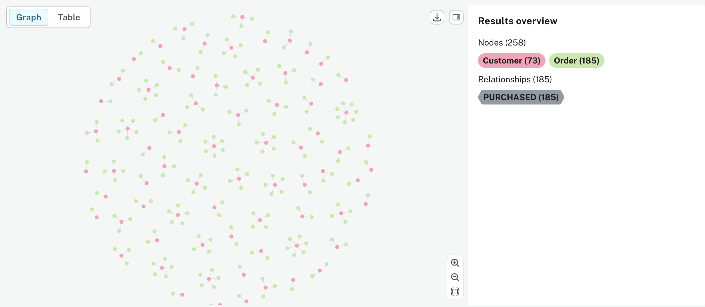

ale tylko tacy, którzy złożyli ponad 5 zamówień

```cypher
MATCH (c:Customer)-[:PURCHASED]->(o:Order)
WHERE o.orderDate >= date("1997-01-01")
  AND o.orderDate <  date("1997-07-01")
WITH c, count(o) AS orderCount
WHERE orderCount > 5
RETURN c.companyName, orderCount
ORDER BY orderCount DESC;
```

- `WITH c, count(o)` - grupowanie po kliencie
- `WHERE orderCount > 5` - odpowiednik `HAVING`

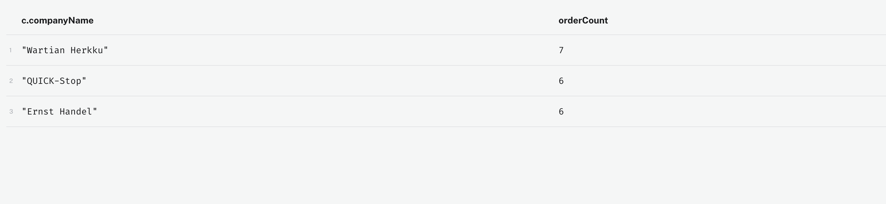

a gdybyśmy chcieli graf?

```cypher
MATCH (c:Customer)-[r:PURCHASED]->(o:Order)
WHERE o.orderDate >= date("1997-01-01") AND o.orderDate < date("1997-07-01")
WITH c, count(o) AS orderCount
WHERE orderCount > 5
RETURN c
ORDER BY orderCount DESC;
```

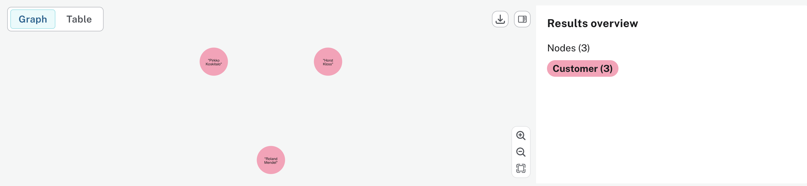

niestety do zwraca tylko węzły `c:Customer`

- próba dodania krawędzi - błąd

```cypher
MATCH (c:Customer)-[r:PURCHASED]->(o:Order)
WHERE o.orderDate >= date("1997-01-01") AND o.orderDate < date("1997-07-01")
WITH c, count(o) AS orderCount
WHERE orderCount > 5
RETURN c, r, o;
```

najprostsze rozwiązanie

- kolejny `MATCH`

```cypher
MATCH (c:Customer)-[:PURCHASED]->(o:Order)
WHERE o.orderDate >= date("1997-01-01") AND o.orderDate < date("1997-07-01")

WITH c, count(o) AS orderCount
WHERE orderCount > 5

MATCH (c)-[r:PURCHASED]->(o:Order)
WHERE o.orderDate >= date("1997-01-01") AND o.orderDate < date("1997-07-01")

RETURN c, r, o
```

- pierwsze `MATCH` - liczy zamówienia
- `WITH` - filtruje klientów (`HAVING`)
- drugi `MATCH` - odtwarza graf

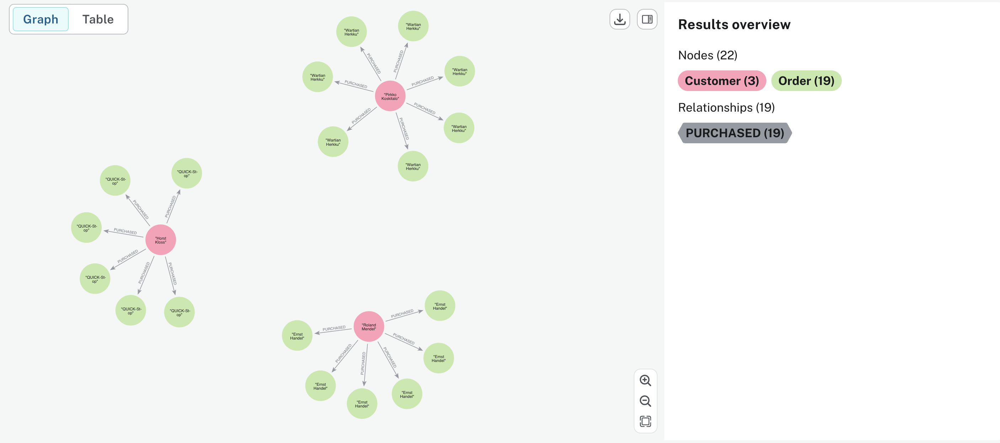

alternatywne rozwiązanie

```cypher
MATCH p = (c:Customer)-[:PURCHASED]->(o:Order)
WHERE o.orderDate >= date("1997-01-01") AND o.orderDate < date("1997-07-01")
WITH c, collect(p) AS paths, count(o) AS orderCount
WHERE orderCount > 5
UNWIND paths AS p1
RETURN p1;
```

- `collect()` - agreguje wiele wierszy do jednej listy
- `UNWIND` - rozbija listę na wiele wierszy

5. Produkty które nie były zamawiane w 1997 (od stycznia do czerwca)

```sql
select p.productid,
       p.productname as product
from products p
where not exists (
    select 1
    from orderdetails od
    join orders o on o.orderid = od.orderid
    where od.productid = p.productid
      and o.orderdate >= '1997-01-01'
      and o.orderdate <  '1997-07-01'
)
order by product;
```

```cypher
MATCH (p:Product)
WHERE NOT EXISTS {
MATCH (p)<-[:CONTAINS]-(o:Order)
WHERE o.orderDate >= date("1997-01-01")
AND o.orderDate < date("1997-07-01")
}

RETURN p.productID AS productID,
p.productName AS product
ORDER BY product;

// albo
MATCH (p:Product)
OPTIONAL MATCH (p)<-[:CONTAINS]-(o:Order)
               WHERE o.orderDate >= date("1997-01-01")
                 AND o.orderDate <  date("1997-07-01")
WITH p, count(o) AS cnt
WHERE cnt = 0
RETURN p.productID AS productID,
       p.productName AS product
ORDER BY product;
```

> [!info]
> i wiele innych ...

# Zadania

rozszerz model o employees

1. Wartość zamówień dla każdego klienta
2. Znajdź 5 klientów z największą wartością zamówień.
3. Policz wartość sprzedaży dla każdej kategorii.
4. Znajdź produkty zamawiane przez klienta `ALFKI`.
5. Znajdz produkty zamawiane w cenach poniżej 15
6. Znajdz produkty które nigdy nie były zamawiane w cenach poniżej 15
7. Znajdź dostawców produktów kupionych w 1997 roku (od stycznia do końca czerwca).
8. Znajdź pracownika, który sprzedał najwięcej zamówień.
9. Znajdź kategorię z największą liczbą sprzedanych sztuk.
10. Znajdź produkty, które mają rabat większy niż 20% w jakimkolwiek zamówieniu.
