# Raport

# Przetwarzanie i analiza danych przestrzennych

# Oracle spatial

---

**Imiona i nazwiska:** Marek Małek, Mateusz Lampert

---

Celem ćwiczenia jest zapoznanie się ze sposobem przechowywania, przetwarzania i analizy danych przestrzennych w bazach danych
(na przykładzie systemu Oracle spatial)

Swoje odpowiedzi wpisuj w miejsca oznaczone jako:

---

> Wyniki, zrzut ekranu, komentarz

```sql
--  ...
```

---

Do wykonania ćwiczenia (zadania 1 – 6) i wizualizacji danych wykorzystaj Oracle SQL Develper. Alternatywnie możesz wykonać analizy w środowisku Python/Jupyter Notebook

Do wykonania zadania 7 wykorzystaj środowisko Python/Jupyter Notebook

Raport należy przesłać w formacie pdf.

Należy też dołączyć raport zawierający kod w formacie źródłowym.

Np.

- plik tekstowy .sql z kodem poleceń
- plik .md zawierający kod wersji tekstowej
- notebook programu jupyter – plik .ipynb

Zamieść kod rozwiązania oraz zrzuty ekranu pokazujące wyniki, (dołącz kod rozwiązania w formie tekstowej/źródłowej)

Zwróć uwagę na formatowanie kodu

<div style="page-break-after: always;"></div>

# Zadanie 1

Zwizualizuj przykładowe dane

US_STATES

> Wyniki, zrzut ekranu, komentarz

**Uwaga dotycząca wszystkich zadań:** Ze względu na istotne ograniczenia oprogramowania `SQLDeveloper` oraz bardzo nieintuizyjny i niewygodny w użyciu interfejs, zdecydowaliśmy się wykonać wszystkie zadania (1-7) w środowisku Python/Jupyter Notebook. Dodatkowo, w celu uniknięcia powielania kodu, zaimplementowane zostały następujące funkcje pomocnicze:

```py
def run_query(sql, params=None):
    cur = connection.cursor()
    cur.execute(sql, params or [])
    return cur.fetchall()


def wkt_rows_to_features(rows, label_index=None):
    features = []
    for row in rows:
        wkt = row[0]
        if wkt is None:
            continue
        geom = loads(wkt)
        props = {}
        if label_index is not None and len(row) > label_index:
            props["name"] = str(row[label_index])
        features.append(geojson.Feature(geometry=mapping(geom), properties=props))
    return features


def make_map(center=(39, -98), zoom=4):
    return folium.Map(location=center, zoom_start=zoom, tiles="OpenStreetMap")


def add_layer(m, features, color="blue", fill_color="lightblue",
              fill_opacity=0.4, weight=1, name="warstwa", tooltip_field=None):
    fc = geojson.FeatureCollection(features)
    style = {
        "color": color,
        "fillColor": fill_color,
        "fillOpacity": fill_opacity,
        "weight": weight,
    }
    layer = folium.GeoJson(
        fc,
        name=name,
        style_function=lambda x, s=style: s,
    )
    if tooltip_field:
        layer.add_child(folium.GeoJsonTooltip(fields=[tooltip_field]))
    layer.add_to(m)
    return m

def show_map(m):
    display(m)
```

**Rozwiązanie:**

```py
sql = f"""
    SELECT sdo_util.to_wktgeometry(geom), state
    FROM us_states
"""
rows = run_query(sql)
print(f"Number of states: {len(rows)}")

m = make_map()
features = wkt_rows_to_features(rows, label_index=1)
add_layer(m, features, color="black", fill_color="lightblue",
          fill_opacity=0.3, name="US States", tooltip_field="name")
folium.LayerControl().add_to(m)
show_map(m)
```

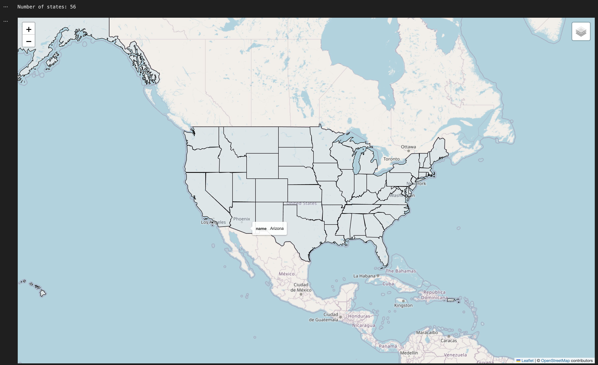

US_INTERSTATES

> Wyniki, zrzut ekranu, komentarz

```py
sql = """
    SELECT sdo_util.to_wktgeometry(geom), interstate
    FROM us_interstates
"""
rows = run_query(sql)
print(f"Number of interstates: {len(rows)}")

m = make_map()
features = wkt_rows_to_features(rows, label_index=1)
add_layer(m, features, color="red", fill_opacity=0,
          name="US Interstates", tooltip_field="name")
folium.LayerControl().add_to(m)
show_map(m)
```

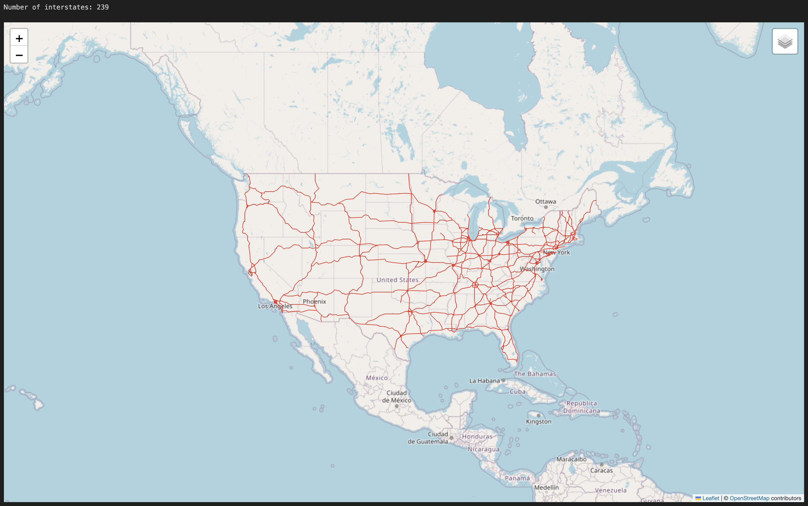

US_CITIES

> Wyniki, zrzut ekranu, komentarz

```py
sql = """
    SELECT sdo_util.to_wktgeometry(location), city, state_abrv
    FROM us_cities
"""
rows = run_query(sql)
print(f"Number of cities: {len(rows)}")

m = make_map()
for row in rows:
    if row[0] is None:
        continue
    geom = loads(row[0])
    folium.CircleMarker(
        location=[geom.y, geom.x],
        radius=3,
        color="darkblue",
        fill=True,
        fill_color="blue",
        fill_opacity=0.6,
        tooltip=f"{row[1]}, {row[2]}"
    ).add_to(m)
show_map(m)
```

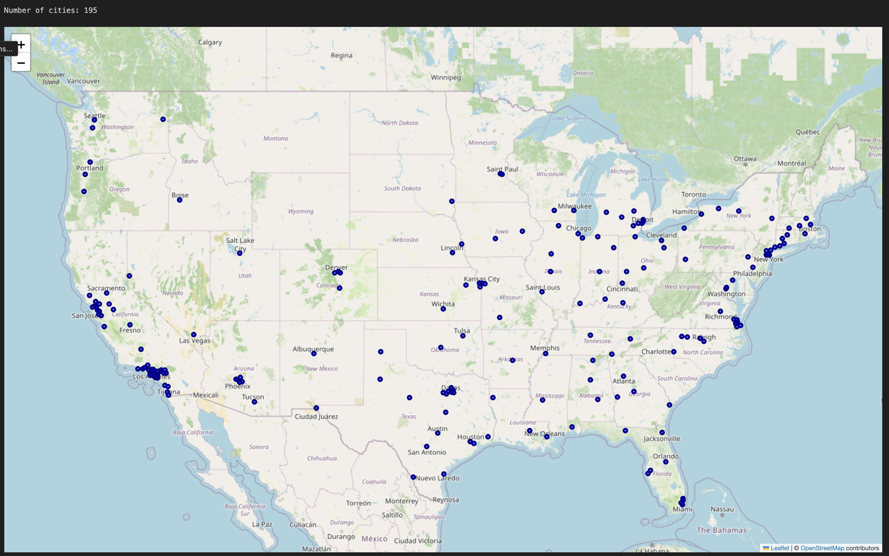

US_RIVERS

> Wyniki, zrzut ekranu, komentarz

```py
sql = """
    SELECT sdo_util.to_wktgeometry(geom), name
    FROM us_rivers
"""
rows = run_query(sql)
print(f"Number of rivers: {len(rows)}")

m = make_map()
features = wkt_rows_to_features(rows, label_index=1)
add_layer(m, features, color="steelblue", fill_opacity=0,
          name="US Rivers", tooltip_field="name")
folium.LayerControl().add_to(m)
show_map(m)
```

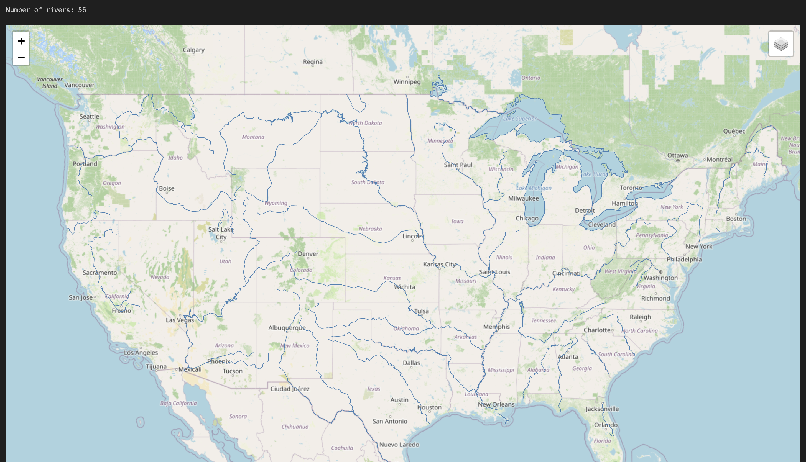

US_COUNTIES

> Wyniki, zrzut ekranu, komentarz

```py
sql = """
    SELECT sdo_util.to_wktgeometry(geom), county
    FROM us_counties
"""
rows = run_query(sql)
print(f"Number of counties: {len(rows)}")

m = make_map()
features = wkt_rows_to_features(rows, label_index=1)
add_layer(m, features, color="grey", fill_color="lightyellow",
          fill_opacity=0.3, weight=0.5, name="US Counties", tooltip_field="name")
folium.LayerControl().add_to(m)
show_map(m)
```

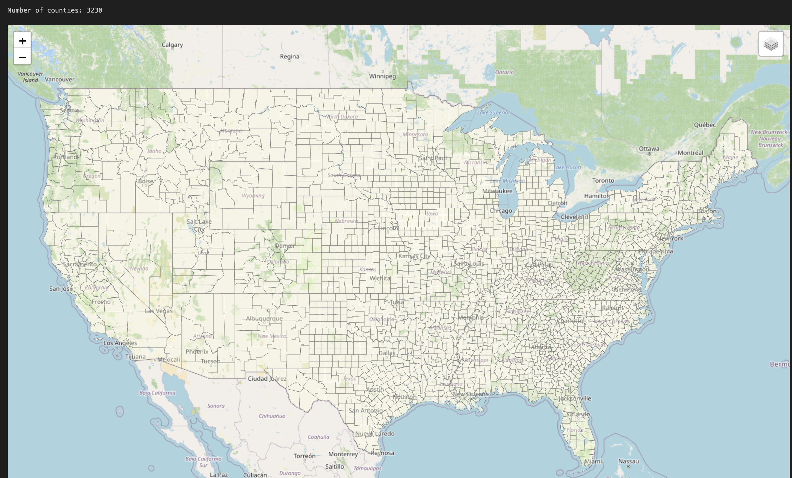

US_PARKS

> Wyniki, zrzut ekranu, komentarz

```py
sql = """
    SELECT sdo_util.to_wktgeometry(geom), name
    FROM us_parks
"""
rows = run_query(sql)
print(f"Number of parks: {len(rows)}")

m = make_map()
features = wkt_rows_to_features(rows, label_index=1)
add_layer(m, features, color="darkgreen", fill_color="lightgreen",
          fill_opacity=0.5, name="US Parks", tooltip_field="name")
folium.LayerControl().add_to(m)
show_map(m)
```

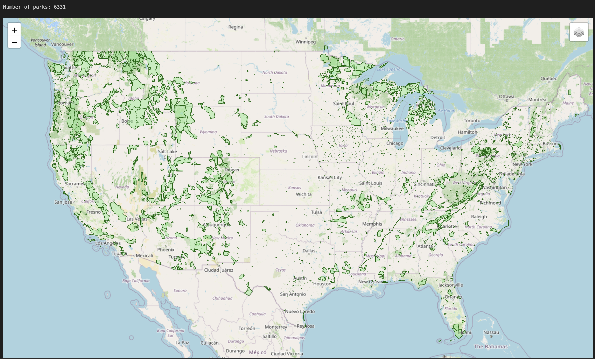

# Zadanie 2

Znajdź wszystkie stany (us_states) których obszary mają część wspólną ze wskazaną geometrią (prostokątem)

Pokaż wynik na mapie.

prostokąt

```sql
SELECT  sdo_geometry (2003, 8307, null,
sdo_elem_info_array (1,1003,3),
sdo_ordinate_array ( -117.0, 40.0, -90., 44.0)) g
FROM dual
```

Użyj funkcji SDO_FILTER

```sql
SELECT state, geom FROM us_states
WHERE sdo_filter (geom,
sdo_geometry (2003, 8307, null,
sdo_elem_info_array (1,1003,3),
sdo_ordinate_array ( -117.0, 40.0, -90., 44.0))
) = 'TRUE';
```

Zwróć uwagę na liczbę zwróconych wierszy (16)

> Wyniki, zrzut ekranu, komentarz

```py
RECT_SQL = """
    SDO_GEOMETRY(2003, 8307, NULL,
        SDO_ELEM_INFO_ARRAY(1, 1003, 3),
        SDO_ORDINATE_ARRAY(-117.0, 40.0, -90.0, 44.0))
"""

sql_filter = f"""
    SELECT sdo_util.to_wktgeometry(geom), state
    FROM us_states
    WHERE sdo_filter(geom, {RECT_SQL}) = 'TRUE'
"""

rows_filter = run_query(sql_filter)
print(f"SDO_FILTER - number of states: {len(rows_filter)}")
for r in rows_filter:
    print(" ", r[1])
```

```
SDO_FILTER - number of states: 16
  Wisconsin
  Illinois
  Michigan
  California
  Oregon
  Nevada
  Idaho
  Utah
  Wyoming
  Colorado
  Nebraska
  South Dakota
  Kansas
  Iowa
  Minnesota
  Missouri
```

Użyj funkcji SDO_ANYINTERACT

```sql
SELECT state, geom FROM us_states
WHERE sdo_anyinteract (geom,
sdo_geometry (2003, 8307, null,
sdo_elem_info_array (1,1003,3),
sdo_ordinate_array ( -117.0, 40.0, -90., 44.0))
) = 'TRUE';
```

```py
sql_anyinteract = f"""
    SELECT sdo_util.to_wktgeometry(geom), state
    FROM us_states
    WHERE sdo_anyinteract(geom, {RECT_SQL}) = 'TRUE'
"""
rows_anyinteract = run_query(sql_anyinteract)
print(f"SDO_ANYINTERACT - number of states: {len(rows_anyinteract)}")
for r in rows_anyinteract:
    print(" ", r[1])
```

```
SDO_ANYINTERACT - number of states: 14
  Wisconsin
  Illinois
  Oregon
  Nevada
  Idaho
  Utah
  Wyoming
  Colorado
  Nebraska
  South Dakota
  Kansas
  Iowa
  Minnesota
  Missouri
```

Porównaj wyniki sdo_filter i sdo_anyinteract

Pokaż wynik na mapie

> Wyniki, zrzut ekranu, komentarz

```py
m = make_map(center=(42, -103), zoom=5)

folium.Rectangle(
    bounds=[[40.0, -117.0], [44.0, -90.0]],
    color="orange", fill=True, fill_color="orange",
    fill_opacity=0.2, weight=2,
    tooltip="Rectangle"
).add_to(m)

feats_filter = wkt_rows_to_features(rows_filter, label_index=1)
add_layer(m, feats_filter, color="red", fill_color="red",
          fill_opacity=0.2, name="SDO_FILTER", tooltip_field="name")

feats_any = wkt_rows_to_features(rows_anyinteract, label_index=1)
add_layer(m, feats_any, color="blue", fill_color="blue",
          fill_opacity=0.2, name="SDO_ANYINTERACT", tooltip_field="name")

folium.LayerControl().add_to(m)
show_map(m)
```

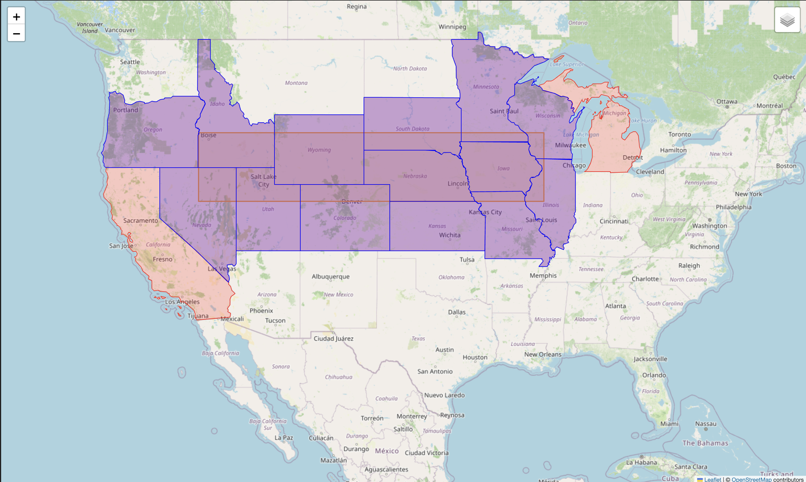

**Komentarz:**

- zapytanie z `SDO_FILTER`, w porównaniu do zapytania z `SDO_ANYINTERACT` uwzględniło dodatkowe 2 stany: `Michigan` oraz `California`
- różnica w wynikach wynika z faktu, że `SDO_FILTER` jest jedynie wstępnym filterem - bazuje on na `MBR (Minimum Bounding Rectangle)`, w związku z czym daje jedynie przybliżone wyniki i przez co uwzględnia stany, które w rzeczywistości w żadnym stopniu nie zawierają się w zdefiniowanym prostokącie. `SDO_ANYINTERACT` jest filtrem dokładnym, będzie spełniony jedynie w sytuacji gdy dane kształty faktycznie mają część wspólną.

# Zadanie 3

Znajdź wszystkie parki (us_parks) których obszary znajdują się wewnątrz stanu Wyoming

Użyj funkcji SDO_INSIDE

```sql
SELECT p.name, p.geom
FROM us_parks p, us_states s
WHERE s.state = 'Wyoming'
      AND SDO_INSIDE (p.geom, s.geom ) = 'TRUE';
```

W przypadku wykorzystywania narzędzia SQL Developer, w celu wizualizacji na mapie użyj podzapytania

```sql
SELECT pp.name, pp.geom FROM us_parks pp
WHERE id IN
(
      SELECT p.id
      FROM us_parks p, us_states s
      WHERE s.state = 'Wyoming'
            AND SDO_INSIDE (p.geom, s.geom ) = 'TRUE'
)
```

> Wyniki, zrzut ekranu, komentarz

```py
sql_wyoming = """
    SELECT sdo_util.to_wktgeometry(geom), state
    FROM us_states
    WHERE state = 'Wyoming'
"""
rows_wy = run_query(sql_wyoming)

sql_inside = """
    SELECT sdo_util.to_wktgeometry(p.geom), p.name
    FROM us_parks p, us_states s
    WHERE s.state = 'Wyoming'
      AND SDO_INSIDE(p.geom, s.geom) = 'TRUE'
"""
rows_inside = run_query(sql_inside)
print(f"SDO_INSIDE - parks inside Wyoming: {len(rows_inside)}")
for r in rows_inside:
    print(" ", r[1])
```

```
SDO_INSIDE - parks inside Wyoming: 32
  Flume Creek Park
  Cinnabar Park
  Sinclair Recreation Park
  ...
```

Porównaj wynik z:

```sql
SELECT p.name, p.geom
FROM us_parks p, us_states s
WHERE s.state = 'Wyoming'
AND SDO_ANYINTERACT (p.geom, s.geom ) = 'TRUE';
```

> Wyniki, zrzut ekranu, komentarz

```py
sql_anyinteract = """
    SELECT sdo_util.to_wktgeometry(p.geom), p.name
    FROM us_parks p, us_states s
    WHERE s.state = 'Wyoming'
      AND SDO_ANYINTERACT(p.geom, s.geom) = 'TRUE'
"""
rows_any = run_query(sql_anyinteract)
print(f"SDO_ANYINTERACT - parks intersecting: {len(rows_any)}")
for r in rows_any:
    print(" ", r[1])
```

```
SDO_ANYINTERACT - parks intersecting: 46
  Routt NF
  Flume Creek Park
  Cinnabar Park
  ...
```

```py
m = make_map(center=(43, -107), zoom=6)

feats_wy = wkt_rows_to_features(rows_wy, label_index=1)
add_layer(m, feats_wy, color="black", fill_color="lightyellow",
          fill_opacity=0.3, name="Wyoming")

feats_inside = wkt_rows_to_features(rows_inside, label_index=1)
add_layer(m, feats_inside, color="darkgreen", fill_color="green",
          fill_opacity=0.6, name="SDO_INSIDE", tooltip_field="name")

feats_any = wkt_rows_to_features(rows_any, label_index=1)
add_layer(m, feats_any, color="orange", fill_color="yellow",
          fill_opacity=0.3, name="SDO_ANYINTERACT", tooltip_field="name")

folium.LayerControl().add_to(m)
show_map(m)
```

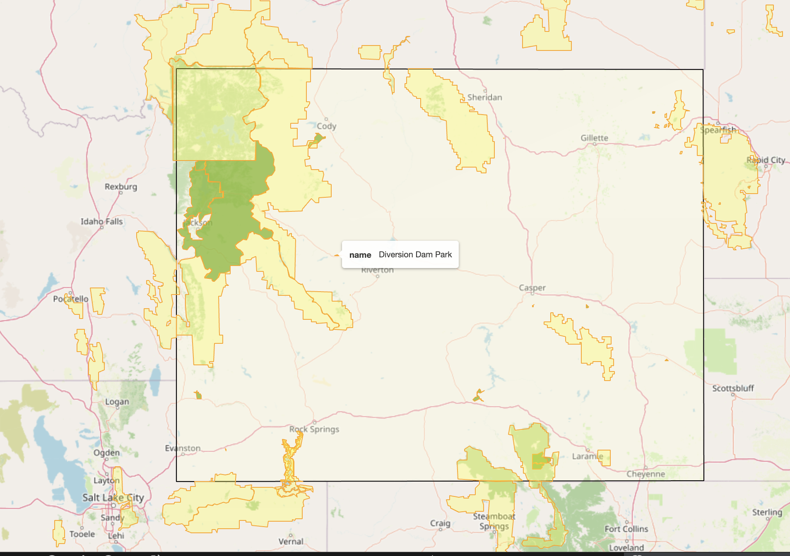

**Komentarz:**

- zapytanie z `SDO_ANYINTERACT` uwzględniło 14 dodatkowych parków względem zapytania z `SDO_INSIDE` - są to parki, które tylko częściowo znajdują się w stanie `Wyoming`, natomiast częściowo znajdują się poza granicami tego stanu.
- `SDO_INSIDE` to filtr, który jest spełniony wyłącznie w sytuacji, gdy dany kształt znajduje się **w całości** w drugim kształcie. `SDO_ANYINTERACT` ogranicza się natomiast do dowolnej interakcji - wystarczy że kształy będą się dotykać w dowolnym miejscu.
- ze względu na skalę mapy na pierwszy rzut oka nie wszystkie parki są widoczne, natomiast po przybliżeniu faktycznie możemy zaobserwować wszystkie 32 parki (wiele z nich jest stosunkowo małych)

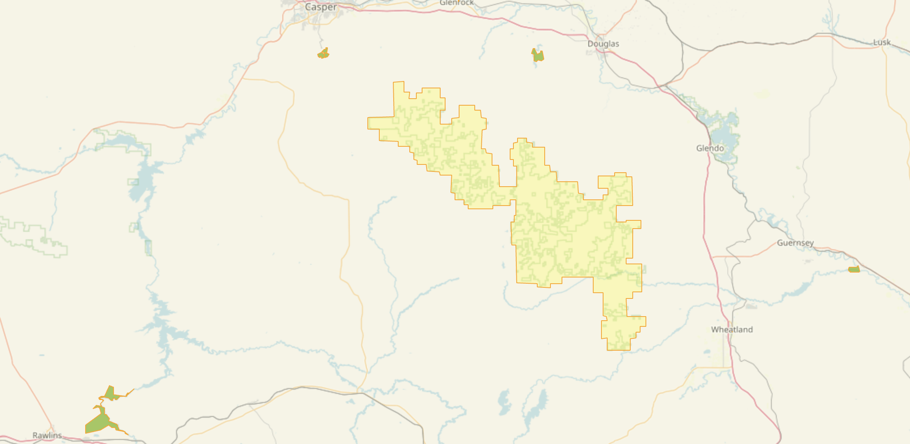

# Zadanie 4

Znajdź wszystkie jednostki administracyjne (us_counties) wewnątrz stanu New Hampshire

```sql
SELECT c.county, c.state_abrv, c.geom
FROM us_counties c, us_states s
WHERE s.state = 'New Hampshire'
AND SDO_RELATE ( c.geom,s.geom, 'mask=INSIDE+COVEREDBY') = 'TRUE';

SELECT c.county, c.state_abrv, c.geom
FROM us_counties c, us_states s
WHERE s.state = 'New Hampshire'
AND SDO_RELATE ( c.geom,s.geom, 'mask=INSIDE') = 'TRUE';

SELECT c.county, c.state_abrv, c.geom
FROM us_counties c, us_states s
WHERE s.state = 'New Hampshire'
AND SDO_RELATE ( c.geom,s.geom, 'mask=COVEREDBY') = 'TRUE';
```

W przypadku wykorzystywania narzędzia SQL Developer, w celu wizualizacji danych na mapie należy użyć podzapytania (podobnie jak w poprzednim zadaniu)

> Wyniki, zrzut ekranu, komentarz

```py
rows_nh = run_query("""
    SELECT sdo_util.to_wktgeometry(geom), state
    FROM us_states WHERE state = 'New Hampshire'
""")

sql_ic = """
    SELECT sdo_util.to_wktgeometry(c.geom), c.county
    FROM us_counties c, us_states s
    WHERE s.state = 'New Hampshire'
      AND SDO_RELATE(c.geom, s.geom, 'mask=INSIDE+COVEREDBY') = 'TRUE'
"""
rows_ic = run_query(sql_ic)
print(f"INSIDE+COVEREDBY - counties: {len(rows_ic)}")
for r in rows_ic: print(" ", r[1])
```

```
INSIDE+COVEREDBY - counties: 10
  Cheshire
  Hillsborough
  Sullivan
  Rockingham
  Merrimack
  Strafford
  Grafton
  Belknap
  Carroll
  Coos
```

```py
sql_i = """
    SELECT sdo_util.to_wktgeometry(c.geom), c.county
    FROM us_counties c, us_states s
    WHERE s.state = 'New Hampshire'
      AND SDO_RELATE(c.geom, s.geom, 'mask=INSIDE') = 'TRUE'
"""
rows_i = run_query(sql_i)
print(f"INSIDE - counties: {len(rows_i)}")
for r in rows_i: print(" ", r[1])

sql_c = """
    SELECT sdo_util.to_wktgeometry(c.geom), c.county
    FROM us_counties c, us_states s
    WHERE s.state = 'New Hampshire'
      AND SDO_RELATE(c.geom, s.geom, 'mask=COVEREDBY') = 'TRUE'
"""
rows_c = run_query(sql_c)
print(f"\nCOVEREDBY - counties: {len(rows_c)}")
for r in rows_c: print(" ", r[1])
```

```
INSIDE - counties: 2
  Merrimack
  Belknap

COVEREDBY - counties: 8
  Cheshire
  Hillsborough
  Sullivan
  Rockingham
  Strafford
  Grafton
  Carroll
  Coos
```

```py
m = make_map(center=(43.7, -71.5), zoom=8)

feats_ic = wkt_rows_to_features(rows_ic, label_index=1)
add_layer(m, feats_ic, color="blue", fill_color="blue",
          fill_opacity=0.1, weight=1, name="INSIDE+COVEREDBY (All)")

feats_c = wkt_rows_to_features(rows_c, label_index=1)
add_layer(m, feats_c, color="red", fill_color="pink",
          fill_opacity=0.3, weight=1, name="COVEREDBY (Bordering)")

feats_i = wkt_rows_to_features(rows_i, label_index=1)
add_layer(m, feats_i, color="green", fill_color="lightgreen",
          fill_opacity=0.6, weight=1, name="INSIDE (Interior)")

feats_nh = wkt_rows_to_features(rows_nh, label_index=1)
add_layer(m, feats_nh, color="black",
          fill_opacity=0, weight=3, name="New Hampshire Boundary")

folium.LayerControl().add_to(m)

show_map(m)
```

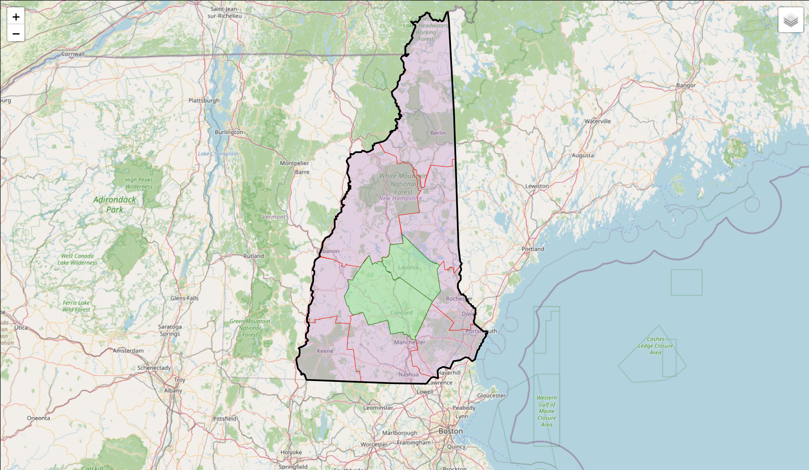

**Komentarz:**

- poszczególne maski zmieniają całkowicie ostateczne rezultaty zapytania: - `INSIDE` uwzględnia tylko te obiekty, które znajdują się w całości wewnątrz zadanego obszaru i **nie dotyka** jego granicy - `COVEREDBY` uwzględnia tylko te obiekty, które znajdują się wewnątrz zadanego obszaru i **styka się** z jego granicą - `INSIDE+COVEREDBY` uwzględnia wszystkie obiekty, które znajdują się w całości wewnątrz zadanego obszaru

# Zadanie 5

Znajdź wszystkie miasta w odległości 50 mili od drogi (us_interstates) I4

Pokaż wyniki na mapie

```sql
SELECT * FROM us_interstates
WHERE interstate = 'I4'

SELECT * FROM us_states
WHERE state_abrv = 'FL'

SELECT c.city, c.state_abrv, c.location
FROM us_cities c
WHERE ROWID IN
(
SELECT c.rowid
FROM us_interstates i, us_cities c
WHERE i.interstate = 'I4'
AND sdo_within_distance (c.location, i.geom,'distance=50 unit=mile') = 'TRUE'
)
```

> Wyniki, zrzut ekranu, komentarz

```py
rows_i4 = run_query("""
    SELECT sdo_util.to_wktgeometry(geom), interstate
    FROM us_interstates WHERE interstate = 'I4'
""")
rows_fl = run_query("""
    SELECT sdo_util.to_wktgeometry(geom), state
    FROM us_states WHERE state_abrv = 'FL'
""")

sql_cities_50 = """
    SELECT sdo_util.to_wktgeometry(c.location), c.city, c.state_abrv
    FROM us_cities c
    WHERE ROWID IN (
        SELECT c2.ROWID
        FROM us_interstates i, us_cities c2
        WHERE i.interstate = 'I4'
          AND sdo_within_distance(c2.location, i.geom, 'distance=50 unit=mile') = 'TRUE'
    )
"""
rows_cities = run_query(sql_cities_50)
print(f"Cities <50 mil from I4 road: {len(rows_cities)}")
for r in rows_cities:
    print(f"  {r[1]}, {r[2]}")
```

```
Cities <50 mil from I4 road: 3
  St Petersburg, FL
  Tampa, FL
  Orlando, FL
```

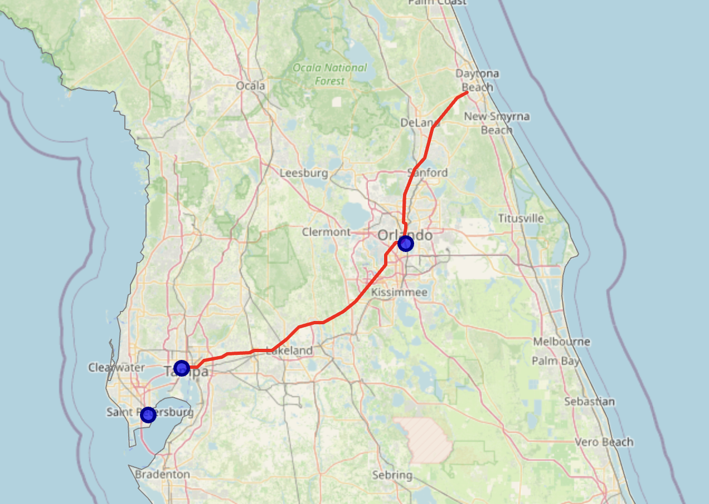

Dodatkowo:

a)    Znajdz wszystkie drogi które przecinają rzekę Mississippi

```py
sql_5a = """
    SELECT sdo_util.to_wktgeometry(i.geom), i.interstate
    FROM us_interstates i, us_rivers r
    WHERE r.name = 'Mississippi'
      AND SDO_ANYINTERACT(i.geom, r.geom) = 'TRUE'
"""
rows_5a = run_query(sql_5a)
print(f"Roads crossing Mississippi: {len(rows_5a)}")
for r in rows_5a:
    print(" ", r[1])

rows_ms = run_query("""
    SELECT sdo_util.to_wktgeometry(geom), name
    FROM us_rivers WHERE name = 'Mississippi'
""")

m = make_map(center=(38, -90), zoom=5)
add_layer(m, wkt_rows_to_features(rows_ms, label_index=1),
          color="steelblue", fill_opacity=0, weight=3, name="Mississippi")
add_layer(m, wkt_rows_to_features(rows_5a, label_index=1),
          color="red", fill_opacity=0, weight=2,
          name="Crossing roads", tooltip_field="name")
folium.LayerControl().add_to(m)
show_map(m)
```

```
Roads crossing Mississippi: 15
  I270
  I74
  I57
  ...
```

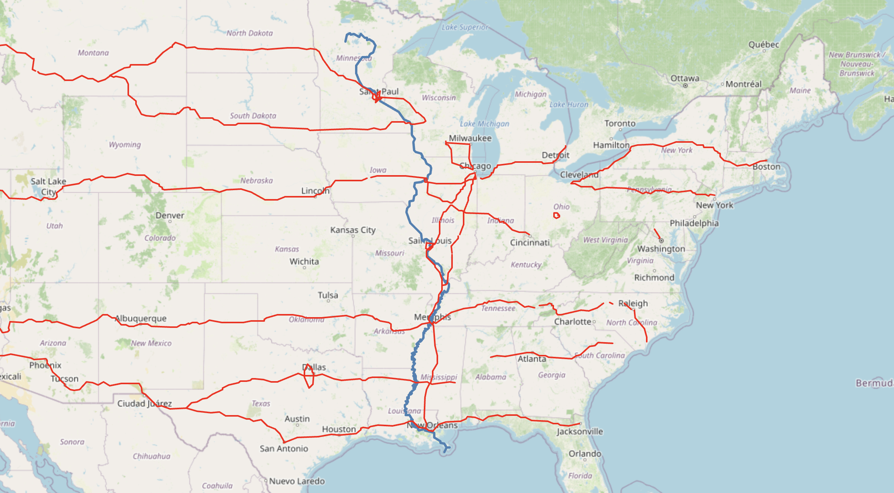

**Komentarz:**

- niektóre fragementy drogi wyglądają jakby nie przecinały rzeki Mississippi, jednak wynika to z faktu, że drogi te mają identyczne oznaczenia:

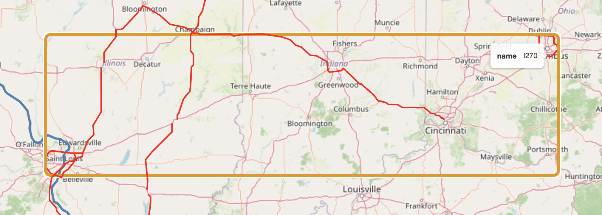

b)    Znajdz wszystkie miasta w odlegości od 15 do 30 mil od drogi 'I275'

```py
sql_30 = """
    SELECT c.ROWID, sdo_util.to_wktgeometry(c.location), c.city, c.state_abrv
    FROM us_interstates i, us_cities c
    WHERE i.interstate = 'I275'
      AND sdo_within_distance(c.location, i.geom, 'distance=30 unit=mile') = 'TRUE'
"""
rows_30 = {r[0]: r for r in run_query(sql_30)}

sql_15 = """
    SELECT c.ROWID
    FROM us_interstates i, us_cities c
    WHERE i.interstate = 'I275'
      AND sdo_within_distance(c.location, i.geom, 'distance=15 unit=mile') = 'TRUE'
"""
rowids_15 = {r[0] for r in run_query(sql_15)}

rows_5b = [r for rid, r in rows_30.items() if rid not in rowids_15]
print(f"Cities from 15 to 30 miles from I275 road: {len(rows_5b)}")
for r in rows_5b:
    print(f"  {r[2]}, {r[3]}")

rows_i275 = run_query("""
    SELECT sdo_util.to_wktgeometry(geom), interstate
    FROM us_interstates WHERE interstate = 'I275'
""")

m = make_map(center=(38, -84), zoom=7)
add_layer(m, wkt_rows_to_features(rows_i275, label_index=1),
          color="red", fill_opacity=0, weight=3, name="I275")
for r in rows_5b:
    if r[1] is None: continue
    geom = loads(r[1])
    folium.CircleMarker(
        location=[geom.y, geom.x], radius=5,
        color="purple", fill=True, fill_color="violet",
        fill_opacity=0.7, tooltip=f"{r[2]}, {r[3]}"
    ).add_to(m)
folium.LayerControl().add_to(m)
show_map(m)
```

```
Cities from 15 to 30 miles from I275 road: 4
  Toledo, OH
  Detroit, MI
  Warren, MI
  Sterling Heights, MI
```

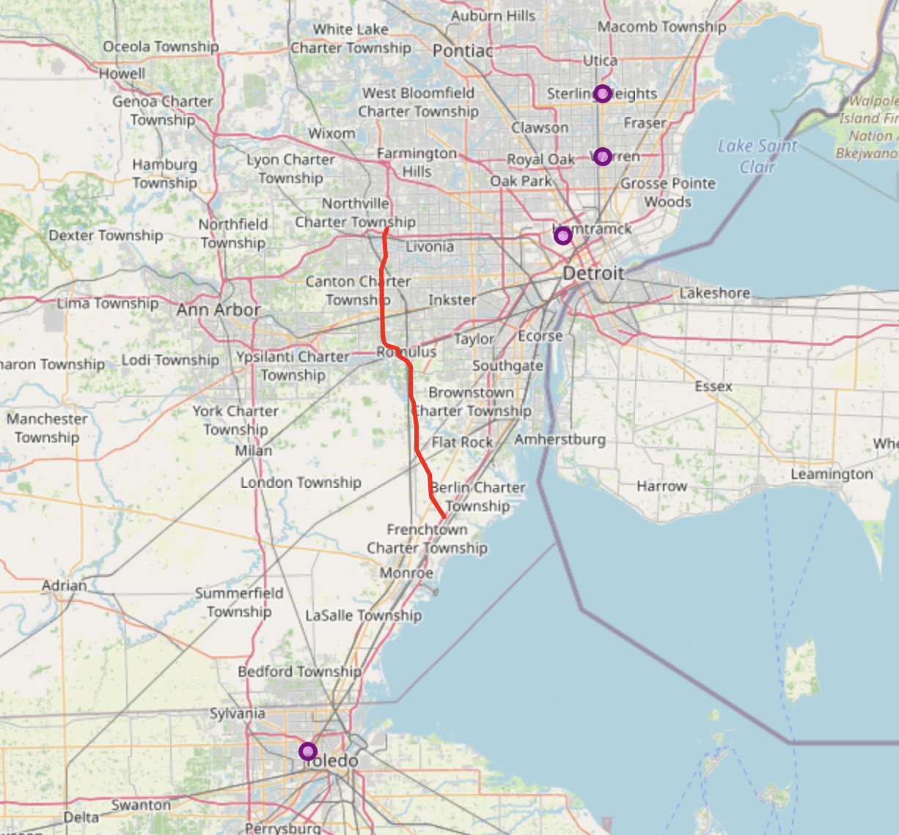

c)      Itp. (własne przykłady)

> Wyniki, zrzut ekranu, komentarz
> (dla każdego z podpunktów)

```sql
--  ...
```

# Zadanie 6

Znajdz 5 miast najbliższych drogi I4

```sql
SELECT c.city, c.state_abrv, c.location
FROM us_interstates i, us_cities c
WHERE i.interstate = 'I4'
AND sdo_nn(c.location, i.geom, 'sdo_num_res=5') = 'TRUE';
```

> Wyniki, zrzut ekranu, komentarz

```py
sql_nn = """
    SELECT sdo_util.to_wktgeometry(c.location), c.city, c.state_abrv
    FROM us_interstates i, us_cities c
    WHERE i.interstate = 'I4'
      AND sdo_nn(c.location, i.geom, 'sdo_num_res=5') = 'TRUE'
"""
rows_nn = run_query(sql_nn)
print("Top 5 cities closes to I4:")
for r in rows_nn:
    print(f"  {r[1]}, {r[2]}")

m = make_map(center=(28.5, -81.5), zoom=7)
feats_i4 = wkt_rows_to_features(rows_i4, label_index=1)
add_layer(m, feats_i4, color="red", fill_opacity=0, weight=3, name="I4")
for r in rows_nn:
    if r[0] is None: continue
    geom = loads(r[0])
    folium.Marker(
        location=[geom.y, geom.x],
        tooltip=f"{r[1]}, {r[2]}",
        icon=folium.Icon(color="green", icon="star")
    ).add_to(m)
folium.LayerControl().add_to(m)
show_map(m)
```

```
Top 5 cities closest to I4:
  Tampa, FL
  Jacksonville, FL
  St Petersburg, FL
  Orlando, FL
  Fort Lauderdale, FL
```

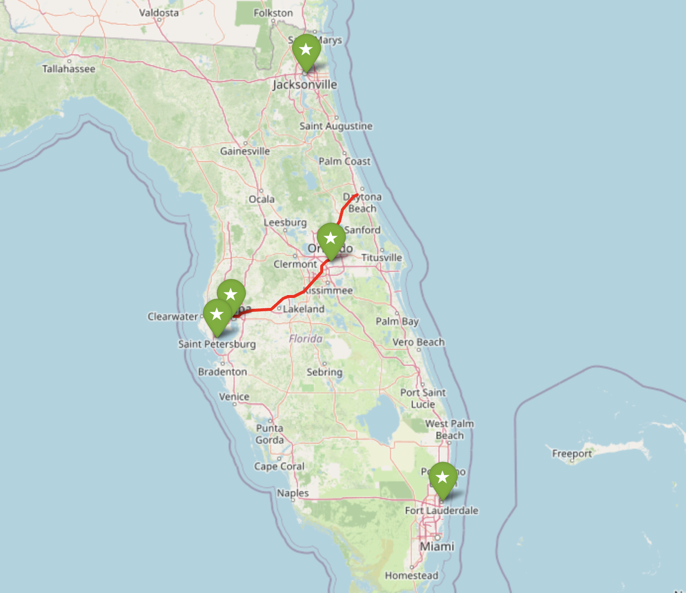

Dodatkowo:

a) Podaj 3 parki narodowe do których jest najbliżej z Nowego Jorku, oblicz odległości do tych parków

```py
rows_nyc = run_query("""
    SELECT sdo_util.to_wktgeometry(location)
    FROM us_cities WHERE city = 'New York' AND state_abrv = 'NY'
""")
nyc_wkt = rows_nyc[0][0]

sql_6a = f"""
    SELECT * FROM (
        SELECT
            sdo_util.to_wktgeometry(p.geom) AS geom,
            p.name,
            sdo_geom.sdo_distance(p.geom, c.location, 0.005, 'unit=mile') AS distance_miles
        FROM US_SPAT.US_PARKS p, us_cities c
        WHERE c.city = 'New York'
          AND c.state_abrv = 'NY'
          AND p.fcc = 'D83'
        ORDER BY distance_miles ASC
    ) WHERE ROWNUM <= 3
"""
rows_6a = run_query(sql_6a)
print("Top 3 national parks from NY:")
for r in rows_6a:
    print(f"  {r[1]:40s} {r[2]:.1f} mil")

nyc_geom = loads(nyc_wkt)
m = make_map(center=(40, -76), zoom=6)
folium.Marker(
    location=[nyc_geom.y, nyc_geom.x],
    tooltip="New York",
    icon=folium.Icon(color="red", icon="home")
).add_to(m)
feats_parks = wkt_rows_to_features(rows_6a, label_index=1)
add_layer(m, feats_parks, color="darkgreen", fill_color="green",
          fill_opacity=0.5, name="Nearest Parks")
for r in rows_6a:
    if r[0] is None: continue
    geom = loads(r[0])
    centroid = geom.centroid
    folium.Marker(
        location=[centroid.y, centroid.x],
        tooltip=f"{r[1]} ({r[2]:.1f} mil)",
        icon=folium.Icon(color="green", icon="tree-deciduous")
    ).add_to(m)
folium.LayerControl().add_to(m)
show_map(m)
```

```
Top 3 national parks from NY:
  Institute Park                           1.0 mil
  Prospect Park                            1.1 mil
  Thompkins Park                           1.3 mil
```

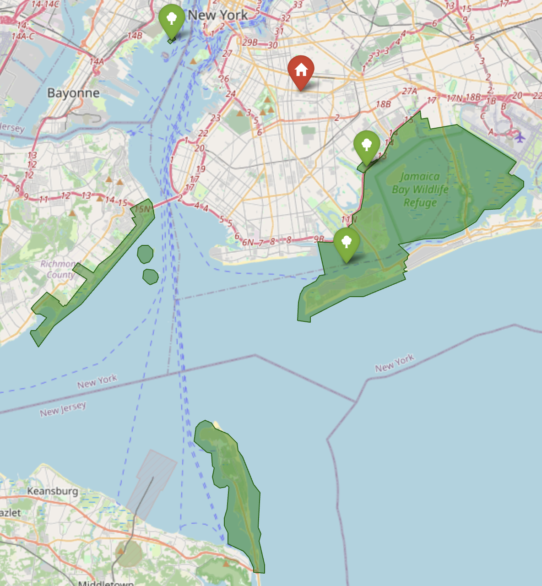

b) Znajdz 5 najbliższych dużych miast (o populacji powyżej 300 tys) od drogi  'I170'

```py
sql_6b = """
    SELECT * FROM (
        SELECT sdo_util.to_wktgeometry(c.location), c.city, c.state_abrv, c.pop90
        FROM us_interstates i, us_cities c
        WHERE i.interstate = 'I170'
          AND c.pop90 > 300000
          AND sdo_nn(c.location, i.geom, 'sdo_batch_size=20') = 'TRUE'
    ) WHERE ROWNUM <= 5
"""
rows_6b = run_query(sql_6b)
print("Top 5 big cities (>300k) closest to I170:")
for r in rows_6b:
    print(f" {r[1]} {r[2]} pop: {r[3]:,}")

rows_i170 = run_query("""
    SELECT sdo_util.to_wktgeometry(geom), interstate
    FROM us_interstates WHERE interstate = 'I170'
""")

m = make_map(center=(38.7, -90.5), zoom=7)
add_layer(m, wkt_rows_to_features(rows_i170, label_index=1),
          color="red", fill_opacity=0, weight=3, name="I170")
for r in rows_6b:
    if r[0] is None: continue
    geom = loads(r[0])
    folium.Marker(
        location=[geom.y, geom.x],
        tooltip=f"{r[1]}, {r[2]} (pop: {r[3]:,})",
        icon=folium.Icon(color="blue", icon="info-sign")
    ).add_to(m)
folium.LayerControl().add_to(m)
show_map(m)
```

```
Top 5 big cities (>300k) closest to I170:
      St Louis MO pop: 396,685
      Kansas City MO pop: 435,146
      Indianapolis IN pop: 741,952
      Memphis TN pop: 610,337
      Chicago IL pop: 2,783,726
```

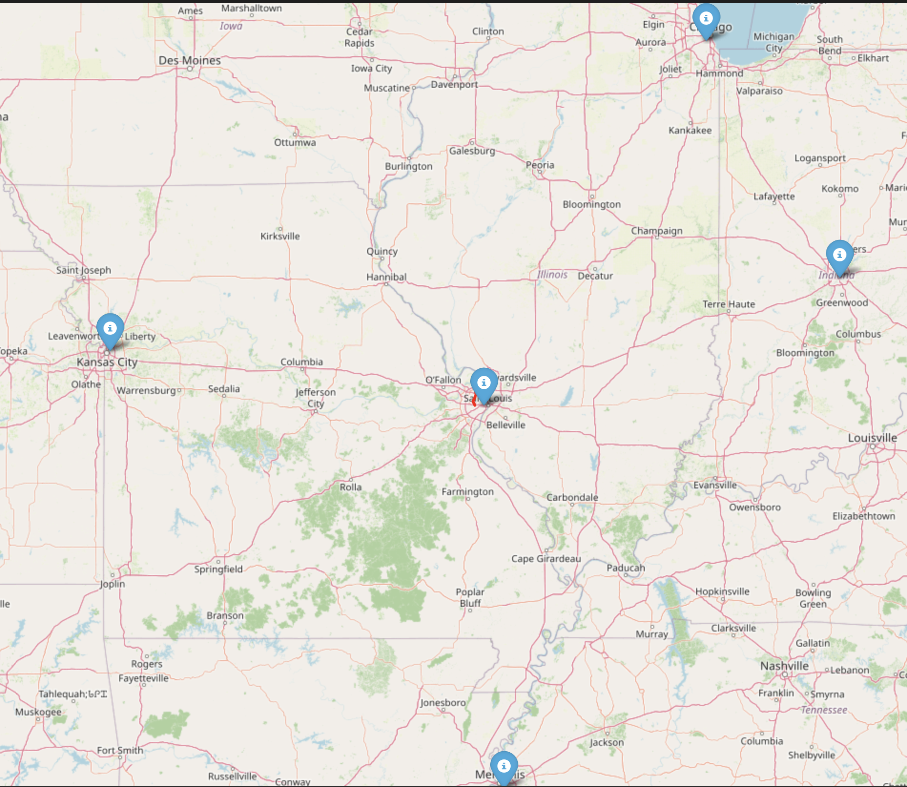

**Komentarz:**

- w zadanich `6a` oraz `6b`, ze względu na dodatkowy filtr nie było możliwe skorzystanie ze standardowej konstrukcji `sdo_nn(...)`, ponieważ wtedy najpierw zwracana jest określona liczba najbliższych obiektów, a dopiero później aplikowane są filtry - w rezultacie otrzymywaliśmy 0 wyników, ponieważ najbliższe obiekty niekoniecznie spełniały wymagania zdefiniowane w filtrach
- zostały przetestowane dwa podejścia radzenia sobie z opisaną sytuacją: - obliczenie dystansu funkcją `sdo_distance(...)`, zaaplikowanie filtrów, a następnie posortowanie wyników za pomocą `order by` (mniej wydajne) - wykorzystanie `sdo_batch_size` zamiast `sdo_num_res` (bardziej wydajne, ale w naszej opinii mniej czytelne)

c)  Itp. (własne przykłady).

- np. przetestuj działanie funkcji
  - sdo_intersection, sdo_union, sdo_difference
  - sdo_buffer
  - sdo_centroid, sdo_mbr, sdo_convexhull, sdo_simplify

> Wyniki, zrzut ekranu, komentarz
> (dla każdego z podpunktów)

**SDO_BUFFER:**

```py
sql_buf = """
SELECT sdo_util.to_wktgeometry(
    sdo_geom.sdo_buffer(geom, 50, 0.5, 'unit=KM')
)
FROM US_SPAT.US_STATES
WHERE state = 'Montana'
"""
rows_buf = run_query(sql_buf)

sql_orig = "SELECT sdo_util.to_wktgeometry(geom) FROM US_SPAT.US_STATES WHERE state = 'Montana'"
rows_orig = run_query(sql_orig)

m = make_map(center=(43, -107), zoom=6)

if rows_buf and rows_buf[0][0]:
    add_layer(m, wkt_rows_to_features(rows_buf),
        color="orange", fill_color="blue", fill_opacity=0.3, name="Buffer")

if rows_orig and rows_orig[0][0]:
    add_layer(m, wkt_rows_to_features(rows_orig),
        color="black", fill_color="none", weight=3, name="Original Wyoming")

folium.LayerControl().add_to(m)
show_map(m)
```

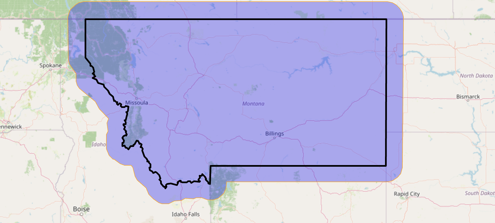

**SDO_MBR & SDO_CENTROID:**

```py
sql_orig = "SELECT sdo_util.to_wktgeometry(geom) FROM US_SPAT.US_STATES WHERE state = 'Montana'"
sql_mbr  = "SELECT sdo_util.to_wktgeometry(sdo_geom.sdo_mbr(geom)) FROM US_SPAT.US_STATES WHERE state = 'Montana'"
sql_cen  = "SELECT sdo_util.to_wktgeometry(sdo_geom.sdo_centroid(geom, 0.005)) FROM US_SPAT.US_STATES WHERE state = 'Montana'"

rows_orig = run_query(sql_orig)
rows_mbr  = run_query(sql_mbr)
rows_cen  = run_query(sql_cen)

m = make_map(center=(47, -110), zoom=6)
add_layer(m, wkt_rows_to_features(rows_orig), color="black", weight=2, fill_color="none", name="Original Montana")
add_layer(m, wkt_rows_to_features(rows_mbr), color="purple", weight=2, fill_color="none", name="MBR")

if rows_cen and rows_cen[0][0]:
    geom = loads(rows_cen[0][0])
    folium.Marker(
        location=[geom.y, geom.x],
        tooltip="Centroid",
        icon=folium.Icon(color="red", icon="info-sign")
    ).add_to(m)

folium.LayerControl().add_to(m)
show_map(m)
```

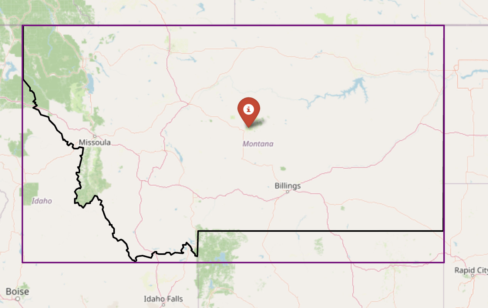

**SDO_CONVEXHULL & SDO_SIMPLIFY:**

```py
sql_hull  = "SELECT sdo_util.to_wktgeometry(sdo_geom.sdo_convexhull(geom, 0.005)) FROM US_SPAT.US_STATES WHERE state = 'Montana'"
sql_simp  = "SELECT sdo_util.to_wktgeometry(sdo_util.simplify(geom, 0.1)) FROM US_SPAT.US_STATES WHERE state = 'Montana'"

rows_hull = run_query(sql_hull)
rows_simp = run_query(sql_simp)

m = make_map(center=(47, -110), zoom=6)

add_layer(m, wkt_rows_to_features(rows_orig), color="black", weight=2, fill_color="none", name="Original Montana")
add_layer(m, wkt_rows_to_features(rows_hull), color="blue", weight=2, fill_color="blue", fill_opacity=0.1, name="Convex Hull")
add_layer(m, wkt_rows_to_features(rows_simp), color="green", weight=3, fill_color="none", name="Simplified (0.1 tol)")

folium.LayerControl().add_to(m)
show_map(m)
```

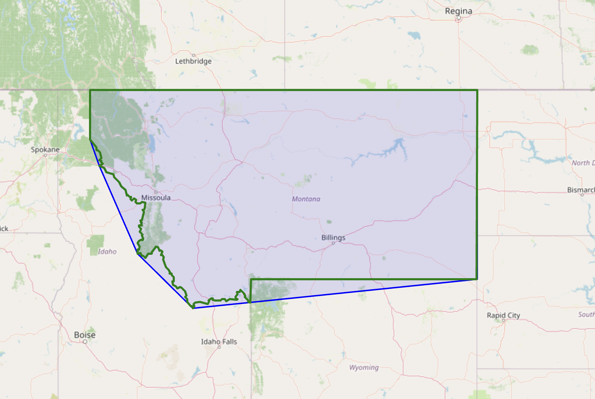

**SDO_INTERSECTION:**

```py
sql = """SELECT sdo_util.to_wktgeometry(sdo_geom.sdo_intersection(a.geom, b.geom, 0.005))
         FROM US_SPAT.US_STATES a, (SELECT sdo_geom.sdo_buffer(geom, 200, 0.5, 'unit=KM') as geom
         FROM US_SPAT.US_STATES WHERE state = 'Montana') b WHERE a.state = 'Montana'"""
rows = run_query(sql)
m = make_map(center=(47, -110), zoom=6)
add_layer(m, wkt_rows_to_features(rows), color="red", name="Intersection")
show_map(m)
```

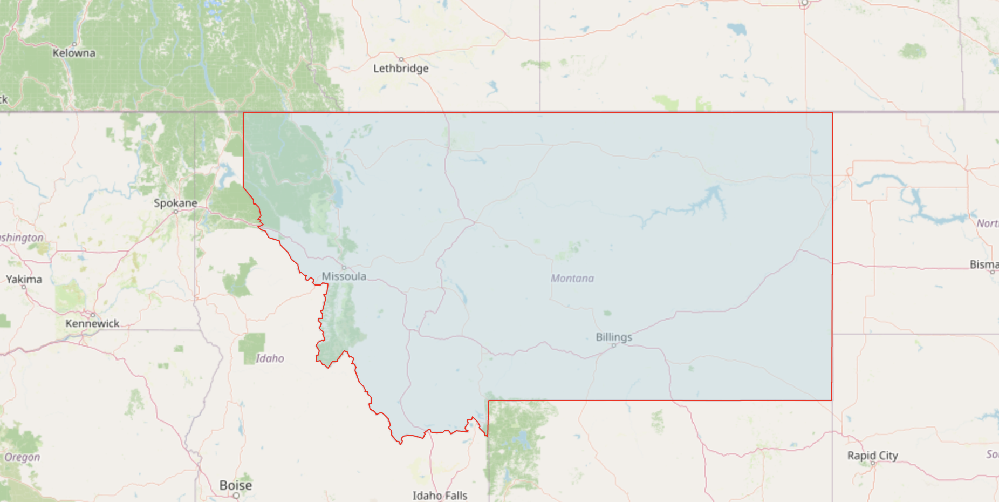

**SDO_DIFFERENCE & SDO_UNION**

```py
m = make_map(center=(47, -110), zoom=6)

sql_un = """SELECT sdo_util.to_wktgeometry(sdo_geom.sdo_union(a.geom, b.geom, 0.005))
         FROM US_SPAT.US_STATES a, (SELECT sdo_geom.sdo_buffer(geom, 50, 0.5, 'unit=KM') as geom
         FROM US_SPAT.US_STATES WHERE state = 'Montana') b WHERE a.state = 'Montana'"""
add_layer(m, wkt_rows_to_features(run_query(sql_un)), color="blue", fill_opacity=0.1, weight=2, name="Union (Stan + Bufor)")

sql_diff = """SELECT sdo_util.to_wktgeometry(sdo_geom.sdo_difference(b.geom, a.geom, 0.005))
         FROM US_SPAT.US_STATES a, (SELECT sdo_geom.sdo_buffer(geom, 50, 0.5, 'unit=KM') as geom
         FROM US_SPAT.US_STATES WHERE state = 'Montana') b WHERE a.state = 'Montana'"""
add_layer(m, wkt_rows_to_features(run_query(sql_diff)), color="red", fill_opacity=0.4, weight=2, name="Difference (Tylko otoczka)")

folium.LayerControl().add_to(m)
show_map(m)
```

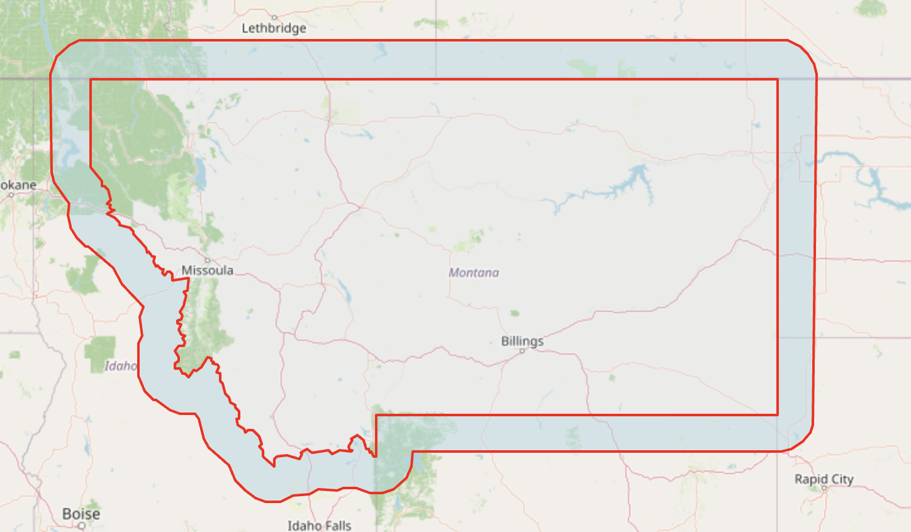

# Zadanie 7

Wykonaj kilka własnych przykładów/analiz

## 7a – Stany z największą liczbą parków (SDO_ANYINTERACT + GROUP BY)

> Wyniki, zrzut ekranu, komentarz

```py
sql_7a = """
    SELECT counts.state, counts.park_count, sdo_util.to_wktgeometry(s.geom)
    FROM (
        SELECT s.state, COUNT(p.id) AS park_count
        FROM us_states s
        LEFT JOIN us_parks p ON SDO_ANYINTERACT(p.geom, s.geom) = 'TRUE'
        GROUP BY s.state
    ) counts
    JOIN us_states s ON counts.state = s.state
    ORDER BY counts.park_count DESC
"""

rows_7a = run_query(sql_7a)
print("Top 10 states by number of national parks:")
for r in rows_7a[:10]:
    print(f"{r[0]:20s} {r[1]} parks")

m = make_map()
max_count = max(r[1] for r in rows_7a) or 1
for row in rows_7a:
    if row[2] is None:
        continue
    count = row[1]
    ratio = count / max_count
    g = int(100 + 100 * ratio)
    r_val = int(200 * (1 - ratio))
    color = f"#{r_val:02x}{g:02x}00"
    geom = loads(row[2])
    feat = geojson.Feature(
        geometry=mapping(geom),
        properties={"name": row[0], "parks": count}
    )
    folium.GeoJson(
        feat,
        style_function=lambda x, c=color: {
            "color": "black", "weight": 0.5,
            "fillColor": c, "fillOpacity": 0.7
        },
        tooltip=folium.GeoJsonTooltip(fields=["name", "parks"])
    ).add_to(m)
show_map(m)
```

```
Top 10 states by number of national parks:
Iowa                 623 parks
New York             571 parks
Texas                433 parks
Wisconsin            427 parks
Oregon               357 parks
Washington           339 parks
Illinois             274 parks
California           247 parks
Michigan             214 parks
Pennsylvania         198 parks
```

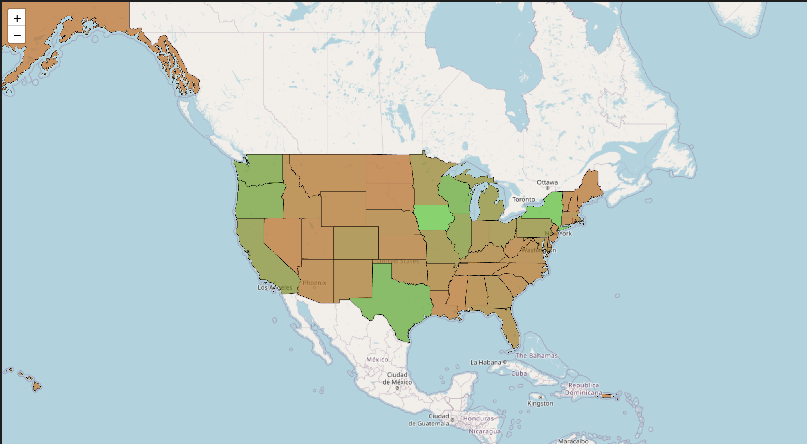

## 7b - Miasta położone wzdłuż rzeki Missisipi (w odległości <= 20 mil)

```py
sql_7b = """
    SELECT sdo_util.to_wktgeometry(c.location), c.city, c.state_abrv, c.pop90
    FROM us_cities c
    WHERE ROWID IN (
        SELECT c2.ROWID
        FROM us_rivers r, us_cities c2
        WHERE r.name = 'Mississippi'
          AND sdo_within_distance(
                  c2.location, r.geom, 'distance=20 unit=mile'
              ) = 'TRUE'
    )
    ORDER BY pop90 DESC
"""
rows_7b = run_query(sql_7b)
print(f"Cities close to Mississippi (<20 miles): {len(rows_7b)}")
for r in rows_7b:
    print(f"  {r[1]:25s} {r[2]}  pop: {r[3]:,}")

m = make_map(center=(37, -90), zoom=5)
add_layer(m, wkt_rows_to_features(rows_ms, label_index=1),
          color="steelblue", fill_opacity=0, weight=3, name="Mississippi")
for r in rows_7b:
    if r[0] is None: continue
    geom = loads(r[0])
    folium.CircleMarker(
        location=[geom.y, geom.x],
        radius=max(4, min(12, r[3] // 100000)),
        color="navy", fill=True, fill_color="dodgerblue",
        fill_opacity=0.7,
        tooltip=f"{r[1]}, {r[2]} (pop: {r[3]:,})"
    ).add_to(m)
folium.LayerControl().add_to(m)
show_map(m)
```

```
Cities close to Mississippi (<20 miles): 6
      Memphis                   TN  pop: 610,337
      New Orleans               LA  pop: 496,938
      St Louis                  MO  pop: 396,685
      Minneapolis               MN  pop: 368,383
      St Paul                   MN  pop: 272,235
      Baton Rouge               LA  pop: 219,531
```

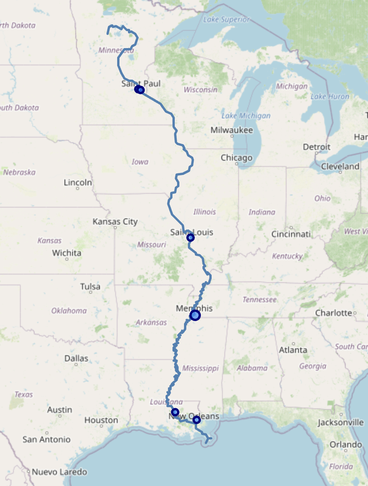

## 7c - Parki w promieniu 200 mil od centrum USA (Kansas)

```py
sql_7c = """
    SELECT sdo_util.to_wktgeometry(geom), name
    FROM us_parks
    WHERE sdo_within_distance(
        geom,
        sdo_geometry(2001, 8307, sdo_point_type(-98.6, 39.8, NULL), NULL, NULL),
        'distance=200 unit=mile'
    ) = 'TRUE'
"""
rows_7c = run_query(sql_7c)
print(f"National parks closer than 200 miles from USA centre: {len(rows_7c)}")
for r in rows_7c:
    print(" ", r[1])

m = make_map(center=(39.8, -98.6), zoom=5)
folium.Circle(
    location=[39.8, -98.6],
    radius=320_000,
    color="orange", fill=True, fill_color="orange",
    fill_opacity=0.1, weight=2,
    tooltip="200 miles radius (~320km)"
).add_to(m)
folium.Marker(
    location=[39.8, -98.6],
    tooltip="Centrum USA - Smith Center, KS",
    icon=folium.Icon(color="red", icon="flag")
).add_to(m)
add_layer(m, wkt_rows_to_features(rows_7c, label_index=1),
          color="darkgreen", fill_color="green", fill_opacity=0.5,
          name="Parks in 200 mil radius", tooltip_field="name")
folium.LayerControl().add_to(m)
show_map(m)
```

```
National parks closer than 200 miles from USA centre: 119
      Albright Park
      Island Park
      Woods Park
      ...
```

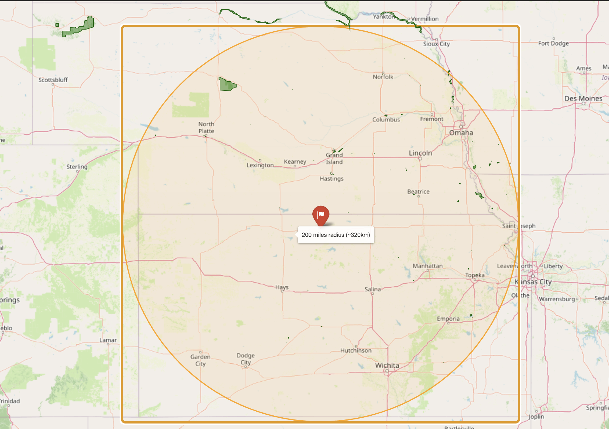

Punktacja

|       |     |
| ----- | --- |
| zad   | pkt |
| 1     | 0,5 |
| 2     | 0,5 |
| 3     | 0,5 |
| 4     | 0,5 |
| 5     | 1   |
| 6     | 2   |
| 7     | 2   |
| razem | 7   |
