# Indeksy, optymalizator <br>Lab1

<!-- <style scoped>
 p,li {
    font-size: 12pt;
  }
</style>  -->

<!-- <style scoped>
 pre {
    font-size: 8pt;
  }
</style>  -->

---

**Imiona i nazwiska:** Marek Małek, Mateusz Lampert

---

Celem ćwiczenia jest zapoznanie się z planami wykonania zapytań (execution plans), oraz z budową i możliwością wykorzystaniem indeksów.

Swoje odpowiedzi wpisuj w miejsca oznaczone jako:

---

> Wyniki:

```sql
--  ...
```

---

Ważne/wymagane są komentarze.

Zamieść kod rozwiązania oraz zrzuty ekranu pokazujące wyniki

- dołącz kod rozwiązania w formie tekstowej/źródłowej
- najlepiej plik .md
  - ewentualnie sql

Zwróć uwagę na formatowanie kodu

## Oprogramowanie - co jest potrzebne?

Do wykonania ćwiczenia potrzebne jest następujące oprogramowanie

- MS SQL Server
- SSMS - SQL Server Management Studio
  - ewentualnie inne narzędzie umożliwiające komunikację z MS SQL Server i analizę planów zapytań
- przykładowa baza danych AdventureWorks2017.

Oprogramowanie dostępne jest na przygotowanej maszynie wirtualnej

## Przygotowanie

Stwórz swoją bazę danych o nazwie lab1.

```sql
create database lab1
go

use lab1
go
```

# Część 1

Celem tej części ćwiczenia jest zapoznanie się z planami wykonania zapytań (execution plans) oraz narzędziem do automatycznego generowania indeksów.

## Dokumentacja/Literatura

Przydatne materiały/dokumentacja. Proszę zapoznać się z dokumentacją:

- [https://docs.microsoft.com/en-us/sql/tools/dta/tutorial-database-engine-tuning-advisor](https://docs.microsoft.com/en-us/sql/tools/dta/tutorial-database-engine-tuning-advisor)
- [https://docs.microsoft.com/en-us/sql/relational-databases/performance/start-and-use-the-database-engine-tuning-advisor](https://docs.microsoft.com/en-us/sql/relational-databases/performance/start-and-use-the-database-engine-tuning-advisor)
- [https://www.simple-talk.com/sql/performance/index-selection-and-the-query-optimizer](https://www.simple-talk.com/sql/performance/index-selection-and-the-query-optimizer)
- [https://blog.quest.com/sql-server-execution-plan-what-is-it-and-how-does-it-help-with-performance-problems/](https://blog.quest.com/sql-server-execution-plan-what-is-it-and-how-does-it-help-with-performance-problems/)

Operatory (oraz reprezentujące je piktogramy/Ikonki) używane w graficznej prezentacji planu zapytania opisane są tutaj:

- [https://docs.microsoft.com/en-us/sql/relational-databases/showplan-logical-and-physical-operators-reference](https://docs.microsoft.com/en-us/sql/relational-databases/showplan-logical-and-physical-operators-reference)

<div style="page-break-after: always;"></div>

Wykonaj poniższy skrypt, aby przygotować dane:

```sql
select * into [salesorderheader]
from [adventureworks2017].sales.[salesorderheader]
go

select * into [salesorderdetail]
from [adventureworks2017].sales.[salesorderdetail]
go
```

# Zadanie 1 - Obserwacja

Wpisz do MSSQL Managment Studio (na razie nie wykonuj tych zapytań):

```sql
-- zapytanie 1
select *
from salesorderheader sh
inner join salesorderdetail sd on sh.salesorderid = sd.salesorderid
where orderdate = '2008-06-01 00:00:00.000'
go

-- zapytanie 1.1
select *
from salesorderheader sh
inner join salesorderdetail sd on sh.salesorderid = sd.salesorderid
where orderdate = '2013-01-28 00:00:00.000'
go

-- zapytanie 2
select orderdate, productid, sum(orderqty) as orderqty,
       sum(unitpricediscount) as unitpricediscount, sum(linetotal)
from salesorderheader sh
inner join salesorderdetail sd on sh.salesorderid = sd.salesorderid
group by orderdate, productid
having sum(orderqty) >= 100
go

-- zapytanie 3
select salesordernumber, purchaseordernumber, duedate, shipdate
from salesorderheader sh
inner join salesorderdetail sd on sh.salesorderid = sd.salesorderid
where orderdate in ('2008-06-01','2008-06-02', '2008-06-03', '2008-06-04', '2008-06-05')
go

-- zapytanie 4
select sh.salesorderid, salesordernumber, purchaseordernumber, duedate, shipdate
from salesorderheader sh
inner join salesorderdetail sd on sh.salesorderid = sd.salesorderid
where carriertrackingnumber in ('ef67-4713-bd', '6c08-4c4c-b8')
order by sh.salesorderid
go
```

Włącz dwie opcje: **Include Actual Execution Plan** oraz **Include Live Query Statistics**:

<!-- ![[media/index1-1.png | 500]] -->


Teraz wykonaj poszczególne zapytania (najlepiej każde analizuj oddzielnie). Co można o nich powiedzieć? Co sprawdzają? Jak można je zoptymalizować?

---

> Wyniki:

```sql
--  ...
```

---

# Zadanie 2 - Dobór indeksów / optymalizacja

Do wykonania tego ćwiczenia potrzebne jest narzędzie SSMS

Zapytania 1, 2, 3, 4 z poprzedniego zadania

```sql
select *
from salesorderheader sh
inner join salesorderdetail sd on sh.salesorderid = sd.salesorderid
where orderdate = '2008-06-01 00:00:00.000'
go

-- zapytanie 2
select orderdate, productid, sum(orderqty) as orderqty,
       sum(unitpricediscount) as unitpricediscount, sum(linetotal)
from salesorderheader sh
inner join salesorderdetail sd on sh.salesorderid = sd.salesorderid
group by orderdate, productid
having sum(orderqty) >= 100
go

-- zapytanie 3
select salesordernumber, purchaseordernumber, duedate, shipdate
from salesorderheader sh
inner join salesorderdetail sd on sh.salesorderid = sd.salesorderid
where orderdate in ('2008-06-01','2008-06-02', '2008-06-03', '2008-06-04', '2008-06-05')
go

-- zapytanie 4
select sh.salesorderid, salesordernumber, purchaseordernumber, duedate, shipdate
from salesorderheader sh
inner join salesorderdetail sd on sh.salesorderid = sd.salesorderid
where carriertrackingnumber in ('ef67-4713-bd', '6c08-4c4c-b8')
order by sh.salesorderid
go

```

Zaznacz wszystkie zapytania, i uruchom je w **Database Engine Tuning Advisor**:

<!-- ![[media/index1-12.png | 500]] -->


Sprawdź zakładkę **Tuning Options**, co tam można skonfigurować?

---

> Wyniki:

```sql
--  ...
```

---

Użyj **Start Analysis**:

<!-- ![[_img/index1-3.png | 500]] -->


Zaobserwuj wyniki w **Recommendations**.

Przejdź do zakładki **Reports**. Sprawdź poszczególne raporty. Główną uwagę zwróć na koszty i ich poprawę:

<!-- ![[_img/index4-1.png | 500]] -->


Zapisz poszczególne rekomendacje:

Uruchom zapisany skrypt w Management Studio.

Opisz, dlaczego dane indeksy zostały zaproponowane do zapytań:

---

> Wyniki:

```sql
--  ...
```

---

Sprawdź jak zmieniły się Execution Plany. Opisz zmiany:

---

> Wyniki:

```sql
--  ...
```

---

# Część 2

Celem ćwiczenia jest zapoznanie się z różnymi rodzajami indeksów oraz możliwością ich wykorzystania

## Dokumentacja/Literatura

Przydatne materiały/dokumentacja. Proszę zapoznać się z dokumentacją:

- [https://docs.microsoft.com/en-us/sql/relational-databases/indexes/indexes](https://docs.microsoft.com/en-us/sql/relational-databases/indexes/indexes)
- [https://docs.microsoft.com/en-us/sql/relational-databases/sql-server-index-design-guide](https://docs.microsoft.com/en-us/sql/relational-databases/sql-server-index-design-guide)
- [https://www.simple-talk.com/sql/performance/14-sql-server-indexing-questions-you-were-too-shy-to-ask/](https://www.simple-talk.com/sql/performance/14-sql-server-indexing-questions-you-were-too-shy-to-ask/)
- [https://www.sqlshack.com/sql-server-query-execution-plans-examples-select-statement/](https://www.sqlshack.com/sql-server-query-execution-plans-examples-select-statement/)

# Zadanie 3 - Indeksy klastrowane I nieklastrowane

Skopiuj tabelę `Customer` do swojej bazy danych:

```sql
select * into customer from adventureworks2017.sales.customer
```

Wykonaj analizy zapytań:

```sql
select * from customer where storeid = 594

select * from customer where storeid between 594 and 610
```

Zanotuj czas zapytania oraz jego koszt koszt:

---

> Wyniki:

- zapytanie z warunkiem `where storeid = 594`


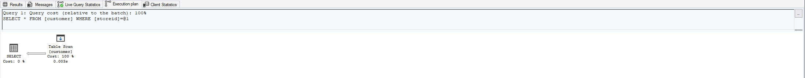

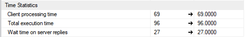

- zapytanie z warunkiem `where storeid between 594 and 610`:

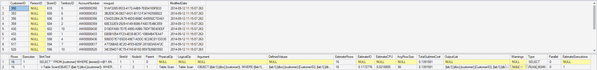


Komentarz:

Jak widać na załączonych zrzutach ekranu, w przypadku braku indeksu wykonywane jest pełny skan tabeli (wszystkie wiersze muszą zostać przeskanowane pod kątem warunku). Koszt obu zapytań jest identyczny (i tak muszą zostać przeskanowane wszystkie wiersze).

Dodaj indeks:

```sql
create  index customer_store_cls_idx on customer(storeid)
```

Jak zmienił się plan i czas? Czy jest możliwość optymalizacji?

---

> Wyniki:

- zapytanie z warunkiem `where storeid = 594`:

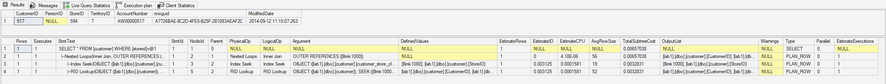

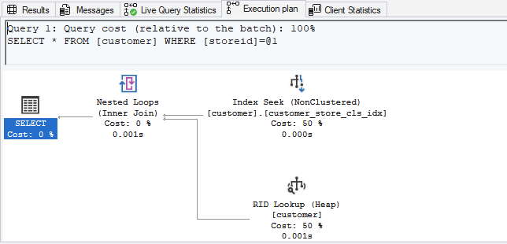


- zapytanie z warunkiem `where storeid between 594 and 610`:


Komentarz:

Po dodaniu indeksu zmienił się plan zapytania - zamiast przeglądania całej tabeli, używa `Nested Loops`, aby dla każdego adresu znalezionego na podstawie `Index Scan` wykonać `RID Lookup` i pobrać brakujące dane z tabeli (w indeksie jest tylko `storeid`, resztę danych musimy pobrać z odpowiedniego miejsca w tabeli). W przypadku obu zapytań koszt zapytania jest zdecydowanie mniejszy w porównaniu do zapytania na tabeli bez indeksu (odpowiednio ~20 razy niższy w przypadku `where storid=594` oraz ~2.5 razy niższe w przypadku `where storeid between 594 and 610`). Różnica w koszcie wynika z faktu, że w przypadku stworzonego indeksu nie mamy dostępu do pobieranych danych (w indeksie zawarte jest tylko `storeid`) i musimy pobrać je ze znalezionych adresów.

Choć koszt zapytań jest niższy, to faktyczny czas wykonania zapytania jest większy w porównaniu do zapytania bez indeksu (w przypadku tak małej ilości danych przeszukanie całej tabeli może być szybsze niż skorzystanie z indeksu)

Dodaj indeks klastrowany:

```sql
create clustered index customer_store_cls_idx on customer(storeid)
```

Czy zmienił się plan/koszt/czas? Skomentuj dwa podejścia w wyszukiwaniu krotek.

---

> Wyniki:

- zapytanie z warunkiem `where storeid=594`


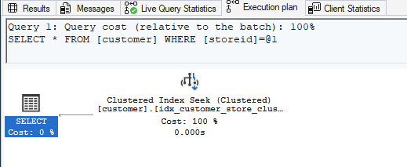

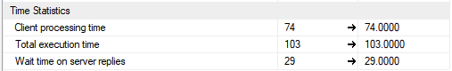

- zapytanie z warunkiem `where storeid between 594 and 610`:

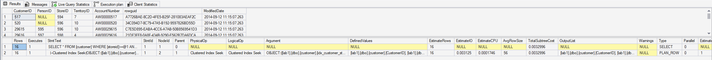

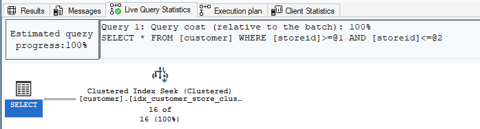


Komentarz:

Plan zapytania ponownie się zmienił, ponieważ stworzyliśmy indeks klastrowany ze względu na `storeid` mamy bezpośredni dostęp do wszystkich pól (dane zostały fizycznie przeorganizowane). Koszt w przypadku obu zapytań jest praktycznie identyczny, a także jest około:

- ~2-krotnie niższy niż zapytanie z indeksem nieklastrowanym oraz ~40-krotnie niższy niż zapytanie bez indeksu dla warunku `where storeid=594`
- ~10-krotnie niższy niż zapytanie z indeksem nieklastrowanym oraz ~40-krotnie niższy niż zapytanie bez indeksu dla warunku `where storeid between 594 and 610`

Różnice w koszcie wynikają z faktu, że w przypadku indeksu klastrowanego, dane są fizycznie reorganizowane na dysku, w rezultacie czego mamy bezpośredni dostęp do wszystkich atrybutów i nie musimy pobierać brakujących danych spod konkretnego adresu.

W przypadku warunku `where storeid between 594 and 610` przewaga indeksu klastrowanego jest jeszcze większa, ponieważ dane te leż fizycznie obok siebie na dysku.

# Zadanie 4 - dodatkowe kolumny w indeksie

Celem zadania jest porównanie indeksów zawierających dodatkowe kolumny.

Skopiuj tabelę `Address` do swojej bazy danych:

```sql
select * into address from  adventureworks2017.person.address
```

W tej części będziemy analizować następujące zapytanie:

```sql
select addressline1, addressline2, city, stateprovinceid, postalcode
from address
where postalcode between '98000' and '99999'
```

```sql
create index address_postalcode_1
on address (postalcode)
include (addressline1, addressline2, city, stateprovinceid);
go

create index address_postalcode_2
on address (postalcode, addressline1, addressline2, city, stateprovinceid);
go
```

Czy jest widoczna różnica w planach/kosztach zapytań?

- w sytuacji gdy nie ma indeksów
- przy wykorzystaniu indeksu:
  - address_postalcode_1
  - address_postalcode_2

Jeśli tak to jaka?

Aby wymusić użycie indeksu użyj `WITH(INDEX(Address_PostalCode_1))` po `FROM`

```sql
select addressline1, addressline2, city, stateprovinceid, postalcode
from address  WITH(INDEX(Address_PostalCode_1))
where postalcode between '98000' and '99999'


select addressline1, addressline2, city, stateprovinceid, postalcode
from address  WITH(INDEX(Address_PostalCode_2))
where postalcode between '98000' and '99999'
```

> Wyniki:

- bez indeksu:

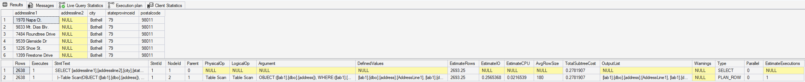


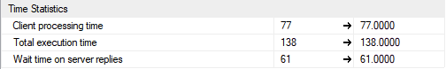

- z indeksem `address_postalcode_1`:

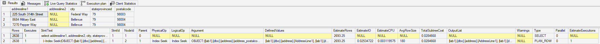

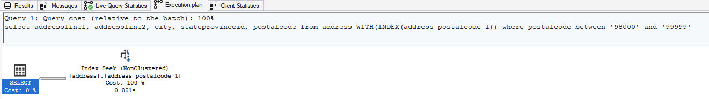

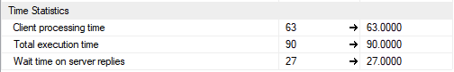

- z indeksem `address_postalcode_2`:


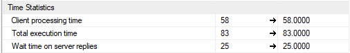

Komentarz:

Pomiędzy zapytaniem bez indeksu a zapytaniami korzystającymi z indeksów występuje znacząca różnica w planach zapytania (zapytanie bez indeksu wykonuje pełne przeszukiwanie tabeli, zapytania z indeksami scanuje tylko indeks, a ponieważ oba indeksy pokrywają zapytanie to nie ma konieczności dodatkowego pobierania brakujących danych). Zapytania korzystające z indeksu `address_postalcode_1` oraz `address_postalcode_2` mają de facto identyczne plany zapytań (koszt również jest identyczny).

Sprawdź rozmiar Indeksów:

```sql
select i.name as indexname, sum(s.used_page_count) * 8 as indexsizekb
from sys.dm_db_partition_stats as s
inner join sys.indexes as i on s.object_id = i.object_id and s.index_id = i.index_id
where i.name = 'address_postalcode_1' or i.name = 'address_postalcode_2'
group by i.name
go
```

Który jest większy? Jak można skomentować te dwa podejścia do indeksowania? Które kolumny na to wpływają?

> Wyniki:

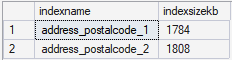

Komentarz:

Indeks `address_postalcode_2` jest nieznacznie większy niż indeks `address_postalcode_1` - wynika to z faktu, że w indeksie nr 1 kolumny `addressline1`, `addressline2`, `city` oraz `stateprovinceid` znajdują się wyłącznie na poziomie liści (indeks uwzględnia tylko `postalcode`, ale mamy bezpośredni dostęp do pozostałych kolumn), natomiast w indeksie nr 2 kolumny `addressline1`, `addressline2`, `city` oraz `stateprovinceid` są częścią klucza, a więc muszą one być uwzględnione na wszystkich poziomach drzewa indeksu.

W przypadku naszego zapytania indeks `address_postalcode_2` nie daje nam znaczącej przewagi, natomiast byłby on dużo bardziej wydajny niż indeks nr 1 np. przypadku filtrowania po większej liczbie kolumn (np. `where postalcode="..." and city="..."`).

# Zadanie 5 - kolejność atrybutów

Skopiuj tabelę `Person` do swojej bazy danych:

```sql
select businessentityid
      ,persontype
      ,namestyle
      ,title
      ,firstname
      ,middlename
      ,lastname
      ,suffix
      ,emailpromotion
      ,rowguid
      ,modifieddate
into person
from adventureworks2017.person.person
```

---

Wykonaj analizę planu dla trzech zapytań:

```sql
select * from [person] where lastname = 'Agbonile'

select * from [person] where lastname = 'Agbonile' and firstname = 'Osarumwense'

select * from [person] where firstname = 'Osarumwense'
```

Co można o nich powiedzieć?

---

> Wyniki:


Komentarz:

W przypadku wszystkich zapytań korzystamy z pełnego przeszukiwania (`full scan`), ponieważ nie mamy indeksu. Niezależnie od kolejności atrybutów, koszt zapytania jest identyczny, ponieważ i tak musimy przejrzeć wszystkie wiersze.

Przygotuj indeks obejmujący te zapytania:

```sql
create index person_first_last_name_idx
on person(lastname, firstname)
```

Sprawdź plan zapytania. Co się zmieniło?

---

> Wyniki:

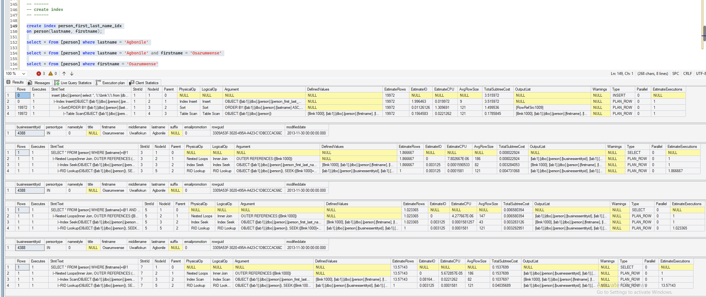

Komentarz:

- w przypadku zapytań korzystających z filtra `where lastname="Agbonile"` zapytania korzystają z bardzo wydajnej operacji `Index Seek`, która pozwala na dostęp
- w przypadku zapytania korzystającego jedynie z filtra `where firstname=...`, zapytanie nie może korzystać z `Index Seek`, a zamiast tego wykorzystywana jest operacja `Index Scan` - wynika to z tego, że "pominęliśmy" jeden poziom w indeksie (klauzula nie pozwala na precyzyjne wyznaczenie "ścieżki" do danych i w rezultacie musimy przeszukać cały indeks)
- zapytanie korzystające z obu atrybutów w klauzuli `where` charakteryzuje się najniższym kosztem (~0.006 w porównaniu do ~0.008 dla zapytanie korzystające wyłącznie z atrybutu `lastname`). Zapytanie korzystające jedynie z atrybutu `firstname` charakteryzuje się najwyższym kosztem i ma jedynie nieznacznie mniejszy koszt niż zapytanie bez indeksu.

Przeprowadź ponownie analizę zapytań tym razem dla parametrów: `FirstName = ‘Angela’` `LastName = ‘Price’`. (Trzy zapytania, różna kombinacja parametrów).

Czym różni się ten plan od zapytania o `'Osarumwense Agbonile'` . Dlaczego tak jest?

---

> Wyniki:


Komentarz:

W przypadku zapytań 1. oraz 3. (odpowiednio tylko z warunkiem `where lastname="..."` oraz `where firstname="..."`), ze względu na ilość osób o odpowiedniu zadanym nazwisku lub imieniu, MSSQL zdecydował że skorzystanie z indeksu (a następnie pobieranie brakujących w indeksie danych ze znalezionych adresów) będzie mniej wydajne niż przeszukiwanie całej tabeli (`Table Scan`). W przypadku warunku `FirstName = ‘Angela’` `LastName = ‘Price’` indeks jest wykorzystywany.

---

Punktacja:

|         |     |
| ------- | --- |
| zadanie | pkt |
| 1       | 2   |
| 2       | 2   |
| 3       | 2   |
| 4       | 2   |
| 5       | 2   |
| razem   | 10  |
|         |     |
