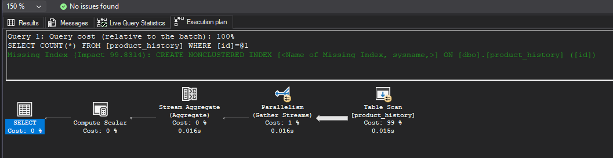
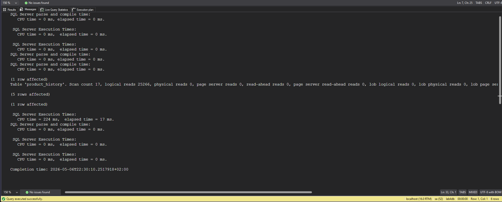
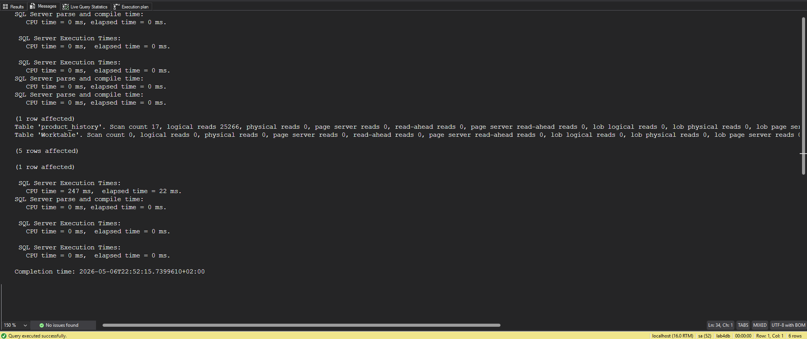
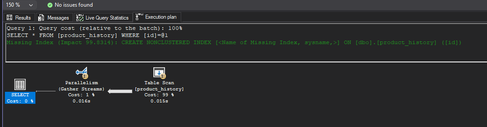
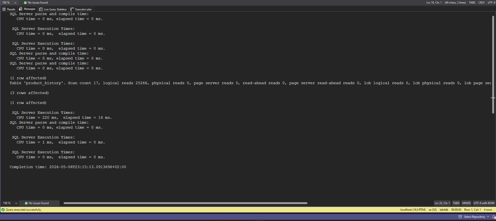
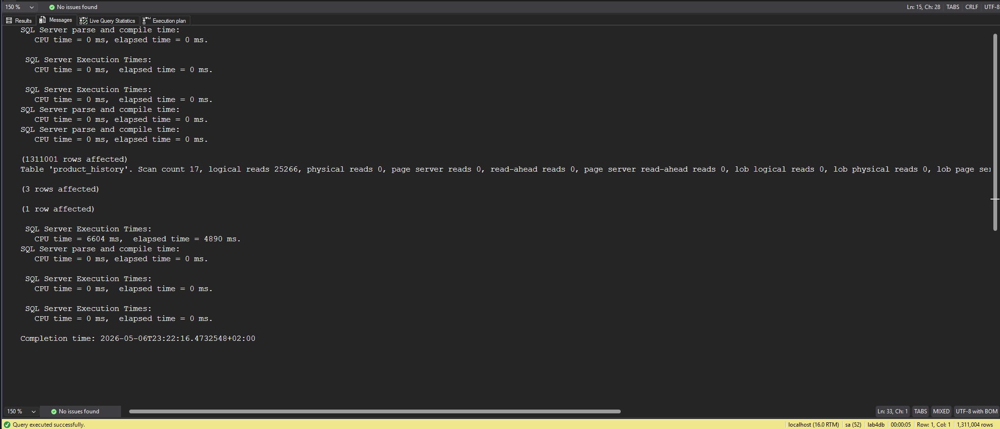
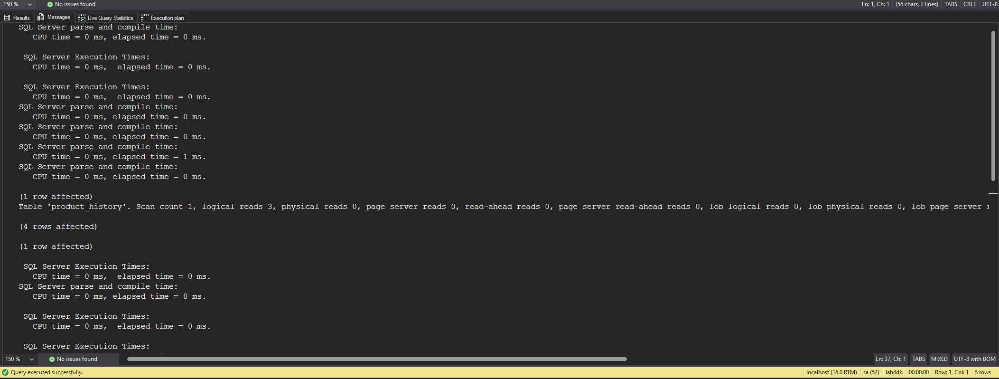
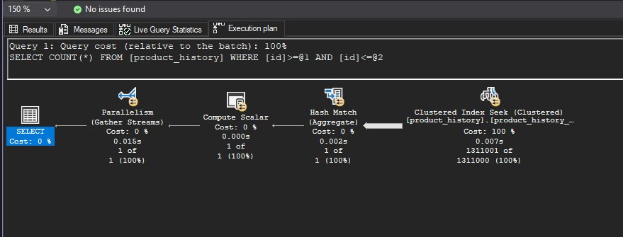
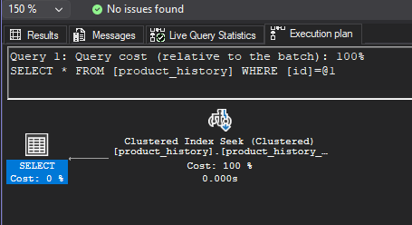

# Indeksy, optymalizator <br>Lab 2

<!-- <style scoped>
 p,li {
    font-size: 12pt;
  }
</style>  -->

<!-- <style scoped>
 pre {
    font-size: 8pt;
  }
</style>  -->

---

**Imiona i nazwiska:** Marek Małek, Mateusz Lampert

---

Celem ćwiczenia jest zapoznanie się z planami wykonania zapytań (execution plans), oraz z budową i możliwością wykorzystaniem indeksów
(kontynuacja poprzedniego ćwiczenia)

Swoje odpowiedzi wpisuj w miejsca oznaczone jako:

---

> Wyniki:

```sql
--  ...
```

---

Ważne/wymagane są komentarze.

Zamieść kod rozwiązania oraz zrzuty ekranu pokazujące wyniki, (dołącz kod rozwiązania w formie tekstowej/źródłowej)

Zwróć uwagę na formatowanie kodu

## Oprogramowanie - co jest potrzebne?

Do wykonania ćwiczenia potrzebne jest następujące oprogramowanie

- MS SQL Server
- SSMS - SQL Server Management Studio
  - ewentualnie inne narzędzie umożliwiające komunikację z MS SQL Server i analizę planów zapytań

Oprogramowanie dostępne jest na przygotowanej maszynie wirtualnej

## Przygotowanie

Uruchom Microsoft SQL Managment Studio.

Stwórz swoją bazę danych o nazwie lab2.

```sql
create database lab2
go

use lab2
go
```

Warto przełączyć bazę w tryb simple

```sql
alter database lab2
set recovery simple;
```

<div style="page-break-after: always;"></div>

# Zadanie 1 - indeksy

Wykonaj poniższy skrypt, aby przygotować dane:

```sql
select * into product_history
from northwind3.dbo.product_history


select * into categories  
from northwind3.dbo.categories


create clustered index categ_clust_idx  
on categories(categoryid)
```

sprawdź liczbę wierszy w tabeli

```sql
select count(*) from product_history
```


Sprawdź jakie indeksy istnieją dla tej tabeli

```sql
exec sp_helpindex 'dbo.product_history'
```


```sql
Select
    i.name as index_name,
    i.type_desc,
    i.is_unique,
    c.name as column_name,
    ic.key_ordinal,
    ic.is_included_column
from sys.indexes i
join sys.index_columns ic
    on i.object_id = ic.object_id
   and i.index_id = ic.index_id
join sys.columns c
    on ic.object_id = c.object_id
   and ic.column_id = c.column_id
where i.object_id = object_id('dbo.product_history')
order by i.name, ic.key_ordinal;
```


włącz statystyki IO i TIME

```sql
SET STATISTICS IO ON

SET STATISTICS TIME ON;
```

podczas analiz sprawdzaj jak zachowują się zapytania, zwróć uwagę na

- plan
- koszt
- czas (ewentualnie, jeśli coś da się zaobserwować)
- liczbę odczytywanych stron !!!!

porównaj zapytania

Sprzęt:

- wykonane na maszynie z procesorem AMD Ryzen 7 7800X3D 8-Core Processor (16 logical processors)

### a)

```sql
select count(*) from product_history
where id = 1000000

select count(*) from product_history
where id between 999000 and 10000000
```

#### Wyniki

```sql
select count(*) from product_history
where id = 1000000
```

- wynik zapytania:


- plan zapytania i koszt:



- czas i liczba odczytywanych stron:



Komentarz:

- execution plan wskazuje, że największy koszt jest związany ze skanowaniem tabeli, dodatkowo `mssql` włączył parallelism, co znacząco zredukowało czas (CPU time = 224 ms, elapsed time = 17 ms.)
- z analizy XML planu, wiemy, że przez paralelilzm odczytanych stron było 25266 (~ 1500 na wątek), podobnie skany tabeli - 17, (1 na wątek + 1 główny (tylko jest governerem, nie ma odczytów - też XML planu))
- `mssql` zasygnalizowal brak indeksu na kolumnie `id` z dużym `Impact` (~99.9%)

```sql
select count(*) from product_history
where id between 999000 and 10000000
```

- wynik zapytania:


- plan zapytania i koszt:


- czas i liczba odczytywanych stron:



Komentarz:

- w planie zapytania widać wskazanie, że tabela nie ma indeksu klastrowego, więc jest to Heap Table Scan, w tym wypadku zapytanie filtruje po przedziale, więc też jest Hash Match
- podobnie jak w poprzednim zapytaniu, `mssql` włączył parallelism, co też zredukowało czas (CPU time = 247 ms, elapsed time = 22 ms.)
- liczba czytanych stron jak i skanów tabeli jest taka sama (podobnie ~1500 na wątek, 1 na wątek)
- tak samo jak w poprzednim zapytaniu największy koszt jest związany ze skanowaniem tabeli, a `mssql` zasygnalizowal brak indeksu na kolumnie `id` z dużym `Impact` (~95%)

### b)

```sql
select * from product_history
where id = 1000000


select * from product_history
where id between 999000 and 10000000
```

#### Wyniki

```sql
select * from product_history
where id = 1000000
```

- wynik zapytania:


- plan zapytania i koszt:



- czas i liczba odczytywanych stron:



Komentarz:

- wnioski są podobne do pierwszego zapytania z podpunktu a), z tą różnicą, że w planie zapytnia nie ma operatora `Stream Aggregate` i `Compute Scalar`, co jest związane z tym, że zapytanie zwraca wszystkie kolumny, a nie tylko ich liczbe

```sql
select * from product_history
where id between 999000 and 10000000
```

- wynik zapytania:


- plan zapytania i koszt:


- czas i liczba odczytywanych stron:



Komentarz:

- `ssms` zasugerował dodanie indeksu klastrowego, ale już z mniejszym `Impact` (~50%), co jest związane z tym, że zapytanie ~1 mln rekordów z całej tabeli, która ma ~2,3 mln rekordów w sumie
- tutaj liczba czytanych stron i skanów tabeli jest znów taka sama, ale czas jest znacznie dłuższy (CPU time = 6480 ms, elapsed time = 4929 ms.). Analizując czas per wątek (~20ms) widzimy, że one nie są bottleneckiem, a do tego przeglądając XML, tag `<WaitStats>`, widać, że czas dla `CXPACKET` jest bardzo duży (`<Wait WaitType="CXPACKET" WaitTimeMs="70734" WaitCount="265802" />`), co może sugerować, że bottleneckiem jest sam `SSMS` (przetworzenie i prezentacja ~1 mln pełnych rekordów)

### c)

sprawdź jak zachowają się zapytania z pkt a) i b) jeśli dla kolumny `id` stworzysz indeks

- klastrowy
- nieklastrowy

```sql
create clustered index product_history_clust_idx
on product_history(id)

drop index product_history_clust_idx on product_history

create index product_history_idx
on product_history(id)

drop index product_history_idx on product_history
```

po zakończeniu pozostaw indeks klastrowy

#### Wyniki

##### Indeks klastrowy

###### a1)

- plan zapytania i koszt:

  

- czas i liczba odczytywanych stron:

  

Komentarz:

- czas jest praktycznie zerowy (0ms)
- liczba czytanych stron drastycznie spadła z ~25000 do 3, podobnie skanów z 17 do 1. (co też jest związane z brakiem paralelizmu)
- w planie wykonywany jest `Index Seek`, który błyskawicznie znajduje pożądany rekord

###### a2)

- plan zapytania i koszt:

  

- czas i liczba odczytywanych stron:

  

Komentarz:

- liczba czytanych stron również spadła ale do 14802, co jest spowodowane, że te 1 mln rekordów musiało zostać przeczytanych, jednak mimo to warto zwrócić uwagę, że teraz liczba czytanych stron jest proporcjonalna do zwracanego zakresu
- czas spadł nieznacznie o 3ms

###### b1)

- plan zapytania i koszt:

  

- czas i liczba odczytywanych stron:

  

Komentarz:

- podobnie jak w przypadku zapytania a1) czas jest praktycznie zerowy (0ms)
- liczba czytanych stron spadła z ~25000 do 3, podobnie skanów z 17 do 1. (co też jest związane z brakim paralelizmu)
- w planie wykonywany jest `Index Seek`, który błyskawnie znajduje pożądany rekord

###### b2)

- plan zapytania i koszt:

  

- czas i liczba odczytywanych stron:

  

Komentarz:

- liczba czytanych stron również spadła ale do 14802, co jest spowodowane, że te 1 mln rekordów musiało zostać przeczytanych, podobnie jak w przypadku a2) liczba czytanych stron jest proporcjonalna do zwracanego zakresu
- czas (elapsed time) nie zmienił się drastycznie (CPU time = 598 ms, elapsed time = 4449 ms.), co może być spowodowanie bottleneckiem `SSMS` (przetworzenie i prezentacja ~1 mln pełnych rekordów), ale czas CPU spadł drastycznie z 6480ms do 615ms, co jest związane z tym, że teraz `mssql` nie musi skanować całej tabeli, a może od razu znaleźć pożądany rekord i zwrócić zakres do końca
- nie ma tu też paralelizmu

##### Indeks nieklastrowy

###### a1)

###### a2)

###### b1)

###### b2)

### d)

indeks dla kolumny `date`

```sql
create index product_history_date_idx
on product_history(date)

drop index product_history_date_idx on product_history
```

porównaj polecenia

```sql
select id, productid, productname, date
from product_history
where date >= '2001-01-01' and date <= '2001-01-31'

select id, productid, productname, date
from product_history
where year(date) = 2001 and month(date) = 1

select id, productid, productname, date
from product_history
where date >= '2001-01-01' and date <= '2001-12-31'

select id, productid, productname, date
from product_history
where year(date) = 2001
```

podczas analiz sprawdzaj jak zachowują się zapytania, zwróć uwagę na

- plan
- indeksy i sposób ich użycia
- koszt
- czas (ewentualnie, jeśli coś da się zaobserwować)
- liczbę odczytywanych stron !!!!

spróbuj skomentować wyniki tych analiz, dlaczego tak się dzieje

### e)

powtórz eksperymenty z pkt d) , ale tym razem użyj indeksu zawierającego dodatkowe kolumny

```sql
create index product_history_date_incl_idx
on product_history(date) include(productid, productname)

drop index product_history_date_incl_idx on product_history

```

co się zmieniło?

### f)

indeks dla kolumny `categoryid`

```sql
create index product_history_cat_idx
on product_history(categoryid)

drop index product_history_cat_idx on product_history
```

przeanalizuj polecenia

```sql
select id, productid, productname, date 
from product_history p
where categoryid = 8


select id, productid, productname, date, categoryname
from product_history p join categories c on p.categoryid = c.categoryid
where p.categoryid = 8
```

### dodatkowo

możesz sprawdzić strukturę indeksu

np.

```sql
exec sp_helpindex 'dbo.product_history';

select
    i.name as index_name,
    ips.index_depth,
    ips.index_level,
    ips.page_count
from sys.indexes i
cross apply sys.dm_db_index_physical_stats(
    db_id(),
    i.object_id,
    i.index_id,
    null,    'detailed'
) ips
where i.object_id = object_id('dbo.product_history')
  and i.name = 'product_history_date_idx';
```

jeśli chcesz zaobserwować odczyty logiczne/fizyczne możesz zwolnić pulę buforów przed wykonaniem polecenia

```sql
CHECKPOINT;
DBCC DROPCLEANBUFFERS;
```

i teraz porównaj liczby czytanych stron np. wykonując dwukrotnie polecenie

```sql
select * from product_history
```

# Zadanie 2

Celem zadania jest poznanie indeksów typu column store

Utwórz tabelę testową:

```sql
create table saleshistory(
 id int identity(1,1) not null primary key,
 salesorderid int not null,
 salesorderdetailid int not null,
 carriertrackingnumber nvarchar(25) null,
 orderqty smallint not null,
 productid int not null,
 specialofferid int not null,
 unitprice money not null,
 unitpricediscount money not null,
 linetotal numeric(38, 6) not null,
 rowguid uniqueidentifier not null,
 modifieddate datetime not null
 )
```

Sprawdź jakie indeksy istnieją dla tej tabeli

```sql
exec sp_helpindex 'dbo.saleshistory'
```

```sql
Select
    i.name as index_name,
    i.type_desc,
    i.is_unique,
    c.name as column_name,
    ic.key_ordinal,
    ic.is_included_column
from sys.indexes i
join sys.index_columns ic
    on i.object_id = ic.object_id
   and i.index_id = ic.index_id
join sys.columns c
    on ic.object_id = c.object_id
   and ic.column_id = c.column_id
where i.object_id = object_id('dbo.saleshistory')
order by i.name, ic.key_ordinal;
```

Wypełnij tablicę danymi:

```sql
-- w ssms

insert into saleshistory
 select sh.*
 from adventureworks2017.sales.salesorderdetail sh
go 100
```

(UWAGA `GO 100` oznacza 100 krotne wykonanie polecenia. Jeżeli podejrzewasz, że twój serwer może to zbyt przeciążyć, zacznij od GO 10, GO 20, GO 50

albo

```sql
declare @i int = 1;

while @i <= 100
begin
    insert into saleshistory
    select *
    from adventureworks2017.sales.salesorderdetail;

    set @i += 1;
end;
```

sprawdź liczbę wierszy w tabeli

```sql
select count(*) from saleshistory
```

włącz statystyki IO i TIME

```sql
SET STATISTICS IO ON

SET STATISTICS TIME ON;
```

Sprawdź jak zachowa się zapytanie

- sprawdź plan
- koszt
- czas
- liczbę odczytywanych stron

```sql
select productid, sum(unitprice), avg(unitprice), sum(orderqty), avg(orderqty)
from saleshistory
group by productid
order by productid
```

Załóż indeks typu column store:

```sql
create nonclustered columnstore index saleshistory_columnstore
 on saleshistory(unitprice, orderqty, productid)
```

Sprawdź różnicę pomiędzy przetwarzaniem w zależności od indeksów. Porównaj plany i opisz różnicę.
Co to są indeksy colums store? Jak działają? (poszukaj materiałów w internecie/literaturze)

UWAGA: ciekawsze efekty możesz zaobserwować dla jeszcze większych tabel (jeśli twój komp na to pozwala możesz zwiększyć wolumen generowanych danych)

# Zadanie 3 – własne eksperymenty

Należy zaprojektować/zaimplementować tabelę w bazie danych, lub wybrać dowolny schemat/bazę/tabelę (poza używanymi na zajęciach), a następnie wypełnić ją danymi w taki sposób, przetestować/przeanalizować działanie indeksów różnego typu. Warto wygenerować sobie tabele o większym rozmiarze.

Możesz też powtórzyć np. eksperymenty wykonywane w zadaniu 1, ale tym razem dla innego serwera,

Wedle uznania i zainteresowań, ważne żeby poeksplorować tematykę i spróbować

Do analizy, proszę uwzględnić następujące rodzaje indeksów:

- Klastrowane (np.  dla atrybutu nie będącego kluczem głównym)
- Nieklastrowane
- Indeksy wykorzystujące kilka atrybutów, indeksy include
- Filtered Index (Indeks warunkowy)
- Kolumnowe

## Analiza

Proszę przygotować zestaw zapytań do danych, które:

- wykorzystują poszczególne indeksy
- które przy wymuszeniu indeksu działają gorzej, niż bez niego (lub pomimo założonego indeksu, tabela jest w pełni skanowana)
  Odpowiedź powinna zawierać:
- Schemat tabeli
- Opis danych (ich rozmiar, zawartość, statystyki)
- Opis indeksu
- Przygotowane zapytania, wraz z wynikami z planów (zrzuty ekranow)
- Inf o kosztach, czytanych stornach
- Komentarze do zapytań, ich wyników
- ew. sprawdzenie, co proponuje Database Engine Tuning Advisor (porównanie czy udało się Państwu znaleźć odpowiednie indeksy do zapytania)

> Wyniki:

```sql
--  ...
```

|         |                                                                          |     |
| ------- | ------------------------------------------------------------------------ | --- |
| zadanie | pkt                                                                      |     |
| 1       | 6                                                                        |     |
| 2       | 2                                                                        |     |
| 3       | 5 (3 pkt. za eksperymenty + 2 dodatkowe za ciekawe/oryginalne przyklady) |     |
| razem   | 13                                                                       |     |
