# Indeksy, optymalizator <br>Lab 2

<!-- <style scoped>
 p,li {
    font-size: 12pt;
  }
</style>  -->

<!-- <style scoped>
 pre {
    font-size: 8pt;
  }
</style>  -->

---

**Imiona i nazwiska:** Marek Małek, Mateusz Lampert

---

Celem ćwiczenia jest zapoznanie się z planami wykonania zapytań (execution plans), oraz z budową i możliwością wykorzystaniem indeksów
(kontynuacja poprzedniego ćwiczenia)

Swoje odpowiedzi wpisuj w miejsca oznaczone jako:

---

> Wyniki:

```sql
--  ...
```

---

Ważne/wymagane są komentarze.

Zamieść kod rozwiązania oraz zrzuty ekranu pokazujące wyniki, (dołącz kod rozwiązania w formie tekstowej/źródłowej)

Zwróć uwagę na formatowanie kodu

## Oprogramowanie - co jest potrzebne?

Do wykonania ćwiczenia potrzebne jest następujące oprogramowanie

- MS SQL Server
- SSMS - SQL Server Management Studio
  - ewentualnie inne narzędzie umożliwiające komunikację z MS SQL Server i analizę planów zapytań

Oprogramowanie dostępne jest na przygotowanej maszynie wirtualnej

## Przygotowanie

Uruchom Microsoft SQL Managment Studio.

Stwórz swoją bazę danych o nazwie lab2.

```sql
create database lab2
go

use lab2
go
```

Warto przełączyć bazę w tryb simple

```sql
alter database lab2
set recovery simple;
```

<div style="page-break-after: always;"></div>

# Zadanie 1 - indeksy

Wykonaj poniższy skrypt, aby przygotować dane:

```sql
select * into product_history
from northwind3.dbo.product_history


select * into categories  
from northwind3.dbo.categories


create clustered index categ_clust_idx  
on categories(categoryid)
```

sprawdź liczbę wierszy w tabeli

```sql
select count(*) from product_history
```


Sprawdź jakie indeksy istnieją dla tej tabeli

```sql
exec sp_helpindex 'dbo.product_history'
```


```sql
Select
    i.name as index_name,
    i.type_desc,
    i.is_unique,
    c.name as column_name,
    ic.key_ordinal,
    ic.is_included_column
from sys.indexes i
join sys.index_columns ic
    on i.object_id = ic.object_id
   and i.index_id = ic.index_id
join sys.columns c
    on ic.object_id = c.object_id
   and ic.column_id = c.column_id
where i.object_id = object_id('dbo.product_history')
order by i.name, ic.key_ordinal;
```


włącz statystyki IO i TIME

```sql
SET STATISTICS IO ON

SET STATISTICS TIME ON;
```

podczas analiz sprawdzaj jak zachowują się zapytania, zwróć uwagę na

- plan
- koszt
- czas (ewentualnie, jeśli coś da się zaobserwować)
- liczbę odczytywanych stron !!!!

porównaj zapytania

Sprzęt:

- wykonane na maszynie z procesorem AMD Ryzen 7 7800X3D 8-Core Processor (16 logical processors)

### a)

```sql
select count(*) from product_history
where id = 1000000

select count(*) from product_history
where id between 999000 and 10000000
```

#### Wyniki

```sql
select count(*) from product_history
where id = 1000000
```

- wynik zapytania:

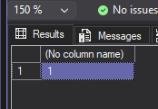

- plan zapytania i koszt:


- czas i liczba odczytywanych stron:


Komentarz:

- execution plan wskazuje, że największy koszt jest związany ze skanowaniem tabeli, dodatkowo `mssql` włączył parallelism, co znacząco zredukowało czas (CPU time = 224 ms, elapsed time = 17 ms.)
- odczytanych stron było 25266 (~ 1500 na wątek)
- skanów tabeli było 17 (przez parallelism, 1 na wątek)
- `mssql` zasygnalizowal brak indeksu na kolumnie `id` z dużym `Impact` (~99.9%)
- "gruba strzałka" na planie wskazuje, że skanowanie tabeli jest najbardziej kosztowną operacją w planie zapytania

```sql
select count(*) from product_history
where id between 999000 and 10000000
```

- wynik zapytania:

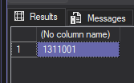

- plan zapytania i koszt:

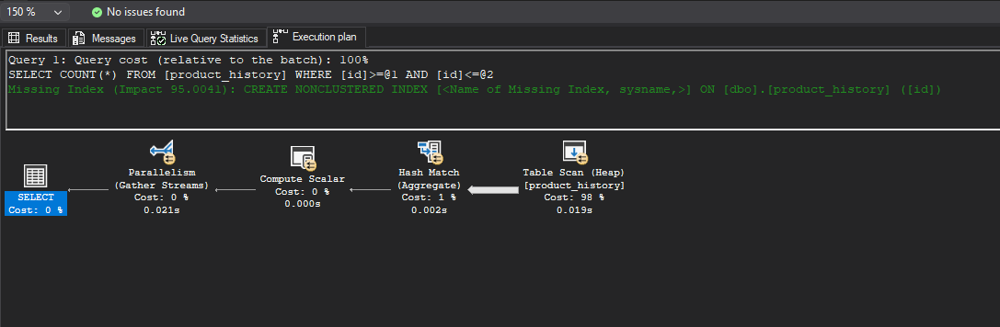

- czas i liczba odczytywanych stron:


Komentarz:

- w planie zapytania widać wskazanie, że tabela nie ma indeksu klastrowego, więc jest to Heap Table Scan, w tym wypadku zapytanie filtruje po przedziale, więc też jest Hash Match
- podobnie jak w poprzednim zapytaniu, `mssql` włączył parallelism, co też zredukowało czas (CPU time = 247 ms, elapsed time = 22 ms.)
- liczba czytanych stron jak i skanów tabeli jest taka sama (podobnie ~1500 na wątek, 1 na wątek)
- tak samo jak w poprzednim zapytaniu największy koszt jest związany ze skanowaniem tabeli, a `mssql` zasygnalizowal brak indeksu na kolumnie `id` z dużym `Impact` (~95%)

### b)

```sql
select * from product_history
where id = 1000000


select * from product_history
where id between 999000 and 10000000
```

#### Wyniki

```sql
select * from product_history
where id = 1000000
```

- wynik zapytania:

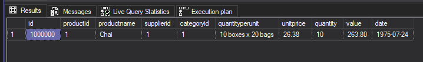

- plan zapytania i koszt:


- czas i liczba odczytywanych stron:


Komentarz:

- wnioski są podobne do pierwszego zapytania z podpunktu a), z tą różnicą, że w planie zapytnia nie ma operatora `Stream Aggregate` i `Compute Scalar`, co jest związane z tym, że zapytanie zwraca wszystkie kolumny, a nie tylko ich liczbę

```sql
select * from product_history
where id between 999000 and 10000000
```

- wynik zapytania:

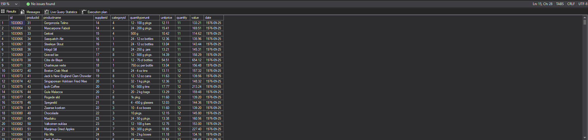

- plan zapytania i koszt:

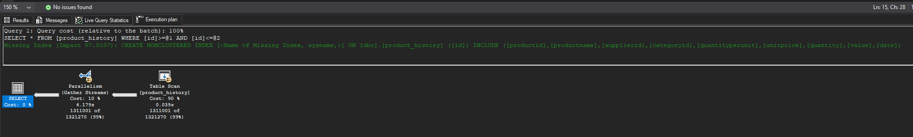

- czas i liczba odczytywanych stron:


Komentarz:

- `ssms` zasugerował dodanie indeksu klastrowego, ale już z mniejszym `Impact` (~50%), co jest związane z tym, że zapytanie ~1 mln rekordów z całej tabeli, która ma ~2,3 mln rekordów w sumie
- tutaj liczba czytanych stron i skanów tabeli jest znów taka sama, ale czas jest znacznie dłuższy (CPU time = 6480 ms, elapsed time = 4929 ms.). Analizując czas per wątek (~20ms) widzimy, że one nie są bottleneckiem, a do tego przeglądając XML, tag `<WaitStats>`, widać, że czas dla `CXPACKET` jest bardzo duży (`<Wait WaitType="CXPACKET" WaitTimeMs="70734" WaitCount="265802" />`), co może sugerować, że bottleneckiem jest sam `SSMS` (przetworzenie i prezentacja ~1 mln pełnych rekordów)

### c)

sprawdź jak zachowają się zapytania z pkt a) i b) jeśli dla kolumny `id` stworzysz indeks

- klastrowy
- nieklastrowy

```sql
create clustered index product_history_clust_idx
on product_history(id)

drop index product_history_clust_idx on product_history

create index product_history_idx
on product_history(id)

drop index product_history_idx on product_history
```

po zakończeniu pozostaw indeks klastrowy

#### Wyniki

##### a1)

###### Indeks klastrowy

- plan zapytania i koszt:

  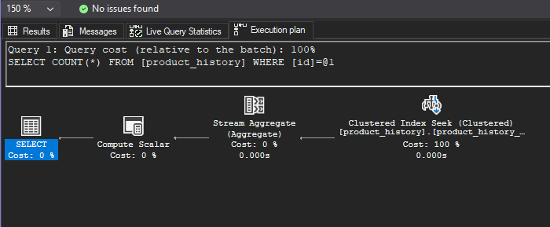

- czas i liczba odczytywanych stron:

  

Komentarz:

- czas jest praktycznie zerowy (0ms)
- liczba czytanych stron drastycznie spadła z ~25000 do 3, podobnie skanów z 17 do 1. (co też jest związane z brakiem paralelizmu)
- w planie wykonywany jest `Index Seek`, który błyskawicznie znajduje pożądany rekord

###### Indeks nieklastrowy

- plan zapytania i koszt:


- czas i liczba odczytywanych stron:

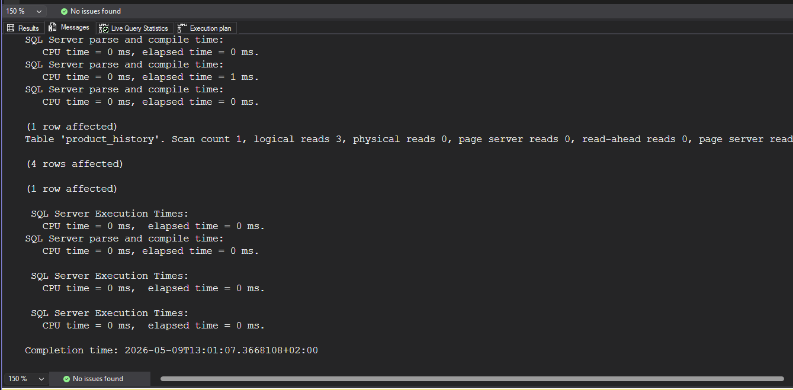

Komentarz:

- rezultaty są praktycznie takie same jak przy indeksie klastrowym, prawdopodobnie przez to, że agregacja `count()` nie potrzebuje odczytywać dodatkowych kolumn, a tylko istnienie rekordu, więc indeks nieklastrowy jest wystarczający do szybkiego znalezienia rekordu

##### a2)

###### Indeks klastrowy

- plan zapytania i koszt:

  

- czas i liczba odczytywanych stron:

  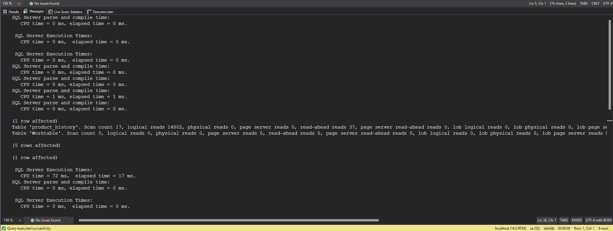

Komentarz:

- liczba czytanych stron również spadła ale do 14802, co jest spowodowane, że te 1 mln rekordów musiało zostać przeczytanych, jednak mimo to warto zwrócić uwagę, że teraz liczba czytanych stron jest proporcjonalna do zwracanego zakresu
- czas spadł nieznacznie o 3ms

###### Indeks nieklastrowy

- plan zapytania i koszt:


- czas i liczba odczytywanych stron:

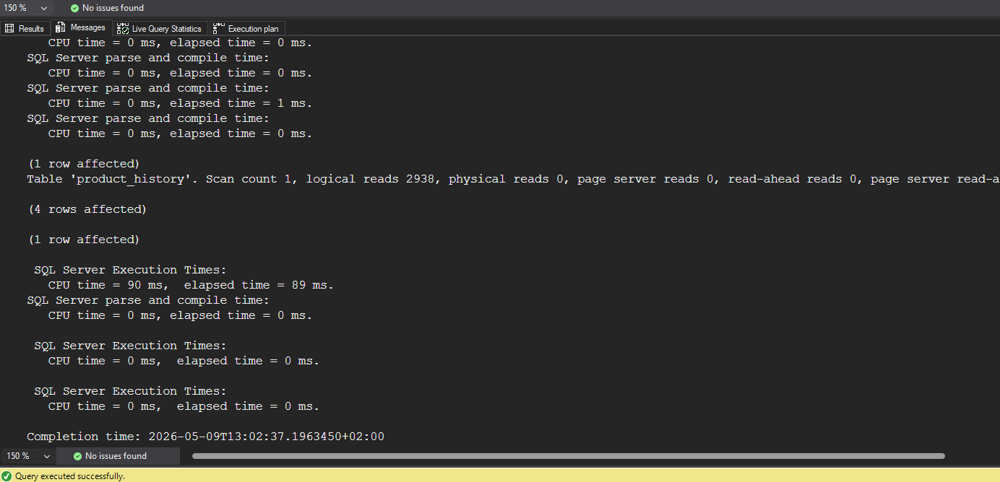

Komentarz

- w przypadku indeksu nieklastrowego liczba odczytywanych stron została zredukowana jeszcze bardziej, co jest związane z tym, że indeks klastrowy jest mniejszą strukturą danych (ma tylko pointery do danych), zmniejszyło to liczbę odczytywanych stron do 2938
- `elapsed time` jest większy, co prawdopodbnie jest związane z brakiem paralelizmu (czasy CPU są praktycznie identyczne), prawdopodobnie optimizer nie włączył paralelizmu przez małą liczbę stron do odczytania, można też sprawdzić parametr `Degree of Parallelism` = 1, a `mssql` włącza paralelism, jeśli jest wynosi on co najmniej 5 by default (properties serwera -> Advanced -> Cost Threshold for Parallelism).

##### b1)

###### Indeks klastrowy

- plan zapytania i koszt:

  

- czas i liczba odczytywanych stron:

  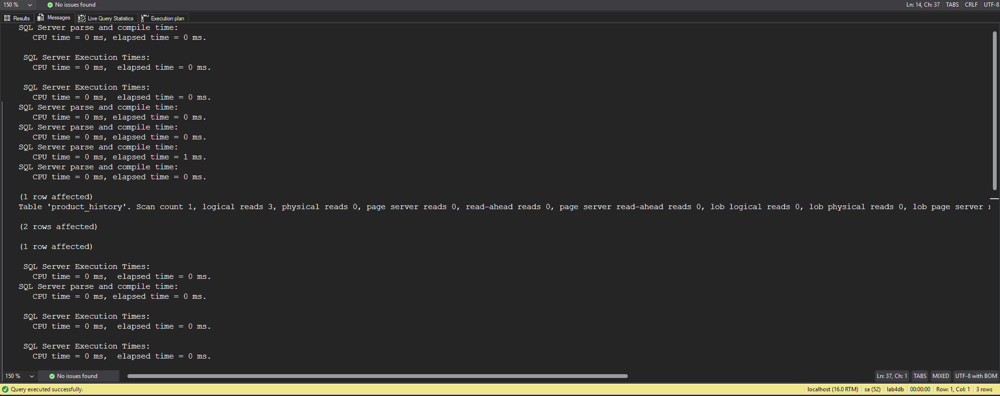

Komentarz:

- podobnie jak w przypadku zapytania a1) czas jest praktycznie zerowy (0ms)
- liczba czytanych stron spadła z ~25000 do 3, podobnie skanów z 17 do 1. (co też jest związane z brakim paralelizmu)
- w planie wykonywany jest `Index Seek`, który błyskawnie znajduje pożądany rekord

###### Indeks nieklastrowy

- plan zapytania i koszt:


- czas i liczba odczytywanych stron:


Komentarz:

- czas jest praktycznie zerowy (0ms)
- warto zwrócić uwagę na różnice w planach, z uwagi na strukturę indeksu nieklastrtowego, `mssql` dodał krok `RID Lookup` (RID, bo tabela nie ma indeksu klastrowego, więc jest Heapem), który musi odczytać dane z tablei, a następnie wykonuje inner join z indeksem, aby zwrócić pełny rekord
- liczba czytanych stron jest większa o 1 niż w przypadku indeksu klastrowego (3 vs 4)

##### b2)

###### Indeks klastrowy

- plan zapytania i koszt:

  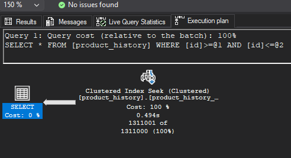

- czas i liczba odczytywanych stron:

  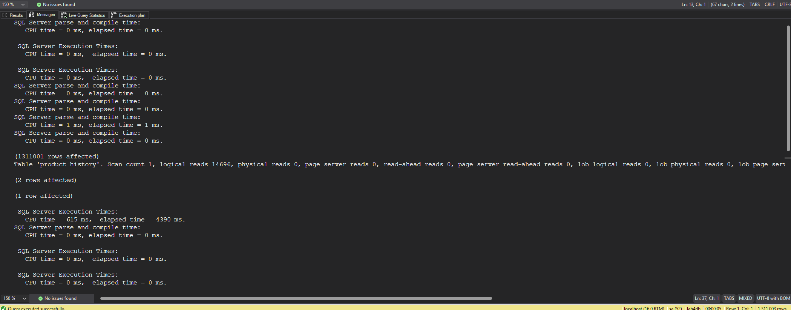

Komentarz:

- liczba czytanych stron również spadła ale do 14802, co jest spowodowane, że te 1 mln rekordów musiało zostać przeczytanych, podobnie jak w przypadku a2) liczba czytanych stron jest proporcjonalna do zwracanego zakresu
- czas (elapsed time) nie zmienił się drastycznie (CPU time = 615 ms, elapsed time = 4390 ms.), co może być spowodowanie bottleneckiem `SSMS` (przetworzenie i prezentacja ~1 mln pełnych rekordów), ale czas CPU spadł drastycznie z 6480ms do 615ms, co jest związane z tym, że teraz `mssql` nie musi skanować całej tabeli, a może od razu znaleźć pożądany rekord i zwrócić zakres do końca
- nie ma tu też paralelizmu

###### Indeks nieklastrowy

- plan zapytania i koszt:


- czas i liczba odczytywanych stron:


Komentarz:

- w tym wypadku liczba czytanych stron zwiększyła się do 25841 (z 25266) w porównaniu do zapytania bez indeksu
- `mssql` zalecił dodanie indeksu klastrowego, tak samo jak w przypadku zapytania bez indeksu
- co najważniejsze sam indeks nieklastrowy został zignorowany, co jest związane z tym, że zapytanie zwraca duży zakres danych, więc dodanie kroków `Index Seek` + `RID Lookup` dla każdego rekordu byłoby bardzo kosztowne (tzw. Tipping Point), więc `mssql` zdecydował się na skanowanie całej tabeli, co jest szybsze w tym przypadku

### d)

indeks dla kolumny `date`

```sql
create index product_history_date_idx
on product_history(date)

drop index product_history_date_idx on product_history
```

porównaj polecenia

```sql
select id, productid, productname, date
from product_history
where date >= '2001-01-01' and date <= '2001-01-31'

select id, productid, productname, date
from product_history
where year(date) = 2001 and month(date) = 1

select id, productid, productname, date
from product_history
where date >= '2001-01-01' and date <= '2001-12-31'

select id, productid, productname, date
from product_history
where year(date) = 2001
```

podczas analiz sprawdzaj jak zachowują się zapytania, zwróć uwagę na

- plan
- indeksy i sposób ich użycia
- koszt
- czas (ewentualnie, jeśli coś da się zaobserwować)
- liczbę odczytywanych stron !!!!

spróbuj skomentować wyniki tych analiz, dlaczego tak się dzieje

```sql
select id, productid, productname, date
from product_history
where date >= '2001-01-01' and date <= '2001-01-31'
```

- plan zapytania i koszt:


- czas i liczba odczytywanych stron:

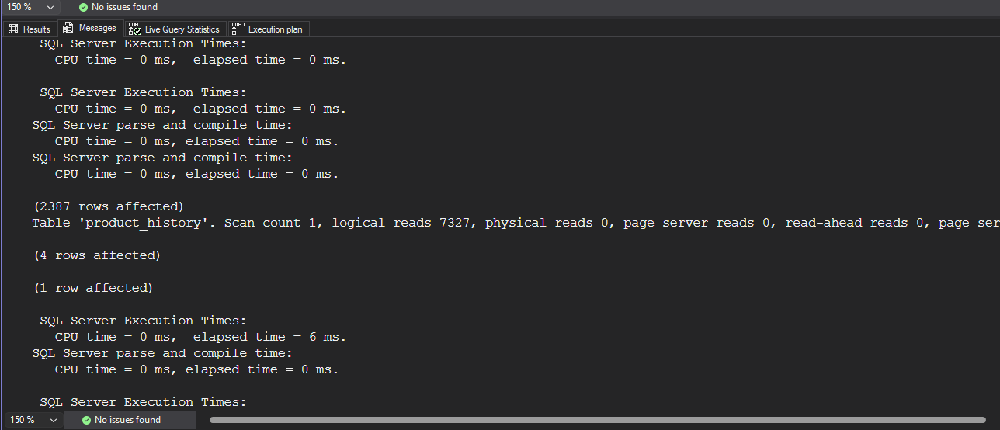

Komentarz:

- elapsed time jest niski (6ms), liczba odczytanych stron to 7327, nie ma paralelizmu.
- samo zapytanie wykonuje `Index Seek`, aby znaleźć dane z zakresu, ale musi zrobić `Key Lookup` (bez RID, bo tabela ma już indeks klastrowy po kolumnie `id`), aby odczytać pełne rekordy i później `Inner Join`.
- `mssql` zasygnalizował aby stworzyć index na `date` z włączeniem kolumn `productid` i `productname` (z `Impact` ~53%), aby wyeliminować `Key Lookup`

```sql
select id, productid, productname, date
from product_history
where year(date) = 2001 and month(date) = 1
```

- plan zapytania i koszt:


- czas i liczba odczytywanych stron:

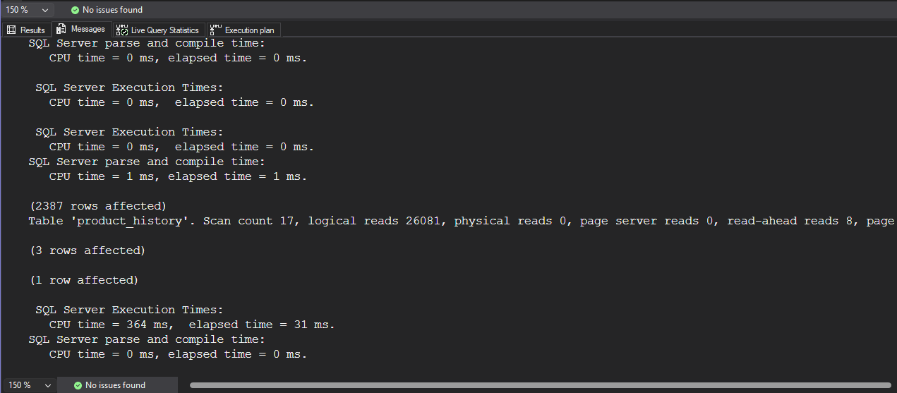

Komentarz:

- o wiele większa liczba odczytywanych stron 26081, 17 skanów (+ paralelizm), czas również większy (CPU time = 364 ms, elapsed time = 31 ms)
- użycie funkcji `year()` i `month()` na kolumnie `date` sprawia, że indeks nie może być użyty, więc `mssql` musi przeskanować całą tabelę, aby znaleźć pasujące rekordy, jest to tzw. Non-SARGable query

```sql
select id, productid, productname, date
from product_history
where date >= '2001-01-01' and date <= '2001-12-31'
```

- plan zapytania i koszt:

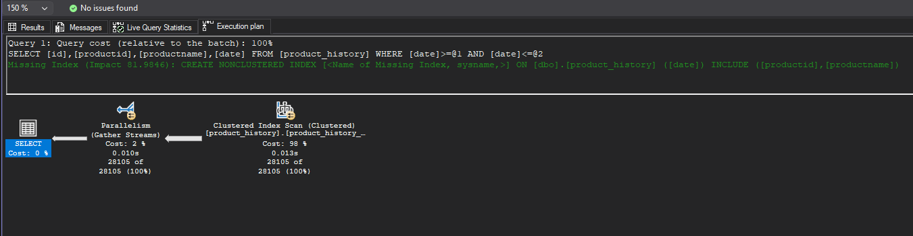

- czas i liczba odczytywanych stron:


Komentarz:

- liczba odczytanych stron jest większa niż w przypadku pierwszego zapytania(7327 vs 26081), co jest związane z tym, że zakres jest większy (cały rok vs styczeń)
- czas jest również większy (CPU time = 133 ms, elapsed time = 19 ms)
- w planie zapytania widać, że `mssql` zdecydował się na skanowanie indeksu zamiast `Index Seek`, prawdopodobnie został przekroczony tzw. Tipping Point
- dodatkowo `mssql` zasygnalizował, że dla tego zapytania warto byłoby stworzyć indeks na `date` z włączeniem kolumn `productid` i `productname` (z `Impact` ~82%)

```sql
select id, productid, productname, date
from product_history
where year(date) = 2001
```

- plan zapytania i koszt:


- czas i liczba odczytywanych stron:


Komentarz:

- liczba stron jest taka sama jak w poprzednim zapytaniu 26081, ale czas jest większy (CPU time = 368 ms, elapsed time = 38 ms), bo też procesor musiał wykonać funkcję `year()` dla każdego rekordu
- podobnie jak w poprzednim zapytaniu z funkcjami `year()` i `month()` indeks nie może być użyty, więc `mssql` musi przeskanować całą tabelę (`Clustered Index Scan`)
- w tym wypadku `mssql` nie zasugerował założenie indeksu z włączeniem kolumn

### e)

powtórz eksperymenty z pkt d) , ale tym razem użyj indeksu zawierającego dodatkowe kolumny

```sql
create index product_history_date_incl_idx
on product_history(date) include(productid, productname)

drop index product_history_date_incl_idx on product_history

```

co się zmieniło?

```sql
select id, productid, productname, date
from product_history
where date >= '2001-01-01' and date <= '2001-01-31'
```

- plan zapytania i koszt:

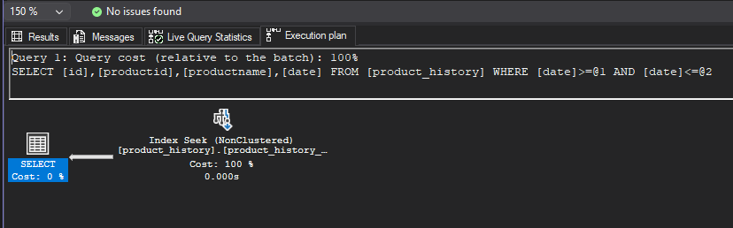

- czas i liczba odczytywanych stron:


Komentarz:

- czas spadł (CPU time = 0 ms, elapsed time = 1 ms), liczba odczytanych stron spadła do 16, a w planie zapytania widać, że `mssql` używa teraz `Index Seek` bezpośrednio na indeksie z włączeniem kolumn, więc nie ma potrzeby wykonywania `Key Lookup`, co znacząco poprawia wydajność

```sql
select id, productid, productname, date
from product_history
where year(date) = 2001 and month(date) = 1
```

- plan zapytania i koszt:


- czas i liczba odczytywanych stron:


Komentarz:

- liczba stron po włączeniu do indeksu kolumn `productid` i `productname` spadła do 11424, bo teraz `mssql` wykonuje `Index Scan` na indeksie z włączeniem kolumn:

```xml

 <IndexScan ...>
   ...
  <Object ... Table="[product_history]" Index="[product_history_date_incl_idx]" IndexKind="NonClustered"  />
  ...
</IndexScan>
```

- czasy są bardzo podobne (CPU time = 339 ms, elapsed time = 34 ms. vs CPU time = 364 ms, elapsed time = 31 ms), co jest związane z tym, że zapytanie nadal jest Non-SARGable, więc `mssql` musi przeskanować cały indeks i wykonać funkcję `year()` i `month()` dla każdego rekordu

```sql
select id, productid, productname, date
from product_history
where date >= '2001-01-01' and date <= '2001-12-31'
```

- plan zapytania i koszt:


- czas i liczba odczytywanych stron:

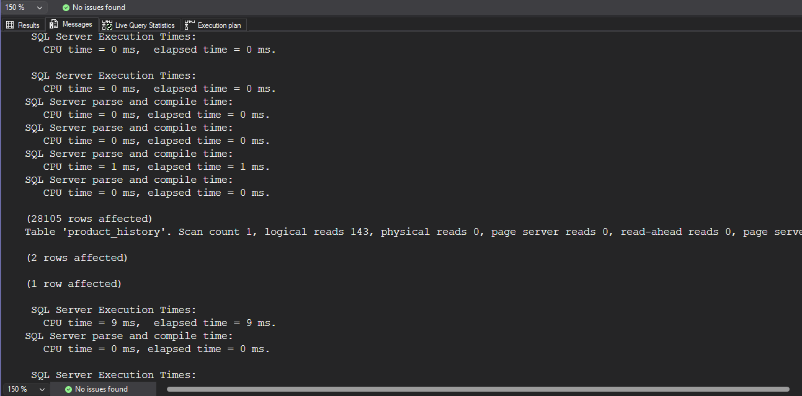

Komentarz:

- liczba stron bardzo spadła z 26081 do 143, a czas również spadł (CPU time = 133 ms, elapsed time = 19 ms. vs CPU time = 9 ms, elapsed time = 9 ms.), co jest związane z tym, że teraz `mssql` może użyć `Index Seek` na indeksie z włączeniem kolumn, zamiast skanować używać `Clustered Index Scan` na całej tabeli, więc teraz zapytanie jest bardzo szybkie
- nie ma paralelizmu

```sql
select id, productid, productname, date
from product_history
where year(date) = 2001
```

- plan zapytania i koszt:

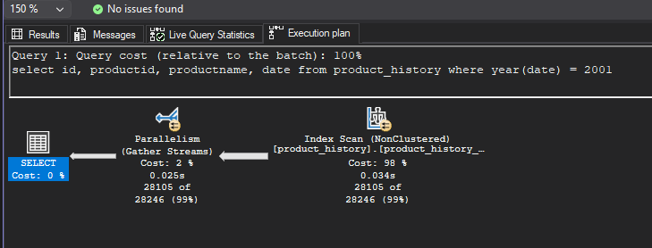

- czas i liczba odczytywanych stron:


Komentarz:

- liczba stron spadła z 26091 do 11424, ale czasy są bardzo podobne (CPU time = 368 ms, elapsed time = 38 ms. vs CPU time = 365 ms, elapsed time = 36 ms)
- podobnie jak w przypadku zapytania z funkcjami `year()` i `month()`, indeks z włączeniem kolumn nie jest wystarczający, ale zmniejsza liczbę odczytywanych stron, bo teraz `mssql` wykonuje `Index Scan` na indeksie z włączeniem kolumn (non clustered)
- włączony jest paralelizm

### f)

indeks dla kolumny `categoryid`

```sql
create index product_history_cat_idx
on product_history(categoryid)

drop index product_history_cat_idx on product_history
```

przeanalizuj polecenia

```sql
select id, productid, productname, date 
from product_history p
where categoryid = 8
```

- plan zapytania i koszt:

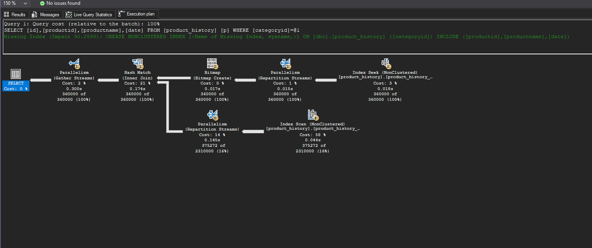

- czas i liczba odczytywanych stron:


Komentarz:

- z analizy planu: zapytanie korzysta z dwóch indeksów jednocześnie (używając też paralelizmu), w jednej gałęzi jest `Index Seek` po `categoryid`, aby stworzyć bitmapę (Bitmap Create) w celu filtracji rekordów zanim dotrą do Joina ("eliminating rows with key values that can't produce any join records before passing rows through another operator"), a w drugiej gałęzi jest `Index Scan` (po non-clustered, aby zaoszczędzić liczbę czytanych stron), na koniec jest Join, który łączy dane z obu gałęzi i `Gather Streams`, który zbiera dane z wątków i zwraca wynik
- obie gałęzie używają paralelizmu, więc Scan Count jest duży (34)
- liczba odczytywanych stron wyniosła 12084, a czas: CPU time = 1418 ms, elapsed time = 470 ms.
- `mssql` zasygnalizował, że dla tego zapytania można dodać indeks nieklastrowy na `categoryid` z włączeniem kolumn `productid`, `productname`, `date` (z `Impact` ~90%), co prawodopodobnie wyeliminowałoby dolną gałąź z `Index Scan` i pozwoliłoby na użycie `Index Seek` na indeksie z włączeniem kolumn, co znacząco poprawiłoby wydajność

```sql
select id, productid, productname, date, categoryname
from product_history p join categories c on p.categoryid = c.categoryid
where p.categoryid = 8
```

- plan zapytania i koszt:


- czas i liczba odczytywanych stron:


Komentarz:

- dodanie nowej tabeli do zapytania (`categories`) zwiększyło jego skomplikowanie i teraz wykorzystany jest tylko index klastrowy na `id`, więc `mssql` zdecydował się na przeskanowanie całej tabeli `product_history`, aby następnie wykonać join z tabelą `categories`
- widać też pogrubioną strzałkę z `Clustered Index Scan` do `Nested Loops`, co oznacza, że jest najbardziej kosztowna ścieżka w planie zapytania
- liczba odczytywanych wzrosła do 25891, a czas wyniósł CPU time = 370 ms, elapsed time = 622 ms. (brak paralelizmu - mniejsze cpu time, ale nieoptymalne zapytanie zwiękzyło czas)
- `mssql` zasygnalizował, że dla tego zapytania można dodać indeks nieklastrowy na `categoryid` z włączeniem kolumn `productid`, `productname`, `date` (z `Impact` ~92%)

### dodatkowo

możesz sprawdzić strukturę indeksu

np.

```sql
exec sp_helpindex 'dbo.product_history';

select
    i.name as index_name,
    ips.index_depth,
    ips.index_level,
    ips.page_count
from sys.indexes i
cross apply sys.dm_db_index_physical_stats(
    db_id(),
    i.object_id,
    i.index_id,
    null,    'detailed'
) ips
where i.object_id = object_id('dbo.product_history')
  and i.name = 'product_history_date_idx';
```

Na przykładzie indeksu nieklastrowego:

- `product_history_date_idx` (bez włączenia kolumn):


- `product_history_date_incl_idx` (z włączeniem kolumn):


Komentarz:

- po metadanych indeksu z włączeniem kolumn można zauważyć, że liczba na poziomie 0 (leaf) jest znacznie większa niż w przypadku indeksu bez włączenia kolumn (11264 vs 3724), co jest związane z tym, że teraz indeks z włączeniem kolumn ma więcej danych do przechowywania (nie tylko klucz, ale też dodatkowe kolumny)

Możemy jeszcze porównać indeksy z zadania a) dla kolumny `id`:

- `product_history_clust_idx` (indeks klastrowy):

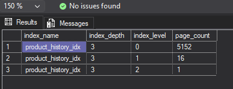

- `product_history_idx` (indeks nieklastrowy):


Komentarz:

- widać, że indeks klastrowy jako, że przechowuje pełne dane, ma znacznie więcej stron na poziomie 0 (leaf) niż indeks nieklastrowy (25841 vs 5152), co jest związane z tym, że indeks klastrowy jest całą tabelą, a indeks nieklastrowy jest tylko strukturą danych z kluczami i pointerami do danych

jeśli chcesz zaobserwować odczyty logiczne/fizyczne możesz zwolnić pulę buforów przed wykonaniem polecenia

```sql
CHECKPOINT;
DBCC DROPCLEANBUFFERS;
```

i teraz porównaj liczby czytanych stron np. wykonując dwukrotnie polecenie

```sql
select * from product_history
```

- IO statistics dla pierwszego zapytania:

```md
Table 'product_history'. Scan count 1, logical reads 25891, physical reads 1, page server reads 0, read-ahead reads 25968, page server read-ahead reads 0, lob logical reads 0, lob physical reads 0, lob page server reads 0, lob read-ahead reads 0, lob page server read-ahead reads 0.
```

- IO statistics dla drugiego zapytania:

```md
Table 'product_history'. Scan count 1, logical reads 25891, physical reads 0, page server reads 0, read-ahead reads 0, page server read-ahead reads 0, lob logical reads 0, lob physical reads 0, lob page server reads 0, lob read-ahead reads 0, lob page server read-ahead reads 0.
```

Komentarz:

- w pierwszym zapytaniu, po wyczyszczeniu buforów, `mssql` musiał odczytać dane z dysku, ale widząc, że zapytanie może potrzebować więcej danych z tej tabeli, `mssql` wykonał read-ahead, aby załadować kolejne strony do bufora, co jest widoczne w statystykach jako `read-ahead reads 25968`
- w drugim zapytaniu, dane są już w buforze, więc nie ma potrzeby odczytywać z dysku, więc `physical reads` wynosi 0, a `logical reads` jest taka sama jak w pierwszym zapytaniu, bo teraz dane są odczytywane z bufora, a nie z dysku

# Zadanie 2

Celem zadania jest poznanie indeksów typu column store

Utwórz tabelę testową:

```sql
create table saleshistory(
 id int identity(1,1) not null primary key,
 salesorderid int not null,
 salesorderdetailid int not null,
 carriertrackingnumber nvarchar(25) null,
 orderqty smallint not null,
 productid int not null,
 specialofferid int not null,
 unitprice money not null,
 unitpricediscount money not null,
 linetotal numeric(38, 6) not null,
 rowguid uniqueidentifier not null,
 modifieddate datetime not null
 )
```

Sprawdź jakie indeksy istnieją dla tej tabeli

```sql
exec sp_helpindex 'dbo.saleshistory'
```

```sql
Select
    i.name as index_name,
    i.type_desc,
    i.is_unique,
    c.name as column_name,
    ic.key_ordinal,
    ic.is_included_column
from sys.indexes i
join sys.index_columns ic
    on i.object_id = ic.object_id
   and i.index_id = ic.index_id
join sys.columns c
    on ic.object_id = c.object_id
   and ic.column_id = c.column_id
where i.object_id = object_id('dbo.saleshistory')
order by i.name, ic.key_ordinal;
```

Wypełnij tablicę danymi:

```sql
-- w ssms

insert into saleshistory
 select sh.*
 from adventureworks2017.sales.salesorderdetail sh
go 100
```

(UWAGA `GO 100` oznacza 100 krotne wykonanie polecenia. Jeżeli podejrzewasz, że twój serwer może to zbyt przeciążyć, zacznij od GO 10, GO 20, GO 50

albo

```sql
declare @i int = 1;

while @i <= 100
begin
    insert into saleshistory
    select *
    from adventureworks2017.sales.salesorderdetail;

    set @i += 1;
end;
```

sprawdź liczbę wierszy w tabeli

```sql
select count(*) from saleshistory
```

włącz statystyki IO i TIME

```sql
SET STATISTICS IO ON

SET STATISTICS TIME ON;
```

Sprawdź jak zachowa się zapytanie

- sprawdź plan
- koszt
- czas
- liczbę odczytywanych stron

```sql
select productid, sum(unitprice), avg(unitprice), sum(orderqty), avg(orderqty)
from saleshistory
group by productid
order by productid
```

Załóż indeks typu column store:

```sql
create nonclustered columnstore index saleshistory_columnstore
 on saleshistory(unitprice, orderqty, productid)
```

Sprawdź różnicę pomiędzy przetwarzaniem w zależności od indeksów. Porównaj plany i opisz różnicę.
Co to są indeksy colums store? Jak działają? (poszukaj materiałów w internecie/literaturze)

UWAGA: ciekawsze efekty możesz zaobserwować dla jeszcze większych tabel (jeśli twój komp na to pozwala możesz zwiększyć wolumen generowanych danych)

**Rezultaty:**

Liczba wierszy w tabeli:


Istniejące indeksy:
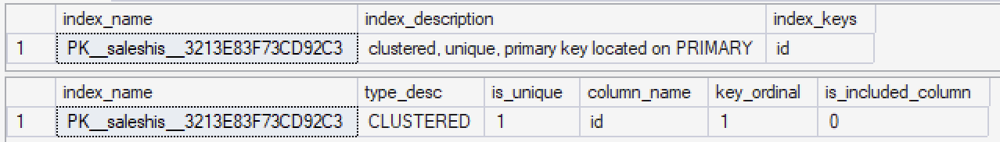

Jak widać na załączonym obrazku, w tabeli został automatycznie stworzy indeks klastrowany dla klucza głównego `id` - indeks ten nie zawiera żadnych innych kolumn.

- zapytanie bez indeksu kolumnowego (istnieje wyłącznie domyślny indeks na kluczu głównym):

```sql
-- zapytanie 2a
select productid, sum(unitprice), avg(unitprice), sum(orderqty), avg(orderqty)
from saleshistory
group by productid
order by productid;
```

```
Table 'saleshistory'. Scan count 9, logical reads 158276, physical reads 0, page server reads 0, read-ahead reads 0, page server read-ahead reads 0, lob logical reads 0, lob physical reads 0, lob page server reads 0, lob read-ahead reads 0, lob page server read-ahead reads 0.
Table 'Worktable'. Scan count 0, logical reads 0, physical reads 0, page server reads 0, read-ahead reads 0, page server read-ahead reads 0, lob logical reads 0, lob physical reads 0, lob page server reads 0, lob read-ahead reads 0, lob page server read-ahead reads 0.

SQL Server Execution Times:
  CPU time = 1967 ms,  elapsed time = 260 ms.
```

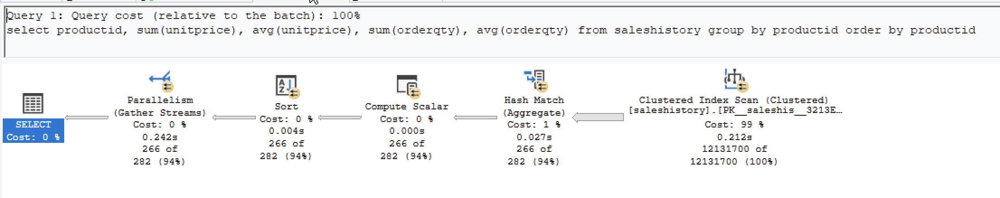
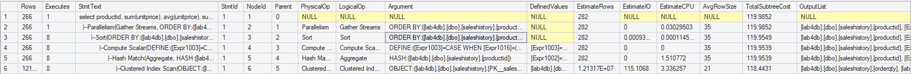

- zapytanie z indeksem kolumnowym na `saleshistory(unitprice, orderqty, productid)`:

```sql
-- zapytanie 2b
create nonclustered columnstore index saleshistory_columnstore
	on saleshistory(unitprice, orderqty, productid)

select productid, sum(unitprice), avg(unitprice), sum(orderqty), avg(orderqty)
from saleshistory
group by productid
order by productid;

drop index saleshistory_columnstore on saleshistory;
```

```
Table 'saleshistory'. Scan count 16, logical reads 0, physical reads 0, page server reads 0, read-ahead reads 0, page server read-ahead reads 0, lob logical reads 12405, lob physical reads 4, lob page server reads 0, lob read-ahead reads 46383, lob page server read-ahead reads 0.
Table 'saleshistory'. Segment reads 19, segment skipped 0.
Table 'Worktable'. Scan count 0, logical reads 0, physical reads 0, page server reads 0, read-ahead reads 0, page server read-ahead reads 0, lob logical reads 0, lob physical reads 0, lob page server reads 0, lob read-ahead reads 0, lob page server read-ahead reads 0.

SQL Server Execution Times:
  CPU time = 141 ms,  elapsed time = 42 ms.
```

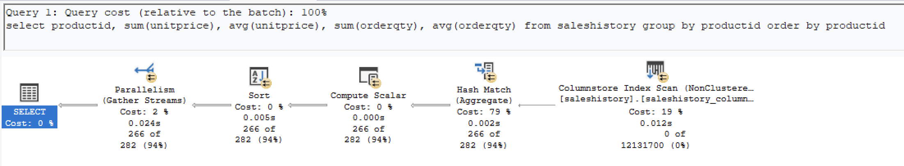
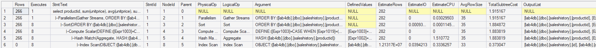

**Obserwacje:**

- plany zapytań wyglądają co do zasady identycznie, jedyną różnicą jest indeks, z którego korzysta operacja `Index Scan` (`Clustered Index Scan` vs. `Columnstore Index Scan`)
- koszt zapytania korzystającego z indeksu kolumnowego jest około 20-krotnie niższy (~1.92 vs ~119.99)
- przewagę indeksu kolumnowego obserwujemy także w czasach wykonania zapytań - `CPU time` spadło około 14-krotnie (1967ms do 141ms), podczas gdy `Elapsed time` spadło około 6-krotnie (260ms do 42ms)
- ilość czytanych stron nie jest w pełni porównywalna, ponieważ w zależności od indeksu, dane przechowywane są w inny sposób - indeks klastrowany używa standardowych stron (`logical reads 158276`), podczas gdy indeks kolumnowy przechowuje dane jako skompresowane segmenty binarne (`LOB`), stąd zamiast `logical reads` pojawiają się `lob logical reads 12405` oraz `segment reads 19`. Oznacza to że SQL Server odczytał tylko 19 segmentów zawierających kolumny productid, unitprice i orderqty — pozostałe kolumny tabeli zostały całkowicie pominięte
- columnstore nie potrzebował paralelizmu do osiągnięcia lepszych wyników niż row store z 9 równoległymi wątkami

**Komentarz:**

> _Co to są indeksy colums store? Jak działają?_

Indeksy columnstore to typ indeksu zaprojektowany z myślą o zapytaniach analitycznych na dużych zbiorach danych. W przeciwieństwie do tradycyjnych indeksów, które przechowują dane wierszami, indeksy kolumnowe przechowują dane kolumnami w skompresowanych segmentach. Kluczowe cechy indeksów kolumnowych:

- korzystając z indeksu kolumnowego, możemy czytać wyłącznie te kolumny których potrzebuje zapytanie, resztę całkowicie pomija
- dane tej samej kolumny są do siebie podobne, co pozwala na znacznie lepszą kompresję niż w row store gdzie różne typy danych są przeplatane
- dane przetwarzane są w partiach naraz zamiast wiersz po wierszu, co pozwala procesorowi wykorzystać wydaje operacje wektorowe do obliczania agregatów na wielu wartościach jednocześnie

Z tego powodu indeksy kolumnowe są idealnym rozwiązaniem w momencie gdy potrzebujemy wykonywać wiele zapytań korzystających z funkcji agregujących (np. raporty analityczne korzystające z `sum(), avg(), count()`), natomiast będą gorszym wyborem w przypadku zapytań wykonujących punktowe wyszukiwanie oraz w przypadku tabel z częstymi modyfikacjami danych.

# Zadanie 3 – własne eksperymenty

Należy zaprojektować/zaimplementować tabelę w bazie danych, lub wybrać dowolny schemat/bazę/tabelę (poza używanymi na zajęciach), a następnie wypełnić ją danymi w taki sposób, przetestować/przeanalizować działanie indeksów różnego typu. Warto wygenerować sobie tabele o większym rozmiarze.

Możesz też powtórzyć np. eksperymenty wykonywane w zadaniu 1, ale tym razem dla innego serwera,

Wedle uznania i zainteresowań, ważne żeby poeksplorować tematykę i spróbować

Do analizy, proszę uwzględnić następujące rodzaje indeksów:

- Klastrowane (np.  dla atrybutu nie będącego kluczem głównym)
- Nieklastrowane
- Indeksy wykorzystujące kilka atrybutów, indeksy include
- Filtered Index (Indeks warunkowy)
- Kolumnowe

## Analiza

Proszę przygotować zestaw zapytań do danych, które:

- wykorzystują poszczególne indeksy
- które przy wymuszeniu indeksu działają gorzej, niż bez niego (lub pomimo założonego indeksu, tabela jest w pełni skanowana)
  Odpowiedź powinna zawierać:
- Schemat tabeli
- Opis danych (ich rozmiar, zawartość, statystyki)
- Opis indeksu
- Przygotowane zapytania, wraz z wynikami z planów (zrzuty ekranow)
- Inf o kosztach, czytanych stornach
- Komentarze do zapytań, ich wyników
- ew. sprawdzenie, co proponuje Database Engine Tuning Advisor (porównanie czy udało się Państwu znaleźć odpowiednie indeksy do zapytania)

> Wyniki:

#### Przygotowanie tabeli oraz danych, podstawowa charakterystyka oraz wstępna analiza

W celu analizy działania indeksów różnego typu, zdecydowaliśmy się pozostać przy silniku MSSQL, ale zaprojektować własną tabelę w bazie danych, która obrazuje całkiem realny scenariusz. W tabeli `sensorReadings` znajdują się dane dotyczące pomiarów 100 czujników, które zbierają dane odnośnie temperatury oraz wilgotności w pewnym zakładzie produkcyjnym. Wszystkie wiersze zawierają także informacje o czasie odczytu, poziomie baterii czujnika oraz statusie pomiaru (informacja o tym czy pomiar jest ok, czy też pomiar jest zły i raportowane jest ostrzeżenie/sytuacja krytyczna). Dokładna definicja tabeli wygląda następująco:

```sql
create table sensorReadings (
    readingId UNIQUEIDENTIFIER DEFAULT NEWID() NOT NULL,
    sensorId INT NOT NULL,
    readingTime DATETIME NOT NULL,
    temperature DECIMAL(5,2) NOT NULL,
    humidity INT NOT NULL,
    batteryLevel INT NOT NULL,
    alertStatus VARCHAR(15) NOT NULL,
    CONSTRAINT PK_SensorReadings PRIMARY KEY NONCLUSTERED (readingId)
);
```

W celu przeprowadzenia miarodajnych eksperymentów, wygenerowanych zostało 1,000,000 wierszy. Do wygenerowania danych wykorzystany został następujący kod:

```sql
;WITH
L0 AS (SELECT c FROM (VALUES(1),(1),(1),(1),(1),(1),(1),(1),(1),(1)) AS Test(c)),  -- 10
L1 AS (SELECT 1 AS c FROM L0 AS A CROSS JOIN L0 AS B),                             -- 100
L2 AS (SELECT 1 AS c FROM L1 AS A CROSS JOIN L1 AS B),                             -- 10 000
L3 AS (SELECT 1 AS c FROM L2 AS A CROSS JOIN L1 AS B),                             -- 1 000 000
numbers AS (SELECT ROW_NUMBER() OVER(ORDER BY (SELECT NULL)) AS n FROM L3)

INSERT INTO sensorReadings (sensorId, readingTime, temperature, humidity, batteryLevel, alertStatus)
SELECT
    (n % 100) + 1,
    DATEADD(MINUTE, -(n / 100) * 30, GETDATE()),
    CAST(20 + (ABS(CHECKSUM(NEWID())) % 6000) / 100.0 AS DECIMAL(5,2)),
    30 + (ABS(CHECKSUM(NEWID())) % 61),
    ABS(CHECKSUM(NEWID())) % 101,
    CASE
        WHEN ABS(CHECKSUM(NEWID())) % 100 < 95 THEN 'OK'
        WHEN ABS(CHECKSUM(NEWID())) % 100 < 99 THEN 'WARNING'
        ELSE 'CRITICAL'
    END
FROM numbers;
```

Powyższy sposób stanowi wydajną alternatywę dla generowania danych wiersz po wierszu w pętli `WHILE` - dzięki zastosowaniu `JOIN-ów`, wygenerowanie 1,000,000 wierszy danych wykonało się błyskawicznie. Krótka charakterystyka wygenerowanych danych:

- `readingId (uniqueidentifier)` - ID odczytu, klucz główny tabeli `sensorReadings`
- `sensorId (int)` - liczba całkowita 1-100, identyfikator sensora
- `readingTime (datetime)` - czas odczytu, w wygenerowanych danych odczyty wykonywane są na wszystkich sensorach co 30 minut (co daje około 8 miesięcy historii)
- `temperature (decimal)` - odczytana temperatura, liczba zmiennoprzecinkowana z zakresu 20-80 (°C)
- `humidity (int)` - odczytana wilogotność powietrza, liczba całkowita z zakresu 30-90 (%)
- `batteryLevel (int)` - stan baterii czujnika, liczba całkowita z zakresu 0-100 (%)
- `alertStatus (varchar)` - informacja o tym, czy należy odczyt jest alarmujący - może przyjmować jedną z wartości: `OK` (wszystko w porządku), `WARNING` (ostrzeżenie) lub `CRITICAL` (krytyczna sytuacja). Około 95% rekordów to odczyty prawidłowe, ze statusem `OK`.

Podstawowe statystki opisowe:

```sql
select
    count(*)                        as total_rows,
    count(distinct sensorId)        as unique_sensors,
    min(readingTime)                as earliest,
    max(readingTime)                as latest,
    round(avg(temperature), 2)      as avg_temp,
    min(temperature)                as min_temp,
    max(temperature)                as max_temp,
    round(avg(cast(humidity as float)), 2) as avg_humidity,
    round(avg(cast(batteryLevel as float)), 2) as avg_battery
from sensorReadings;
```

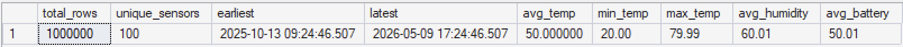

Rozkład wartości w kolumnie `alertStatus`:

```sql
select
    alertStatus,
    count(*) as cnt
from sensorReadings
group by alertStatus
order by cnt desc;
```

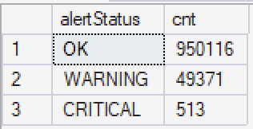

Rozmiar danych w tabeli `sensorReadings`:

```sql
select
    row_count,
    (reserved_page_count * 8) / 1024.0 as reserved_mb,
    (used_page_count * 8) / 1024.0 as used_mb
from sys.dm_db_partition_stats
where object_id = object_id('sensorReadings')
  and index_id in (0, 1);
```


### Eksperymenty

#### Zapytanie o wszystkie odczyty w zadanym oknie czasu - indeks klastrowany vs indeks nieklastrowany vs brak indeksu

Zapytanie dotyczy okresu od `01.04.2026 - 30.04.2026` i zwraca:

- id sensora
- czas odczytu
- odczytaną temperaturę
- odczytaną wilgotność

```sql
-- 1. brak indeksu
SELECT sensorId, readingTime, temperature, humidity
FROM sensorReadings
WHERE readingTime >= '2026-04-01' AND readingTime < '2026-04-30';

-- 2. indeks nieklastrowany
CREATE INDEX ix_readingTime
ON sensorReadings(readingTime);

SELECT sensorId, readingTime, temperature, humidity
FROM sensorReadings
WHERE readingTime >= '2026-04-01' AND readingTime < '2026-04-30';

-- 3. wymuszenie użycia indeksu nieklastrowanego (bez INCLUDE)

SELECT sensorId, readingTime, temperature, humidity
FROM sensorReadings WITH (INDEX(ix_readingTime))
WHERE readingTime >= '2026-04-01' AND readingTime < '2026-04-30';

-- 4. indeks nieklastrowany + INCLUDE
DROP INDEX ix_readingTime ON sensorReadings;

CREATE INDEX ix_readingTime_incl
ON sensorReadings(readingTime)
INCLUDE(sensorId, temperature, humidity);

SELECT sensorId, readingTime, temperature, humidity
FROM sensorReadings
WHERE readingTime >= '2026-04-01' AND readingTime < '2026-04-30';

-- 5. indeks klastrowany
DROP INDEX ix_readingTime_incl ON sensorReadings;

CREATE CLUSTERED INDEX cx_readingTime
ON sensorReadings(readingTime);

SELECT sensorId, readingTime, temperature, humidity
FROM sensorReadings
WHERE readingTime >= '2026-04-01' AND readingTime < '2026-04-30';
```

**Wyniki:**

- zapytanie bez indeksu:

```
Table 'sensorReadings'. Scan count 9, logical reads 6973, physical reads 0, page server reads 0, read-ahead reads 0, page server read-ahead reads 0, lob logical reads 0, lob physical reads 0, lob page server reads 0, lob read-ahead reads 0, lob page server read-ahead reads 0.
```

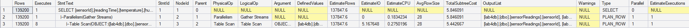

- zapytanie z indeksem nieklastrowanym:

```
Table 'sensorReadings'. Scan count 9, logical reads 6973, physical reads 0, page server reads 0, read-ahead reads 0, page server read-ahead reads 0, lob logical reads 0, lob physical reads 0, lob page server reads 0, lob read-ahead reads 0, lob page server read-ahead reads 0.
```

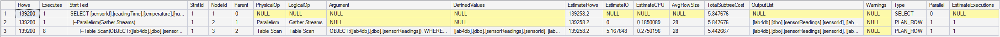
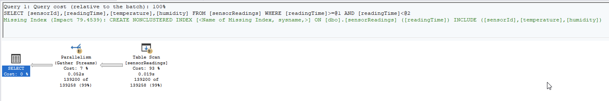

- zapytanie z wymuszonym użyciem indeksu nieklastrowanego (bez `INCLUDE`):

```
Table 'Worktable'. Scan count 0, logical reads 0, physical reads 0, page server reads 0, read-ahead reads 0, page server read-ahead reads 0, lob logical reads 0, lob physical reads 0, lob page server reads 0, lob read-ahead reads 0, lob page server read-ahead reads 0.
Table 'sensorReadings'. Scan count 9, logical reads 426769, physical reads 0, page server reads 0, read-ahead reads 6, page server read-ahead reads 0, lob logical reads 0, lob physical reads 0, lob page server reads 0, lob read-ahead reads 0, lob page server read-ahead reads 0.
```

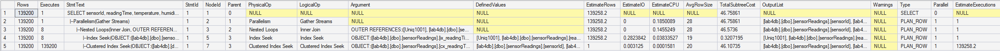
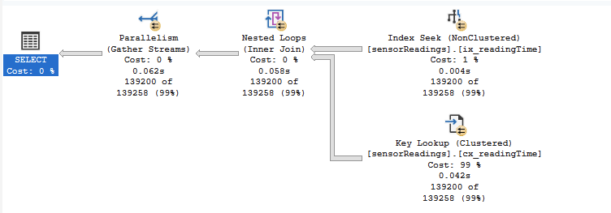

- zapytanie z indeksem nieklastrowanym + `INCLUDE`:

```
Table 'sensorReadings'. Scan count 1, logical reads 610, physical reads 0, page server reads 0, read-ahead reads 5, page server read-ahead reads 0, lob logical reads 0, lob physical reads 0, lob page server reads 0, lob read-ahead reads 0, lob page server read-ahead reads 0.
```

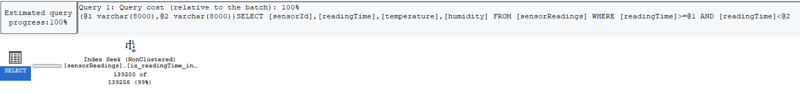
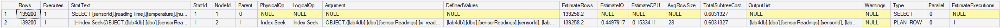

- zapytanie z indeksem klastrowanym:

```
Table 'sensorReadings'. Scan count 1, logical reads 1080, physical reads 0, page server reads 0, read-ahead reads 0, page server read-ahead reads 0, lob logical reads 0, lob physical reads 0, lob page server reads 0, lob read-ahead reads 0, lob page server read-ahead reads 0.
```

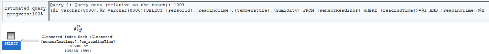
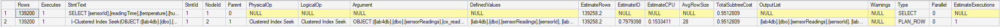

**Obserwacje:**

- ze względu na szeroki zakres dat oraz wiele rekordów w zadanym zakresie (139200 rekordów), w przypadku indeksu nieklastrowanego bez klauzuli `INCLUDE` optymalizator stwierdził, że szybciej będzie wykonać pełne skanowanie tabeli, niż skorzystać z indeksu, a następnie dla każdego identyfikatora wykonywać `Key Lookup` - w związku z tym zapytanie `2.` jest redukowane do zapytania `1.`, a ich koszt oraz ilość odczytywanych stron są praktycznie identyczne (odpowiednio ~5.85 oraz 6973). Potwierdzenie tej tezy znajdujemy w zapytaniu `3.`, gdzie po wymuszeniu użycia indeksu nieklastrowanego (bez `include`) koszt zapytania rośnie do ~46.74, a ilość odczytywanych stron do 426769 (co pokazuje, że nie zawsze warto korzystać z indeksu), co wynika z konieczności wielokrotnego wykonywania operacji `Key Lookup`
- zdecydowanie najbardziej wydajne jest zapytanie `4.`, które wykorzystuje indeks nieklastrowany z klauzulą `include(sensorId, temperature, humidity);` (tzn. że dane te uwzględnione są w liściach indeksu i nie ma konieczności wykonywania `Key Lookup`, jeśli potrzebujemy tylko tych kolumn) - koszt dla tego zapytania jest prawie 10-krotnie niższy w porównaniu do skanowania całej tabeli, a ilość czytanych stron wynosi jedynie 610
- choć zapytanie z indeksem klastrowanym (zapytanie `5.`) jest nieznacznie mniej wydajne niż zapytanie `4.`, to nadal prezentuje bardzo dobre i obiecujące wyniki - charakteryzuje się około 6-krotnie niższym kosztem zapytania oraz około 7-krotnie mniejszą liczbą odczytywanych stron w porównaniu do pełnego skanowania tabeli.

#### Zapytanie o wszystkie odczyty ze statusem krytycznym

Zapytanie dotyczy wszystkich odczytów `alertStatus = 'CRITICAL'` i zwraca:

- id sensora
- czas odczytu
- odczytaną temperaturę
- odczytaną wilgotność
- status ostrzeżenia

**Zapytanie:**

```sql
-- filtered index tylko na ostrzezenia i krytyczne alerty
CREATE INDEX ix_alerts_filtered
ON sensorReadings(alertStatus, sensorId, readingTime, temperature, humidity)
WHERE alertStatus IN ('WARNING', 'CRITICAL');

-- zapytanie o CRITICAL z indeksem filtrowanym
SELECT sensorId, readingTime, alertStatus, temperature, humidity
FROM sensorReadings
WHERE alertStatus = 'CRITICAL'

-- zapytanie o OK z indeksem filtrowanym
SELECT sensorId, readingTime, alertStatus, temperature, humidity
FROM sensorReadings
WHERE alertStatus = 'OK';

-- zapytanie o CRITICAL bez indeksu filtrowanego

SELECT sensorId, readingTime, alertStatus, temperature, humidity
FROM sensorReadings WITH (INDEX(0))
WHERE alertStatus = 'CRITICAL'
```

Dodatkowo, w celu porównania rozmiaru indeksu filtrowanego względem indeksu założonego na wszystkie statusy wykorzystane zostało zapytanie:

```sql
CREATE INDEX ix_alerts_full
ON sensorReadings(alertStatus, sensorId, readingTime);

SELECT
    i.name,
    i.type_desc,
    i.filter_definition,
    ips.page_count,
    ips.record_count
FROM sys.indexes i
CROSS APPLY sys.dm_db_index_physical_stats(
    DB_ID(), i.object_id, i.index_id, null, 'sampled'
) ips
WHERE i.object_id = OBJECT_ID('sensorReadings')
  AND i.name IS NOT NULL
ORDER BY ips.page_count DESC;
```

**Wyniki:**

- zapytanie o status `CRITICAL` z indeksem filtrowanym:

```
Table 'sensorReadings'. Scan count 1, logical reads 6, physical reads 0, page server reads 0, read-ahead reads 0, page server read-ahead reads 0, lob logical reads 0, lob physical reads 0, lob page server reads 0, lob read-ahead reads 0, lob page server read-ahead reads 0.
```

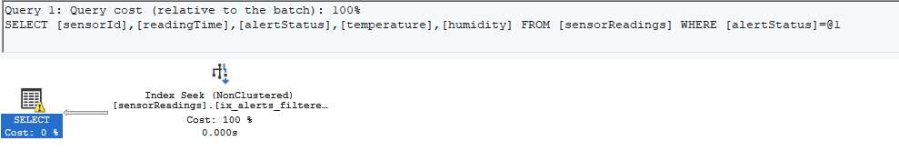
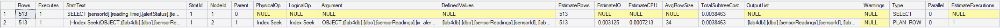

- zapytanie o status `OK` z indeksem filtrowanym:

```
Table 'sensorReadings'. Scan count 1, logical reads 7709, physical reads 0, page server reads 0, read-ahead reads 0, page server read-ahead reads 0, lob logical reads 0, lob physical reads 0, lob page server reads 0, lob read-ahead reads 0, lob page server read-ahead reads 0.
```

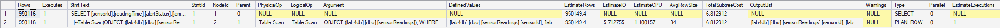
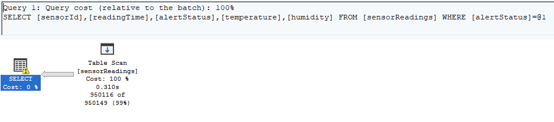

- zapytanie o status `CRITICAL` bez indeksu filtrowanego:

```
Table 'sensorReadings'. Scan count 9, logical reads 7709, physical reads 0, page server reads 0, read-ahead reads 0, page server read-ahead reads 0, lob logical reads 0, lob physical reads 0, lob page server reads 0, lob read-ahead reads 0, lob page server read-ahead reads 0.
```

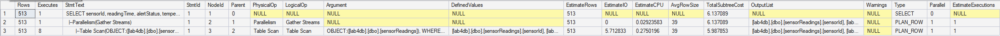
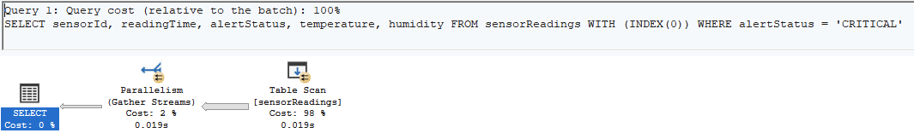

- porównanie rozmiarów poszczególnych indeksów:

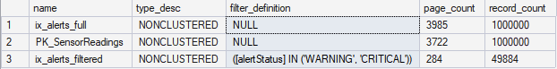

**Obserwacje:**

- zapytanie o status `CRITICAL` korzysta z indeksu filtrowanego, ze względu na fakt, że wszystkie potrzebne atrybuty są zawarte w indeksie klauzulą nie ma konieczności wykonywania dodatkowych operacji `Key Lookup`. Ze względu na wykorzystanie indeksu zapytanie to jest bardzo wydajne - koszt zapytania to ~0.0038, a liczba czytanych stron wynosi 6.
- zapytanie o status `OK` nie korzysta z obecnego w bazie indeksu, ponieważ status `OK` celowo nie został uwzględniony w indeksie filtrowanym. W związku z tym zapytanie `2.` nie korzysta z indeksu, wykonuje pełne skanowanie tabeli, koszt zapytania wynosi ~6.81, a liczba czytanych stron wynosi 7709.
- w celu porównania wydajności na tym samym zapytaniu, wykonujemy zapytanie `3.`, które daje takie same rezultaty jak zapytanie `1.`, ale nie korzysta z indeksu (został on ręcznie wyłączony) - koszt tego zapytania jest bardzo zbliżony do zapytania `2.` - charakteryzuje sie ono około 2000 razy większym kosztem oraz wymaga przeczytania aż 7709 stron.
- rozmiar indeksu filtrowanego (założonego jedynie na statusy `WARNING` i `CRITICAL`) jest około 20-krotnie mniejszy niż indeks założony na wszystkie statusy, co stanowi istotną zaletę indeksu filtrowanego. Dzięki temu nadaje się on idealnie do sytuacji, w których musimy śledzić pewne sytuacje, które występują stosunkowo rzadko, ale są dla nas kluczowe z perspektywy biznesowej (często nie interesują nas wszystkie "standardowe" odczyty (u nas: status `OK`), a raczej skupiamy się na tych, które są krytyczne (u nas: status `WARNING/CRITICAL` - np. pewna awaria)). Dzięki wykorzystaniu indeksu filtrowanego możemy zaoszczędzić dużo zasobów.

#### Zapytanie o zagregowane statystki odnośnie temperatury, wilgotności, stanu baterii i statusu z odczytu

**Zapytanie:**

```sql
-- bez indeksu
SELECT
    sensorId,
    AVG(temperature)                 as avg_temp,
    MAX(temperature)                 as max_temp,
    MIN(temperature)                 as min_temp,
    AVG(CAST(humidity as float))     as avg_humidity,
    AVG(CAST(batteryLevel as float)) as avg_battery,
    COUNT(*)                         as total_readings,
    SUM(CASE WHEN alertStatus != 'OK' THEN 1 ELSE 0 END) as alert_count
FROM sensorReadings
GROUP BY sensorId
ORDER BY sensorId;

-- columnstore index
CREATE NONCLUSTERED COLUMNSTORE INDEX csx_analytics
ON sensorReadings(temperature, humidity, batteryLevel, sensorId, alertStatus);

SELECT
    sensorId,
    AVG(temperature)                 as avg_temp,
    MAX(temperature)                 as max_temp,
    MIN(temperature)                 as min_temp,
    AVG(CAST(humidity as float))     as avg_humidity,
    AVG(CAST(batteryLevel as float)) as avg_battery,
    COUNT(*)                         as total_readings,
    SUM(CASE WHEN alertStatus != 'OK' THEN 1 ELSE 0 END) as alert_count
FROM sensorReadings
GROUP BY sensorId
ORDER BY sensorId;

DROP INDEX csx_analytics ON sensorReadings;

-- standardowy nonclustered

CREATE INDEX ix_analytics_incl
ON sensorReadings(sensorId)
INCLUDE(temperature, humidity, batteryLevel, alertStatus);

SELECT
    sensorId,
    AVG(temperature)                 as avg_temp,
    MAX(temperature)                 as max_temp,
    MIN(temperature)                 as min_temp,
    AVG(CAST(humidity as float))     as avg_humidity,
    AVG(CAST(batteryLevel as float)) as avg_battery,
    COUNT(*)                         as total_readings,
    SUM(CASE WHEN alertStatus != 'OK' THEN 1 ELSE 0 END) as alert_count
FROM sensorReadings
GROUP BY sensorId
ORDER BY sensorId;

DROP INDEX ix_analytics_incl ON sensorReadings;
```

**Rezultaty:**

- zapytanie bez indeksu:

```
Table 'sensorReadings'. Scan count 9, logical reads 7709, physical reads 0, page server reads 0, read-ahead reads 0, page server read-ahead reads 0, lob logical reads 0, lob physical reads 0, lob page server reads 0, lob read-ahead reads 0, lob page server read-ahead reads 0.
```

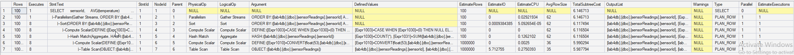
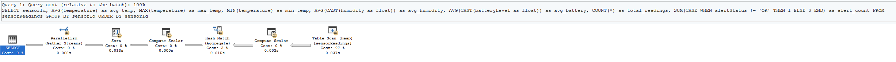

- zapytanie z indeksem kolumnowym:

```
Table 'sensorReadings'. Scan count 2, logical reads 0, physical reads 0, page server reads 0, read-ahead reads 0, page server read-ahead reads 0, lob logical reads 1986, lob physical reads 1, lob page server reads 0, lob read-ahead reads 6487, lob page server read-ahead reads 0.
Table 'sensorReadings'. Segment reads 1, segment skipped 0.
```

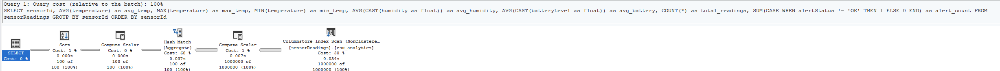
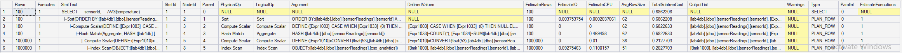

- zapytanie z indeksem nieklastrowanym uwzględniającym wszystkie konieczne kolumny:

```
Table 'sensorReadings'. Scan count 9, logical reads 4696, physical reads 0, page server reads 0, read-ahead reads 35, page server read-ahead reads 0, lob logical reads 0, lob physical reads 0, lob page server reads 0, lob read-ahead reads 0, lob page server read-ahead reads 0.
```

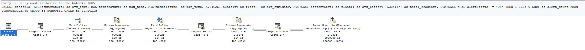
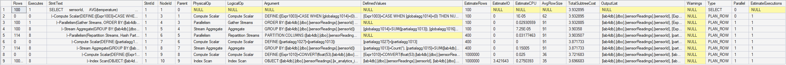

**Obserwacje:**

- zapytanie z indeksem kolumnowym (`2.`) poradziło sobie najlepiej - koszt tego zapytania to jedynie ~0.69 (w porównaniu do ~6.15 oraz ~3.93 dla odpowiednio zapytań `1.` (bez indeksu) oraz `3.` (z indeksem nieklastrowanym uwzględniającym wszystkie niezbędne kolumny))
- indeks kolumnowy charakteryzuje się innym sposobem przechowywania danych, w związku z czym dla zapytania `2.` raportujemy 1986 operacji `lob logical read` oraz 0 operacji `logical read` - `lob logical read` to odczyty "stron LOB" (LOB - typ danych przeznaczony do przechowywania dużych, nieustrukturyzowanych wolumenów danych), na których znajdują się skompresowane dane z oryginalnej tabeli. Liczby te nie są bezpośrednio porównywalne.
- zapytanie `1.` (bez indeksu) wykonuje operację `Table Scan` (czyta całą tabelę), buduje tymczasową tablicę hashową do agregacji (`Hash Match`) oraz wykorzystuje `Parallelizm` (9 wątków); zapytanie `2.` nie korzysta z paralalizmu - optymalizator stwierdził, że jeden wątek jest wystarczający, korzysta z operacji `Columnstore Index Scan`; zapytanie `3.` korzysta z `Index Scan` zamiast `Table Scan` (ale nadal skanuje cały indeks), a dzięki temu, że dane z indeksu są posortowane po `sensorId` wykorzystywane jest `Stream Aggregate` zamiast `Hash Match` - dzięki temu nie ma konieczności budowania nowej struktury dla celów agregacji. Zapytanie `3.` również korzysta z paralelizmu.
- powyższe wyniki idealnie obrazują, że indeks kolumnowy idealnie nadaje się dla danych, dla których będziemy często wykonywać tego typu analityczne zapytania, w których konieczne jest agregowanie dużych wolumentów danych - dzięki kompresji oraz odpowiedniemu uporządkowaniu danych indeks kolumnowy pozwala na znaczne przyspieszenie zapytań tego typu.

|         |                                                                          |     |
| ------- | ------------------------------------------------------------------------ | --- |
| zadanie | pkt                                                                      |     |
| 1       | 6                                                                        |     |
| 2       | 2                                                                        |     |
| 3       | 5 (3 pkt. za eksperymenty + 2 dodatkowe za ciekawe/oryginalne przyklady) |     |
| razem   | 13                                                                       |     |
