# Kolumnowe bazy danych cz. I

**Eksploracja danych, podstawowe agregacje i pierwszy benchmark PostgreSQL i ClickHouse**

---

**Imię i nazwisko:** Marek Małek, Mateusz Lampert

**Grupa: 4 (Piątek, 15:00-16:30)**

---

## Cel ćwiczenia

- sprawdzenie poprawności działania przygotowanego środowiska,
- zapoznanie się z tabelą events,
- przećwiczenie podstawowych zapytań analitycznych SQL,
- przygotowanie pierwszych prostych wskaźników KPI,
- porównanie wyników uzyskanych w PostgreSQL i ClickHouse,
- sformułowanie pierwszych wniosków, w jakich analizach baza kolumnowa może być szczególnie użyteczna.

## Ważne

- Pracuj na tej samej tabeli events w obu bazach danych.
- W typowej konfiguracji na zajęciach wystarczy używać nazwy events.
- Jeżeli w Twoim kliencie SQL tabela nie jest widoczna w bieżącym kontekście, użyj pełnej nazwy: `public.events` w PostgreSQL albo `ds_lab.events` w ClickHouse.
- Tam, gdzie polecenie mówi o porównaniu, nie wystarczy samo uruchomienie zapytania - napisz krótko, czy wyniki są zgodne.
- Do każdego zadania dołącz: kod zapytania, wynik oraz wymagany komentarz.
- Nie oddawaj samych zrzutów wyników bez interpretacji.
- W kilku zadaniach możesz korzystać z zapytań startowych, ale część rozwiązań musisz samodzielnie rozbudować.
- Do benchmarku użyj tego samego klienta SQL dla obu baz danych.
- Być może na zajęciach zabraknie czasu na wykonanie wszystkich zadań. Pozostałe elementy należy dokończyć po zajęciach.

## Opis kolumn tabeli events

- `event_time` - czas zdarzenia,
- `event_type` - typ zdarzenia, np. view, cart, purchase,
- `user_id` - identyfikator użytkownika,
- `session_id` - identyfikator sesji,
- `country` - kraj,
- `device` - urządzenie,
- `product_id` - identyfikator produktu,
- `price` - cena jednostkowa,
- `quantity` - liczba sztuk.

## Sprawozdanie

Oddawane sprawozdanie powinno zawierać komplet rozwiązań wszystkich zadań: kod zapytań, wyniki oraz wymagane komentarze.

- Sprawozdanie oddaj jako plik PDF albo Markdown.
- Kod SQL formatuj jako bloki kodu.
- Wyniki zapytań przedstawiaj jako tabele albo zrzuty ekranu.
- Komentarze pisz pełnymi zdaniami.
- Termin oddania: Do końca dnia poprzedzającego kolejne zajęcia

**Punktacja:** razem 10 pkt.

---

## 0. Gotowość do zajęć - 0 pkt

Pokaż, że środowisko jest przygotowane do pracy.

- `docker compose up -d` uruchamia oba kontenery bez błędów,
- `docker ps` pokazuje kontenery postgres i clickhouse w statusie Up,
- w obu bazach dostępna jest tabela events,
- możliwe jest połączenie z obiema bazami z poziomu klienta SQL.

**Uwaga:** brak gotowości środowiska uniemożliwia wykonanie dalszych zadań.

---

```{=typst}
#pagebreak()
```

## 1. Pierwsze poznanie tabeli events - 1 pkt

Zapoznaj się z tabelą events w obu bazach.

- sprawdź strukturę tabeli,
- wyświetl kilka przykładowych rekordów,
- policz liczbę wierszy,
- wyznacz minimalny i maksymalny czas zdarzenia,
- sprawdź, czy w kolumnach price i quantity występują wartości NULL, jeśli występują, wskaż ich liczbę.

**Zapytania startowe:**

```sql
SELECT
    count(*) AS n,
    min(event_time) AS min_time,
    max(event_time) AS max_time
FROM events;
```

```sql
SELECT
    count(*) AS all_rows,
    count(price) AS non_null_price,
    count(quantity) AS non_null_quantity,
    count(*) - count(price) AS null_price_rows,
    count(*) - count(quantity) AS null_quantity_rows
FROM events;
```

**W komentarzu napisz:** czy liczba rekordów i zakres czasu są zgodne w obu bazach, czy w danych występują NULL-e.

### Wyniki

#### Struktura tabeli

- PostgreSQL:

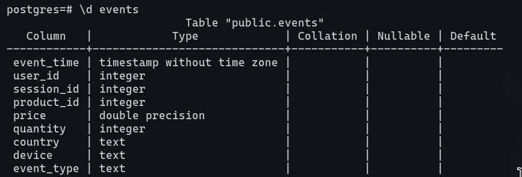

```{=typst}
#pagebreak()
```

- ClickHouse:

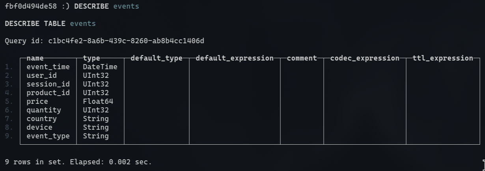

Typy danych są zgodne co do nazwy, ale kolumny metadanych istotnie się róźnią. PostgreSQL ma dodatkowo opcje `collation` (jak porównywać dane). Clickhouse oprócz wartości domyślnej ma też `default_expression` (jak zachowa się kolumna, gdy nie zostanie podana wartość), `codecs_compression` (jak kompresować dane) oraz `ttl_expression` (czy dane mają mieć czas życia).

#### Przykładowe rekordy

- PostgreSQL:

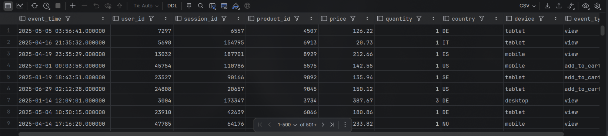

```{=typst}
#pagebreak()
```

- ClickHouse:

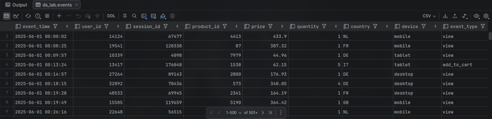

Wyniki są zgodne, oba systemy pokazują te same dane.

#### Liczba wierszy i zakres czasu

- PostgreSQL:

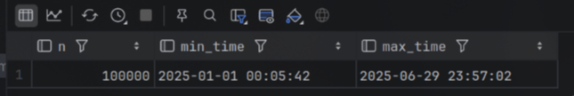

- ClickHouse:

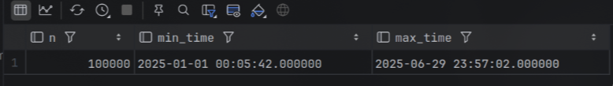

Liczba wierszy jest zgodna w obu tabelach, podobnie jak zakres czasu zdarzeń. PostgreSQL stosuje dokdładność do mikrosekund, a ClickHouse do sekund, ale oba zakresy są zgodne.

#### `NULL`-e w kolumnach price i quantity

- PostgreSQL:

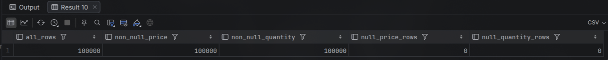

```{=typst}
#pagebreak()
```

- ClickHouse:

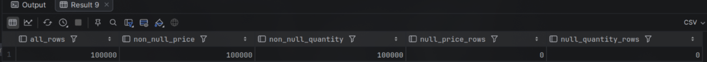

Wyniki są takie same, brak wartości `NULL`

---

## 2. Profil danych zdarzeniowych - 1 pkt

Przygotuj podstawowy profil danych.

- sprawdź, jakie typy zdarzeń występują w danych i ile ich jest,
- sprawdź, jakie kraje występują w danych i ile mają zdarzeń,
- sprawdź, jakie urządzenia występują w danych i ile mają zdarzeń,
- dla każdego z tych trzech przekrojów wskaż kategorię dominującą.

**Zapytanie startowe:**

```sql
SELECT
    event_type,
    count(*) AS n
FROM events
GROUP BY event_type
ORDER BY n DESC;
```

Dwa pozostałe zapytania przygotuj samodzielnie na analogicznej zasadzie.

### Rozwiązanie:

```sql
SELECT
    event_type,
    count(*) AS n
FROM events
GROUP BY event_type
ORDER BY n DESC;
```

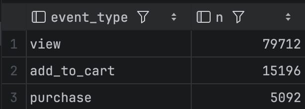

```{=typst}
#pagebreak()
```

```sql
SELECT
    country,
    count(*) AS n
FROM events
GROUP BY country
ORDER BY n DESC;
```

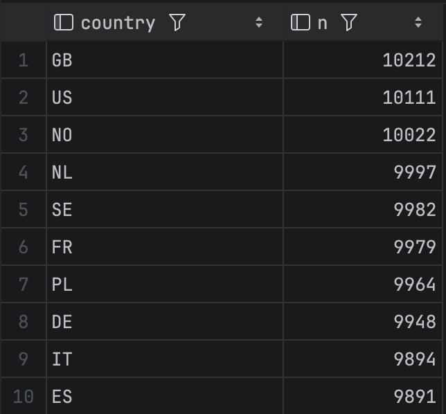

```{=typst}
#pagebreak()
```

```sql
SELECT
    device,
    count(*) AS n
FROM events
GROUP BY device
ORDER BY n DESC;
```

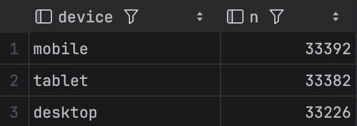

Wśród wszystkich wydarzeń występują eventy 3 typów (`view`, `add_to_cart` oraz `purchase`), dominującą kategorią są zdarzenia typu `view`. Wydarzenia miały miejsce w 10 różnych krajach, z czego większość miała miejsce w Wielkiej Brytanii (`GB`). Wśród urządzeń dominowały telefony komórkowe, a wszystkie eventy dotyczyły jednego z typów urządzeń - `mobile`, `tablet` lub `desktop`.

---

## 3. Aktywność w czasie - 1 pkt

Sprawdź, jak zmienia się liczba zdarzeń w czasie.

- policz liczbę zdarzeń dla kolejnych dni,
- wskaż 5 dni o największej liczbie zdarzeń,
- wskaż 5 dni o najmniejszej liczbie zdarzeń,
- napisz, czy dane wyglądają na równomiernie rozłożone w czasie.

Możesz przygotować osobno: pełne zestawienie dzienne, 5 dni o największej liczbie zdarzeń oraz 5 dni o najmniejszej liczbie zdarzeń.

**Wskazówka:** w PostgreSQL możesz użyć `DATE(event_time)`, a w ClickHouse możesz użyć `toDate(event_time)`.

**W komentarzu:** napisz krótko, czy rozkład wygląda stabilnie, czy są widoczne dni odstające.

```{=typst}
#pagebreak()
```

### Rozwiązanie:

- Pełne zestawienie dzienne:

```sql
--- PostgreSQL
select date(event_time) as day, count(*) as event_count
from events
group by day;
```

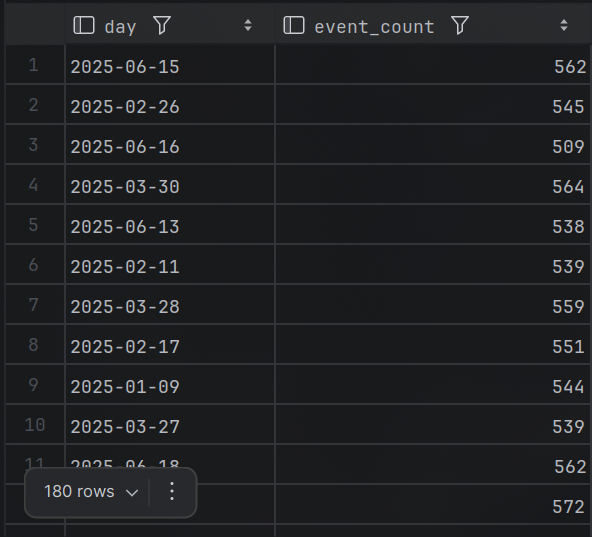

```{=typst}
#pagebreak()
```

```sql
--- ClickHouse
select toDate(event_time) as day, count(*) as event_count
from events
group by day;
```

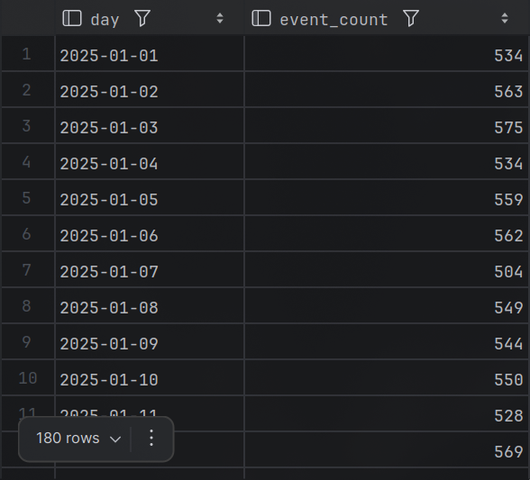

```{=typst}
#pagebreak()
```

- 5 dni o największej liczbie zdarzeń:

```sql
--- PostgreSQL
select date(event_time) as day, count(*) as event_count
from events
group by day
order by event_count desc
limit 5;
```

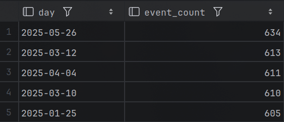

```sql
--- ClickHouse
select toDate(event_time) as day, count(*) as event_count
from events
group by day
order by event_count desc
limit 5;
```

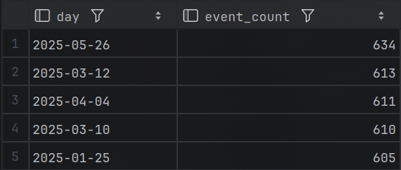

```{=typst}
#pagebreak()
```

- 5 dni o najmniejszej liczbie zdarzeń:

```sql
--- PostgreSQL
select date(event_time) as day, count(*) as event_count
from events
group by day
order by event_count asc
limit 5;
```

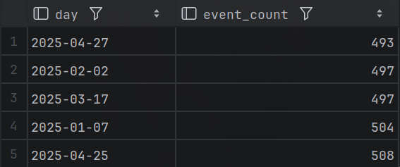

```sql
--- ClickHouse
select toDate(event_time) as day, count(*) as event_count
from events
group by day
order by event_count asc
limit 5;
```

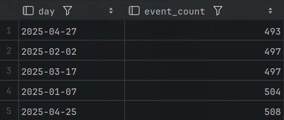

```{=typst}
#pagebreak()
```

- Rozkład liczby zdarzeń w czasie (histogram + średnia):

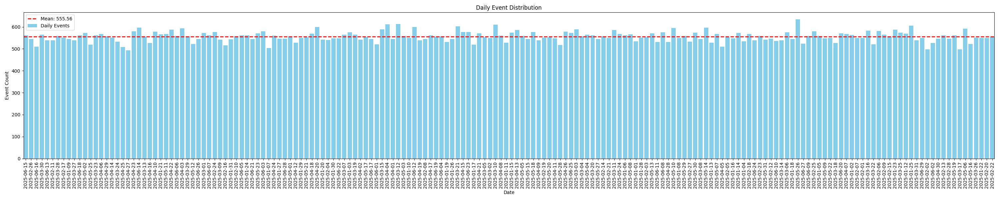

Komentarz:

- rozkład jest raczej stabilny, ale jest kilka dni odstających. Najbardziej odstaje `2025-05-26` (634 zdarzenia do 555 (średnia) ~14%).

---

## 4. Podstawowe KPI sprzedażowe - 2 pkt

Przygotuj podstawowe KPI związane ze zdarzeniami zakupowymi.

- policz liczbę zdarzeń typu purchase,
- policz łączny przychód ze zdarzeń typu purchase,
- policz średnią wartość pojedynczego zakupu,
- policz średnią liczbę sztuk w pojedynczym zakupie,
- policz liczbę sesji, w których wystąpił co najmniej jeden zakup,
- policz udział sesji zakupowych w ogólnej liczbie sesji jako uproszczony współczynnik konwersji.

**Zapytanie startowe:**

```sql
SELECT
    count(*) AS purchases_cnt,
    sum(price * quantity) AS revenue,
    avg(price * quantity) AS avg_order_value,
    avg(quantity) AS avg_quantity
FROM events
WHERE event_type = 'purchase';
```

Drugą część zadania - dotyczącą sesji i konwersji - przygotuj samodzielnie.

**W komentarzu napisz:** czy wyniki w obu bazach są zgodne oraz dlaczego udział sesji zakupowych lepiej opisuje konwersję niż prosty stosunek liczby zdarzeń purchase do liczby zdarzeń view.

```{=typst}
#pagebreak()
```

### Rozwiązanie:

```sql
-- postgres
with t as (
    select count(distinct session_id) as total_sessions
    from events
),
q as (
    select count(distinct session_id) as purchase_sessions
    from events
    where event_type = 'purchase'
)
select
    purchase_sessions,
    (purchase_sessions * 1.0) / total_sessions as conversion
from q, t;
```

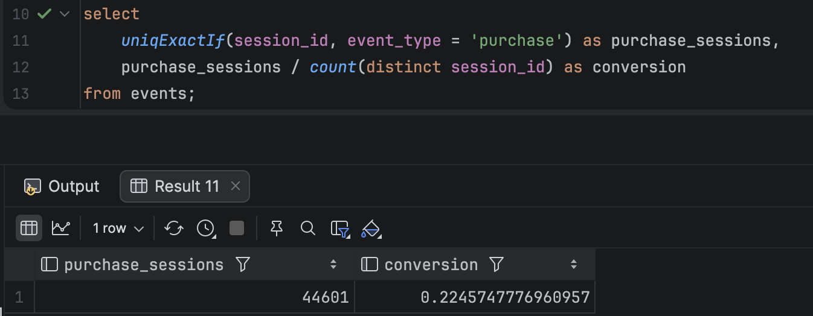

```{=typst}
#pagebreak()
```

```sql
-- clickhouse
select
    uniqExactIf(session_id, event_type = 'purchase') as purchase_sessions,
    purchase_sessions / count(distinct session_id) as conversion
from events;
```

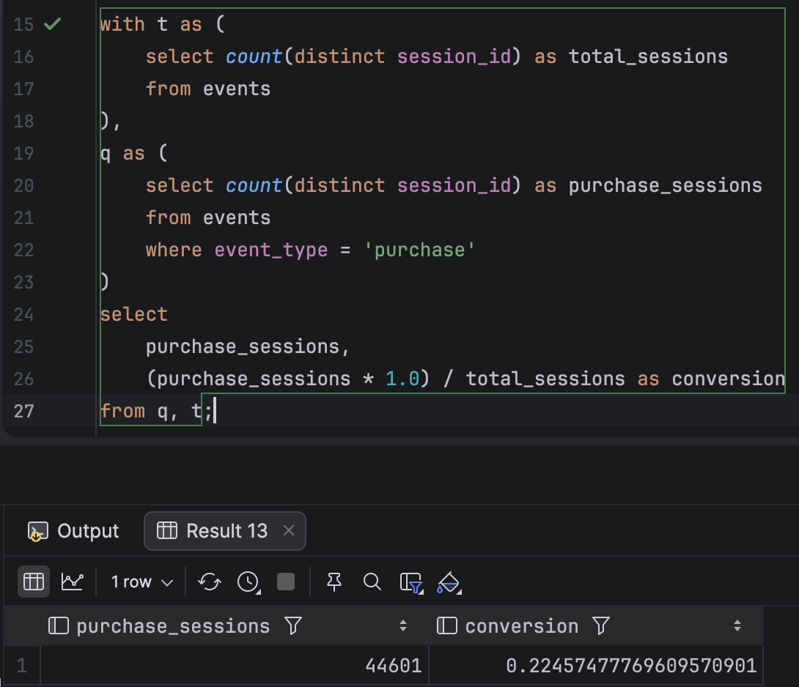

Wyniki z obu zapytań zwróciły identyczne rezultaty (z dokładnością do dokładności numerycznej).

Komentarz:

- udział sesji zakupowych lepiej opisuje konwersję niż prosty stosunek liczby zdarzeń `purchase` do liczby zdarzeń `view`, ponieważ wiele zdarzeń `purchase` oraz `view` mogło wystąpić w trakcie jednej sesji. Konwersja obliczana w taki sposób (jako udział sesji zakupowych) pozwala na bardziej rzetelną ocenę, ponieważ nie bierze pod uwagę zachowań specyficznych dla poszczególnych użytkowników (jeden użytkownik może otwierać bardzo wiele zakładek i kupić tylko jeden przedmiot, a inny użytkownik może otworzyć tylko jeden link i kupić dany przedmiot) - dzięki temu nasza miara konwersji faktycznie odpowiada na pytanie ile razy, gdy ktoś wszedł do naszego sklepu, wizyta zakończyła się sprzedażą.

---

## 5. KPI w przekrojach biznesowych - 1 pkt

Policz przychód dla zdarzeń typu purchase w dwóch wybranych przekrojach:

- według kraju,
- według urządzenia,
- według dnia.

Wybierz dwa z powyższych przekrojów. Dla każdego policz przychód, posortuj wynik malejąco, wskaż najwyższe wartości i krótko je zinterpretuj.

**Zapytanie startowe:**

```sql
SELECT
    country,
    sum(price * quantity) AS revenue
FROM events
WHERE event_type = 'purchase'
GROUP BY country
ORDER BY revenue DESC;
```

Drugie zapytanie przygotuj samodzielnie.

```{=typst}
#pagebreak()
```

### Rozwiązanie

- według urządzenia (dla obu serwerów kod zapytania jest taki sam):

```sql
--- PostgreSQL & ClickHouse
select device,
       sum(price * quantity) as revenue
from events
where event_type = 'purchase'
group by device
order by revenue desc;
```

Wyniki:

- dla przekroju według kraju:
  - ClickHouse:

    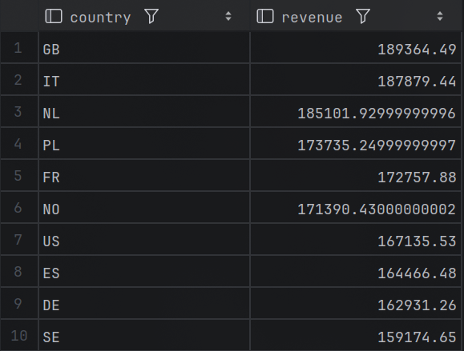

```{=typst}
#pagebreak()
```

- Postgres:

  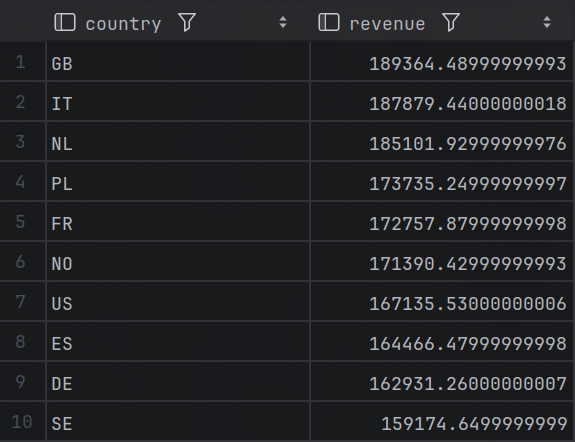

Wyniki są zgodne co do precyzji obliczeń.

```{=typst}
#pagebreak()
```

- dla przekroju według urządzenia:
  - ClickHouse:

    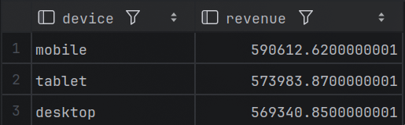

  - Postgres:

    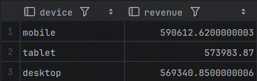

Wyniki są zgodne co do precyzji obliczeń.

Komentarz:

- Największy przychód pochodzi z Wielkiej Brytanii (`country` = 'GB'), co może oznaczać, że jest to główny rynek. Jeśli chodzi o przekrój według urządzenia, to największy przychód pochodzi z urządzeń typu `mobile`, co może sugerować, że większość klientów korzysta z telefonów komórkowych do dokonywania zakupów (raczej popularny trend).

## 6. Użytkownicy o najwyższym przychodzie - 1 pkt

Znajdź użytkowników o najwyższym łącznym przychodzie z zakupów.

Wynik powinien zawierać: user_id, liczbę wszystkich zdarzeń użytkownika, liczbę zdarzeń typu purchase, łączny przychód użytkownika ze zdarzeń typu purchase. Pokaż co najmniej 20 rekordów o najwyższym przychodzie.

**Ważne:** Przychód licz tylko dla zdarzeń typu purchase.

**Wskazówka:** W tym zadaniu przydatne może być warunkowe zliczanie i warunkowe sumowanie.

**Zapytanie startowe do uzupełnienia:**

```sql
SELECT
    user_id,
    count(*) AS all_events,
    ... AS purchase_events,
    ... AS revenue
FROM events
GROUP BY user_id
ORDER BY revenue DESC
LIMIT 20;
```

**W komentarzu napisz:**

- czy użytkownik z najwyższym przychodem ma też największą liczbę wszystkich zdarzeń,
- czy duża aktywność użytkownika zawsze oznacza wysoki przychód,
- jakie wnioski można wyciągnąć z porównania liczby zdarzeń i przychodu.

```{=typst}
#pagebreak()
```

### Rozwiązanie:

```sql
-- postgres
select
    user_id,
    count(*) as all_events,
    count(case when event_type = 'purchase' then 1 end) as purchase_events,
    sum(case when event_type = 'purchase' then quantity * price else 0 end) as revenue
from events
group by user_id
order by revenue desc
limit 20;
```

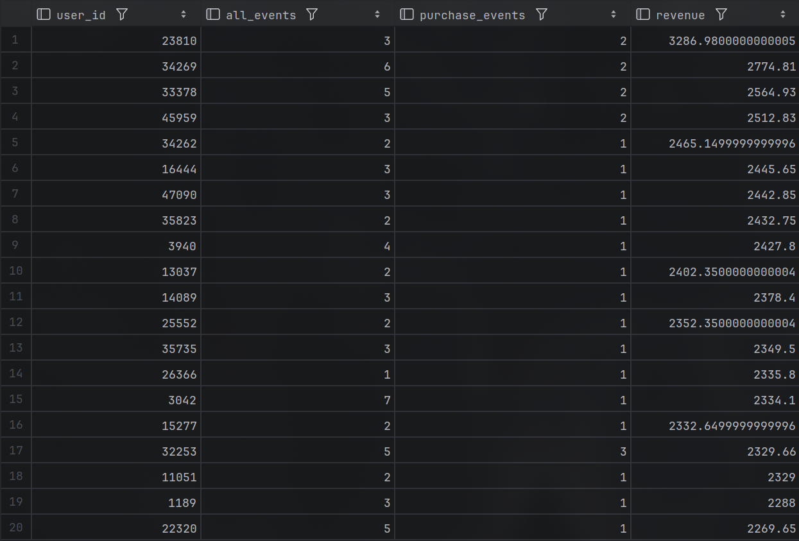

```{=typst}
#pagebreak()
```

```sql
-- clickhouse
select
    user_id,
    count(*) as all_events,
    countIf(event_type = 'purchase') as purchase_events,
    sumIf(price * quantity, event_type = 'purchase') as revenue
from events
group by user_id
order by revenue desc
limit 20;
```

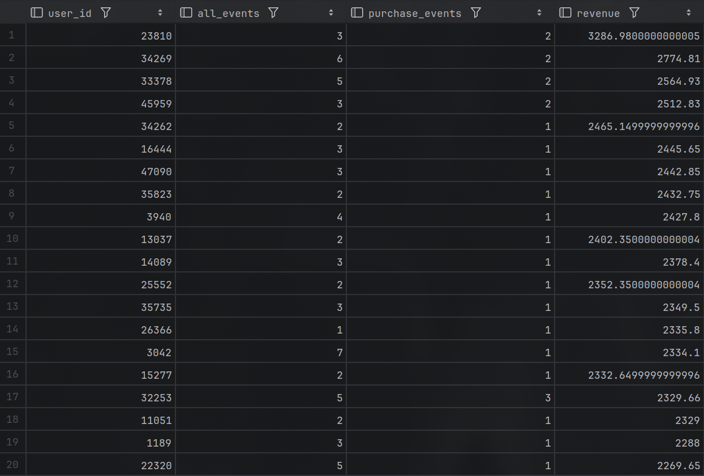

Rezultaty obu zapytań są identyczne (z dokładnością do dokładności numerycznej):

Komentarz:

- użytkownik z najwyższym przychodem nie ma największej liczby wszystkich zdarzeń, nie ma też największej liczby zdarzeń typu `purchase`
- duża aktywność użytkownika pewnie w pewien sposób koreluje z wysokim przychodem, ale nie zawsze jednoznacznie oznacza wysoki przychód (aktywność oraz ilość wydarzeń typu `purchase` nie różni się w jakkolwiek znaczący sposób wśród użytkowników z miejsc 1-200)
- kluczowa dla wyniku jest faktyczna wartość zamówienia, a nie sama częstotliwość interakcji - użytkownik o niższej aktywności może wygenerować większy przychód jeśli kupuje droższe produkty.

---

## 7. Benchmark zapytań w PostgreSQL i ClickHouse - 3 pkt

W tym zadaniu wykonasz prosty benchmark zapytań w PostgreSQL i ClickHouse, aby porównać działanie obu systemów dla zapytań prostszych i bardziej złożonych agregacyjnie. Szczegóły zostały opisane w częściach A, B i C.

### Sposób pomiaru

Dla każdego benchmarkowanego zapytania:

- uruchom zapytanie w PostgreSQL i w ClickHouse,
- wykonaj każde zapytanie 4 razy w każdej bazie,
- pierwszy pomiar pomiń jako rozgrzewkowy,
- zapisz czasy z trzech kolejnych uruchomień,
- podaj średni czas wykonania dla każdej bazy.

Czas odczytaj z klienta SQL, którego używasz na zajęciach.

**Uwaga:** nie benchmarkuj zapytań zwracających bardzo duży wynik bez LIMIT, ponieważ czas prezentacji danych w kliencie SQL może zaburzać porównanie.

### Prezentacja wyników

Wyniki benchmarku przedstaw w zwartej tabeli. Tabela powinna zawierać co najmniej: nazwę zapytania, PostgreSQL - pomiar 1, pomiar 2, pomiar 3, średnia, oraz ClickHouse - pomiar 1, pomiar 2, pomiar 3, średnia.

### Komentarz końcowy

Na końcu napisz 3-5 zdań komentarza, w których odniesiesz się do następujących kwestii:

- czy wyniki liczbowe zapytań były zgodne w obu bazach?
- czy różnice czasu wykonania były małe czy wyraźne?
- przy którym typie zapytania różnica była największa?
- czy po tym ćwiczeniu można postawić wstępny wniosek, że bardziej złożone agregacje są naturalnym zastosowaniem systemu analitycznego takiego jak ClickHouse?

**Uwaga:** nie oczekujemy jeszcze pełnego benchmarku technicznego. Celem zadania jest pierwsze praktyczne porównanie działania prostszych i bardziej złożonych zapytań agregujących w dwóch systemach.

### Część A. Dwa zapytania z wcześniejszych zadań

Wybierz dwa zapytania z wcześniejszych zadań tego laboratorium i wykonaj je w obu bazach danych. Dla każdego zapytania pokaż wynik, napisz, czy wynik liczbowy jest zgodny w PostgreSQL i ClickHouse, oraz zapisz czas wykonania odczytany z klienta SQL.

Wybierz zapytania o różnym poziomie trudności, np. jedno prostsze zapytanie i jedno średnio złożone zapytanie.

```{=typst}
#pagebreak()
```

#### Zapytanie z zadania 4

```sql
-- postgres
with t as (
    select count(distinct session_id) as total_sessions
    from events
),
q as (
    select count(distinct session_id) as purchase_sessions
    from events
    where event_type = 'purchase'
)
select
    purchase_sessions,
    (purchase_sessions * 1.0) / total_sessions as conversion
from q, t;
-- clickhouse
select
    uniqExactIf(session_id, event_type = 'purchase') as purchase_sessions,
    purchase_sessions / count(distinct session_id) as conversion
from events;
```

Zgodnie z wynikami z zadania 4, rezultaty obu zapytań są identyczne (z dokładnością do dokładności numerycznej).

Czasy wykonania zapytania:

|              | Postgres | Clickhouse |
| ------------ | -------- | ---------- |
| Time 1 [ms]  | 647      | 351        |
| Time 2 [ms]  | 645      | 348        |
| Time 3 [ms]  | 649      | 356        |
| Average [ms] | 647      | 351.67     |

Zapytanie w Clickhousie okazało się ponad 1.8 raza szybsze w porównaniu do Postgresa.

#### Zapytanie z zadania 6

```sql
-- postgres
select
    user_id,
    count(*) as all_events,
    count(case when event_type = 'purchase' then 1 end) as purchase_events,
    sum(case when event_type = 'purchase' then quantity * price else 0 end) as revenue
from events
group by user_id
order by revenue desc
limit 20;
-- clickhouse
select
    user_id,
    count(*) as all_events,
    countIf(event_type = 'purchase') as purchase_events,
    sumIf(price * quantity, event_type = 'purchase') as revenue
from events
group by user_id
order by revenue desc
limit 20;
```

Zgodnie z wynikami z zadania 6, rezultaty obu zapytań są identyczne (z dokładnością do dokładności numerycznej).

Czasy wykonania zapytania:

|              | Postgres | Clickhouse |
| ------------ | -------- | ---------- |
| Time 1 [ms]  | 585      | 375        |
| Time 2 [ms]  | 553      | 355        |
| Time 3 [ms]  | 560      | 352        |
| Average [ms] | 566      | 360.67     |

Zapytanie w Clickhousie okazało się ponad 1.5 razy szybsze w porównaniu do Postgresa.

### Część B. Zapytanie benchmarkowe podane przez prowadzącego

Wykonaj w obu bazach poniższe zapytanie agregujące.

**PostgreSQL:**

```sql
SELECT
    DATE(event_time) AS day,
    country,
    device,
    event_type,
    count(*) AS events_cnt,
    count(DISTINCT user_id) AS users_cnt,
    count(DISTINCT session_id) AS sessions_cnt,
    sum(CASE
            WHEN event_type = 'purchase' THEN price * quantity
            ELSE 0
        END) AS revenue
FROM events
GROUP BY
    DATE(event_time),
    country,
    device,
    event_type
ORDER BY revenue DESC
LIMIT 20;
```

**ClickHouse:**

```sql
SELECT
    toDate(event_time) AS day,
    country,
    device,
    event_type,
    count() AS events_cnt,
    count(DISTINCT user_id) AS users_cnt,
    count(DISTINCT session_id) AS sessions_cnt,
    sum(CASE
            WHEN event_type = 'purchase' THEN price * quantity
            ELSE 0
        END) AS revenue
FROM events
GROUP BY
    day,
    country,
    device,
    event_type
ORDER BY revenue DESC
LIMIT 20;
```

Dla tego zapytania pokaż wynik z obu baz, napisz, czy wyniki są zgodne, oraz zapisz czas wykonania w PostgreSQL i ClickHouse.

#### Wyniki:

- Clickhouse:
  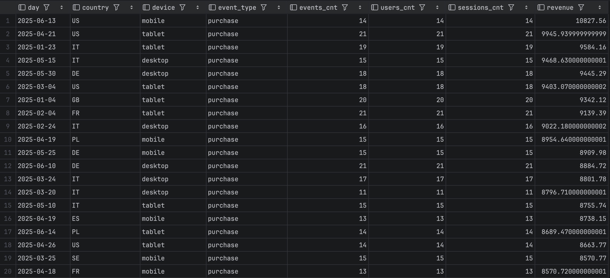

- Postgres:
  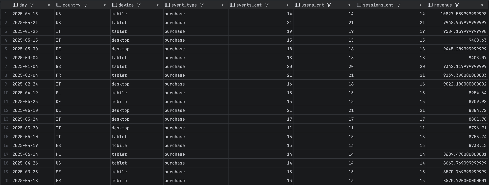

Rezultaty obu zapytań są identyczne (z dokładnością do dokładności numerycznej).

```{=typst}
#pagebreak()
```

Czasy wykonania zapytania:

|              | Postgres | Clickhouse |
| ------------ | -------- | ---------- |
| Time 1 [ms]  | 1568     | 422        |
| Time 2 [ms]  | 1603     | 425        |
| Time 3 [ms]  | 1445     | 391        |
| Average [ms] | 1538.67  | 412.67     |

Średni czas zapytania w bazie Clickhouse jest prawie 4 razy krótszy w porównaniu do analogicznego zapytania w Postgresie.

### Część C. Własne analogiczne zapytanie

Na podstawie zapytania z części B przygotuj jedno własne zapytanie analogiczne, które będzie oparte na tym samym schemacie, ale zmodyfikowane w co najmniej jednym lub dwóch elementach.

Możesz skorzystać z poniższych modyfikacji:

- ograniczyć dane tylko do zdarzeń purchase,
- usunąć jeden wymiar grupowania,
- dodać filtr dla wybranego kraju,
- dodać filtr dla wybranego urządzenia,
- zmienić zestaw liczonych miar,
- ograniczyć analizę do wybranego przedziału czasu.

Własne zapytanie wykonaj w obu bazach danych. Dla tego zapytania pokaż kod, pokaż wynik, napisz, czy wyniki są zgodne, oraz zapisz czas wykonania w PostgreSQL i ClickHouse.

Zapytanie:

- zdarzenia typu `purchase`,
- grupowanie tylko według dnia i kraju,
- filtr dla urządzenia `mobile`,
- analiza dla pierwszych 6 miesięcy 2025 roku
- filtr dla krajów "GB", "US" i "DE".

```sql
--- PostgreSQL
select
    date(event_time) as day,
    country,
    count() as purchase_cnt,
    sum(price * quantity) as total_revenue,
    avg(price * quantity) as avg_order_value
from events
where event_type = 'purchase'
  and device = 'mobile'
  and event_time >= '2025-01-01 00:00:00'
  and event_time < '2025-07-01 00:00:00'
  and country in ('GB', 'US', 'DE')
group by
    day,
    country
order by total_revenue desc
limit 20;
```

```sql
--- ClickHouse
select
    toDate(event_time) as day,
    country,
    count() as purchase_cnt,
    sum(price * quantity) as total_revenue,
    avg(price * quantity) as avg_order_value
from events
where event_type = 'purchase'
  and device = 'mobile'
  and event_time >= '2025-01-01 00:00:00'
  and event_time < '2025-07-01 00:00:00'
  and country in ('GB', 'US', 'DE')
group by
    day,
    country
order by total_revenue desc
limit 20;
```

Wyniki:

- Clickhouse:
  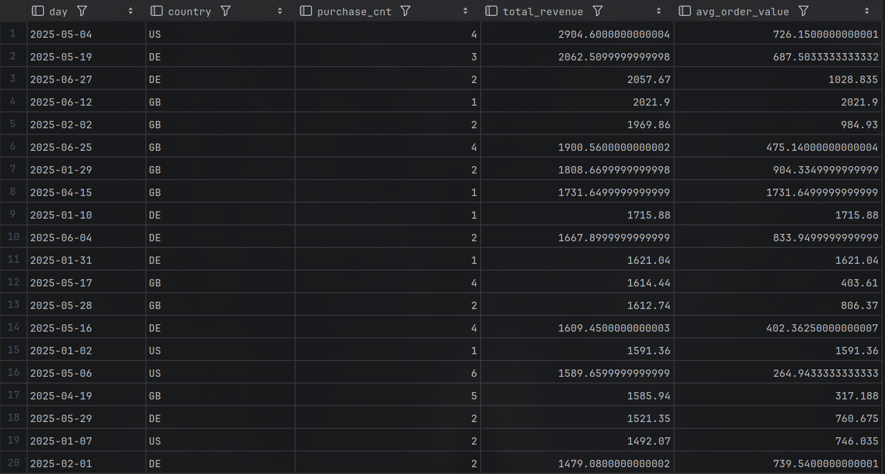

```{=typst}
#pagebreak()
```

- Postgres:

  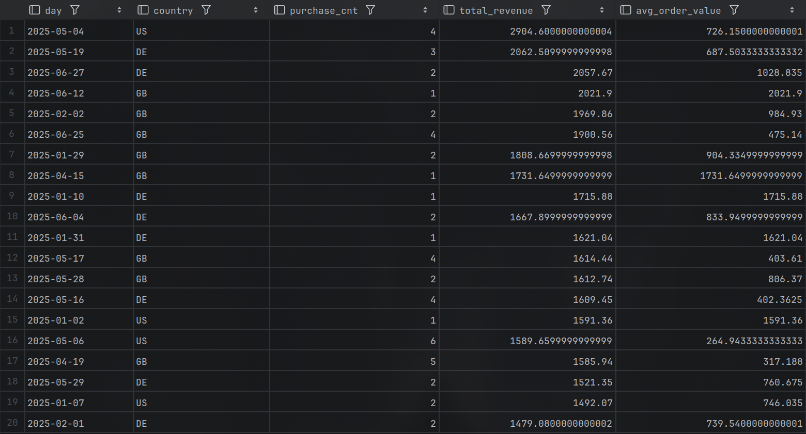

Wyniki są zgodne co do precyzji obliczeń.

|              | Postgres | Clickhouse |
| ------------ | -------- | ---------- |
| Time 1 [ms]  | 447      | 334        |
| Time 2 [ms]  | 452      | 345        |
| Time 3 [ms]  | 445      | 349        |
| Average [ms] | 448      | 342.67     |

Czas wykonania zapytania w Clickhousie jest około 1.3 razy krótszy w porównaniu do Postgresa.

---

## Uwaga końcowa dla studentów

Oceniane będą:

- poprawność logiczna zapytania,
- zgodność wyników między bazami tam, gdzie jest to wymagane,
- umiejętność interpretacji wyniku,
- czytelność i sensowność kodu.

Samo uruchomienie gotowego zapytania bez zrozumienia i bez komentarza nie będzie traktowane jako pełne rozwiązanie.
