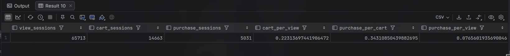
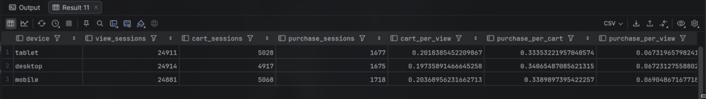
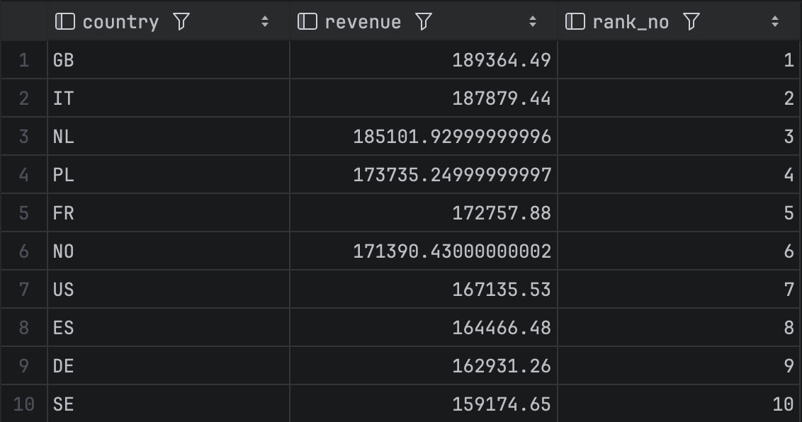
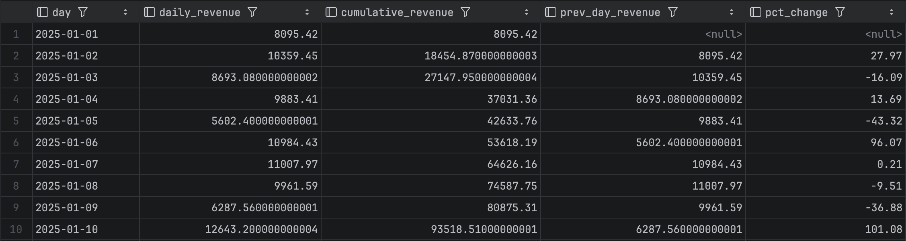
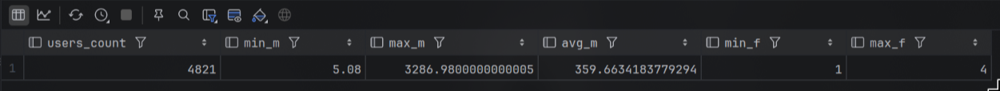
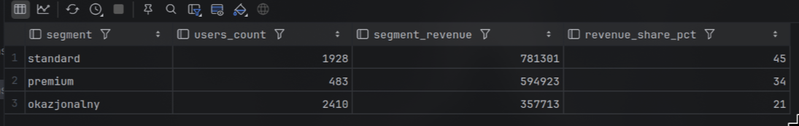

# Kolumnowe bazy danych cz. II

## Zaawansowana analityka i dowód wydajności

**Imię i nazwisko:** ********\*\*********\_\_\_********\*\*********

**Grupa:** ****\*\*****\_****\*\*****

---

## Cel ćwiczenia

Po tym laboratorium będziesz potrafił:

1. zbudować lejek konwersji i zinterpretować odpływ między jego etapami,
2. użyć funkcji okna do rankingu i analizy trendu przychodów w czasie,
3. podzielić użytkowników na segmenty metodą RFM i wyciągnąć z tego wnioski biznesowe,
4. zmierzyć i wyjaśnić różnicę wydajności między ClickHouse a PostgreSQL i powiedzieć, skąd ona wynika.

Laboratorium ma celowo prostą strukturę: **zadania 1–3 to analityka w ClickHouse, zadanie 4 to dowód** eksperyment porównawczy oparty na zapytaniach, które właśnie napisałeś.

---

## Zanim zaczniesz - przeczytaj to uważnie

### Której bazy używamy i kiedy

| Zadanie                | Baza danych                     |
| ---------------------- | ------------------------------- |
| 0. Gotowość            | obie — sprawdzasz środowisko    |
| 1. Lejek konwersji     | `ClickHouse`                    |
| 2. Funkcje okna        | Jedna baza do wyboru            |
| 3. Segmentacja RFM     | Do wyboru ale ClickHouse lepiej |
| 4. Benchmark i wnioski | obie — porównanie obowiązkowe   |

W tym laboratorium ClickHouse jest bazą wiodącą. PostgreSQL pojawia się w zadaniu 4 jako punkt odniesienia — po to, żeby różnicę wydajności zmierzyć, nie zakładać.

### Jak korzystać ze ściągi

Do zajęć dołączona jest ściąga `sql_postgresql_clickhouse_sciaga.pdf`. Zawiera składnię i podpowiedzi do przykładów dla każdego zadania. Korzystaj z niej jak z dokumentacji - żeby sprawdzić składnię funkcji, nie żeby skopiować rozwiązanie. Numer sekcji ściągi podany jest przy każdym zadaniu.

**Oceniane są interpretacja i komentarz.** Sam fakt uruchomienia zapytania nie jest rozwiązaniem.

### Sprawozdanie

Oddaj jako PDF albo Markdown. Dla każdego zadania dołącz:

- kod zapytania,
- wynik - tabela lub zrzut ekranu,
- komentarz - pełnymi zdaniami, nie listą słów.

**Termin oddania:** do końca dnia poprzedzającego kolejne zajęcia.

**Punktacja:** razem 10 pkt.

---

## Założenie startowe

Środowisko Docker działa, tabela events jest dostępna w obu bazach. Jeżeli tabela nie jest widoczna w bieżącym kontekście, użyj pełnej nazwy:

- `public.events` w PostgreSQL,
- `ds_lab.events` w ClickHouse.

---

## 0. Gotowość do zajęć — warunek konieczny (0 pkt)

Pokaż, że środowisko działa: kontenery `postgres` i `clickhouse` mają status `Up`, tabela `events` jest widoczna w obu bazach, połączenie z klienta SQL działa.

**Brak gotowości środowiska** uniemożliwia wykonanie dalszych zadań.

---

## 1. Lejek konwersji — 2 pkt

### Dlaczego to robimy

W e-commerce każda sesja przechodzi przez etapy: wyświetlenie → koszyk → zakup. Na każdym etapie część sesji odpada. **Lejek konwersji** mierzy, ile sesji przechodzi przez każdy etap i gdzie odpływ jest największy - to fundamentalny wskaźnik analityki e-commerce. Przy okazji zobaczysz, jak ClickHouse upraszcza agregaty warunkowe dzięki `countIf` zamiast klasycznego `CASE WHEN`. (zobacz odpowiednie sekcje w ściądze)

### Wykonaj w ClickHouse

Dla każdej sesji ustal, czy wystąpiło w niej zdarzenie `view`, `cart` i `purchase`. Na tej podstawie policz dla całego zbioru:

- liczbę sesji z view,
- liczbę sesji z cart,
- liczbę sesji z purchase,
- wskaźnik cart / view — jaka część sesji z view dotarła do cart,
- wskaźnik purchase / cart — jaka część sesji z cart zakończyła się zakupem,
- wskaźnik purchase / view — ogólna konwersja od pierwszego kontaktu do zakupu.

Następnie powtórz analizę w przekroju `device`.

### Zapytanie startowe

```sql
-- Krok 1: flagi na poziomie sesji
WITH session_flags AS (
    SELECT
        session_id,
        countIf(event_type = 'view')     > 0 AS has_view,
        countIf(event_type = 'add_to_cart')     > 0 AS has_cart,
        countIf(event_type = 'purchase') > 0 AS has_purchase
    FROM events
    GROUP BY session_id
)
-- Krok 2: agregacja do poziomu całego zbioru
SELECT
    countIf(has_view)     AS view_sessions,
    countIf(has_cart)     AS cart_sessions,
    countIf(has_purchase) AS purchase_sessions,
    countIf(has_cart)     / nullIf(countIf(has_view), 0)     AS cart_per_view,
    countIf(has_purchase) / nullIf(countIf(has_cart), 0)     AS purchase_per_cart,
    countIf(has_purchase) / nullIf(countIf(has_view), 0)     AS purchase_per_view
FROM session_flags;
```

Zbuduj analogicznie wersję z `GROUP BY device`.

### W komentarzu napisz

- Na którym etapie lejka odpływ jest największy i co to oznacza dla biznesu — gdzie sklep traci klientów?
- Czy lejek różni się między urządzeniami? Jeśli tak, co może być tego przyczyną?
- `countIf` zastępuje klasyczny wzorzec `MAX(CASE WHEN ... THEN 1 ELSE 0 END)` ze standardowego SQL. W 2–3 zdaniach wyjaśnij, na czym polega różnica w podejściu i dlaczego wersja ClickHouse jest krótsza.

### Rozwiązanie

Grupowanie po `device`:`

```sql
WITH session_flags AS (SELECT session_id,
                              device,
                              countIf(event_type = 'view') > 0        AS has_view,
                              countIf(event_type = 'add_to_cart') > 0 AS has_cart,
                              countIf(event_type = 'purchase') > 0    AS has_purchase
                       FROM events
                       GROUP BY device, session_id)

SELECT device,
       countIf(has_view)                                    AS view_sessions,
       countIf(has_cart)                                    AS cart_sessions,
       countIf(has_purchase)                                AS purchase_sessions,
       countIf(has_cart) / nullIf(countIf(has_view), 0)     AS cart_per_view,
       countIf(has_purchase) / nullIf(countIf(has_cart), 0) AS purchase_per_cart,
       countIf(has_purchase) / nullIf(countIf(has_view), 0) AS purchase_per_view
FROM session_flags
GROUP BY device
```

Wyniki zapytań:

- Lejek ogólny:



- Lejek w przekroju urządzeń:



Komentarz:

- największy procentowo odpływ jest między etapami view a cart, tylko 7% klientów, którzy zobaczyli produkt, dodali go do koszyka. To oznacza, że sklep traci większość potencjalnych klientów na etapie zainteresowania produktem - być może strona produktu nie jest wystarczająco przekonująca, brakuje informacji, zdjęć, recenzji, albo ceny są zbyt wysokie.
- lejek nieznacznie różni się między urządzeniami, ale ogólnie jest taki sam. Na desktopie jest najmniej sesji cart (4917 vs 5028, 5068). Na mobile jest najwięcej sesji purchase (1718 vs 1677, 1675).
- `countIf` to funkcja agregująca, która zlicza tylko te wiersze, które spełniają warunek. W klasycznym SQL musielibyśmy użyć `CASE WHEN` do stworzenia flagi 0/1, a następnie zliczyć sumę tych flag. `countIf` pozwala zrobić to bezpośrednio, co skraca i upraszcza zapytanie.

---

## 2. Funkcje okna: rankingi i trend przychodów 2 pkt

### Dlaczego to robimy

Zwykłe `GROUP BY` zwija dane - dostajesz jeden wiersz na grupę. **Funkcje okna** liczą wartości w kontekście innych wierszy bez zwijania wyników: ranking krajów, suma narastająca, zmiana dzień do dnia bez zagnieżdżonych podzapytań.

### Wybierz jedną bazę i napisz w niej obie części

Zaznacz w sprawozdaniu, którą bazę wybrałeś.

### Część A - Ranking krajów

Policz łączny przychód z zakupów dla każdego kraju i nadaj krajom ranking według przychodu. Użyj `RANK()` albo `DENSE_RANK()`.

Wynik powinien zawierać kolumny: country, revenue, rank_no.

**Wskazówka:** funkcję okna możesz zastosować bezpośrednio w SELECT obok agregacji - nie musisz pisać podzapytania ani CTE.

### Część B - Narastający przychód i zmiana dzień do dnia

Policz dzienny przychód ze zdarzeń `purchase`. Następnie w tym samym zapytaniu oblicz:

- sumę narastającą - cumulative_revenue,
- przychód z poprzedniego dnia - prev_day_revenue,
- zmianę procentową względem poprzedniego dnia - pct_change.

Wynik powinien zawierać kolumny: day, daily_revenue, cumulative_revenue, prev_day_revenue, pct_change.

### Wskazówki składniowe

| Element            | PostgreSQL                      | ClickHouse                                                                    |
| ------------------ | ------------------------------- | ----------------------------------------------------------------------------- |
| Data               | `DATE(event_time)`              | `toDate(event_time)`                                                          |
| Suma narastająca   | `SUM(x) OVER (ORDER BY day)`    | `sum(x) OVER (ORDER BY day ROWS BETWEEN UNBOUNDED PRECEDING AND CURRENT ROW)` |
| Poprzednia wartość | `LAG(x, 1) OVER (ORDER BY day)` | `lagInFrame(x, 1) OVER (ORDER BY day ROWS ...)`                               |

**Wskazówka:** zbuduj zapytanie w dwóch krokach - najpierw CTE z dziennym przychodem (GROUP BY day), a dopiero do niego dołącz funkcje okna.

### W komentarzu napisz

- Czy suma narastająca rośnie równomiernie czy skokowo?
- Czy widać konkretny dzień z wyraźną zmianą - ile wyniósł wzrost lub spadek w procentach?
- Co było dla Ciebie nowe w funkcjach okna i co sprawiło największą trudność?

### Rozwiązanie

W rozwiązaniu wykorzystana została baza Clickhouse.

#### Zadanie 2a)

**Zapytanie:**

```sql
select
    country,
    sum(price * quantity) as revenue,
    rank() over (order by sum(price * quantity) desc ) as rank_no
from events
where event_type = 'purchase'
group by country
order by rank_no;
```

**Wyniki:**



**Komentarz:**

- krajem o najwyższym łącznym przychodzie okazała się Wielka Brytania, natomiast krajem o najniższym łącznym przychodzie Szwecja.
- w tym konkretnym zastosowaniu nie ma znaczenia czy wykorzystaliśmy `rank()`/`denserank()`, ponieważ nie występują remisy.

#### Zadanie 2b)

**Zapytanie:**

```sql
with daily as (
    select toDate(event_time) AS day, sum(price * quantity) AS daily_revenue
    from events
    where event_type = 'purchase'
    group by day
)
select day, daily_revenue,
    sum(daily_revenue) over (order by day rows between unbounded preceding and current row) as cumulative_revenue,
    lagInFrame(toNullable(daily_revenue), 1, null) over (order by day rows between unbounded preceding and current row) as prev_day_revenue,
    round((daily_revenue - prev_day_revenue) / prev_day_revenue * 100, 2) as pct_change
from daily;
```

**Wyniki:**



**Komentarz:**

- suma narastająca rośnie mniej więcej równomiernie - choć obserwujemy pewne odstające dni, w których przychód wynosi np. ~4 tysiące lub ~20 tysięcy, co generalny trend jest raczej stabilny (w większości dni wartości rosną o ~8-12 tysięcy). Co istotne, nawet po wystąpieniu przychodu dziennego w wysokości ~20k, wartości przychodu w kolejnych dniach wracają do normy.
- obswerwujemy kilka dni z wyraźną zmianą, przykładowo `15.01.2025` nastąpił wzrost dobowy o 168%, `19.03.2025` nastąpił wzrost o ~148%, a `05.06.2025` nastąpił spadek o ~65%.
- funckje okna były nam już znane wcześniej, ponieważ były one już przerabiane na poprzednich laboratoriach. Z tego względu nie sprawiły one większym problemów.

---

## 3. Segmentacja użytkowników - metoda RFM - 2 pkt

### Dlaczego to robimy

**RFM** to prosta i skuteczna metoda segmentacji klientów stosowana w marketingu od dekad:

- **R**ecency - jak dawno użytkownik ostatnio kupił?
- **F**requency - ile razy kupił?
- **M**onetary - ile łącznie wydał?

Na tej podstawie dzielisz klientów na segmenty: najlepszych nagradzasz, uśpionych reaktywujesz, nowych zachęcasz do kolejnego zakupu.

### Wybierz jedną bazę i wykonaj zadanie w niej

Zaznacz w sprawozdaniu, którą bazę wybrałeś.

**Użyta baza: PostgreSQL**

### Krok 1 — oblicz R, F, M dla każdego użytkownika

```sql
-- Wersja PostgreSQL
-- Dla ClickHouse: zamień DATE_PART na dateDiff('day', ...)
-- patrz ściąga
WITH ref AS (
    SELECT MAX(event_time) AS ref_time
    FROM events
),
purchases AS (
    SELECT
        user_id,
        COUNT(*)              AS frequency,
        SUM(price * quantity) AS monetary,
        MAX(event_time)       AS last_purchase_time
    FROM events
    WHERE event_type = 'purchase'
    GROUP BY user_id
)
SELECT
    p.user_id,
    DATE_PART('day', ref.ref_time - p.last_purchase_time) AS recency,
    p.frequency,
    p.monetary
FROM purchases p
CROSS JOIN ref
ORDER BY monetary DESC;
```



Zanim przejdziesz dalej — sprawdź zakres wartości, żeby świadomie dobrać progi:

```sql
-- Poznaj rozkład danych przed doborem progów
WITH purchases AS (
    SELECT
        user_id,
        COUNT(*)              AS frequency,
        SUM(price * quantity) AS monetary
    FROM events
    WHERE event_type = 'purchase'
    GROUP BY user_id
)
SELECT
    COUNT(*)        AS users_count,
    MIN(monetary)   AS min_m,
    MAX(monetary)   AS max_m,
    AVG(monetary)   AS avg_m,
    MIN(frequency)  AS min_f,
    MAX(frequency)  AS max_f
FROM purchases;
```


### Krok 2 — podział użytkowników na segmenty

Na podstawie wyników z kroku 1 zbuduj trzy segmenty według kolumny `monetary`. Progi dobierz samodzielnie na podstawie rozkładu danych z powyższego kroku.

```sql
-- Przykładowy fragment segmentacji
-- Dostosuj progi do swoich danych
CASE
    WHEN monetary >= <twój_próg_wysoki>  THEN 'premium'
    WHEN monetary >= <twój_próg_średni>  THEN 'standard'
    ELSE                                      'okazjonalny'
END AS segment
```

Dla każdego segmentu policz:

- liczbę użytkowników,
- łączny przychód segmentu,
- udział procentowy w całkowitym przychodzie wszystkich użytkowników.

### W komentarzu napisz

- Jak dobrałeś progi i dlaczego - co konkretnie w danych na to wskazało?
- Czy mała grupa użytkowników generuje dużą część przychodu - jaki procent użytkowników i jaki procent przychodu?
- Czy widzisz coś zbliżonego do zasady Pareto?
- Co wyniki mówią o lojalności klientów tego sklepu?

#### Wyniki:

Segmentacja z procentowym udziałem w przychodzie:

```sql

WITH user_rfm AS (SELECT user_id,
                         COUNT(*)              AS frequency,
                         SUM(price * quantity) AS monetary,
                         MAX(event_time)       AS last_purchase_time
                  FROM events
                  WHERE event_type = 'purchase'
                  GROUP BY user_id),
     segmentation AS (SELECT user_id,
                             monetary,
                             CASE
                                 WHEN percent_rank() OVER (ORDER BY monetary) >= 0.90 THEN 'premium'
                                 WHEN percent_rank() OVER (ORDER BY monetary) >= 0.50 THEN 'standard'
                                 ELSE 'okazjonalny'
                                 END AS segment
                      FROM user_rfm),
     totals AS (SELECT SUM(monetary) AS total_revenue
                FROM user_rfm)
SELECT s.segment,
       COUNT(*)                                                            AS users_count,
       ROUND(SUM(s.monetary))                                              AS segment_revenue,
       ROUND(SUM(s.monetary) * 100.0 / (SELECT total_revenue FROM totals)) AS revenue_share_pct
FROM segmentation s
GROUP BY s.segment
ORDER BY segment_revenue DESC;
```



Komentarz:

- progi do segmentów zostały dobrane na podstawie percentyla - 90% dla premium, 50% dla standard. To pozwala na dynamiczny podział bez konieczności ręcznego ustalania progów kwotowych
- mała grupa użytkowników generuje dużą część przychodu - 10% użytkowników (segment premium) generuje 34% przychodu, podczas gdy 40% użytkowników (segment standard) generuje 45% przychodu, a pozostałe 50% użytkowników (segment okazjonalny) generuje 21% przychodu.
- nie ma ściśle zasady Pareto 80/20, jest to bardziej rozmyte, ale widać, że niewielka grupa użytkowników (premium) generuje znaczący procent przychodu.
- klienci sklepu raczej nie są lojalni - większość należy do segmentu okazjonalnego (50%), a tylko niewielka część to klienci premium. Sklep powinien skupić się na strategiach retencji i zwiększania wartości klientów standardowych, aby przesunąć ich do segmentu premium.

---

## 4. Benchmark i wnioski końcowe - 4 pkt

### Dlaczego to robimy

Przez całe laboratorium pisałeś zapytania analityczne. Teraz zmierzysz, jak szybko obie bazy te zapytania wykonują - i odpowiesz na pytanie będące sednem kursu: **kiedy i dlaczego ClickHouse wygrywa z PostgreSQL?** To eksperyment: hipoteza, pomiar, wynik, interpretacja.

### Zasady pomiaru

Dla każdego zapytania w każdej bazie:

- uruchom zapytanie 4 razy,
- **pierwszy wynik odrzuć** - jest rozgrzewkowy,
- zapisz 3 kolejne czasy,
- oblicz średnią.

📣 **ClickHouse cache - krytyczne:** przed każdą serią pomiarów uruchom `SET use_query_cache = 0`. Bez tego kolejne wykonania identycznego zapytania mogą zwrócić wynik z pamięci podręcznej zamiast policzyć go od nowa — czasy będą sztucznie niskie i nieporównywalne.

### Trzy zapytania do zmierzenia

Użyj zapytań, które już napisałeś w zadaniach 1–3. Nie pisz nowych, benchmark ma sens tylko wtedy, gdy mierzysz coś, co już rozumiesz.

**B1 - proste** - proste zapytanie agregujące z jednym GROUP BY, np. przychód per kraj albo liczba zdarzeń per dzień – **może to być zadanie z wcześniejszych laboratoriów**

**B2 - średnie** - zapytanie z lejkiem konwersji z zadania 1

**B3 - złożone** - zapytanie z funkcją okna z zadania 2 lub segmentacja RFM z zadania 3.

**Uwaga:** jeśli zadania 2 lub 3 pisałeś tylko w ClickHouse, dostosuj zapytanie B3 do PostgreSQL przed pomiarem. Różnice składniowe znajdziesz w ściądze. To jest celowe zobaczysz, że logika jest taka sama, zmienia się tylko dialekt.

### Tabela wyników

Wypełnij poniższą tabelę. Czasy podaj w milisekundach.

| Zapytanie    | Charakt. | PG p.1 | PG p.2 | PG p.3 | PG śr. | CH p.1 | CH p.2 | CH p.3 | CH śr. |
| ------------ | -------- | ------ | ------ | ------ | ------ | ------ | ------ | ------ | ------ |
| B1 — proste  |          |        |        |        |        |        |        |        |        |
| B2 — średnie |          |        |        |        |        |        |        |        |        |
| B3 — złożone |          |        |        |        |        |        |        |        |        |

W kolumnie „Charakterystyka" wpisz jednym zdaniem, co zapytanie robi: ile kolumn czyta czy używa `GROUP BY`, `COUNT(DISTINCT)`, funkcji okna, CTE.

### Analiza planu wykonania

Dla zapytania **B1** i **B3** uruchom:

```sql
-- PostgreSQL — wykonuje zapytanie i pokazuje realne czasy
EXPLAIN ANALYZE <zapytanie>;

-- ClickHouse — pokazuje plan bez wykonania
EXPLAIN <zapytanie>;
```

Nie jest wymagana pełna analiza techniczna. Napisz po **2–3 zdania** dla każdego z czterech planów (B1 w PG, B1 w CH, B3 w PG, B3 w CH):

- gdzie w planie widać agregację i sortowanie,
- czy plan B3 jest wyraźnie bardziej rozbudowany niż B1,
- czym plan ClickHouse różni się od planu PostgreSQL - na co zwróciłeś uwagę.

### Refleksja końcowa – obowiązkowa

Na podstawie pomiarów i planów napisz **5–8 zdań** odpowiadając na poniższe pytania. To jest najważniejszy element całego laboratorium.

- Czy różnica czasu między bazami rosła wraz ze złożonością zapytania?
- Przy którym zapytaniu przewaga ClickHouse była największa i jak to tłumaczysz?
- Co plany wykonania mówią o tym, dlaczego ClickHouse jest szybszy dla tego rodzaju zapytań?
- Gdybyś był architektem systemu danych w firmie e-commerce obsługującej miliony zdarzeń dziennie - dla jakich zadań wybrałbyś ClickHouse, a dla jakich PostgreSQL? Uzasadnij konkretnie.

**Refleksja jest oceniana jako osobny punkt (1 pkt).** Oczekujemy własnego rozumowania opartego na zmierzonych danych - nie powtórzenia treści instrukcji.

---

## Zadanie dodatkowe — dla chętnych (bez dodatkowych punktów)

Jeżeli skończyłeś wcześniej, wybierz jedną z poniższych opcji.

**Opcja A — agregacja tygodniowa** - przepisz zapytanie z zadania 2 tak, aby grupowało dane tygodniowo. W ClickHouse użyj toStartOfWeek, w PostgreSQL DATE_TRUNC('week', ...). Czy wyniki są identyczne? Czy jest różnica w składni?

**Opcja B — uniq vs uniqExact** - w ClickHouse policz liczbę unikalnych użytkowników per dzień używając najpierw uniqExact, potem uniq. Zmierz czas obu wersji. O ile uniq jest szybsze i jak duży jest błąd przybliżenia? Kiedy w prawdziwym projekcie zaakceptowałbyś wynik przybliżony?

**Opcja C — własne pytanie analityczne** - zadaj sobie pytanie dotyczące tabeli events, którego jeszcze nie badałeś, i odpowiedz na nie zapytaniem SQL. Napisz, skąd wziął się pomysł, jak podszedłeś do problemu i co odkryłeś.

---

## Co jest oceniane

| Element                                                                     | Punkty |
| --------------------------------------------------------------------------- | ------ |
| Zadanie 1 — lejek konwersji w ClickHouse + komentarz z wyjaśnieniem countIf | 2      |
| Zadanie 2 — funkcje okna: ranking i trend z LAG                             | 2      |
| Zadanie 3 — segmentacja RFM z własnym doborem progów                        | 2      |
| Zadanie 4 — pomiary benchmarkowe z wypełnioną tabelą                        | 1      |
| Zadanie 4 — analiza planów EXPLAIN                                          | 1      |
| Zadanie 4 — refleksja końcowa                                               | 1      |
| Jakość komentarzy i interpretacji we wszystkich zadaniach                   | 1      |
| **Razem**                                                                   | **10** |

Napisanie działającego kodu to warunek konieczny, nie wystarczający. Jeżeli uruchomiłeś zapytanie i dostałeś wynik, ale nie rozumiesz, co z niego wynika dla biznesu, oddałeś połowę zadania.
