# Laboratorium – dokumentowe bazy danych: Couchbase

**Temat:** Couchbase, dokumenty JSON, indeksy, `JOIN`, `UNNEST` i analiza danych Northwind

**Baza:** Couchbase Community uruchomiony w Dockerze

**Bucket:** `northwind`

**Scope:** `_default`

**Główne kolekcje:** `orders`, `orderdetails`, `customers`, `products`, `orders_nested`

**Imię i nazwisko:** Marek Małek, Mateusz Lampert

**Grupa:** 4, piątek 15:00-16:30

---

## Cel ćwiczenia

Po wykonaniu laboratorium student powinien umieć:

1. uruchomić i zweryfikować środowisko Couchbase,
1. poruszać się po panelu Couchbase i korzystać z Query Workbench,
1. rozumieć strukturę `bucket → scope → collection`,
1. wykonać podstawowe zapytania SQL++ / N1QL na dokumentach JSON,
1. wyjaśnić, dlaczego Couchbase wymaga indeksów do wykonywania zapytań,
1. odróżnić `primary index` od indeksu celowego,
1. wykonać `JOIN` między kolekcjami dokumentów,
1. porównać model niezagnieżdżony z modelem zagnieżdżonym,
1. użyć `UNNEST` do rozbijania tablicy zagnieżdżonej w dokumencie,
1. wykorzystać `EXPLAIN` do podstawowej interpretacji planu zapytania.

---

## Ważne informacje

W tym laboratorium pracujemy na danych Northwind załadowanych do Couchbase.

Dane są dostępne w dwóch wariantach modelowania:

### Model niezagnieżdżony

Dane są podzielone na osobne kolekcje:

- `orders` – zamówienia,
- `orderdetails` – pozycje zamówień,
- `customers` – klienci,
- `products` – produkty.

W tym wariancie, aby połączyć zamówienia z pozycjami zamówień, używamy `JOIN`.

### Model zagnieżdżony

Dodatkowo przygotowana jest kolekcja:

- `orders_nested`.

W tej kolekcji jeden dokument odpowiada jednemu zamówieniu, a pozycje zamówienia są zapisane wewnątrz dokumentu w tablicy `items`. W tym wariancie do rozbicia pozycji zamówienia używamy `UNNEST`.

---

## Jak korzystać ze ściągi

Do laboratorium dołączona jest ściąga `Couchbase_SQLPP_sciaga.md`. Korzystaj z niej jak z dokumentacji pomocniczej: sprawdzaj składnię `JOIN`, `UNNEST`, `IFMISSINGORNULL`, `CREATE INDEX` i `EXPLAIN`, ale nie kopiuj bezrefleksyjnie gotowych rozwiązań. Oceniane są również komentarze i interpretacja.

---

## Sprawozdanie

Oddawane sprawozdanie powinno zawierać:

- kod zapytań,
- wyniki zapytań jako tabele albo zrzuty ekranu,
- krótkie komentarze interpretacyjne,
- odpowiedzi na pytania wskazane w zadaniach.

**Format sprawozdania:** PDF albo Markdown.

**Kod SQL++ / N1QL formatuj jako bloki kodu.**

**Nie oddawaj samych zrzutów ekranu bez komentarza.**

---

## Punktacja

| Zadanie   | Temat                                                     | Punkty |
| --------- | --------------------------------------------------------- | ------ |
| 0         | Gotowość środowiska                                       | 0      |
| 1         | Pierwsze poznanie Couchbase i danych                      | 1      |
| 2         | Indeksy: brak indeksu, primary index, secondary index     | 2      |
| 3         | `JOIN` na kolekcjach dokumentów                           | 2      |
| 4         | Model niezagnieżdżony vs zagnieżdżony: `JOIN` vs `UNNEST` | 2      |
| 5         | Agregacja biznesowa                                       | 1      |
| 6         | `EXPLAIN` i refleksja końcowa                             | 2      |
| **Razem** |                                                           | **10** |

---

## 0. Gotowość środowiska – 0 pkt

To zadanie nie jest punktowane, ale jest warunkiem rozpoczęcia pracy.

### Wykonaj

1. Uruchom środowisko:

```bash
docker compose --profile init up -d
```

2. Sprawdź, czy działają kontenery:

```bash
docker ps
```

3. Wejdź do panelu Couchbase:

```text
http://localhost:8091
```

4. Zaloguj się:

```text
Login: student
Hasło: student
```

5. Sprawdź, czy widzisz bucket:

```text
northwind
```

6. Wejdź do Query Workbench i uruchom:

```sql
SELECT 1 AS test;
```

### Do sprawozdania

Nie trzeba dołączać pełnych logów. Wystarczy jedno zdanie:

> Środowisko Couchbase zostało uruchomione, logowanie działa, bucket `northwind` jest widoczny, a Query Workbench wykonuje zapytania.

---

## 1. Pierwsze poznanie Couchbase i danych – 1 pkt

### Cel

Poznaj podstawową strukturę danych w Couchbase i sprawdź, jakie kolekcje są dostępne.

### Wykonaj

1. W panelu Couchbase za pomocą zakładek w menu bocznym np. 'Buckets', 'Documents', 'Query' zbadaj strukturę:

```text
bucket → scope → collection
```

2. W Query Workbench policz liczbę dokumentów w kolekcjach:

- `orders`,
- `orderdetails`,
- `customers`,
- `products`,
- `orders_nested`.

W poprawnie zainicjalizowanym środowisku powinieneś otrzymać orientacyjnie:

| Kolekcja        | Liczba dokumentów |
| --------------- | ----------------- |
| `orders`        | 83?               |
| `orderdetails`  | 215?              |
| `customers`     | 9?                |
| `products`      | 7?                |
| `orders_nested` | 83?               |

3. Podejrzyj kilka dokumentów z kolekcji `orders`.
1. Podejrzyj jeden dokument z kolekcji `orders_nested`.

### Wskazówki

Przykład zapytania liczącego dokumenty:

```sql
SELECT COUNT(1) AS orders_count
FROM `northwind`._default.orders
WHERE OrderID IS NOT MISSING;
```

Przykład podejrzenia dokumentu:

```sql
SELECT o
FROM `northwind`._default.orders AS o
WHERE o.OrderID IS NOT MISSING
LIMIT 3;
```

### W komentarzu napisz

- Co oznaczają pojęcia `bucket`, `scope` i `collection`?
- Ile dokumentów znajduje się w kolekcjach `orders`, `orderdetails`, `customers`, `products` i `orders_nested`?
- Czym różni się dokument z kolekcji `orders` od dokumentu z kolekcji `orders_nested`?

**Rozwiązanie:**

> Co oznaczają pojęcia bucket, scope i collection?

**Bucket** - najwyższy poziom w hierarchii organizacji danych, jest to odpowiednik całej bazy danych. W ramach `bucketu` może istnieć wiele różnych `scope`.

**Scope** - pośredni poziom grupowania kolekcji wewnątrz `bucketa`, odpowiednik przestrzeni nazw. Pozwala na logiczne oddzielenie od siebie zestawów kolekcji (np. sprzedaż vs. magazyn). W ramach `scope` może istnieć wiele różnych kolekcji.

**Collection** - zbiór dokumentów tego samego typu, jest to odpowiednik tabeli w SQL, natomiast kolekcje nie narzucają konkretnej struktury, reprezentują jedynie zbiór podobnych dokumentów. W ramach kolekcji może istnieć wiele dokumentów.

> Ile dokumentów znajduje się w kolekcjach orders, orderdetails,
> customers, products i orders_nested?

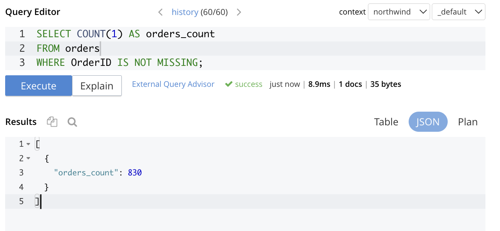
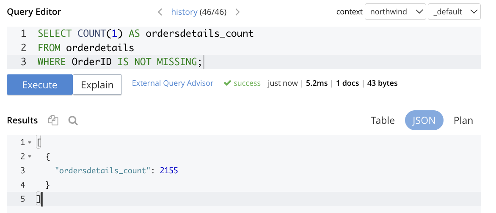
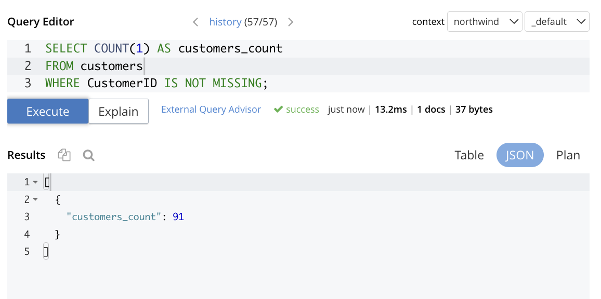
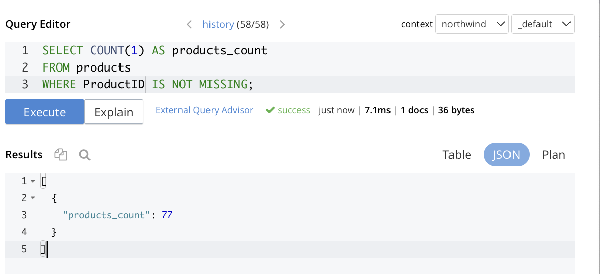
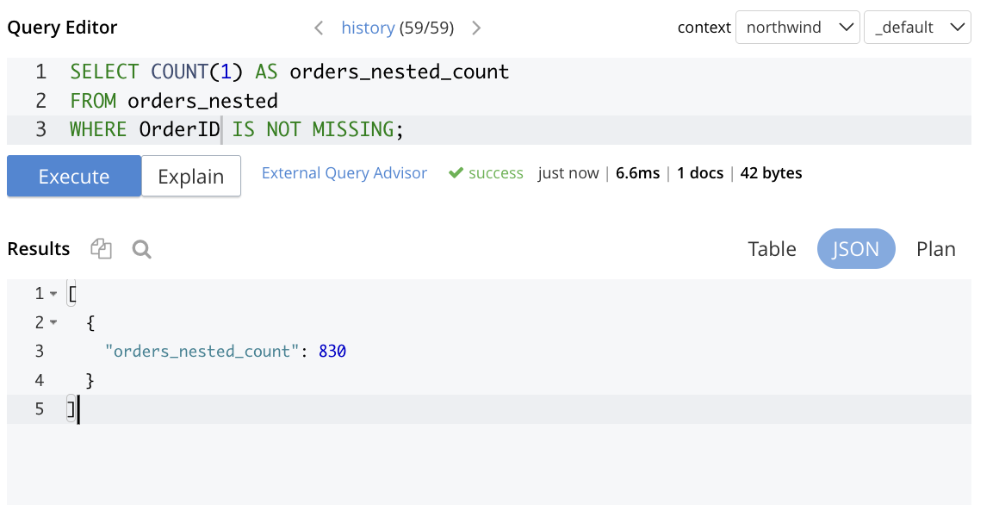

| Kolekcja      | Liczba dokumentów |
| ------------- | ----------------- |
| orders        | 830               |
| orderdetails  | 2155              |
| customers     | 91                |
| products      | 77                |
| orders_nested | 830               |

Dodatkowo, w Couchbase dostępne jest także podsumowanie danych, dzięki czemu mamy bezpośrednią informację o liczności poszczególnych kolekcji:

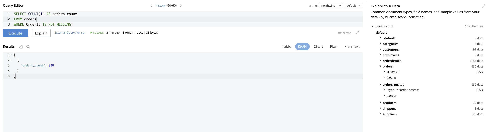

> Czym różni się dokument z kolekcji orders od dokumentu z kolekcji
> orders_nested?

W kolekcji `orders` znajdują się tylko podstawowe informacje o zamówieniu, natomiast wszelkie szczegóły odnośnie kupowanych produktów znajdują się w kolekcji `orderdetails` (informacje o tym jakie produkty i w jakiej ilości były kupowane w ramach danego zamówienia). Kolekcja `orders_nested` zawiera te informacje bezpośrednio zagnieżdżone, to znaczy mamy do tych dancyh bezpośrednio, bez konieczności łączenia kolekcji (jak ma to miejsce w podejściu `orders` + `orderdetails`).

---

## 2. Indeksy: brak indeksu, primary index, secondary index – 2 pkt

### Cel

Zobacz, że Couchbase nie wykonuje zapytań bez odpowiedniego indeksu. Następnie porównaj indeks główny z indeksem celowym.

### Część A – zapytanie bez indeksu

Wykonaj zapytanie:

```sql
SELECT
  c.Country,
  COUNT(1) AS customers_count
FROM `northwind`._default.customers AS c
GROUP BY c.Country
ORDER BY customers_count DESC;
```

#### Oczekiwane zachowanie

W świeżo uruchomionym środowisku zapytanie powinno zakończyć się błędem informującym o braku indeksu. Jeżeli zapytanie działa od razu, oznacza to najczęściej, że w środowisku pozostał wcześniej utworzony indeks.

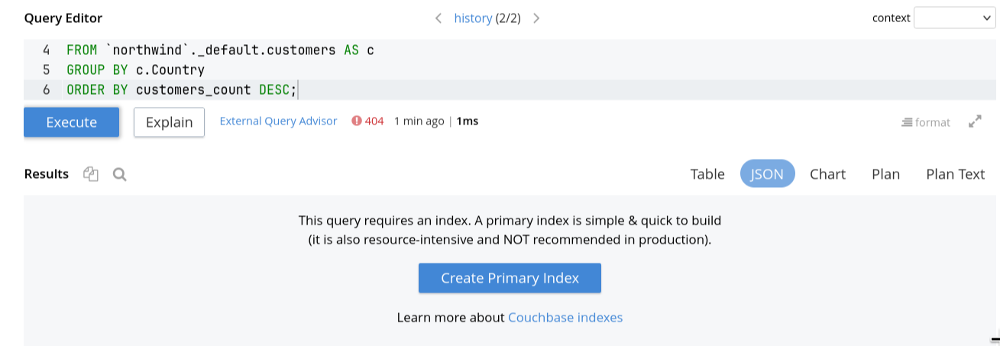

### Część B – primary index

Utwórz primary index:

```sql
CREATE PRIMARY INDEX idx_customers_primary
ON `northwind`._default.customers;
```

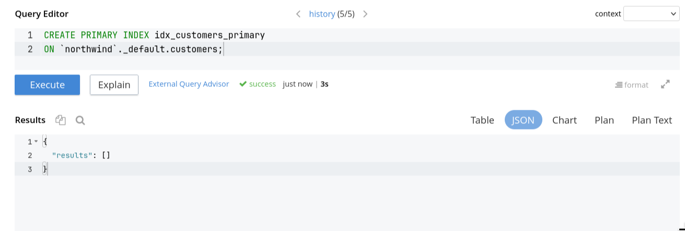

Powtórz zapytanie z części A.

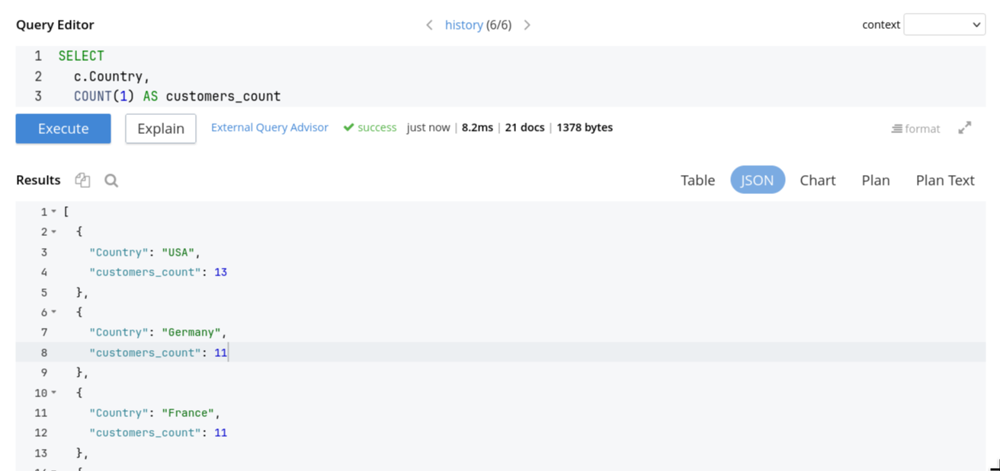

### Część C – indeks celowy

Usuń primary index:

```sql
DROP INDEX idx_customers_primary
ON `northwind`._default.customers;
```

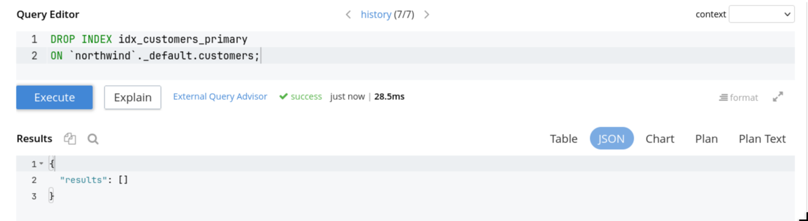

Utwórz indeks celowy na polu `Country`:

```sql
CREATE INDEX idx_customers_country
ON `northwind`._default.customers(Country);
```

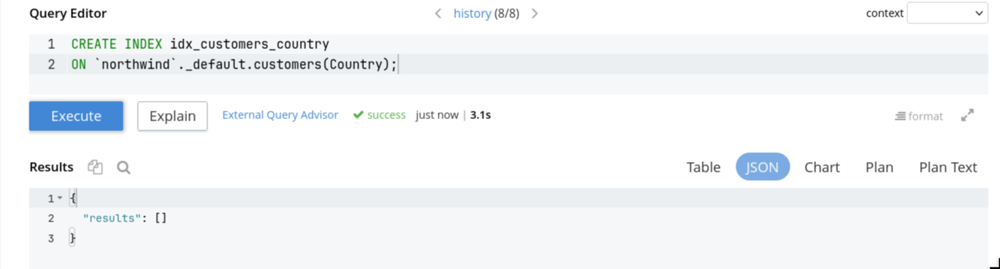

Wykonaj zapytanie z warunkiem indeksowym:

```sql
SELECT
  c.Country,
  COUNT(1) AS customers_count
FROM `northwind`._default.customers AS c
WHERE c.Country IS NOT MISSING
GROUP BY c.Country
ORDER BY customers_count DESC;
```

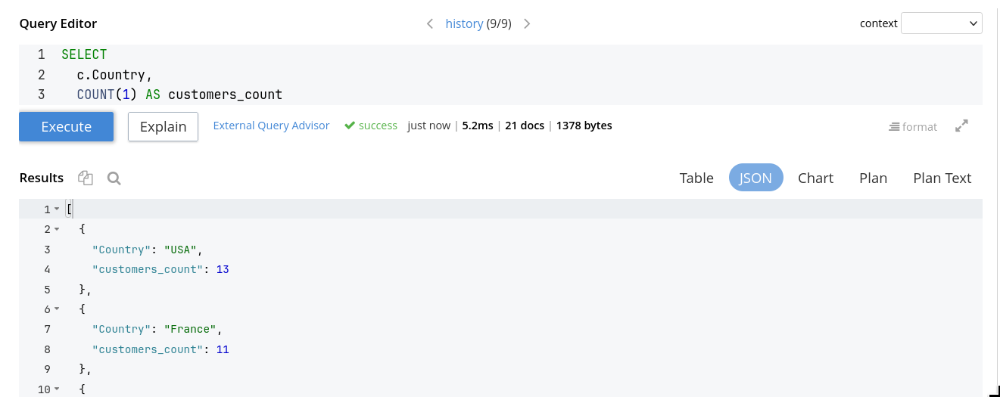

### W komentarzu napisz

- Co się stało przy próbie wykonania zapytania bez indeksu?

> Zapytanie zakończyło się błędem, ponieważ Couchbase wymaga indeksu do wykonania zapytania.

- Czym różni się `primary index` od indeksu celowego?

> Primary index jest ogólnym indeksem, który pozwala na skanowanie wszystkich dokumentów w kolekcji, ale jest nieefektywny do większości zapytań. Indeks celowy jest zdefiniowany na konkretnych polach i umożliwia szybkie wyszukiwanie i agregację na tych polach.

- Dlaczego w zapytaniu po utworzeniu indeksu celowego dodano warunek `WHERE c.Country IS NOT MISSING`?

> Warunek `WHERE c.Country IS NOT MISSING` jest potrzebny, aby zapytanie mogło skorzystać z indeksu celowego, który został utworzony na polu `Country`. Bez tego warunku Couchbase nie mógłby użyć indeksu i musiałby wykonać pełne skanowanie kolekcji, co jest nieefektywne.

- Dlaczego w środowisku produkcyjnym nie powinno się traktować primary index jako rozwiązania docelowego?

> Primary index jest nieefektywny, ponieważ pozwala na skanowanie wszystkich dokumentów w kolekcji, co może prowadzić do długiego czasu odpowiedzi i dużego obciążenia bazy. W środowisku produkcyjnym powinno się tworzyć indeksy celowe na polach, które są często używane w zapytaniach, aby zapewnić szybkie i efektywne działanie aplikacji.

---

## 3. `JOIN` na kolekcjach dokumentów – 2 pkt

### Cel

Zobacz, że Couchbase pozwala wykonywać `JOIN` podobny do SQL, ale pracuje na dokumentach JSON i kolekcjach, a nie na klasycznych tabelach relacyjnych.

### Część A – zamówienia z nazwą klienta

Dla zamówień pokaż:

- `OrderID`,
- `OrderDate`,
- `CustomerID`,
- `CompanyName`.

Przed wykonaniem zapytania utwórz indeks potrzebny do łączenia z kolekcją `customers`:

```sql
CREATE INDEX idx_customers_customerid
ON `northwind`._default.customers(CustomerID);
```

Jeżeli indeks już istnieje, Couchbase zwróci komunikat o istniejącym indeksie. W takiej sytuacji przejdź do kolejnego kroku.

Następnie przygotuj zapytanie łączące `orders` z `customers`.

### Część B – zamówienia i pozycje zamówień

Dla pozycji zamówień pokaż:

- `OrderID`,
- `CustomerID`,
- `ProductID`,
- `UnitPrice`,
- `Quantity`,
- `Discount`.

Wykorzystaj kolekcje:

- `orders`,
- `orderdetails`.

**Uwaga:** indeksy `idx_orders_orderid` oraz `idx_orderdetails_orderid` zostały utworzone automatycznie podczas inicjalizacji środowiska. Nie trzeba ich zakładać ręcznie. Jeżeli mimo to spróbujesz je utworzyć, Couchbase poinformuje, że indeks już istnieje – to nie jest błąd.

**Rozwiązanie:**

```sql
SELECT o.OrderID,
       o.CustomerID,
       od.ProductID,
       od.UnitPrice,
       od.Quantity,
       od.Discount
FROM orders AS o
    JOIN orderdetails AS od ON o.OrderID = od.OrderID
WHERE o.OrderID IS NOT MISSING
    AND od.OrderID IS NOT MISSING
```

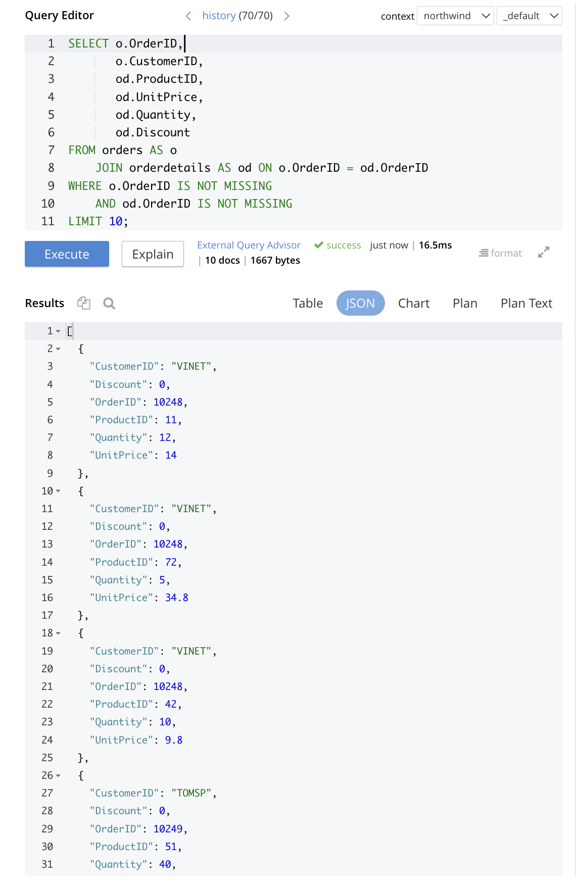

### Część C – wartość zamówienia

Policz wartość zamówienia według wzoru:

```text
wartość pozycji = UnitPrice * Quantity * (1 - Discount)
```

Brak rabatu traktuj jako `0`.

**Wskazówka:** w dokumentach JSON pole `Discount` może nie istnieć albo mieć wartość `null`. W Couchbase do obsługi takich sytuacji służy funkcja `IFMISSINGORNULL(od.Discount, 0)`, która zwraca `0`, jeżeli pole nie istnieje lub jest puste.

Dla każdego zamówienia oblicz:

- `OrderID`,
- `CustomerID`,
- `order_value`,
- liczbę pozycji zamówienia.

Pokaż 10 zamówień o najwyższej wartości.

**Rozwiązanie:**

```sql
SELECT o.OrderID,
       o.CustomerID,
       SUM(od.UnitPrice * od.Quantity * (1 - IFMISSINGORNULL(od.Discount, 0))) AS order_value
FROM orders AS o
    JOIN orderdetails AS od ON o.OrderID = od.OrderID
WHERE o.OrderID IS NOT MISSING
    AND od.OrderID IS NOT MISSING
GROUP BY o.OrderID,
         o.CustomerID
LIMIT 10;
```

```json
[
  {
    "CustomerID": "QUICK",
    "OrderID": 10938,
    "order_value": 2731.875
  },
  {
    "CustomerID": "TRADH",
    "OrderID": 10830,
    "order_value": 1974
  },
  {
    "CustomerID": "REGGC",
    "OrderID": 10942,
    "order_value": 560
  },
  {
    "CustomerID": "LILAS",
    "OrderID": 10283,
    "order_value": 1414.8000000000002
  },
  {
    "CustomerID": "OTTIK",
    "OrderID": 10508,
    "order_value": 240
  },
  {
    "CustomerID": "OCEAN",
    "OrderID": 10409,
    "order_value": 319.20000000000005
  },
  {
    "CustomerID": "SANTG",
    "OrderID": 10909,
    "order_value": 670
  },
  {
    "CustomerID": "SAVEA",
    "OrderID": 10678,
    "order_value": 5256.5
  },
  {
    "CustomerID": "REGGC",
    "OrderID": 10908,
    "order_value": 663.0999994799495
  },
  {
    "CustomerID": "RANCH",
    "OrderID": 10828,
    "order_value": 932
  }
]
```

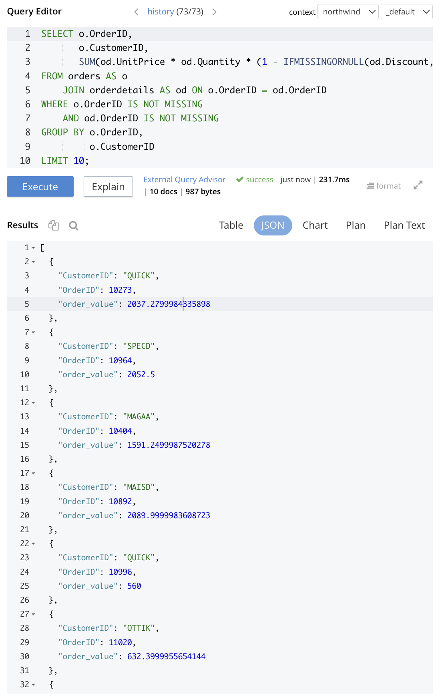

### W komentarzu napisz

- Czy `JOIN` w Couchbase przypomina składnię znaną z SQL?
- Czym różni się takie łączenie od relacji w klasycznej bazie relacyjnej (np. czy baza wymusza klucze obce i spójność relacji tak jak w typowym modelu relacyjnym)?
- Dlaczego indeks po stronie dołączanej kolekcji jest ważny?
- Czy największe zamówienia mają zawsze największą liczbę pozycji?

> Czy `JOIN` w Couchbase przypomina składnię znaną z SQL?

Składnia `JOIN` z Couchbase jest de facto identyczna w porównaniu do składni znanej z SQL.

> Czym różni się takie łączenie od relacji w klasycznej bazie relacyjnej (np. czy baza wymusza klucze obce i spójność relacji tak jak w typowym modelu relacyjnym)?

W klasycznej bazie relacyjnej baza danych wymusza klucze obce oraz ich integralność. W przypadku Couchbase'a baza nie przechowuje żadnych informacji o relacjach pomiędzy kolekcjami i nie waliduje spójności przy zapisie. Odpowiedzialność za integralność danych leży całkowicie po stronie aplikacji i programisty.

> Dlaczego indeks po stronie dołączanej kolekcji jest ważny?

W przypadku braku indeksu konieczne pełne przeskanowanie kolekcji, czyli w przypadku sprawdzenie każdego dokumentu w tabeli `orderdetails` dla każdego wiersza z `orders`. Indeks na kolumnie, po której łączymy kolekcje pozwala silnikowi bezpośrednio zlokalizować pasujące dokumenty bez przeglądania całej kolekcji.

W przypadku próby połączenia kolekcji po kluczu, na który nie jest założony indeks, zapytanie kończy się błędem:

```json
[
  {
    "code": 4330,
    "msg": "No index available for ANSI join term od",
    "query": "SELECT o.OrderID,\n       o.ProductID,\n       SUM(od.UnitPrice * od.Quantity * (1 - IFMISSINGORNULL(od.Discount, 0))) AS order_value,\n       COUNT(*) AS positions\nFROM orders AS o\n    JOIN orderdetails AS od ON o.OrderID = od.ProductID\nWHERE o.OrderID IS NOT MISSING\n    AND od.ProductID IS NOT MISSING\nGROUP BY o.OrderID,\n         o.ProductID\nORDER BY order_value DESC, positions DESC\nLIMIT 10;"
  }
]
```

> Czy największe zamówienia mają zawsze największą liczbę pozycji?

W celu zweryfikowania tego stwierdzenia, do poprzedniego zapytania dodane zostało zliczanie liczby pozycji w zamówieniu:

```sql
SELECT o.OrderID,
       o.CustomerID,
       SUM(od.UnitPrice * od.Quantity * (1 - IFMISSINGORNULL(od.Discount, 0))) AS order_value,
       COUNT(*) AS positions
FROM orders AS o
    JOIN orderdetails AS od ON o.OrderID = od.OrderID
WHERE o.OrderID IS NOT MISSING
    AND od.OrderID IS NOT MISSING
GROUP BY o.OrderID,
         o.CustomerID
ORDER BY order_value DESC, positions DESC;
```

```json
[
  {
    "CustomerID": "QUICK",
    "OrderID": 10865,
    "order_value": 16387.49998714775,
    "positions": 2
  },
  {
    "CustomerID": "HANAR",
    "OrderID": 10981,
    "order_value": 15810,
    "positions": 1
  },
  {
    "CustomerID": "SAVEA",
    "OrderID": 11030,
    "order_value": 12615.05,
    "positions": 4
  },
  {
    "CustomerID": "RATTC",
    "OrderID": 10889,
    "order_value": 11380,
    "positions": 2
  },
  {
    "CustomerID": "SIMOB",
    "OrderID": 10417,
    "order_value": 11188.4,
    "positions": 4
  },
  {
    "CustomerID": "KOENE",
    "OrderID": 10817,
    "order_value": 10952.844978627563,
    "positions": 4
  },
  {
    "CustomerID": "HUNGO",
    "OrderID": 10897,
    "order_value": 10835.240000000002,
    "positions": 2
  },
  {
    "CustomerID": "RATTC",
    "OrderID": 10479,
    "order_value": 10495.6,
    "positions": 4
  },
  {
    "CustomerID": "QUICK",
    "OrderID": 10540,
    "order_value": 10191.7,
    "positions": 4
  },
  {
    "CustomerID": "QUICK",
    "OrderID": 10691,
    "order_value": 10164.8,
    "positions": 5
  }
]
```

Zgodnie z otrzymanymi wynikami (top 10 rezultatów w zadanej kolejności), największe zamówienia niekoniecznie zawsze mają największą liczbę pozycji. Zamówienie o największej wartości ma wyłącznie 2 pozycje, drugie w kolejności zamówienie ma 1 pozycję, gdzie np. zamówienie o 10. w kolejności wartości ma aż 5 pozycji.

---

## 4. Model niezagnieżdżony vs zagnieżdżony: `JOIN` vs `UNNEST` – 2 pkt

### Cel

Porównaj dwa sposoby modelowania tych samych danych:

1. model niezagnieżdżony: `orders` + `orderdetails`,
1. model zagnieżdżony: `orders_nested`, gdzie pozycje zamówienia są tablicą `items`.

### Część A – obejrzyj dokument zagnieżdżony

Podejrzyj dokument zamówienia o numerze `10248` z kolekcji `orders_nested`.

Zwróć uwagę na pole:

```text
items
```

**Rozwiązanie:**

```sql
select *
from orders_nested
where OrderID = 10248;
```

```json
[
  {
    "orders_nested": {
      "CustomerID": "VINET",
      "EmployeeID": 5,
      "OrderDate": {
        "$date": "1996-07-04T00:00:00Z"
      },
      "OrderID": 10248,
      "ShipCity": "Reims",
      "ShipCountry": "France",
      "ShipName": "Vins et alcools Chevalier",
      "items": [
        {
          "Discount": 0,
          "LineValue": 98,
          "ProductID": 42,
          "Quantity": 10,
          "UnitPrice": 9.8
        },
        {
          "Discount": 0,
          "LineValue": 168,
          "ProductID": 11,
          "Quantity": 12,
          "UnitPrice": 14
        },
        {
          "Discount": 0,
          "LineValue": 174,
          "ProductID": 72,
          "Quantity": 5,
          "UnitPrice": 34.8
        }
      ],
      "type": "order_nested"
    }
  }
]
```

### Część B – rozbij tablicę `items` przez `UNNEST`

Dla zamówienia `10248` pokaż wszystkie pozycje zamówienia z tablicy `items`.

Wynik powinien zawierać:

- `OrderID`,
- `CustomerID`,
- `ProductID`,
- `UnitPrice`,
- `Quantity`,
- `Discount`,
- `LineValue`.

#### Wskazówka składniowa

`UNNEST` rozbija tablicę zagnieżdżoną w dokumencie na osobne rekordy. Każdy element tablicy staje się oddzielnym wierszem w wyniku:

```sql
SELECT
  n.OrderID,
  item.ProductID
FROM `northwind`._default.orders_nested AS n
UNNEST n.items AS item
WHERE n.OrderID = 10248;
```

Rozbuduj to zapytanie o pozostałe kolumny wymienione powyżej.

**Rozwiązanie:**

```sql
SELECT odn.OrderID,
       odn.CustomerID,
       item.ProductID,
       item.UnitPrice,
       item.Quantity,
       item.Discount,
       item.LineValue
FROM orders_nested AS odn
UNNEST odn.items AS item
WHERE odn.OrderID = 10248;
```

```json
[
  {
    "CustomerID": "VINET",
    "Discount": 0,
    "LineValue": 98,
    "OrderID": 10248,
    "ProductID": 42,
    "Quantity": 10,
    "UnitPrice": 9.8
  },
  {
    "CustomerID": "VINET",
    "Discount": 0,
    "LineValue": 168,
    "OrderID": 10248,
    "ProductID": 11,
    "Quantity": 12,
    "UnitPrice": 14
  },
  {
    "CustomerID": "VINET",
    "Discount": 0,
    "LineValue": 174,
    "OrderID": 10248,
    "ProductID": 72,
    "Quantity": 5,
    "UnitPrice": 34.8
  }
]
```

### Część C – policz wartość zamówień z modelu zagnieżdżonego

Na kolekcji `orders_nested` policz:

- `OrderID`,
- `CustomerID`,
- `order_value`,
- liczbę pozycji.

Użyj `UNNEST`.

Pokaż 10 zamówień o najwyższej wartości.

```sql
SELECT n.OrderID,
       n.CustomerID,
       SUM(item.UnitPrice * item.Quantity * (1 - IFMISSINGORNULL(item.Discount, 0))) AS order_value,
       COUNT(1) AS positions
FROM orders_nested AS n
UNNEST n.items AS item
WHERE n.OrderID IS NOT MISSING
GROUP BY n.OrderID,
         n.CustomerID
ORDER BY order_value DESC
LIMIT 10;
```

```json
[
  {
    "CustomerID": "QUICK",
    "OrderID": 10865,
    "order_value": 16387.49998714775,
    "positions": 2
  },
  {
    "CustomerID": "HANAR",
    "OrderID": 10981,
    "order_value": 15810,
    "positions": 1
  },
  {
    "CustomerID": "SAVEA",
    "OrderID": 11030,
    "order_value": 12615.05,
    "positions": 4
  },
  {
    "CustomerID": "RATTC",
    "OrderID": 10889,
    "order_value": 11380,
    "positions": 2
  },
  {
    "CustomerID": "SIMOB",
    "OrderID": 10417,
    "order_value": 11188.4,
    "positions": 4
  },
  {
    "CustomerID": "KOENE",
    "OrderID": 10817,
    "order_value": 10952.844978627563,
    "positions": 4
  },
  {
    "CustomerID": "HUNGO",
    "OrderID": 10897,
    "order_value": 10835.240000000002,
    "positions": 2
  },
  {
    "CustomerID": "RATTC",
    "OrderID": 10479,
    "order_value": 10495.6,
    "positions": 4
  },
  {
    "CustomerID": "QUICK",
    "OrderID": 10540,
    "order_value": 10191.7,
    "positions": 4
  },
  {
    "CustomerID": "QUICK",
    "OrderID": 10691,
    "order_value": 10164.8,
    "positions": 5
  }
]
```

### Część D – porównaj wynik z modelem niezagnieżdżonym

Porównaj wynik z części C z wynikiem otrzymanym wcześniej przez `JOIN` na `orders` i `orderdetails` (zadanie 3C).

Minimum: porównaj wizualnie top 10 zamówień z obu podejść i napisz, czy wyniki są zgodne.

Opcjonalnie: jeżeli chcesz potwierdzić zgodność formalnie, możesz napisać zapytanie z `WITH`, które porówna wartości zamówień z obu modeli dla wszystkich 830 zamówień.

**Rozwiązanie:**

Wyniki otrzymane z zapytania wykorzystującego `JOIN`:

```txt
CustomerID	OrderID	order_value	positions
"QUICK"	10865	16387.49998714775	2
"HANAR"	10981	15810	1
"SAVEA"	11030	12615.05	4
"RATTC"	10889	11380	2
"SIMOB"	10417	11188.4	4
"KOENE"	10817	10952.844978627563	4
"HUNGO"	10897	10835.240000000002	2
"RATTC"	10479	10495.6	4
"QUICK"	10540	10191.7	4
"QUICK"	10691	10164.8	5
```

Wyniki otrzymane z zapytania wykorzystującego model zagnieżdżony:

```txt
CustomerID	OrderID	order_value	positions
"QUICK"	10865	16387.49998714775	2
"HANAR"	10981	15810	1
"SAVEA"	11030	12615.05	4
"RATTC"	10889	11380	2
"SIMOB"	10417	11188.4	4
"KOENE"	10817	10952.844978627563	4
"HUNGO"	10897	10835.240000000002	2
"RATTC"	10479	10495.6	4
"QUICK"	10540	10191.7	4
"QUICK"	10691	10164.8	5
```

Wyniki otrzymane z obu zapytań są identyczne. Dodatkowo, w celu zweryfikowania, wykorzystane zostało zapytanie korzystające z klauzul `WITH` oraz `EXCEPT`, które weryfikuje czy wyniki są identyczne dla wszystkich dokumentów (dokładność `order_value` do 6 miejsc po przecinku):

```sql
WITH flat AS (
    SELECT o.OrderID,
           o.CustomerID,
           ROUND(SUM(od.UnitPrice * od.Quantity * (1 - IFMISSINGORNULL(od.Discount, 0))), 6) AS order_value,
           COUNT(*) AS positions
    FROM orders AS o
        JOIN orderdetails AS od ON o.OrderID = od.OrderID
    WHERE o.OrderID IS NOT MISSING
        AND od.OrderID IS NOT MISSING
    GROUP BY o.OrderID,
             o.CustomerID ),
nested AS (
    SELECT n.OrderID,
           n.CustomerID,
           ROUND(SUM(item.UnitPrice * item.Quantity * (1 - IFMISSINGORNULL(item.Discount, 0))), 6) AS order_value,
           COUNT(1) AS positions
    FROM orders_nested AS n
    UNNEST n.items AS item
    WHERE n.OrderID IS NOT MISSING
    GROUP BY n.OrderID,
             n.CustomerID )
SELECT 'only_in_flat' AS source,
       f.*
FROM flat AS f EXCEPT ALL SELECT 'only_in_flat' AS source,
                                         n.*
FROM nested AS n
UNION ALL
SELECT 'only_in_nested' AS source,
       n.*
FROM nested AS n EXCEPT ALL SELECT 'only_in_nested' AS source,
                                           f.*
FROM flat AS f;
```

```json
{
  "results": []
}
```

### W komentarzu napisz

- Na czym polega różnica między `JOIN` i `UNNEST`?
- Dlaczego w modelu zagnieżdżonym nie trzeba łączyć `orders` z `orderdetails`?
- Czy oba podejścia dają ten sam wynik biznesowy?
- Kiedy zagnieżdżanie pozycji zamówienia w dokumencie może być wygodne?
- Kiedy lepiej zostawić dane w osobnych kolekcjach?

> Na czym polega różnica między `JOIN` i `UNNEST`?

`JOIN` łączy dwa osobne dokumenty z dwóch kolekcji na podstawie wspólnego klucza. `UNNEST` rozpakowuje tablicę wewnątrz jednego dokumentu i traktuje każdy jej element jako osobny wiersz.

> Dlaczego w modelu zagnieżdżonym nie trzeba łączyć `orders` z `orderdetails`?

Ponieważ w modelu zagnieżdżonym, wszystkie dane z `orderdetails` są zawarte w kolekcji `orders_nested` pod kluczem `items` - dzięki temu mamy do nich bezpośredni dostęp (są one częścią dokumentu), a wszystko co potrzebne do wyliczenia wartości zamówienia znajduje się w jednym miejscu.

> Czy oba podejścia dają ten sam wynik biznesowy?

Oba podejścia dają ten sam wynik biznesowy

> Kiedy zagnieżdżanie pozycji zamówienia w dokumencie może być wygodne?

Zagnieżdżanie jest wygodne, gdy dane są silnie powiązane i zawsze odczytywane razem. Dzięki temu możemy uniknąć wielu kosztowych operacji `JOIN`, ponieważ mamy bezpośredni dostęp do zagnieżdżonych danych. Przykładowo, pozycje zamówienia oraz szczegóły dotyczące zamówienia rzadko mają sens bez kontekstu samego zamówienia.

> Kiedy lepiej zostawić dane w osobnych kolekcjach?

Osobne kolekcje sprawdzą się lepiej w sytuacji, gdy odwołujemy się do danych z wielu miejsc - przykładowo, produkt (identyfikowany przez `ProductID`) pojawia się w wielu zamówieniach i nie ma sensu duplikowanie danych każdego produktu za każdym razem, gdy jest on zagnieżdżany. Dla danych, dla których potrzebujemy niezależnych zapytań (dane nie są ściśle powiązane z innym dokumentem i ma sa odpytywanie tej kolekcji w izolacji), rozdzielenie danych na osobne kolekcje także może okazać się wygodniejsze. Dzięki rozdzieleniu zagnieżdżonych danych na osobne kolekcje możemy także uniknąć duplikacji danych, co pomaga także w aktualizacji danych (np. zmiana nazwy produktu w jednym miejscu, a nie w wielu dokumentach).

---

## 5. Agregacja biznesowa – 1 pkt

### Cel

Wykonaj prostą analizę biznesową na danych dokumentowych.

### Wybierz <u>jeden</u> wariant

Do zaliczenia zadania wybierz jeden wariant. Jeżeli skończysz wcześniej, wykonaj drugi wariant jako ćwiczenie dodatkowe.

### Wariant A – top 10 produktów po wartości sprzedaży

Dla produktów policz:

- `ProductID`,
- `ProductName`,
- łączną liczbę sprzedanych sztuk,
- łączną wartość sprzedaży.

Wykorzystaj kolekcje:

- `orderdetails`,
- `products`.

Przed zapytaniem może być potrzebny indeks:

```sql
CREATE INDEX idx_products_productid
ON `northwind`._default.products(ProductID);

CREATE INDEX idx_orderdetails_productid
ON `northwind`._default.orderdetails(ProductID);
```

Jeżeli indeks już istnieje, Couchbase zwróci komunikat o istniejącym indeksie — to nie jest błąd.

#### Rozwiązanie

##### Dodanie indeksu

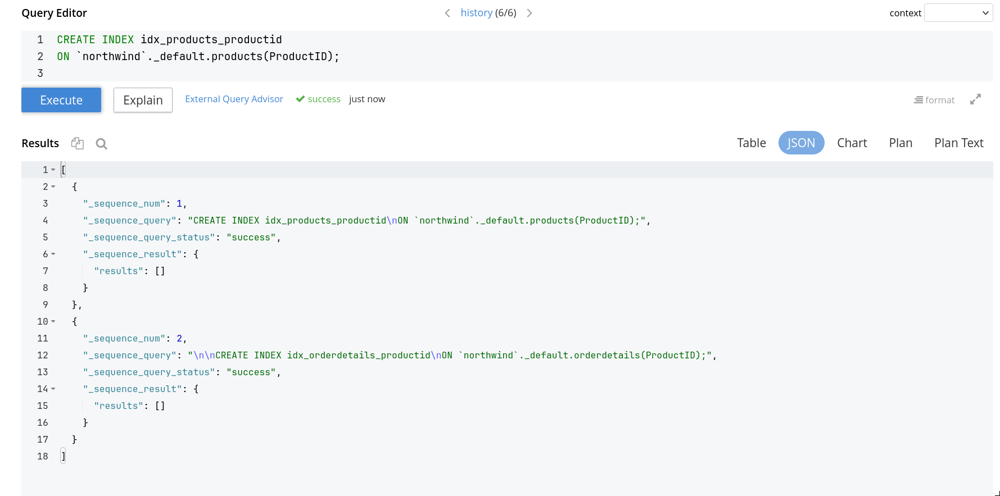

##### Zapytanie

```sql
select p.ProductID,
       p.ProductName,
       count(*)                                                             as TotalUnitsSold,
       sum(o.UnitPrice * o.Quantity * (1 - ifmissingornull(o.Discount, 0))) as TotalOrderValue
from `northwind`._default.products as p
         join `northwind`._default.orderdetails as o
              on p.ProductID = o.ProductID
where p.ProductID is not missing
  and o.ProductID is not missing
group by p.ProductID, p.ProductName
order by TotalOrderValue desc
limit 10;
```

Wynik:

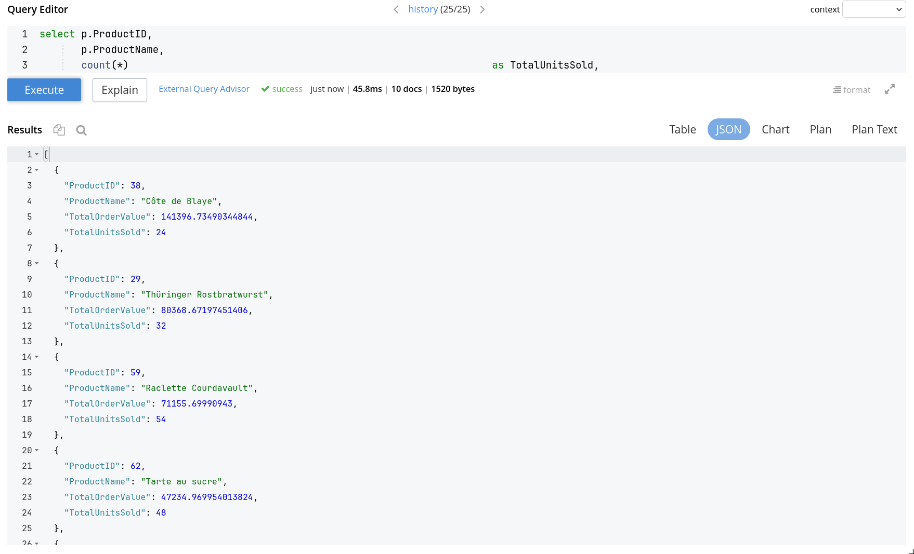

### Wariant B – top 10 klientów po wartości zakupów

Dla klientów policz:

- `CustomerID`,
- `CompanyName`,
- liczbę zamówień,
- łączną wartość zakupów.

Wykorzystaj kolekcje:

- `orders`,
- `orderdetails`,
- `customers`.

#### Rozwiązanie

##### Dodanie indeksu

```sql
CREATE INDEX idx_orders_customerid
ON `northwind`._default.orders(CustomerID);

CREATE INDEX idx_customers_customerid
ON `northwind`._default.customers(CustomerID);
```

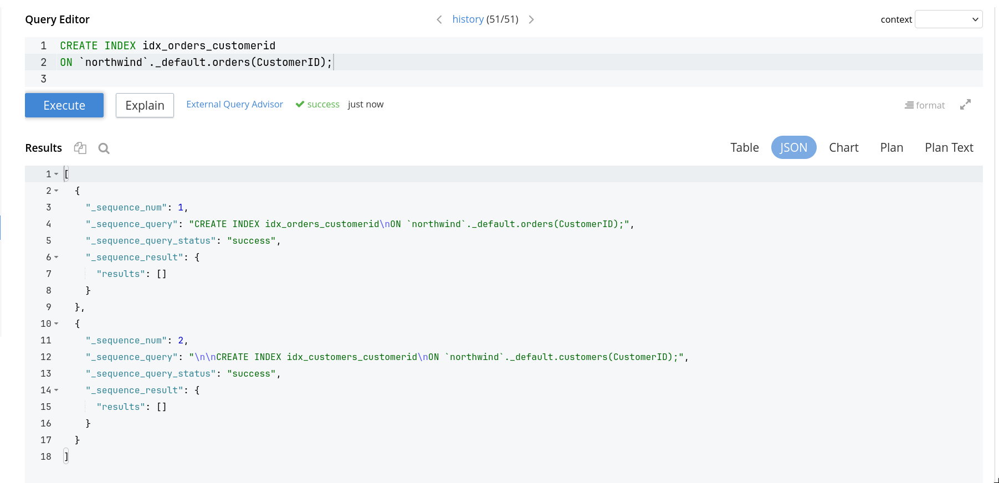

##### Zapytanie

```sql
select c.CustomerID,
       c.CompanyName,
       count(distinct o.OrderID) as                                            TotalOrderCount,
       sum(od.UnitPrice * od.Quantity * (1 - ifmissingornull(od.Discount, 0))) TotalOrderValue
from `northwind`._default.customers as c
         join `northwind`._default.orders as o
              on o.CustomerID = c.CustomerID
         join `northwind`._default.orderdetails as od
              on od.OrderID = o.OrderID
group by c.CustomerID, c.CompanyName
order by TotalOrderValue desc
limit 10;
```

Wynik:

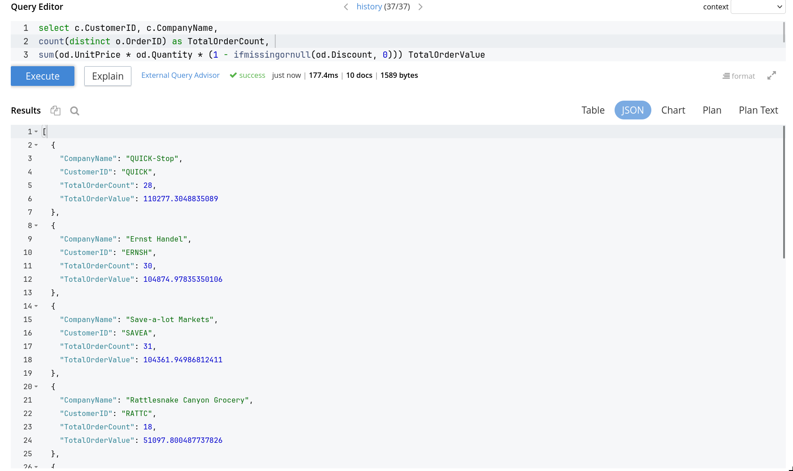

### W komentarzu napisz

- Który produkt albo klient ma najwyższą wartość sprzedaży?

> A:
>
> ```json
> {
>   "ProductID": 38,
>   "ProductName": "Côte de Blaye",
>   "TotalOrderValue": 141396.73490344844,
>   "TotalUnitsSold": 24
> }
> ```
>
> B:
>
> ```json
> {
>   "CompanyName": "QUICK-Stop",
>   "CustomerID": "QUICK",
>   "TotalOrderCount": 28,
>   "TotalOrderValue": 110277.3048835089
> }
> ```

- Czy wynik jest łatwy do biznesowej interpretacji?

> Tak, wynik jest łatwy do interpretacji, ponieważ pokazuje konkretne produkty i klientów wraz z ich łączną wartością sprzedaży i liczbą sprzedanych jednostek, co pozwala na szybkie zidentyfikowanie najbardziej wartościowych produktów i klientów.

- Czy zapytanie bardziej przypomina klasyczny SQL/BI, czy pracę z dokumentami JSON?

> Zapytanie bardziej przypomina klasyczny SQL/BI, ponieważ wykonuje typowe operacje agregacji, grupowania i sortowania, ale używa też funkcji specyficznych dla Couchbase, takich jak `IFMISSINGORNULL`, aby radzić sobie z potencjalnie brakującymi danymi w dokumentach JSON.

---

## 6. `EXPLAIN` i refleksja końcowa – 2 pkt

### Cel

Nie wystarczy wiedzieć, że zapytanie działa. Trzeba jeszcze rozumieć, w jaki sposób baza je wykonuje.

### Część A – plan dla zapytania z `JOIN`

Wybierz zapytanie z zadania 3 albo 5 i uruchom je z `EXPLAIN` (albo za pomocą przycisku w menu).

Przykład:

```sql
EXPLAIN
SELECT ...
```

##### Zapytanie 5B:

```sql
select c.CustomerID,
       c.CompanyName,
       count(distinct o.OrderID) as                                            TotalOrderCount,
       sum(od.UnitPrice * od.Quantity * (1 - ifmissingornull(od.Discount, 0))) TotalOrderValue
from `northwind`._default.customers as c
         join `northwind`._default.orders as o
              on o.CustomerID = c.CustomerID
         join `northwind`._default.orderdetails as od
              on od.OrderID = o.OrderID
group by c.CustomerID, c.CompanyName
order by TotalOrderValue desc
limit 10;
```

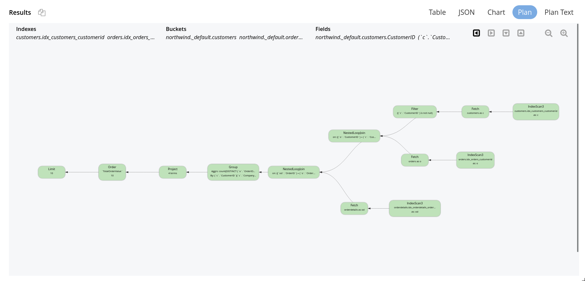

### Część B – plan dla zapytania z `UNNEST`

Wybierz zapytanie z zadania 4 i uruchom je z `EXPLAIN`.

##### Zapytanie 4C:

```sql
select n.OrderID,
       n.CustomerID,
       sum(item.UnitPrice * item.Quantity * (1 - ifmissingornull(item.Discount, 0))) as TotalOrderValue,
       count(1)                                                                      as ItemsCount
from `northwind`._default.orders_nested as n
         unnest n.items as item
where n.OrderID is not missing
group by n.OrderID, n.CustomerID
order by TotalOrderValue desc
limit 10;
```

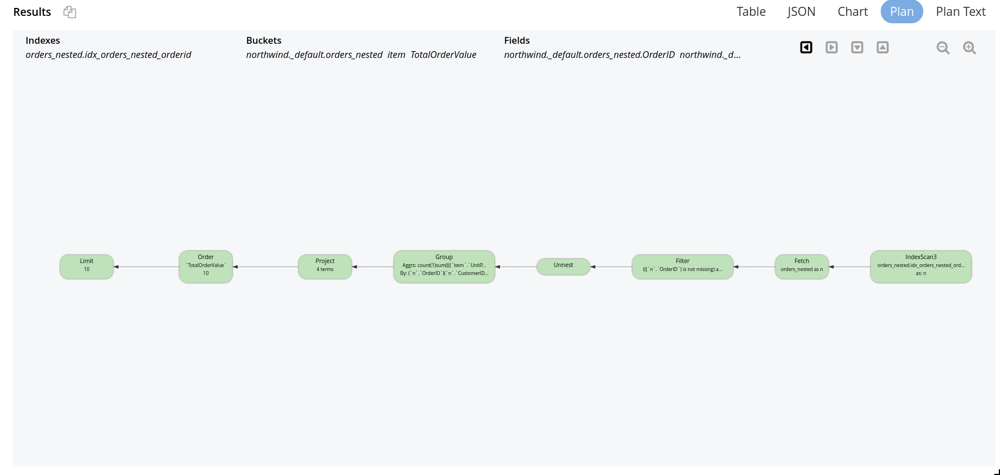

### Część C – porównanie

Porównaj oba plany na poziomie ogólnym.

Nie opisuj całego planu. Wystarczy wskazać, z jakich indeksów korzysta zapytanie, czy pojawia się `JOIN` albo `UNNEST`, oraz gdzie widać agregację i sortowanie.

Wskaż elementy typu:

- `IndexScan`,
- `Fetch`,
- `NestedLoopJoin`,
- `Unnest`,
- `Group`,
- `Order`,
- `Limit`.

Porównanie:

> Zapytanie z `join` korzysta z 3 indeksów (`idx_customers_customerid`, `idx_orders_customerid`, `idx_orderdetails_orderid`) w celu `IndexScan` na kolekcjach `customers`, `orders` i `orderdetails`, a następnie łączy dane za pomocą `NestedLoopJoin`. Jest to typowe podejście dla modelu relacyjnego.
> Zapytanie z `unnest` korzysta z tylko jednego indeksu (`idx_orders_nested_orderid`) do `IndexScan` na kolekcji `orders_nested`, a następnie rozbija tablicę `items` za pomocą `unnest`.
> Główną różnicą jest liczba `fetch`, podejście z `join` wymusza pobranie danych z trzech kolekcji, podczas gdy `unnest` operuje na jednej kolekcji z zagnieżdżonymi danymi, co może być bardziej efektywne, ale wymaga innego modelowania danych.
> Pozostałe elementy planu, takie jak `Group`, `Order`, `Project` i `Limit`, są takie same z dokładnością do zwracanych kolumn i warunków.

### W komentarzu końcowym napisz

Odpowiedz w kilku zdaniach:

- Co było największą różnicą między Couchbase a klasyczną bazą relacyjną?

> Największą różnicą jest model danych oparty na dokumentach JSON, który pozwala na elastyczne przechowywanie danych bez sztywnej struktury tabel, oraz konieczność tworzenia indeksów, aby zapytania mogły być wykonywane. Ponadto, Couchbase oferuje funkcje specyficzne dla pracy z dokumentami, takie jak `UNNEST` do rozbijania tablic zagnieżdżonych w dokumentach oraz `IFMISSINGORNULL` do obsługi brakujących danych, co różni się od tradycyjnego modelu relacyjnego.

- Dlaczego indeksy są tak ważne w Couchbase?

> Indeksy są kluczowe w Couchbase, ponieważ bez nich zapytania nie mogą być wykonane. Couchbase wymaga indeksów, aby szybko odnaleźć dokumenty spełniające warunki zapytania. Bez indeksów baza musiałaby skanować wszystkie dokumenty w kolekcji, co jest nieefektywne i może prowadzić do długiego czasu odpowiedzi.

- Co pokazało porównanie `JOIN` i `UNNEST`?

> Porównanie `JOIN` i `UNNEST` pokazało, że oba podejścia mogą być używane do osiągnięcia tego samego celu biznesowego, ale różnią się sposobem modelowania danych i wykonywania zapytań. `JOIN` jest bardziej zbliżony do tradycyjnego modelu relacyjnego, podczas gdy `UNNEST` pozwala na pracę z danymi zagnieżdżonymi w dokumentach JSON, co może być bardziej efektywne w niektórych przypadkach, ale wymaga innego podejścia do projektowania bazy danych.

- Czy dokumentowy model danych wyklucza analizę i raportowanie?

> Nie, ale praca z dokumentami JSON wymaga innego podejścia do modelowania danych i zapytań, zwłaszcza gdy dane są zagnieżdżone.

- Gdybyś projektował system zamówień, kiedy rozważyłbyś zagnieżdżenie pozycji zamówienia w dokumencie zamówienia?

> W przypadku, gdy zamówienie składa się z wielu elementów, które są ściśle powiązane i często pobierane razem. Jest to wtedy wygodne, bo dokument zamówienia zawiera wszystkie informacje o zamówieniu, a `UNNEST` pozwala łatwo rozbić pozycje na osobne rekordy do analizy.

---

## Zadanie dodatkowe dla chętnych

### Materializacja KPI klienta

Utwórz kolekcję `customer_kpis`, a następnie zapisz do niej gotowe dokumenty z metrykami klienta:

- `CustomerID`,
- `CompanyName`,
- `Revenue`,
- `OrdersCount`.

Następnie wykonaj zapytanie raportowe na kolekcji `customer_kpis`.

**Uwaga**: wskazówki do rozwiązania zadania znajdziesz w ściądze.

W komentarzu napisz:

- czym różni się liczenie raportu „w locie" od czytania gotowej kolekcji KPI,
- kiedy takie podejście może być użyteczne,
- jakie jest ryzyko materializowania wyników, jeśli dane źródłowe się zmieniają.
