## SQL - Funkcje okna (Window functions) <br> Lab 1

---

**Imiona i nazwiska: Marek Małek, Mateusz Lampert**

---

Celem ćwiczenia jest przygotowanie środowiska pracy, wstępne zapoznanie się z działaniem funkcji okna (window functions) w SQL, analiza wydajności zapytań i porównanie z rozwiązaniami przy wykorzystaniu "tradycyjnych" konstrukcji SQL

Swoje odpowiedzi wpisuj w miejsca oznaczone jako:

---

> Wyniki:

```sql
--  ...
```

---

Ważne/wymagane są komentarze.

Zamieść kod rozwiązania oraz zrzuty ekranu pokazujące wyniki, (dołącz kod rozwiązania w formie tekstowej/źródłowej)

Zwróć uwagę na formatowanie kodu

---

## Oprogramowanie - co jest potrzebne?

Do wykonania ćwiczenia potrzebne jest następujące oprogramowanie:

- MS SQL Server - wersja 2019, 2022, 2025
- PostgreSQL - wersja 15/16/17/18
- SQLite
- Narzędzia do komunikacji z bazą danych
  - SSMS - Microsoft SQL Managment Studio
  - DtataGrip lub DBeaver
- Przykładowa baza Northwind
  - W wersji dla każdego z wymienionych serwerów

Oprogramowanie dostępne jest na przygotowanej maszynie wirtualnej

## Dokumentacja/Literatura

- Kathi Kellenberger,  Clayton Groom, Ed Pollack, Expert T-SQL Window Functions in SQL Server 2019, Apres 2019
- Itzik Ben-Gan, T-SQL Window Functions: For Data Analysis and Beyond, Microsoft 2020

- Kilka linków do materiałów które mogą być pomocne
   - [https://learn.microsoft.com/en-us/sql/t-sql/queries/select-over-clause-transact-sql?view=sql-server-ver16](https://learn.microsoft.com/en-us/sql/t-sql/queries/select-over-clause-transact-sql?view=sql-server-ver16)
  - [https://www.sqlservertutorial.net/sql-server-window-functions/](https://www.sqlservertutorial.net/sql-server-window-functions/)
  - [https://www.sqlshack.com/use-window-functions-sql-server/](https://www.sqlshack.com/use-window-functions-sql-server/)
  - [https://www.postgresql.org/docs/current/tutorial-window.html](https://www.postgresql.org/docs/current/tutorial-window.html)
  - [https://www.postgresqltutorial.com/postgresql-window-function/](https://www.postgresqltutorial.com/postgresql-window-function/)
  - [https://www.sqlite.org/windowfunctions.html](https://www.sqlite.org/windowfunctions.html)
  - [https://www.sqlitetutorial.net/sqlite-window-functions/](https://www.sqlitetutorial.net/sqlite-window-functions/)

- W razie potrzeby - opis Ikonek używanych w graficznej prezentacji planu zapytania w SSMS jest tutaj:
  - [https://docs.microsoft.com/en-us/sql/relational-databases/showplan-logical-and-physical-operators-reference](https://docs.microsoft.com/en-us/sql/relational-databases/showplan-logical-and-physical-operators-reference)

## Przygotowanie

Uruchom SSMS
- Skonfiguruj połączenie z bazą Northwind na lokalnym serwerze MS SQL 

Uruchom DataGrip (lub Dbeaver)

- Skonfiguruj połączenia z bazą Northwind3
  - na lokalnym serwerze MS SQL
  - na lokalnym serwerze PostgreSQL
  - z lokalną bazą SQLite

---

# Zadanie 1 - obserwacja

Wykonaj i porównaj wyniki następujących poleceń.

```sql
select avg(unitprice) avgprice
from products p;

select avg(unitprice) over () as avgprice
from products p;

select categoryid, avg(unitprice) avgprice
from products p
group by categoryid

select avg(unitprice) over (partition by categoryid) as avgprice
from products p;
```

Jaka jest są podobieństwa, jakie różnice pomiędzy grupowaniem danych a działaniem funkcji okna?

---

> Wyniki:

```sql
select avg(unitprice) avgprice
from products p;

=> jeden wiersz, globalna średnia równa ~28.834

===

select avg(unitprice) over () as avgprice
from products p;

=> 77 wierszy, globalna średnia równa ~28.834 "doklejona" do każdego wiersza (okno zdefiniowane jako wszystkie wiersze)

===

select categoryid, avg(unitprice) avgprice
from products p
group by categoryid;

=> 8 wierszy, dla każdego categoryid mamy średnią dla danej kategorii, oryginalne wiersze zostały zredukowane do agregatów

===

select avg(unitprice) over (partition by categoryid) as avgprice
from products p;

=> 77 wierszy, do każdego wiersza doklejona jest średnia z danej kategorii (categoryid)

===

select p.productid, p.ProductName, p.unitprice,
       (select avg(unitprice) from products) as avgprice
from products p
where productid < 10;

=> 9 wierszy, do każdego doklejona jest globalna średnia (bo mamy podzapytanie, w którym nie obowiązuje filtr productid < 10) równa ~28.834

===

select p.productid, p.ProductName, p.unitprice,
       avg(unitprice) over () as avgprice
from products p
where productid < 10;

=> 9 wierszy, do każdego doklejona jest średnia z tych 9. wierszy (filtr obowiązuje wewnątrz okna) równa ~ 31.372
```

---

# Zadanie 2 - obserwacja

Wykonaj i porównaj wyniki następujących poleceń.

```sql
--1)

select p.productid, p.ProductName, p.unitprice,
       (select avg(unitprice) from products) as avgprice
from products p
where productid < 10

--2)
select p.productid, p.ProductName, p.unitprice,
       avg(unitprice) over () as avgprice
from products p
where productid < 10
```

Jaka jest różnica? Czego dotyczy warunek w każdym z przypadków?

Napisz polecenie równoważne

- 1. z wykorzystaniem funkcji okna.
- 2. z wykorzystaniem podzapytania

---

> Wyniki:

Podobnie jak w zadanie 1. - w przypadku pierwszego zapytania średnia uwzględnia wszystkie rekordy (`avgprice` to wynik podzapytania, w którym warunek `where productid < 10` już nie obowiązuje), w przypadku drugiego zapytania warunek ten jest uwzględniany, a funkcja okna bierze średnią wyłącznie z tych odfiltrowanych 9. wierszy. W obu przypadkach wartości średniej są doklejane do wszystkich wierszy.

```sql
--1-with-window)
select productid, productname, unitprice, avgprice
from (
    select p.productid, p.productname, p.unitprice,
           avg(unitprice) over () as avgprice
    from products p
) sub
where productid < 10;

--2-with-subquery)
select p.productid, p.ProductName, p.unitprice,
       (select avg(unitprice) from products where productid < 10)
from products p
where productid < 10
```

---

# Zadanie 3

Baza: Northwind, tabela: products

Napisz polecenie, które zwraca: id produktu, nazwę produktu, cenę produktu, średnią cenę wszystkich produktów.

Napisz polecenie z wykorzystaniem z wykorzystaniem podzapytania, join'a oraz funkcji okna. Porównaj czasy oraz plany wykonania zapytań.

Przetestuj działanie w różnych SZBD (MS SQL Server, PostgreSql, SQLite)

W SSMS włącz dwie opcje: Include Actual Execution Plan oraz Include Live Query Statistics

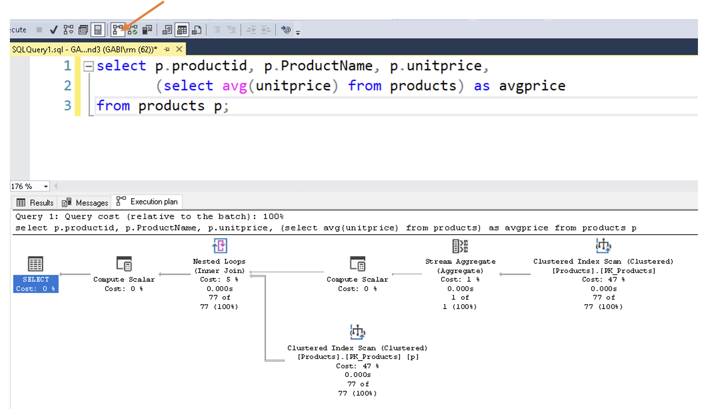

W DataGrip użyj opcji Explain Plan/Explain Analyze


---

> Wyniki:

Różnice w czasie wykonania zapytania są marginalne ze względu na rozmiar tabeli `products` (77 wierszy) - w rezultacie nie ma sensu porównywanie czasu wykonania zapytań.

```sql
--subquery
select p.productid, p.productname, p.unitprice,
       (select avg(unitprice) from products) as avgprice
from products p;
```

**Postgres:**
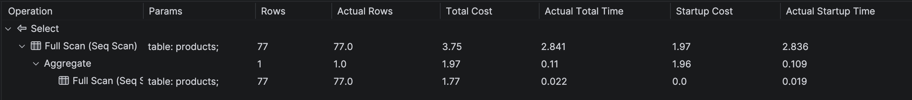

**MSSQL:**
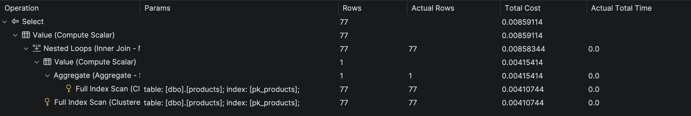

**SQLite:**
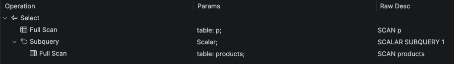

```sql
--join
select p.productid, p.productname, p.unitprice, sub.avgprice
from products p
cross join (
    select avg(unitprice) as avgprice
    from products
) sub;
```

**Postgres:**
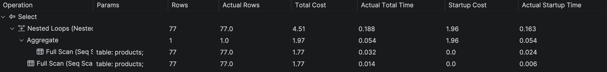

**MSSQL:**
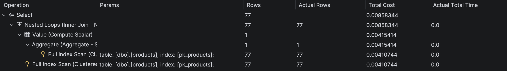

**SQLite:**
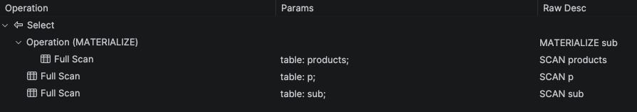

```sql
--window function
select p.productid, p.productname, p.unitprice,
       avg(p.unitprice) over () as avgprice
from products p;
```

**Postgres:**
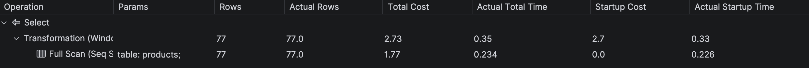

**MSSQL:**
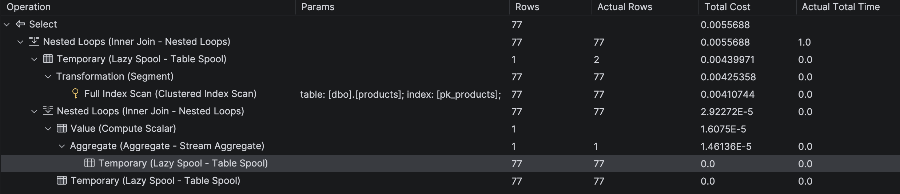

**SQLite:**
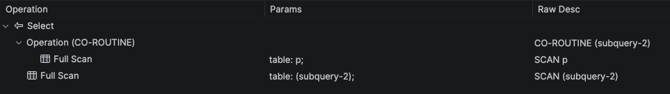

---

# Zadanie 4

Baza: Northwind, tabela products

Napisz polecenie, które zwraca: id produktu, nazwę produktu, cenę produktu, średnią cenę produktów w kategorii, do której należy dany produkt. Wyświetl tylko pozycje (produkty) których cena jest większa niż średnia cena.

Napisz polecenie z wykorzystaniem podzapytania, join'a oraz funkcji okna. Porównaj zapytania. Porównaj czasy oraz plany wykonania zapytań.

Przetestuj działanie w różnych SZBD (MS SQL Server, PostgreSql, SQLite)

---

> Wyniki: W MSSQL plan wykonania jest dostosowany przez optymalizator i podmieniony na najbardziej optymalny (`totalTime` bliskie 0). W przypadku Postgresql i SQLite plan wykonania jest zgodny z napisanym zapytaniem.

```sql
--subquery
select p1.ProductID, p1.ProductName, p1.UnitPrice, (
    select avg(p2.unitprice)
    from products p2
    where p1.categoryid = p2.categoryid
) as AvgCategoryPrice
from Products p1
where p1.UnitPrice > (select avg(p3.UnitPrice) from Products p3 where p1.CategoryID = p3.CategoryID)
order by p1.ProductID;
```

**Postgres:**
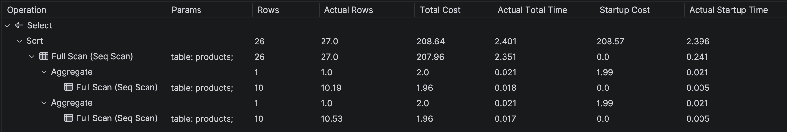

**MSSQL:**
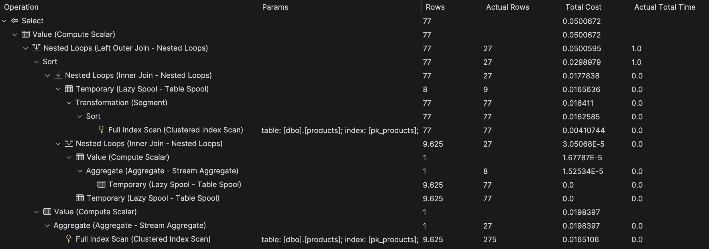

**SQLite:**
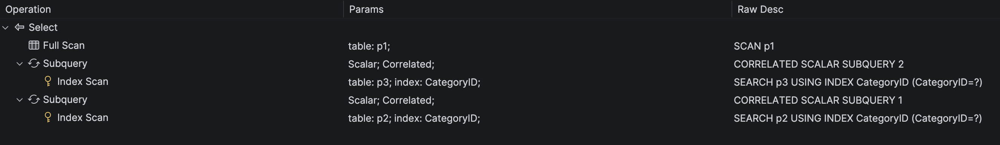

```sql
--join
with t as (
	select CategoryID, avg(UnitPrice) as AvgPrice from Products
	group by CategoryID
)
select p.ProductID, p.ProductName, p.UnitPrice, t.AvgPrice from Products p
join t on p.CategoryID = t.CategoryID
where p.UnitPrice > t.AvgPrice
order by p.ProductID;
```

**Postgres:**
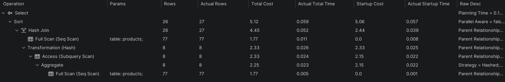

**MSSQL:**
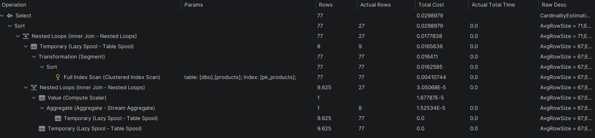

**SQLite:**
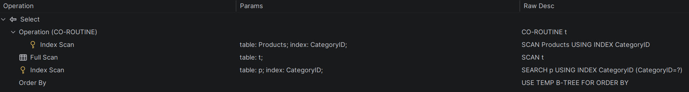

```sql
--window function
with t as (
	select p.ProductID, p.ProductName, p.UnitPrice, avg(p.UnitPrice) over(partition by p.CategoryID) as AvgPrice from Products p
)
select ProductID, ProductName, UnitPrice, AvgPrice from t
where UnitPrice > AvgPrice
order by ProductID;
```

**Postgres:**
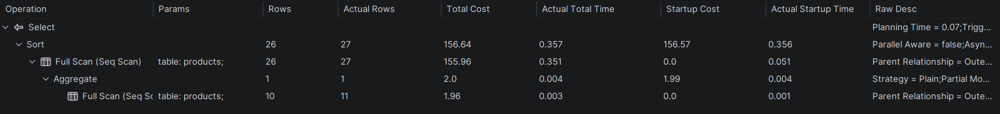

**MSSQL:**
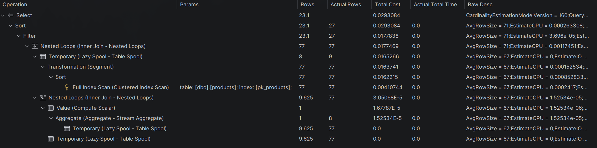

**SQLite:**
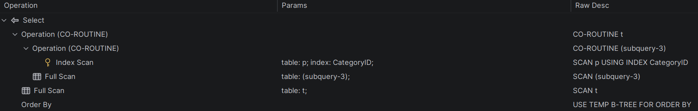

---

# Zadanie 5

Oryginalna baza Northwind jest bardzo mała. Warto zaobserwować działanie na nieco większym zbiorze danych.

Baza Northwind3 zawiera dodatkową tabelę product_history

- 2,2 mln wierszy

Bazę Northwind3 można pobrać z moodle (zakładka - Backupy baz danych)

Można też wygenerować tabelę product_history przy pomocy skryptu

Skrypt dla SQL Srerver

Stwórz tabelę o następującej strukturze:

```sql
create table product_history(
   id int identity(1,1) not null,
   productid int,
   productname varchar(40) not null,
   supplierid int null,
   categoryid int null,
   quantityperunit varchar(20) null,
   unitprice decimal(10,2) null,
   quantity int,
   value decimal(10,2),
   date date,
 constraint pk_product_history primary key clustered
    (id asc )
)
```

Wygeneruj przykładowe dane:

Dla 30000 iteracji, tabela będzie zawierała nieco ponad 2mln wierszy (dostostu ograniczenie do możliwości swojego komputera)

Skrypt dla SQL Srerver

```sql
declare @i int
set @i = 1
while @i <= 30000
begin
    insert product_history
    select productid, ProductName, SupplierID, CategoryID,
         QuantityPerUnit,round(RAND()*unitprice + 10,2),
         cast(RAND() * productid + 10 as int), 0,
         dateadd(day, @i, '1940-01-01')
    from products
    set @i = @i + 1;
end;

update product_history
set value = unitprice * quantity
where 1=1;
```

Skrypt dla Postgresql

```sql
create table product_history(
   id int generated always as identity not null
       constraint pkproduct_history
            primary key,
   productid int,
   productname varchar(40) not null,
   supplierid int null,
   categoryid int null,
   quantityperunit varchar(20) null,
   unitprice decimal(10,2) null,
   quantity int,
   value decimal(10,2),
   date date
);
```

Wygeneruj przykładowe dane:

Skrypt dla Postgresql

```sql
do $$
begin
  for cnt in 1..30000 loop
    insert into product_history(productid, productname, supplierid,
           categoryid, quantityperunit,
           unitprice, quantity, value, date)
    select productid, productname, supplierid, categoryid,
           quantityperunit,
           round((random()*unitprice + 10)::numeric,2),
           cast(random() * productid + 10 as int), 0,
           cast('1940-01-01' as date) + cnt
    from products;
  end loop;
end; $$;

update product_history
set value = unitprice * quantity
where 1=1;
```

Wykonaj polecenia: `select count(*) from product_history`, potwierdzające wykonanie zadania

---

> Wyniki:

```sql
select count(*) from product_history;
```

**Postgres:**

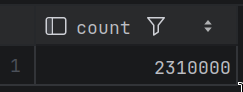

**MSSQL:**

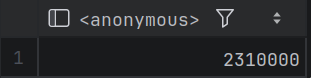

**SQLite:**

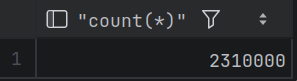

# Zadanie 6

Baza: Northwind, tabela product_history

Napisz polecenie, które zwraca: id pozycji, id produktu, nazwę produktu, id_kategorii, cenę produktu, średnią cenę produktów w kategorii do której należy dany produkt. Wyświetl tylko pozycje (produkty) których cena jest większa niż średnia cena.

W przypadku długiego czasu wykonania ogranicz zbiór wynikowy do kilkuset/kilku tysięcy wierszy

pomocna może być konstrukcja `with`

```sql
with t as (

....
)
select * from t
where id between ....
```

Napisz polecenie z wykorzystaniem podzapytania, join'a oraz funkcji okna. Porównaj zapytania. Porównaj czasy oraz plany wykonania zapytań.

Przetestuj działanie w różnych SZBD (MS SQL Server, PostgreSql, SQLite)

---

> Wyniki: Z podzapytaniem tylko MSSQL poradził sobie w skończonym czasie (457ms, 45ms dla ograniczonego zbioru), prawdopodobnie przez paralelizm. Postgresql i SQLite wypadly znacznie gorzej ~1 minuta na ograniczonym zbiorze, a dla pełnego zbioru zapytanie nie zostało ukończone w rozsądnym czasie. Przy joinie wyniki wyniosły odpowiednio MSSQL 458ms, Postgresql 1s, SQLite 1s. Przy funkcji okna MSSQL znów był najszybszy ~500ms, Postgresql 1.6s, SQLite 2s.

> DataGrip wskazał, że w przypadku MSSQL warto dodać indeks na kolumnie `categoryid` w tabeli `product_history`.

```sql
--subquery
select p1.id, p1.productid, p1.productname, p1.categoryid, p1.unitprice, (
    select avg(p2.unitprice)
    from product_history p2
    where p1.categoryid = p2.categoryid
) as AvgCategoryPrice
from product_history p1
where p1.unitprice > (
    select avg(p3.unitprice)
    from product_history p3
    where p1.categoryid = p3.categoryid
)
order by p1.productid;
```

**MSSQL:**
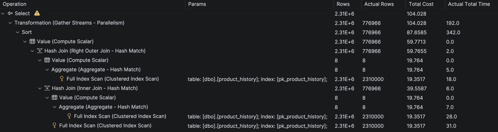

```sql
-- subquery (reduced)
with t as (
    select p1.id, p1.productid, p1.productname, p1.categoryid, p1.unitprice, (
        select avg(p2.unitprice)
        from product_history p2
        where p1.categoryid = p2.categoryid
    ) as AvgCategoryPrice
    from product_history p1
    where p1.unitprice > (
        select avg(p3.unitprice)
        from product_history p3
        where p1.categoryid = p3.categoryid
    )
)
select *
from t
where t.id between 1000 and 1500
order by t.productid;
```

**Postgres:**
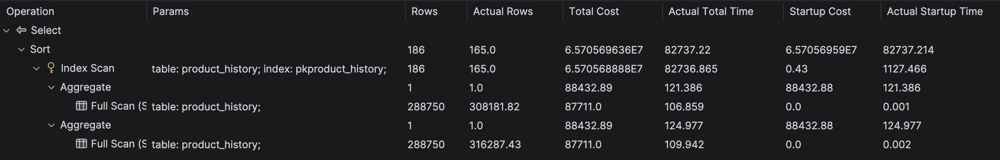

**SQLite:**
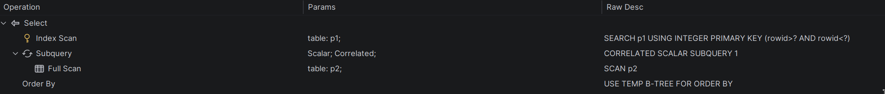

```sql
--join
with t as (
	select categoryid, avg(unitprice) as avgprice
	from product_history
	group by categoryid
)
select p.id, p.productid, p.productname, p.unitprice, p.categoryid, t.avgprice
from product_history p
join t on p.categoryid = t.categoryid
where p.unitprice > t.avgprice
order by p.productid;
```

**Postgres:**
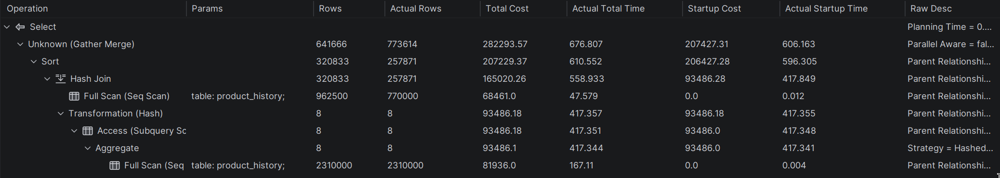

**MSSQL:**
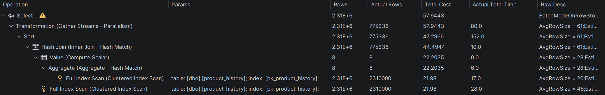

**SQLite:**
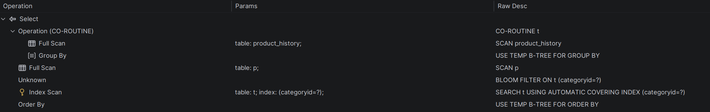

```sql
--window function
with t as (
	select p.id, p.productid, p.productname, p.unitprice, p.categoryid, avg(p.unitprice) over(partition by p.categoryid) as avgprice
	from product_history p
)
select id, productid, productname, unitprice, categoryid, avgprice
from t
where unitprice > avgprice
order by productid;
```

**Postgres:**
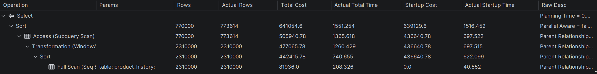

**MSSQL:**
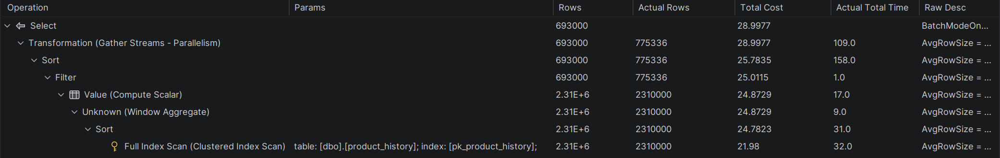

**SQLite:**
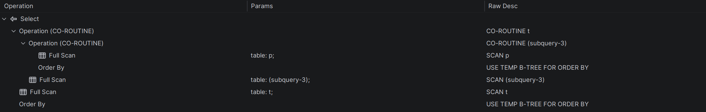

---

|         |     |
| ------- | --- |
| zadanie | pkt |
| 1       | 1   |
| 2       | 1   |
| 3       | 1   |
| 4       | 1   |
| 5       | 1   |
| 6       | 2   |
| razem:  | 7   |
