---
header-includes:
  - \usepackage{float}
  - \floatplacement{figure}{H}
---

## SQL - Funkcje okna (Window functions) <br> Lab 2

---

**Imiona i nazwiska:** Mateusz Lampert, Marek Małek

---

Celem ćwiczenia jest zapoznanie się z działaniem funkcji okna (window functions) w SQL, analiza wydajności zapytań i porównanie z rozwiązaniami przy wykorzystaniu "tradycyjnych" konstrukcji SQL

Swoje odpowiedzi wpisuj w miejsca oznaczone jako:

---

> Wyniki:

```sql
--  ...
```

---

### Ważne/wymagane są komentarze

Zamieść kod rozwiązania oraz zrzuty ekranu pokazujące wyniki, (dołącz kod rozwiązania w formie tekstowej/źródłowej)

Zwróć uwagę na formatowanie kodu

---

## Oprogramowanie - co jest potrzebne?

Do wykonania ćwiczenia potrzebne jest następujące oprogramowanie:

- MS SQL Server - wersja 2019, 2022
- PostgreSQL - wersja 15/16/17
- SQLite
- Narzędzia do komunikacji z bazą danych
  - SSMS - Microsoft SQL Managment Studio
  - DtataGrip lub DBeaver
- Przykładowa baza Northwind/Northwind3
  - W wersji dla każdego z wymienionych serwerów

Oprogramowanie dostępne jest na przygotowanej maszynie wirtualnej

## Dokumentacja/Literatura

- Kathi Kellenberger,  Clayton Groom, Ed Pollack, Expert T-SQL Window Functions in SQL Server 2019, Apres 2019
- Itzik Ben-Gan, T-SQL Window Functions: For Data Analysis and Beyond, Microsoft 2020

- Kilka linków do materiałów które mogą być pomocne
   - [https://learn.microsoft.com/en-us/sql/t-sql/queries/select-over-clause-transact-sql?view=sql-server-ver16](https://learn.microsoft.com/en-us/sql/t-sql/queries/select-over-clause-transact-sql?view=sql-server-ver16)
  - [https://www.sqlservertutorial.net/sql-server-window-functions/](https://www.sqlservertutorial.net/sql-server-window-functions/)
  - [https://www.sqlshack.com/use-window-functions-sql-server/](https://www.sqlshack.com/use-window-functions-sql-server/)
  - [https://www.postgresql.org/docs/current/tutorial-window.html](https://www.postgresql.org/docs/current/tutorial-window.html)
  - [https://www.postgresqltutorial.com/postgresql-window-function/](https://www.postgresqltutorial.com/postgresql-window-function/)
  - [https://www.sqlite.org/windowfunctions.html](https://www.sqlite.org/windowfunctions.html)
  - [https://www.sqlitetutorial.net/sqlite-window-functions/](https://www.sqlitetutorial.net/sqlite-window-functions/)

- W razie potrzeby - opis Ikonek używanych w graficznej prezentacji planu zapytania w SSMS jest tutaj:
  - [https://docs.microsoft.com/en-us/sql/relational-databases/showplan-logical-and-physical-operators-reference](https://docs.microsoft.com/en-us/sql/relational-databases/showplan-logical-and-physical-operators-reference)

## Przygotowanie

Uruchom SSMS
- Skonfiguruj połączenie z bazą Northwind na lokalnym serwerze MS SQL 

Uruchom DataGrip (lub Dbeaver)

- Skonfiguruj połączenia z bazą Northwind3
  - na lokalnym serwerze MS SQL
  - na lokalnym serwerze PostgreSQL
  - z lokalną bazą SQLite

Można też skorzystać z innych narzędzi klienckich (wg własnego uznania)

Oryginalna baza Northwind jest bardzo mała. Warto zaobserwować działanie na nieco większym zbiorze danych.

Korzystamy ze "zmodyfikowanej wersji" bazy northwind

Baza Northwind3 zawiera dodatkową tabelę product_history

- 2,2 mln wierszy

Bazę Northwind3 można pobrać z moodle (zakładka - Backupy baz danych)

# Zadanie 1

Funkcje rankingu, `row_number()`, `rank()`, `dense_rank()`

```sql
select productid, productname, unitprice, categoryid,
    row_number() over(partition by categoryid order by unitprice desc) as rowno,
    rank() over(partition by categoryid order by unitprice desc) as rankprice,
    dense_rank() over(partition by categoryid order by unitprice desc) as denserankprice
from products;
```

Wykonaj polecenie, zaobserwuj wynik. Porównaj funkcje row_number(), rank(), dense_rank(). Skomentuj wyniki.

Spróbuj uzyskać ten sam wynik bez użycia funkcji okna

Do analizy użyj wybranego systemu/bazy danych - wybierz MS SQLserver, Postgres lub SQLite.

---

> Wyniki:

Analiza została przeprowadzona z wykorzystaniem bazy danych PostgreSQL.

Wynik zapytania z polecenia:


Komentarz:

- `row_number` to numer danego wiersza wewnątrz okna, zgodnie z zadaną kolejnością (tutaj: `unitprice desc`, natomiast zgodnie z [dokumentacją oracle](https://docs.oracle.com/cd/B19306_01/server.102/b14200/functions137.htm), funkcja `row_number` nie jest deterministyczna w przypadku remisów). W przypadku `row_number` nie ma remisów w wartościach, zawsze dostajemy wartości `1..<ilosc wierszy w oknie>`.
- `rank` to ranga danego wiersza wewnątrz okna, zgodnie z zadaną kolejnością (tutaj: `unitprice desc`). W przypadku remisów, wszystkie wiersze o tej samej wartości dostają tę samą rangę `r`, natomiast wiersze o następnej w kolejności wartości dostają rangę `r+k`, gdzie `k`-ilość remisujących wierszy. `rank` zawsze przyjmowało wartości `1..<ilosc wierszy w oknie>`.
- `dense_rank` działa podobnie jak `rank`, natomiast w przypadku remisów, wszystkie wiersze o tej samej wartości dostają tę samą rangę `r`, a wiersze o następnej w kolejności wartości dostają rangę `r+1` (nie przeskakujemy wartości).

Te same wyniki można także uzyskać nie korzystając z funkcji okna, z wykorzystaniem podzapytań lub instrukcji `join`:

- `row_number`:

```sql
--  row_number() z inner-join
select p1.productid, p1.productname, p1.unitprice, p1.categoryid, count(p2.productid) + 1 as rowno_custom
from products p1
         left join products p2
              on p2.categoryid = p1.categoryid and
                 (p2.unitprice > p1.unitprice or (p2.unitprice = p1.unitprice and p2.productid < p1.productid))
group by p1.productid, p1.productname, p1.unitprice, p1.categoryid
order by p1.categoryid, rowno_custom;

-- row_number() z subquery
select productid, productname, unitprice, categoryid,
    (
        select count(*) + 1
        from products p2
        where p2.categoryid = p1.categoryid
            and (
                p2.unitprice > p1.unitprice
                or (p2.unitprice = p1.unitprice and p2.productid < p1.productid)
            )
    ) as rowno_custom
from products p1
order by p1.categoryid, rowno_custom;
```

- `rank`:

```sql
-- rank() z inner-join
select p1.productid, p1.productname, p1.unitprice, p1.categoryid, count(p2.productid) + 1 as rankprice_custom
from products p1
         left join products p2
                   on p2.categoryid = p1.categoryid and p2.unitprice > p1.unitprice
group by p1.productid, p1.productname, p1.unitprice, p1.categoryid
order by p1.categoryid, rankprice_custom;

-- rank() z subquery
select productid, productname, unitprice, categoryid,
    (
        select count(*) + 1
        from products p2
        where p2.unitprice > p1.unitprice and p2.categoryid = p1.categoryid
    ) as rankprice_custom
from products p1
order by p1.categoryid, rankprice_custom;
```

- `dense_rank`:

```sql
-- dense_rank() z inner-join
select p1.productid, p1.productname, p1.unitprice, p1.categoryid, count(distinct p2.unitprice) + 1 as denserankprice_custom
from products p1
         left join products p2
                   on p2.categoryid = p1.categoryid and p2.unitprice > p1.unitprice
group by p1.productid, p1.productname, p1.unitprice, p1.categoryid
order by p1.categoryid, denserankprice_custom;

-- dense_rank() z subquery
select productid, productname, unitprice, categoryid,
    (
        select count(distinct p2.unitprice) + 1
        from products p2
        where p2.unitprice > p1.unitprice and p2.categoryid = p1.categoryid
    ) as denserankprice_custom
from products p1
order by p1.categoryid, denserankprice_custom;
```

W celu porównania wyników uruchamiamy zapytanie łączące wszystkie te zapytania:

```sql
with custom_rn as (select p1.productid,
                          count(p2.productid) + 1 as rowno_custom
                   from products p1
                            left join products p2
                                      on p2.categoryid = p1.categoryid and
                                         (p2.unitprice > p1.unitprice or
                                          (p2.unitprice = p1.unitprice and p2.productid < p1.productid))
                   group by p1.productid),
     custom_rk as (select p1.productid,
                          count(p2.productid) + 1 as rankprice_custom
                   from products p1
                            left join products p2
                                      on p2.categoryid = p1.categoryid and
                                         p2.unitprice > p1.unitprice
                   group by p1.productid),
     custom_dk as (select p1.productid,
                          count(distinct p2.unitprice) + 1 as denserankprice_custom
                   from products p1
                            left join products p2
                                      on p2.categoryid = p1.categoryid and
                                         p2.unitprice > p1.unitprice
                   group by p1.productid)
select p.productid,
       p.productname,
       p.unitprice,
       p.categoryid,
       custom_rn.rowno_custom,
       row_number() over (partition by categoryid order by p.unitprice desc, p.productid) as rowno,
       custom_rk.rankprice_custom,
       rank() over (partition by categoryid order by p.unitprice desc)                    as rankprice,
       custom_dk.denserankprice_custom,
       dense_rank() over (partition by categoryid order by p.unitprice desc)              as denserankprice
from products p
         join custom_rn on custom_rn.productid = p.productid
         join custom_rk on custom_rk.productid = p.productid
         join custom_dk on custom_dk.productid = p.productid
order by p.categoryid, custom_rn.rowno_custom;
```

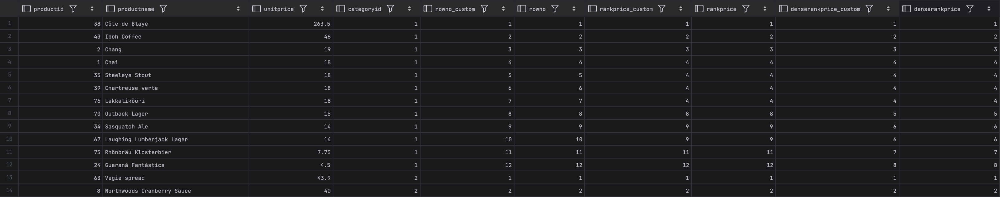

W celu upewnienia się, że wszystkie wartości naszych odpowiedników są identyczne jak te z zapytań korzystających z funkcji okna, korzystamy z dwukierunkowego zapytania `except` (dzięki temu możemy sprawdzić czy w wyniku dostajemy identyczne wiersze, czy istnieją jakieś różnice):

```sql
with q1 as (with custom_rn as (select p1.productid,
                                      count(p2.productid) + 1 as rowno
                               from products p1
                                        left join products p2
                                                  on p2.categoryid = p1.categoryid and
                                                     (p2.unitprice > p1.unitprice or
                                                      (p2.unitprice = p1.unitprice and p2.productid < p1.productid))
                               group by p1.productid),
                 custom_rk as (select p1.productid,
                                      count(p2.productid) + 1 as rankprice
                               from products p1
                                        left join products p2
                                                  on p2.categoryid = p1.categoryid and
                                                     p2.unitprice > p1.unitprice
                               group by p1.productid),
                 custom_dk as (select p1.productid,
                                      count(distinct p2.unitprice) + 1 as denserankprice
                               from products p1
                                        left join products p2
                                                  on p2.categoryid = p1.categoryid and
                                                     p2.unitprice > p1.unitprice
                               group by p1.productid)
            select p.productid,
                   p.productname,
                   p.unitprice,
                   p.categoryid,
                   custom_rn.rowno,
                   custom_rk.rankprice,
                   custom_dk.denserankprice
            from products p
                     join custom_rn on custom_rn.productid = p.productid
                     join custom_rk on custom_rk.productid = p.productid
                     join custom_dk on custom_dk.productid = p.productid
            order by p.categoryid, custom_rn.rowno),
     q2 as (select p.productid,
                   p.productname,
                   p.unitprice,
                   p.categoryid,
                   row_number() over (partition by categoryid order by p.unitprice desc, p.productid) as rowno,
                   rank() over (partition by categoryid order by p.unitprice desc)                    as rankprice,
                   dense_rank() over (partition by categoryid order by p.unitprice desc)              as denserankprice
            from products p
            order by p.categoryid)
(select * from q1 except select * from q2)
union all
(select * from q2 except select * from q1);
```

Wynik:

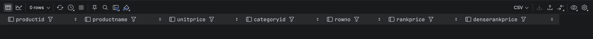

Jak widać na załączonym zrzucie ekranu, wszystkie funkcje oraz nasze customowe odpowiedniki dają identyczne rezultaty (zapytanie zwraca 0 wierszy, co oznacza, wynikowy zbiór jest identyczny dla obu zapytań).

Ze względu na różnicę w wydajności podzapytania względem `inner-joina`, w dalszej części konspektu będziemy korzystać z metody wykorzystującej `inner-joina` (porównanie wykonane dla silnika Postgres oraz funkcji `row_number`, wydajność pozostałych funkcji ma podobną charakterystykę):

- funkcja okna:


- `inner-join`:

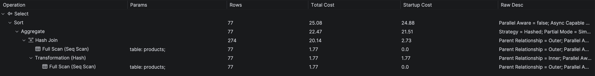

- podzapytanie:


# Zadanie 2

Baza: Northwind, tabela product_history

Dla każdego produktu, podaj 4 najwyższe ceny tego produktu w danym roku. Zbiór wynikowy powinien zawierać:

- rok
- id produktu
- nazwę produktu
- cenę
- datę (datę uzyskania przez produkt takiej ceny)
- pozycję w rankingu

- Uporządkuj wynik wg roku, nr produktu, pozycji w rankingu

W przypadku długiego czasu wykonania ogranicz zbiór wynikowy.

Spróbuj uzyskać ten sam wynik bez użycia funkcji okna, porównaj wyniki, czasy i plany zapytań (koszty).

Przetestuj działanie w różnych SZBD (MS SQL Server, PostgreSql, SQLite)

---

> Wyniki:

W przypadku zapytania wykorzystującego funkcję okna, korzystamy z funkcji `dense_rank`, a następnie wybieramy unikalne unikalne wartości `(rok, productid, cena)` z `denserankprice < 4` - w rezultacie uzyskamy 4 najwyższe ceny, bez względu na występujące remisy. Ze względu na długi czas wykonania `explain analyse` (w przypadku zapytania z `inner-join`, zapytanie z funkcją okna działa bardzo szybko), zbiór wynikowy został ograniczony jedynie do produktów o `productid < 10`.

```sql
-- zapytanie wykorzystujące dense_rank()

with t as (select distinct on (extract(year from date), productid, unitprice)
              extract(year from date) as year,
              productid,
              productname,
              unitprice,
              date,
              dense_rank() over (
                  partition by extract(year from date), productid
                  order by unitprice desc
                  )                   as denserankprice
           from product_history p)
select *
from t
where t.denserankprice <= 4 and t.productid < 10
order by year, productid, unitprice desc;

-- zapytanie bez funkcji okna (inner-join)

with t as (select distinct on (extract(year from date), productid, unitprice)
              extract(year from date) as year,
              productid,
              productname,
              unitprice,
              date
           from product_history),
     dr as (select p1.year,
                   p1.productid,
                   p1.productname,
                   p1.unitprice,
                   p1.date,
                   count(distinct p2.unitprice) + 1 as denserankprice
            from t p1
                     left join t p2 on p2.year = p1.year and p2.productid = p1.productid and p2.unitprice > p1.unitprice
            group by p1.year, p1.productid, p1.productname, p1.unitprice, p1.date)
select *
from dr
where denserankprice <= 4 and productid < 10
order by year, productid, unitprice desc;
```

Rezultaty:

- z funkcją okna:


- z `inner-join`:

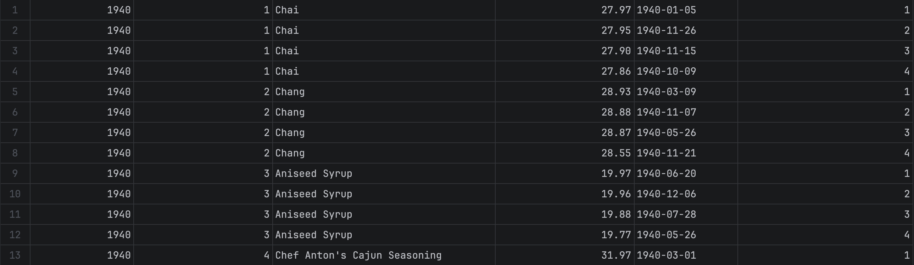

W celu zweryfikowania poprawności zapytania niekorzystającego z funkcji okna, tworzymy zapytanie korzystające z dwukierunkowego `except`. Ze względu na fakt, że ceny o danej randze mogły zostać zaobserwowane w różnych dniach, a zadanie nie specyfikowała, która data powinna być zawarta w zbiorze wynikowym, data nie jest brana pod uwagę przy porównywaniu dwóch zbiorów wynikowych:

```sql
with q1 as (with t
                     as (select distinct on (extract(year from date), productid, unitprice)
                            extract(year from date) as year,
                            productid,
                            productname,
                            unitprice,
                            date,
                            dense_rank() over (
                                partition by extract(year from date), productid
                                order by unitprice desc
                                )                   as denserankprice
                         from product_history p)
            select *
            from t
            where t.denserankprice <= 4
              and t.productid < 10
            order by year, productid, unitprice desc),
     q2 as (with t
                     as (select distinct on (extract(year from date), productid, unitprice)
                            extract(year from date) as year,
                            productid,
                            productname,
                            unitprice,
                            date
                         from product_history),
                 dr as (select p1.year,
                               p1.productid,
                               p1.productname,
                               p1.unitprice,
                               p1.date,
                               count(distinct p2.unitprice) + 1 as denserankprice
                        from t p1
                                 left join t p2 on p2.year = p1.year and p2.productid = p1.productid and
                                                   p2.unitprice > p1.unitprice
                        group by p1.year, p1.productid, p1.productname, p1.unitprice, p1.date)
            select *
            from dr
            where denserankprice <= 4
              and productid < 10
            order by year, productid, unitprice desc)
    (select year, productid, productname, unitprice, denserankprice
     from q1
     except
     select year, productid, productname, unitprice, denserankprice
     from q2)
union all
(select year, productid, productname, unitprice, denserankprice
 from q2
 except
 select year, productid, productname, unitprice, denserankprice
 from q1);
```

Wyniki:


W przypadku uwzględnienia daty w zapytaniu porównującym te dwa podejścia, obserwujemy pewne różnice (natomiast dla każdego produktu, ceny o danej randze są identyczne, wiersze różnią się wyłącznie datą wystąpienia):

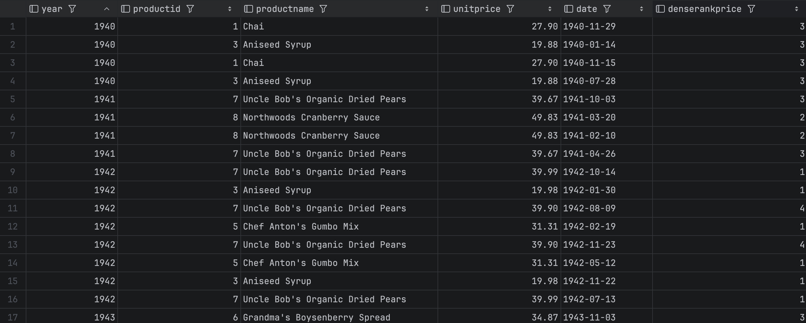

Zapytania dla MSSQL oraz SQLite są generalnie identyczne, z dokładnością do wyciągania roku z daty:

```sql
-- postgres
extract(year from date) as year

-- mssql
year(date) as year

-- sqlite
strftime('%Y', date) as year
```

Porównanie planów zapytań (Postgres):

- zapytanie z `dense_rank`


- zapytanie z `inner-join`

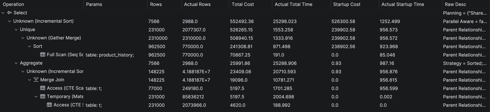

Wnioski:

- zapytanie wykorzystujące funkcję okna (`dense_rank`), charakteryzuje się ponad 4-krotnie niższym kosztem (`total cost`)
- faktyczny czas wykonania zapytania jest ~50 razy krótszy (`actual total time`)
- wiersze w zapytaniu z `inner-join` musiały się zmaterializować, w rezultacie tworzonych jest 85 milionów wierszy pośrednich
- oczekiwana liczba wierszy (`rows`) jest mocno niedoszacowana względem faktycznej liczby wierszy (`actual rows`), co może skutkować złym wyborem planu wykonania zapytania.

Alternatywne zapytanie korzystające z subquery nie wykonało się w rozsądnym czasie, nawet na ograniczonym zbiorze danych.

Porównanie planów zapytań - MSSQL:

- zapytanie z `dense_rank`

  

- zapytanie z `inner-join`

  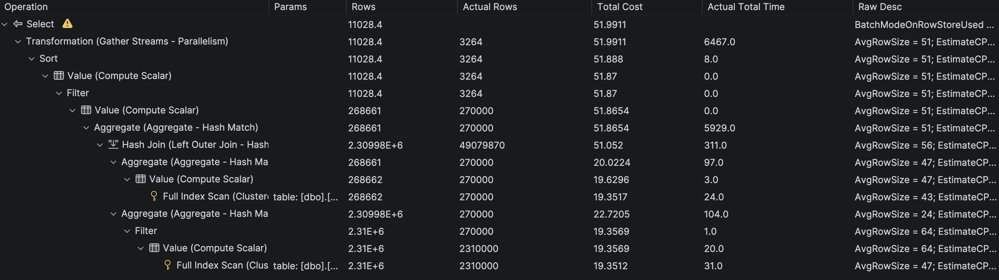

Wnioski:

- dla ograniczonego zapytania, całkowity koszt zapytania z funkcją okna jest około 2,5 raza niższy względem zapytania z `joinem`, a faktyczny czas zapytania jest ~90 razy niższy.
- zapytanie jest zdecydowanie szybsze w porównaniu do Postgresa (~7 razy dla funkcji okna oraz ~4 razy dla zapytania z `joinem`)
- zapytanie na nieograniczonym zbiorze wykonało się w rozsądnym czasie zarówno dla zapytania z funkcją okna oraz `joinem` (~200 razy niższy całkowity koszt zapytania, zapytanie z funkcją okna wykonywało się około 400ms, zapytaniem z `joinem` około 1,5 minuty)

Porównanie wydajności i planów zapytań - SQLite:

- z funkcją `dense_rank`:


- z `inner-join`:

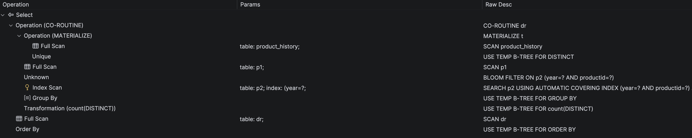

Wnioski:

- zapytanie korzystające z funkcji okna dla ograniczonego zbioru danych wykonuje się poniżej 1 sekundy, w przypadku zapytania z `joinem` czas wykonania zapytania wynosi około 1 minuty (nie są to jednak dokładne wyniki ze względu na paginację, a SQLite nie posiada opcji `explain analyse` z dokładną informacją odnośnie faktycznego czasu wykonania zapytania)
- w planie zapytania z `inner-joinem` widzimy, że dane muszą się faktycznie zmaterializować

---

# Zadanie 3

Funkcje `lag()`, `lead()`

Wykonaj polecenia, zaobserwuj wynik. Jak działają funkcje `lag()`, `lead()`

```sql
select productid, productname, categoryid, date, unitprice,
       lag(unitprice) over (partition by productid order by date)
as previousprodprice,
       lead(unitprice) over (partition by productid order by date)
as nextprodprice
from product_history
where productid = 1 and year(date) = 2022
order by date;

with t as (select productid, productname, categoryid, date, unitprice,
                  lag(unitprice) over (partition by productid
order by date) as previousprodprice,
                  lead(unitprice) over (partition by productid
order by date) as nextprodprice
           from product_history
           )
select * from t
where productid = 1 and year(date) = 2022
order by date;
```

Jak działają funkcje `lag()`, `lead()`?

Spróbuj uzyskać ten sam wynik bez użycia funkcji okna

Do analizy użyj wybranego systemu/bazy danych (wybierz MS SQLserver, Postgres lub SQLite).

---

> Wyniki:

Początek wyniku:
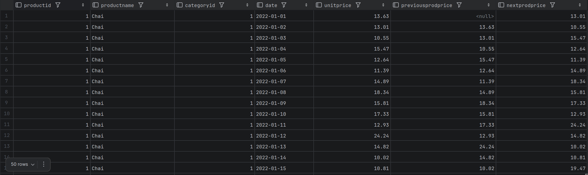

Koniec wyniku:
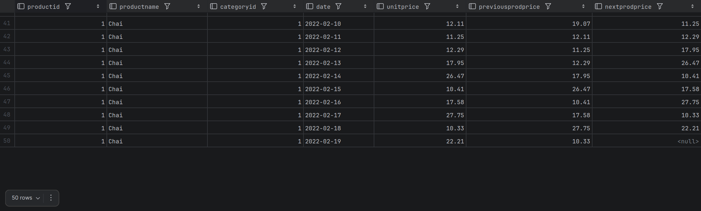

Według sygnatury z [dokumentacji](https://www.postgresql.org/docs/current/functions-window.html) `PostgreSQL` funkcja `lag()` zwraca wartość z poprzedniego wiersza co do offsetu, a `lead()` zwraca wartość z następnego wiersza co do offsetu. W przypadku braku takiego wiersza zwracana jest wartość domyślna. W naszym przypadku (brak podania offsetu i wartości domyślnej) offset jest równy 1, a wartość domyślna jest równa NULL. Oznacza to, że funkcja `lag()` zwraca cenę produktu z poprzedniego dnia, a `lead()` zwraca cenę produktu z następnego dnia. W przypadku pierwszego wiersza (brak poprzedniego dnia) funkcja `lag()` zwraca NULL, a w przypadku ostatniego wiersza (brak następnego dnia) funkcja `lead()` zwraca NULL.

Podejście bez funkcji okna:

```sql
-- podzapytanie
select ph.productid,
       ph.productname,
       ph.categoryid,
       ph.date,
       ph.unitprice,
       (select ph2.unitprice
        from product_history ph2
        where ph2.productid = ph.productid
          and ph2.date < ph.date
          and extract(year from date) = 2022
        order by ph2.date desc
        limit 1) as previousprodprice,
       (select ph3.unitprice
        from product_history ph3
        where ph3.productid = ph.productid
          and ph3.date > ph.date
          and extract(year from date) = 2022
        order by ph3.date
        limit 1) as nextprodprice
from product_history ph
where ph.productid = 1
  and extract(year from ph.date) = 2022
order by ph.date;
```

```sql
-- joiny
select ph.productid,
       ph.productname,
       ph.categoryid,
       ph.date,
       ph.unitprice,
       ph_prev.unitprice as previousprodprice,
       ph_next.unitprice as nextprodprice
from product_history ph
         left join product_history ph_prev on ph.productid = ph_prev.productid
    and ph_prev.date = (select max(date)
                        from product_history
                        where productid = ph.productid
                          and date < ph.date
                          and extract(year from date) = 2022)
         left join product_history ph_next on ph.productid = ph_next.productid
    and ph_next.date = (select min(date)
                        from product_history
                        where productid = ph.productid
                          and date > ph.date
                          and extract(year from date) = 2022)
where ph.productid = 1
  and extract(year from ph.date) = 2022
order by ph.date;
```

Porównanie wyników klazulą `except` w obie strony dało pusty zbiór wynikowy, co oznacza, że wyniki są takie same dla wszystkich trzech podejść.

Porównanie planów wykonania dla różnych podejść:

- funkcje okna:
  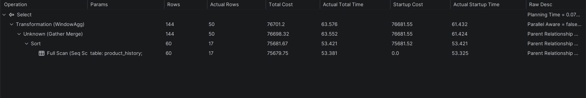

- podzapytanie:
  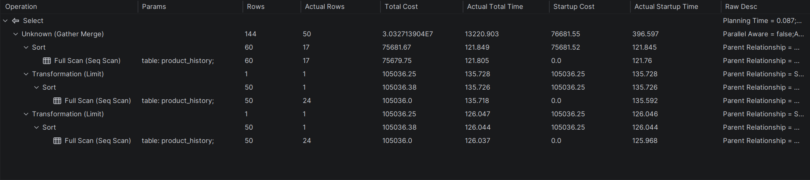

- joiny:
  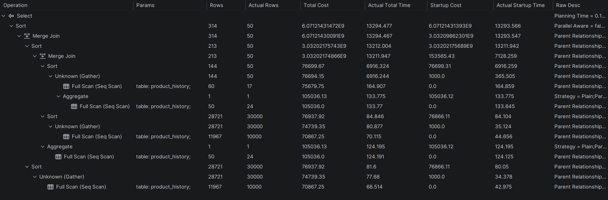

Wnioski:

- podejście z funkcjami okna jest znacznie szybsze niż podzapytanie i joiny, co widać po czasie wykonania i kosztach
- funkcja okna wykonuje jeden skan tabeli `product_history`, natomiast podzapytanie i joiny wykonują wiele skanów tej tabeli (po jednym dla każdego wiersza), co jest przyczyną dłuższego czasu wykonania

---

# Zadanie 4

Baza: Northwind, tabele customers, orders, order details

Napisz polecenie które wyświetla inf. o zamówieniach

Zbiór wynikowy powinien zawierać:

- nazwę klienta,
- nr zamówienia,
- datę zamówienia,
- wartość zamówienia (wraz z opłatą za przesyłkę),
- nr poprzedniego zamówienia danego klienta,
- datę poprzedniego zamówienia danego klienta,
- wartość poprzedniego zamówienia danego klienta.

Do analizy użyj wybranego systemu/bazy danych - wybierz MS SQLserver, Postgres lub SQLite.

---

> Wyniki:

```sql
-- PostgreSQL
with ordersummary as (select c.companyname,
                             o.orderid,
                             o.orderdate,
                             sum(od.unitprice * od.quantity * (1 - od.discount)) + o.freight as ordertotal
                      from orders o
                               join customers c on o.customerid = c.customerid
                               join orderdetails od on o.orderid = od.orderid
                      group by c.companyname, o.orderid, o.orderdate, o.freight)
select companyname,
       orderid,
       orderdate,
       ordertotal,
       lag(orderid) over (partition by companyname order by orderdate, orderid)    as prevorderid,
       lag(orderdate) over (partition by companyname order by orderdate, orderid)  as prevorderdate,
       lag(ordertotal) over (partition by companyname order by orderdate, orderid) as prevordertotal
from ordersummary
order by companyname, orderdate;
```

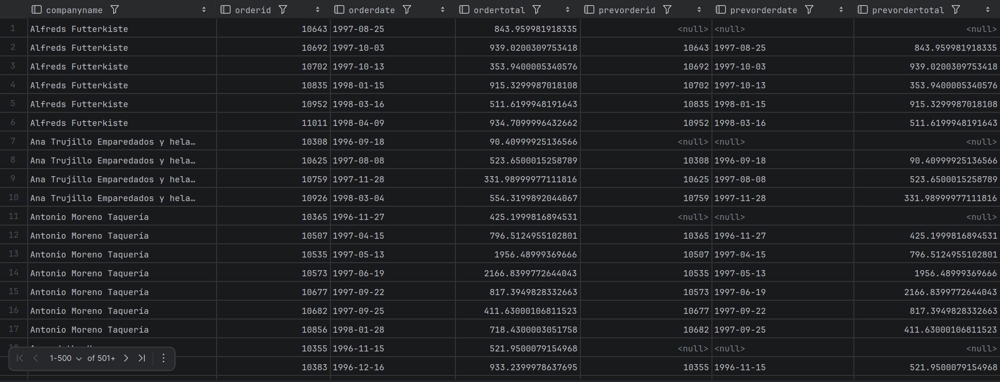

Dla każdego klienta widzimy jego zamówienia wraz z informacjami o poprzednim zamówieniu. W przypadku pierwszego zamówienia danego klienta, kolumny dotyczące poprzedniego zamówienia będą zawierały wartość `NULL`.

Podejścia bez funkcji okna:

```sql
-- podzapytanie
with ordersummary as (select c.companyname,
                             o.customerid,
                             o.orderid,
                             o.orderdate,
                             sum(od.unitprice * od.quantity * (1 - od.discount)) + o.freight as ordertotal
                      from orders o
                               join customers c on o.customerid = c.customerid
                               join orderdetails od on o.orderid = od.orderid
                      group by c.companyname, o.customerid, o.orderid, o.orderdate, o.freight)
select t1.companyname,
       t1.orderid,
       t1.orderdate,
       t1.ordertotal,
       (select t2.orderid
        from ordersummary t2
        where t2.customerid = t1.customerid
          and (t2.orderdate < t1.orderdate or (t2.orderdate = t1.orderdate and t2.orderid < t1.orderid))
        order by t2.orderdate desc, t2.orderid desc
        limit 1) as prevorderid,
       (select t2.orderdate
        from ordersummary t2
        where t2.customerid = t1.customerid
          and (t2.orderdate < t1.orderdate or (t2.orderdate = t1.orderdate and t2.orderid < t1.orderid))
        order by t2.orderdate desc, t2.orderid desc
        limit 1) as prevorderdate,
       (select t2.ordertotal
        from ordersummary t2
        where t2.customerid = t1.customerid
          and (t2.orderdate < t1.orderdate or (t2.orderdate = t1.orderdate and t2.orderid < t1.orderid))
        order by t2.orderdate desc, t2.orderid desc
        limit 1) as prevordertotal
from ordersummary t1
order by t1.companyname, t1.orderdate, t1.orderid;
```

```sql
-- joiny
with ordersummary as (select c.companyname,
                             o.customerid,
                             o.orderid,
                             o.orderdate,
                             sum(od.unitprice * od.quantity * (1 - od.discount)) + o.freight as ordertotal
                      from orders o
                               join customers c on o.customerid = c.customerid
                               join orderdetails od on o.orderid = od.orderid
                      group by c.companyname, o.customerid, o.orderid, o.orderdate, o.freight),
     ordermapping as (select t1.orderid,
                             (select t2.orderid
                              from ordersummary t2
                              where t2.customerid = t1.customerid
                                and (t2.orderdate < t1.orderdate or
                                     (t2.orderdate = t1.orderdate and t2.orderid < t1.orderid))
                              order by t2.orderdate desc, t2.orderid desc
                              limit 1) as previd
                      from ordersummary t1)
select curr.companyname,
       curr.orderid,
       curr.orderdate,
       curr.ordertotal,
       prev.orderid    as prevorderid,
       prev.orderdate  as prevorderdate,
       prev.ordertotal as prevordertotal
from ordersummary curr
         join ordermapping m on curr.orderid = m.orderid
         left join ordersummary prev on m.previd = prev.orderid
order by curr.companyname, curr.orderdate, curr.orderid;
```

Porównanie wyników klazulą `except` w obie strony dało pusty zbiór wynikowy, co oznacza, że wyniki są takie same dla wszystkich trzech podejść.

Porównanie planów wykonania dla różnych podejść:

- funkcje okna:
  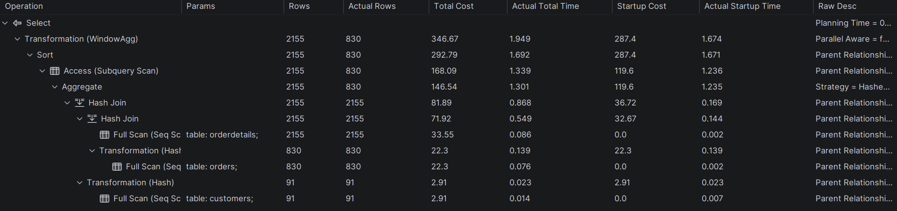

- podzapytanie:
  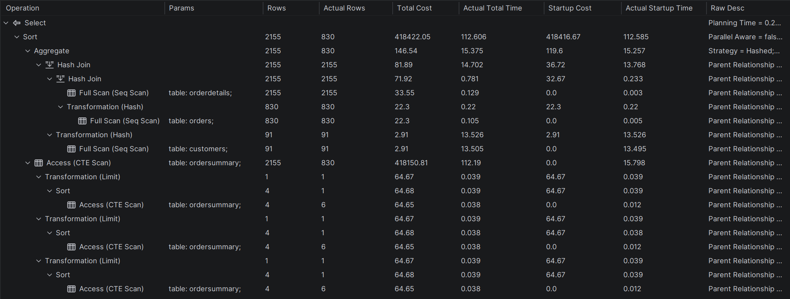

- joiny:
  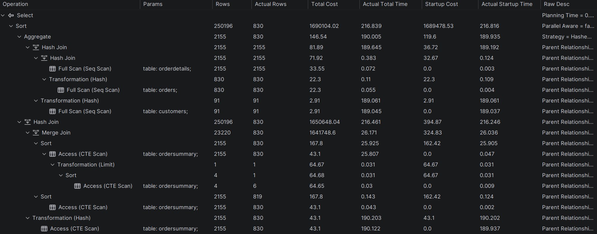

Wnioski:

- w przypadku funkcji okna konieczne było, aby grupować dane po orderdate i orderid, aby dobrze obsłużyć kolejność zamówień, co spowodowało, że próba otrzymania tego samego wyniku bez funkcji okna okazała się trudna do napisania
- kod z funkcjami okna jest znacznie bardziej czytelny, łatwiejszy oraz zwięzły do napisania niż kod z podzapytaniem i joinami, co jest dodatkową zaletą funkcji okna
- czasy wykonania są bardzo małe (<1s), ale warto zwrócić uwagę na koszty, które są znacznie większe dla podejścia z podzapytaniem i joinami niż dla podejścia z funkcjami okna

---

# Zadanie 5

Funkcje `first_value()`, `last_value()`

Baza: Northwind, tabele customers, orders, order details

Wykonaj polecenia, zaobserwuj wynik. Jak działają funkcje `first_value()`, `last_value()`.

Skomentuj uzyskane wyniki. Czy funkcja `first_value` pokazuje w tym przypadku najdroższy produkt w danej kategorii, czy funkcja `last_value()` pokazuje najtańszy produkt?

Co jest przyczyną takiego działania funkcji `last_value`.

Co trzeba zmienić żeby funkcja last_value pokazywała najtańszy produkt w danej kategorii?

Do analizy użyj wybranego systemu/bazy danych - wybierz MS SQLserver, Postgres lub SQLite)

```sql
select productid, productname, unitprice, categoryid,
    first_value(productname) over (partition by categoryid
order by unitprice desc) first,
    last_value(productname) over (partition by categoryid
order by unitprice desc) last
from products
order by categoryid, unitprice desc;
```

---

> Wyniki:

Analiza została przeprowadzona z wykorzystaniem bazy danych PostgreSQL.


Funkcja `first_value()` zwraca pierwszą wartość w danym oknie zgodnie z zadaną kolejnością, funkcja `last_value()` zwraca ostatnią wartość w danym oknie zgodnie z zadaną kolejnością, przy czym zakres funkcji `last_value` jest od początku do **aktualnego wiersza** (`rows between unbounded preceding and current row`). W naszym przypadku, funkcja `first_value()` faktycznie będzie pokazywała najdroższy produkt w danej kategorii, natomiast funkcja `last_value()` będzie zawsze pokazywała produkt z danego wiersza (bo on jest najtańszy licząc od początku do aktualnego wiersza). W celu wykorzystania funkcji `last_value` do wskazywania najtańszego produktu w danej kategorii, musimy zmienić zakres tej funkcji:

```sql
-- wczesniej, zakres do aktualnego wiersza
last_value(productname) over (partition by categoryid
  order by unitprice desc) last

-- poprawiona wersja, zakres całego okna
last_value(productname) over (partition by categoryid
  order by unitprice desc rows between unbounded preceding and unbounded following) last
```

Rezultaty poprawionego zapytania:
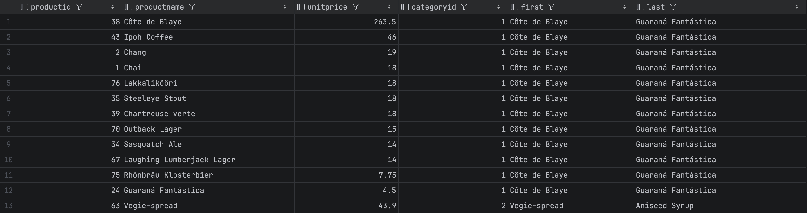

---

# Zadanie 6

Baza: Northwind, tabele orders, order details

Napisz polecenie które wyświetla inf. o zamówieniach

Zbiór wynikowy powinien zawierać:

- Id klienta,
- nr zamówienia,
- datę zamówienia,
- wartość zamówienia (wraz z opłatą za przesyłkę),
- dane zamówienia klienta o najniższej wartości w danym miesiącu
  - nr zamówienia o najniższej wartości w danym miesiącu
  - datę tego zamówienia
  - wartość tego zamówienia
- dane zamówienia klienta o najwyższej wartości w danym miesiącu
  - nr zamówienia o najwyższej wartości w danym miesiącu
  - datę tego zamówienia
  - wartość tego zamówienia

Do analizy użyj wybranego systemu/bazy danych - wybierz MS SQLserver, Postgres lub SQLite.

---

> Wyniki:

```sql
-- PostgreSQL
with ordersummary as (select o.customerid,
                             o.orderid,
                             o.orderdate,
                             date_trunc('month', o.orderdate)                                as ordermonth,
                             sum(od.unitprice * od.quantity * (1 - od.discount)) + o.freight as ordertotal
                      from orders o
                               join orderdetails od on o.orderid = od.orderid
                      group by o.customerid, o.orderid, o.orderdate, o.freight)
select customerid,
       orderid,
       orderdate,
       ordertotal,
       first_value(orderid) over (partition by customerid, ordermonth order by ordertotal asc)     as minorderid,
       first_value(orderdate) over (partition by customerid, ordermonth order by ordertotal asc)   as minorderdate,
       first_value(ordertotal) over (partition by customerid, ordermonth order by ordertotal asc)  as minordervalue,
       first_value(orderid) over (partition by customerid, ordermonth order by ordertotal desc)    as maxorderid,
       first_value(orderdate) over (partition by customerid, ordermonth order by ordertotal desc)  as maxorderdate,
       first_value(ordertotal) over (partition by customerid, ordermonth order by ordertotal desc) as maxordervalue
from ordersummary
order by customerid, orderdate;
```

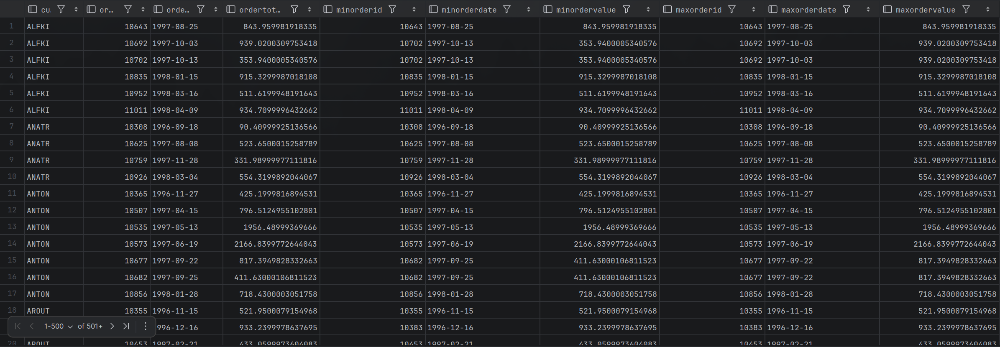

Podejścia bez funkcji okna:

```sql
-- podzapytanie
with ordersummary as (select c.companyname,
                             o.customerid,
                             o.orderid,
                             o.orderdate,
                             date_trunc('month', o.orderdate)                                as ordermonth,
                             sum(od.unitprice * od.quantity * (1 - od.discount)) + o.freight as ordertotal
                      from orders o
                               join customers c on o.customerid = c.customerid
                               join orderdetails od on o.orderid = od.orderid
                      group by c.companyname, o.customerid, o.orderid, o.orderdate, o.freight)
select t1.customerid,
       t1.orderid,
       t1.orderdate,
       t1.ordertotal,
       (select t2.orderid
        from ordersummary t2
        where t2.customerid = t1.customerid
          and t2.ordermonth = t1.ordermonth
        order by t2.ordertotal asc, t2.orderid asc
        limit 1) as minorderid,
       (select t2.orderdate
        from ordersummary t2
        where t2.customerid = t1.customerid
          and t2.ordermonth = t1.ordermonth
        order by t2.ordertotal asc, t2.orderid asc
        limit 1) as minorderdate,
       (select t2.ordertotal
        from ordersummary t2
        where t2.customerid = t1.customerid
          and t2.ordermonth = t1.ordermonth
        order by t2.ordertotal asc, t2.orderid asc
        limit 1) as minordervalue,
       (select t2.orderid
        from ordersummary t2
        where t2.customerid = t1.customerid
          and t2.ordermonth = t1.ordermonth
        order by t2.ordertotal desc, t2.orderid desc
        limit 1) as maxorderid,
       (select t2.orderdate
        from ordersummary t2
        where t2.customerid = t1.customerid
          and t2.ordermonth = t1.ordermonth
        order by t2.ordertotal desc, t2.orderid desc
        limit 1) as maxorderdate,
       (select t2.ordertotal
        from ordersummary t2
        where t2.customerid = t1.customerid
          and t2.ordermonth = t1.ordermonth
        order by t2.ordertotal desc, t2.orderid desc
        limit 1) as maxordervalue
from ordersummary t1
order by t1.customerid, t1.orderdate;
```

```sql
-- joiny
with ordersummary as (select c.companyname,
                             o.customerid,
                             o.orderid,
                             o.orderdate,
                             date_trunc('month', o.orderdate)                                as ordermonth,
                             sum(od.unitprice * od.quantity * (1 - od.discount)) + o.freight as ordertotal
                      from orders o
                               join customers c on o.customerid = c.customerid
                               join orderdetails od on o.orderid = od.orderid
                      group by c.companyname, o.customerid, o.orderid, o.orderdate, o.freight),
     monthlyextremes as (select customerid,
                                ordermonth,
                                min(ordertotal) as minval,
                                max(ordertotal) as maxval
                         from ordersummary
                         group by customerid, ordermonth)
select os.customerid,
       os.orderid,
       os.orderdate,
       os.ordertotal,
       os_min.orderid    as minorderid,
       os_min.orderdate  as minorderdate,
       os_min.ordertotal as minordervalue,
       os_max.orderid    as maxorderid,
       os_max.orderdate  as maxorderdate,
       os_max.ordertotal as maxordervalue
from ordersummary os
         join monthlyextremes ex on os.customerid = ex.customerid and os.ordermonth = ex.ordermonth
         left join ordersummary os_min on os_min.customerid = ex.customerid
    and os_min.ordermonth = ex.ordermonth
    and os_min.ordertotal = ex.minval
         left join ordersummary os_max on os_max.customerid = ex.customerid
    and os_max.ordermonth = ex.ordermonth
    and os_max.ordertotal = ex.maxval
order by os.customerid, os.orderdate;
```

Porównanie wyników klazulą `except` w obie strony dało pusty zbiór wynikowy, co oznacza, że wyniki są takie same dla wszystkich trzech podejść.

Porównanie planów wykonania dla różnych podejść:

- funkcje okna:

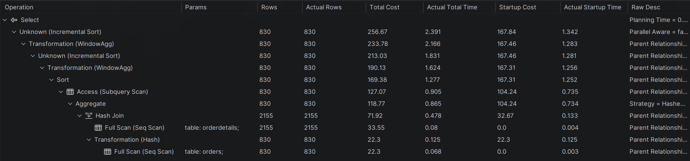

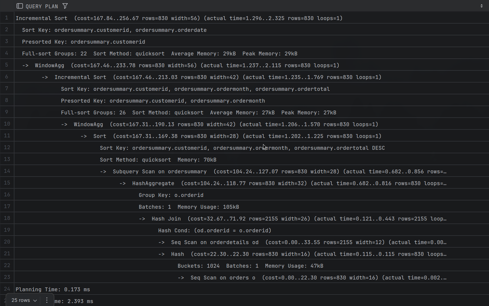

- podzapytanie:

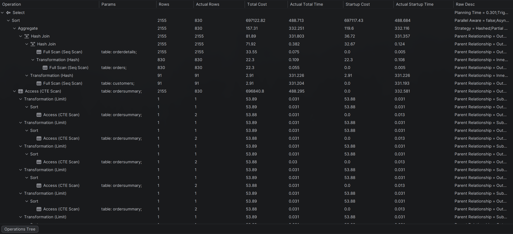

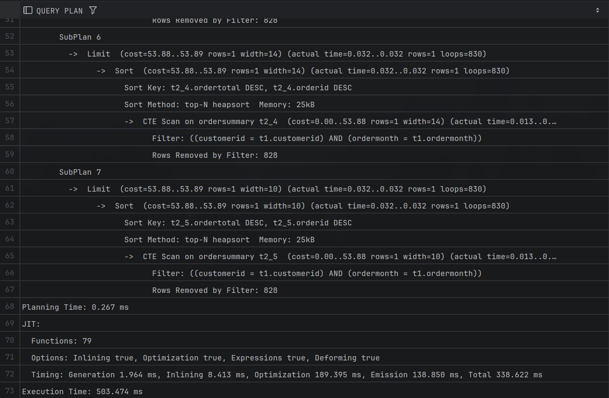

- joiny:

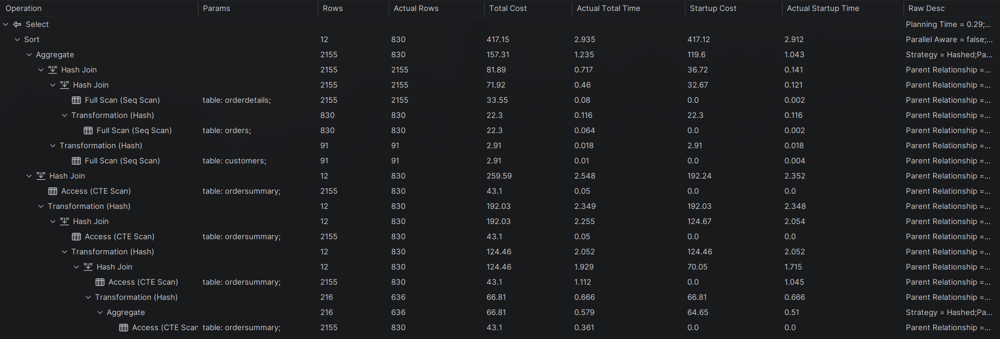

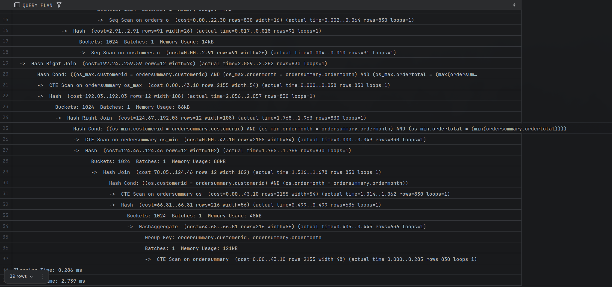

Wnioski:

- funkcje okna znów okazały się najlepsze, zwłaszcza w porównaniu do podejścia z podzapytaniem, które jest bardzo kosztowne, co widać po czasie wykonania i kosztach
- zapytanie z joinami jest również kosztowne, ale znacznie mniej niż podejście z podzapytaniem, warto jednak zwrócić uwagę na `plan width` (`Estimated average width of rows output by this plan node (in bytes).`), który jest większy dla podejścia z joinami niż dla podejścia z funkcjami okna, co oznacza, że mimo podobnego czasu wykonania, podejście z joinami jest mniej wydajne pod względem wykorzystania pamięci niż podejście z funkcjami okna
- podejście z podzapytaniem znów wypadło najgorzej pod względem kosztu oraz czasu wykonania - dla każdego z 830 wierszy w tabeli wykonano 6 podzapytań, które filtowały 828 wierszy, warto zauważyć, że `PostgreSQL` nawet włączył `JIT`, aby przyśpieszyć wykonanie, co zajęło ~340ms (dla porównania całość zapytania z funkcjami okna zajęło ~2.4ms!)

---

# Zadanie 7

Baza: Northwind, tabela product_history

Napisz polecenie które pokaże wartość sprzedaży każdego produktu narastająco od początku każdego miesiąca. Użyj funkcji okna

Zbiór wynikowy powinien zawierać:

- id pozycji
- id produktu
- datę
- wartość sprzedaży produktu w danym dniu
- wartość sprzedaży produktu narastające od początku miesiąca

Spróbuj uzyskać ten sam wynik bez użycia funkcji okna, porównaj wyniki, czasy i plany zapytań (koszty).

Przetestuj działanie w różnych SZBD (MS SQL Server, PostgreSql, SQLite)

---

> Wyniki:

Zapytanie realizujące opisane zadanie w Postgresie:

```sql
-- z funkcją okna
with t as (select od.orderid                                     as id,
                  od.productid,
                  date_part('month', o.orderdate)                as month,
                  o.orderdate                                    as date,
                  od.unitprice * od.quantity * (1 - od.discount) as total,
                  sum(od.unitprice * od.quantity * (1 - od.discount)) over (
                      partition by od.productid,
                          date_part('year', o.orderdate),
                          date_part('month', o.orderdate)
                      order by od.productid, o.orderdate
                      )                                          as cum_total
           from orderdetails od
                    join orders o on od.orderid = o.orderid)
select t.id,
       t.productid,
       t.month,
       t.date,
       t.total,
       t.cum_total
from t;

-- bez funkcji okna (inner-join)
with t as (select od.orderid                                     as id,
                  od.productid,
                  date_part('month', o.orderdate)                as month,
                  o.orderdate                                    as date,
                  od.unitprice * od.quantity * (1 - od.discount) as total
           from orderdetails od
                    join orders o on od.orderid = o.orderid)
select t.id,
       t.productid,
       t.month,
       t.date,
       t.total,
       sum(t2.total) as cum_total
from t
         left join t t2
                   on t2.productid = t.productid
                       and date_part('year', t2.date) = date_part('year', t.date)
                       and date_part('month', t2.date) = date_part('month', t.date)
                       and (
                          t2.date < t.date
                              or (t2.date = t.date and t2.id <= t.id)
                          )
group by t.id,
         t.productid,
         t.month,
         t.date,
         t.total
order by t.productid,
         t.date;
```

Rezultaty zapytania:

- z funkcją okna:

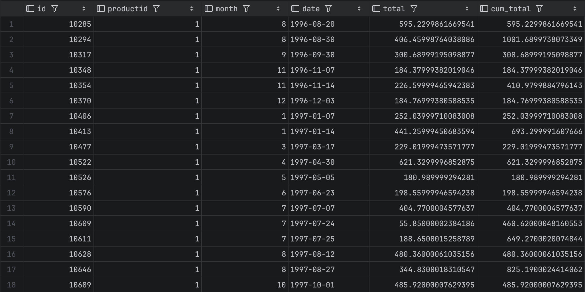

- z `inner-joinem`:

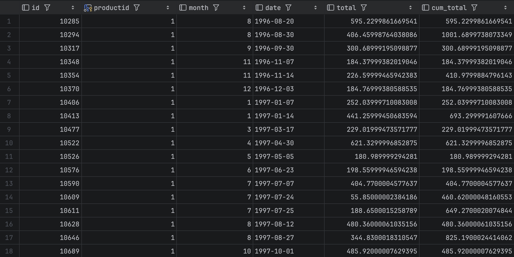

Jak widać na załączonych zrzutach ekranu, wartości te są kumulowane w ramach danego miesiąca. W celu upewnienia się, że wyniki są identyczne w przypadku obu zapytań, ponownie korzystamy z dwukierunkowego `except`:

```sql
with q1 as (with t as (select od.orderid                                     as id,
                              od.productid,
                              date_part('month', o.orderdate)                as month,
                              o.orderdate                                    as date,
                              od.unitprice * od.quantity * (1 - od.discount) as total,
                              sum(od.unitprice * od.quantity * (1 - od.discount)) over (
                                  partition by od.productid,
                                      date_part('year', o.orderdate),
                                      date_part('month', o.orderdate)
                                  order by od.productid, o.orderdate
                                  )                                          as cum_total
                       from orderdetails od
                                join orders o on od.orderid = o.orderid)
            select t.id,
                   t.productid,
                   t.month,
                   t.date,
                   t.total,
                   t.cum_total
            from t),
     q2 as (with t as (select od.orderid                                     as id,
                              od.productid,
                              date_part('month', o.orderdate)                as month,
                              o.orderdate                                    as date,
                              od.unitprice * od.quantity * (1 - od.discount) as total,
                              sum(od.unitprice * od.quantity * (1 - od.discount)) over (
                                  partition by od.productid,
                                      date_part('year', o.orderdate),
                                      date_part('month', o.orderdate)
                                  order by od.productid, o.orderdate
                                  )                                          as cum_total
                       from orderdetails od
                                join orders o on od.orderid = o.orderid)
            select t.id,
                   t.productid,
                   t.month,
                   t.date,
                   t.total,
                   t.cum_total
            from t)
        (select * from q1 except select * from q2)
union all
(select * from q2 except select * from q1);
```

W wyniku otrzymujmy pusty zbiór, co oznacza, że zbiory wynikowe są identyczne w przypadku obu zapytań:

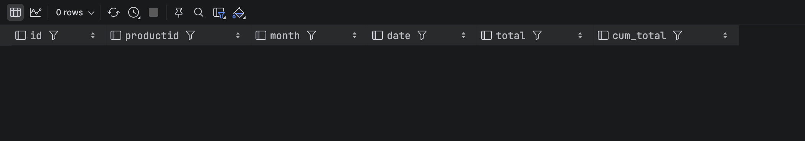

Porównanie wydajności i planów zapytań - Postgres:

- zapytanie z funkcją okna:

  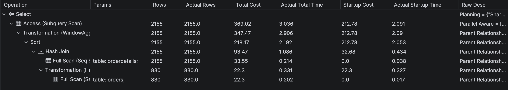

- zapytanie z `inner-joinem`:

  

Wnioski:

- zapytanie z funkcją okna charakteryzuje się około 2 razy niższym kosztem zapytania
- ze względu na mały rozmiar danych (tabele `orders` i `ordershistory`), zapytania są generalnie bardzo szybkie (~30ms), więc nie ma sensu porównywać bezpośrednio czasu zapytań

Zapytania dla MSSQL oraz SQLite są identyczne, z dokładnością do funkcji ekstrahującej miesiąc oraz rok z daty:

```sql
-- postgres
date_part('year', o.orderdate) as year
date_part('month', o.orderdate) as month

-- mssql
year(o.orderdate) as year
month(o.orderdate) as month

-- sqlite
strftime('%Y', o.orderdate) as year
strftime('%m', o.orderdate) as month
```

Porównanie wydajności i planów zapytań - MSSQL:

- z funkcją okna:


- z `inner-join`:


Wnioski:

- koszt całkowity dla funkcji okna jest ~3 krotnie niższy, natomiast czas wykonania jest bardzo zbliżony (ze względu na małą ilość danych)

Porównanie wydajności i planów zapytań - SQLite:

- z funkcją okna:

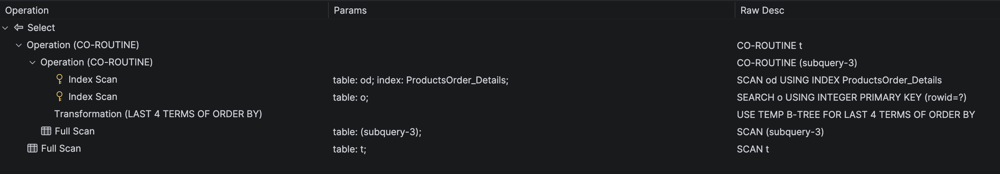

- z `inner-join`:


Wnioski:

- czas wykonania zapytań jest bardzo zbliżony (~400ms) zarówno dla funkcji okna i `inner-joina`, jest to około 20-krotnie dłużej niż to samo zapytanie w Postgres i MSSQL

---

# Zadanie 8

Wykonaj kilka "własnych" przykładowych analiz.

Czy są jeszcze jakieś ciekawe/przydatne funkcje okna (z których nie korzystałeś w ćwiczeniu)? Spróbuj ich użyć w zaprezentowanych przykładach.

Do analizy użyj wybranego systemu/bazy danych - wybierz MS SQLserver, Postgres lub SQLite.

1. `ntile ( num_buckets integer ) → integer`

Funkcja `ntile` dzieli uporządkowany zbiór wynikowy na `num_buckets` grup (wierszy) i przypisuje każdemu wierszowi numer grupy, do której należy. Grupy są numerowane od 1 do `num_buckets`.

Np. Podziel klientów na 4 grupy (kwartyle) na podstawie ich całkowitych wydatków w 1997 roku.

---

> Wyniki:

```sql
-- PostgreSQL
with customerspending as (select c.companyname,
                                 c.customerid,
                                 sum(od.unitprice * od.quantity * (1 - od.discount)) as totalspent
                          from orders o
                                   join customers c on o.customerid = c.customerid
                                   join orderdetails od on o.orderid = od.orderid
                          where o.orderdate >= '1997-01-01'
                            and o.orderdate <= '1997-12-31'
                          group by c.companyname, c.customerid)
select companyname,
       totalspent,
       ntile(4) over (order by totalspent desc) as customertier
from customerspending
order by customertier, totalspent desc;
```

Początek wyniku:

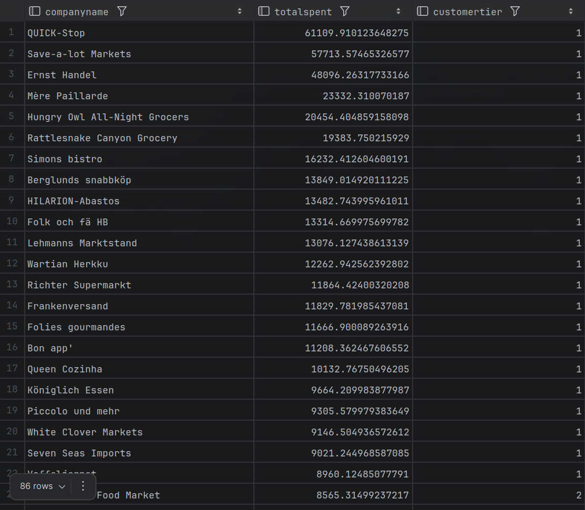

Koniec wyniku:

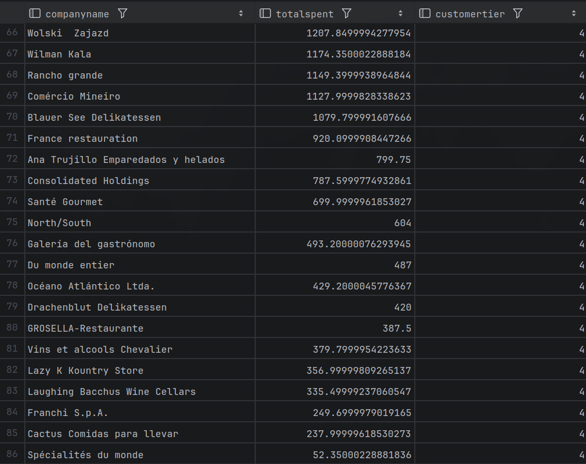

2. `percent_rank () → double precision`, `cume_dist () → double precision`

Funkcja `percent_rank` oblicza procentową pozycję wiersza w zbiorze wynikowym, natomiast `cume_dist` oblicza skumulowany procent wierszy, które mają wartość mniejszą lub równą wartości w bieżącym wierszu.

Np. Utwórz zestawienie sprzedaży dla produktu `Chef Anton's Cajun Seasoning` i oblicz percentyl oraz skumulowaną dystrybucję wartości sprzedaży tego produktu. Podaj nazwę klienta, nr zamówienia, wartość sprzedaży, percentyl oraz skumulowaną dystrybucję wartości sprzedaży dla tego produktu.

```sql
-- PostgreSQL
with productsales as (select c.companyname,
                             p.productname,
                             o.orderid,
                             (od.unitprice * od.quantity) as salevalue
                      from orderdetails od
                               join products p on od.productid = p.productid
                               join orders o on od.orderid = o.orderid
                               join customers c on o.customerid = c.customerid)
select companyname,
       orderid,
       productname,
       salevalue,
       round(percent_rank() over (
           partition by productname
           order by salevalue
           )::numeric, 3) as percentilerank,
       round(cume_dist() over (
           partition by productname
           order by salevalue
           )::numeric, 3) as cumulativedistribution
from productsales
where productname = 'Chef Anton''s Cajun Seasoning'
order by salevalue desc;
```

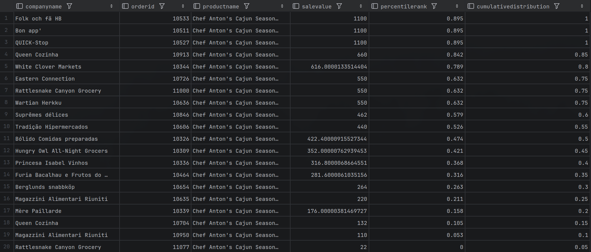

- Przy tym zestawieniu ładnie widać podział na klientów detalicznych i liderów sprzedaży.

---

Punktacja

|         |     |
| ------- | --- |
| zadanie | pkt |
| 1       | 1   |
| 2       | 2   |
| 3       | 1   |
| 4       | 1   |
| 5       | 1   |
| 6       | 1   |
| 7       | 2   |
| 8       | 2   |
| razem   | 11  |
